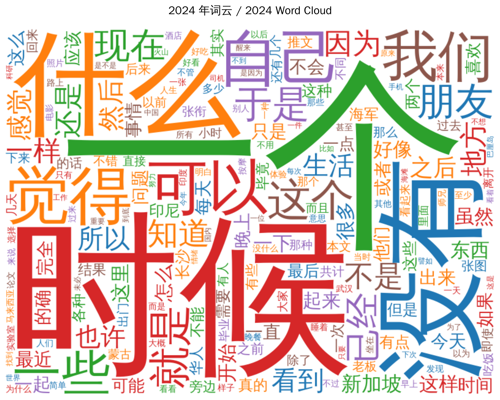
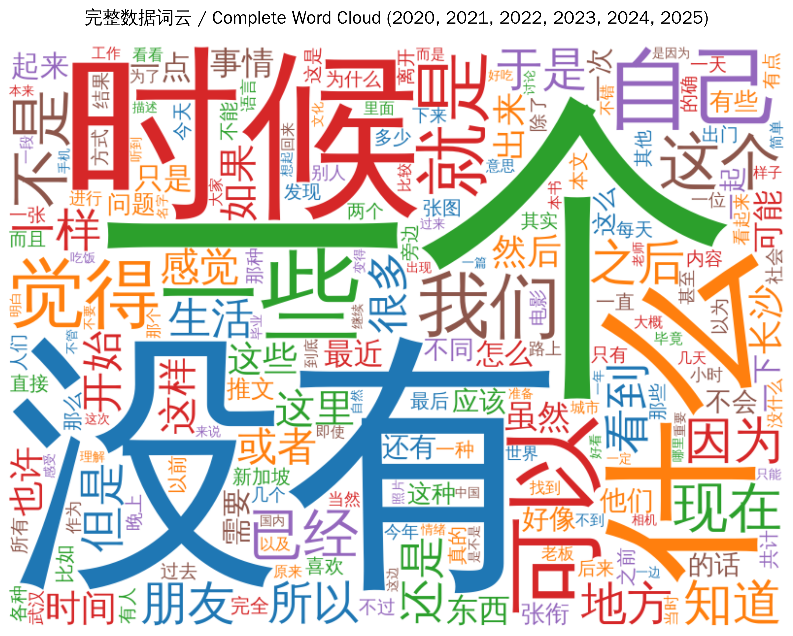

<div align="center">
  <h1 style="background: linear-gradient(135deg, #667eea 0%, #764ba2 100%); -webkit-background-clip: text; -webkit-text-fill-color: transparent; background-clip: text; margin: 20px 0; font-size: 2.5em;">
    🚀 微信公众号文章备份工具
  </h1>
  
  <p style="font-size: 1.2em; color: #666; max-width: 800px; margin: 0 auto 30px;">
    专业的微信公众号文章抓取和备份解决方案，支持图片本地化、多格式输出、断点续传等功能
  </p>
  
  <div style="display: flex; justify-content: center; gap: 15px; margin-bottom: 30px;">
    <a href="https://github.com/xianyu564/scrape-my-wechat-official-account/actions/workflows/ci.yml">
      
    </a>
    <a href="https://opensource.org/licenses/MIT">
      
    </a>
    <a href="https://creativecommons.org/licenses/by-nc-sa/4.0/">
      
    </a>
    
    
  </div>
</div>

> 本仓库同时包含两大部分：
> - 备份工具代码（可复用抓取任意公众号已发文）
> - 已完整备份的个人公众号《文不加点的张衔瑜》全文语料（可直接阅读、研究与再训练）

### 🔗 快速链接（内容直达）

- **文章总目录**（编年排序，含年度字数/图片合计、全局编号）：[`Wechat-Backup/文不加点的张衔瑜/目录.md`](Wechat-Backup/文不加点的张衔瑜/目录.md)
- **主题合集**（按主题分类，含专题下的文章详情和格式规范）：[`Wechat-Backup/文不加点的张衔瑜/合集.md`](Wechat-Backup/文不加点的张衔瑜/合集.md)
- **语料主目录**（含全部文章的 HTML/MD/images/meta）：[`Wechat-Backup/文不加点的张衔瑜/`](Wechat-Backup/文不加点的张衔瑜/)

<div align="center" style="background: linear-gradient(135deg, #f5f7fa 0%, #c3cfe2 100%); padding: 20px; border-radius: 15px; margin: 20px 0; box-shadow: 0 4px 8px rgba(0,0,0,0.1);">
  <p style="margin: 0; font-size: 1.1em; color: #333;">
    🎯 <strong>本工具专为《文不加点的张衔瑜》个人公众号设计</strong>
  </p>
</div>

## 📚 关于个人公众号（文不加点的张衔瑜）

- **定位**：个人日记型公众号，记录日常生活、旅行见闻、思想火花与社会观察。
- **时间跨度与规模**：累计八年写作，已备份八十万字、近四百篇图文（见 `Wechat-Backup/`）。
- **学术与兴趣背景**：哲学博士，关注与涉猎 AI、计算化学、生物医药、周易等领域，探索科技与哲学的边界（已在公众号完成个人职业兴趣认证）。
- **组织方式**：按年份/日期自动归档；每篇含 `HTML`、`Markdown`、`images/` 与 `meta.json`，便于阅读、复用与研究。
- **使用目的**：为自我存档、长期复盘、社会现场的自反式研究，以及后续的语料分析与个性化对话模型提供高质量素材。

### 📦 仓库结构速览（代码 + 已备份语料）

- **备份工具代码**：
  - 脚本入口：`script/wx_publish_backup.py`
  - 配置示例：`env.json.EXAMPLE`（复制为 `env.json` 后填写）
  - 文档：`script/README.md`、`docs/TROUBLESHOOTING.md`
- **已备份语料（可直接阅读/研究/再训练）**：
  - 主目录：[`Wechat-Backup/文不加点的张衔瑜/`](Wechat-Backup/文不加点的张衔瑜/)
  - 编年目录：[`Wechat-Backup/文不加点的张衔瑜/目录.md`](Wechat-Backup/文不加点的张衔瑜/目录.md)（按时间顺序）
  - 主题合集：[`Wechat-Backup/文不加点的张衔瑜/合集.md`](Wechat-Backup/文不加点的张衔瑜/合集.md)（按主题分类）

## 💭 项目动机

<div style="background: linear-gradient(135deg, #667eea 0%, #764ba2 100%); padding: 25px; border-radius: 20px; color: white; margin: 20px 0; box-shadow: 0 10px 20px rgba(0,0,0,0.15);">

<div style="display: flex; align-items: center; gap: 20px; margin-bottom: 20px;">
  <div>
    <h3 style="margin: 0 0 10px 0; color: white;">🎁《文不加点的张衔瑜》的诞生 🎁</h3>
    <p style="margin: 0; opacity: 0.9;">这是我成年当天的礼物</p>
  </div>
</div>

<div style="background: rgba(255,255,255,0.1); padding: 20px; border-radius: 15px; backdrop-filter: blur(10px); margin-bottom: 20px;">
  <h4 style="margin: 0 0 15px 0; color: white;">📚 八年公众号写作历程</h4>
  <ul style="margin: 0; padding-left: 20px; opacity: 0.9;">
    <li>累计创作了八十万字、近400篇图文，记录人生各个阶段的思考</li>
    <li>涵盖生活日志、旅行笔记、社会评论等多元内容</li>
  </ul>
</div>

<div style="background: rgba(255,255,255,0.1); padding: 20px; border-radius: 15px; backdrop-filter: blur(10px); margin-bottom: 20px;">
  <h4 style="margin: 0 0 15px 0; color: white;">⏰ 时间节点的巧合与遗憾</h4>
  <p style="margin: 0; opacity: 0.9;">
    原本计划通过官方渠道进行备份，于是我自己写作了 <a href="https://github.com/xianyu564/wechat_official_backup" style="color: #ffd700; text-decoration: underline;">@xianyu564/wechat_official_backup</a> 项目。
    然而，微信官方在 <strong>2025年7月</strong> 停用了关键的 <code>freepublishGetarticle</code> 接口（<code>/cgi-bin/freepublish/getarticle</code>），
    这个时间点恰好比我开始备份的想法早了<strong>一个月</strong>。
  </p>
</div>

<div style="background: rgba(255,255,255,0.1); padding: 20px; border-radius: 15px; backdrop-filter: blur(10px);">
  <h4 style="margin: 0 0 15px 0; color: white;">🛠️ 解决方案的诞生</h4>
  <p style="margin: 0; opacity: 0.9;">
    面对官方接口的停用，我开发了这个替代方案，通过模拟浏览器行为来获取已发布文章，
  </p>
</div>

</div>

## 📋 目录

- [项目动机](#项目动机)
- [功能特性](#功能特性)
- [快速开始](#快速开始)
- [安装依赖](#安装依赖)
- [配置说明](#配置说明)
- [使用方法](#使用方法)
- [输出结构](#输出结构)
- [项目展望](#项目展望)
- [故障排除](#故障排除)
- [贡献指南](#贡献指南)
- [许可证](#许可证)

## ✨ 功能特性

<div style="display: grid; grid-template-columns: repeat(auto-fit, minmax(300px, 1fr)); gap: 20px; margin: 20px 0;">

  <div style="background: linear-gradient(135deg, #667eea 0%, #764ba2 100%); padding: 20px; border-radius: 15px; color: white; box-shadow: 0 8px 16px rgba(0,0,0,0.15);">
    <h3 style="margin: 0 0 15px 0; color: white;">🔍 智能抓取</h3>
    <p style="margin: 0; opacity: 0.9;">自动抓取微信公众号已发布文章，支持分页获取和智能去重。</p>
  </div>

  <div style="background: linear-gradient(135deg, #f093fb 0%, #f5576c 100%); padding: 20px; border-radius: 15px; color: white; box-shadow: 0 8px 16px rgba(0,0,0,0.15);">
    <h3 style="margin: 0 0 15px 0; color: white;">📁 智能组织</h3>
    <p style="margin: 0; opacity: 0.9;">按年份自动组织备份文件结构，便于管理和查找。</p>
  </div>

  <div style="background: linear-gradient(135deg, #4facfe 0%, #00f2fe 100%); padding: 20px; border-radius: 15px; color: white; box-shadow: 0 8px 16px rgba(0,0,0,0.15);">
    <h3 style="margin: 0 0 15px 0; color: white;">🖼️ 图片本地化</h3>
    <p style="margin: 0; opacity: 0.9;">自动下载并本地化图片资源，确保备份完整性。</p>
  </div>

  <div style="background: linear-gradient(135deg, #43e97b 0%, #38f9d7 100%); padding: 20px; border-radius: 15px; color: white; box-shadow: 0 8px 16px rgba(0,0,0,0.15);">
    <h3 style="margin: 0 0 15px 0; color: white;">📝 多格式输出</h3>
    <p style="margin: 0; opacity: 0.9;">支持HTML和Markdown格式输出，满足不同使用需求。</p>
  </div>

  <div style="background: linear-gradient(135deg, #36d1dc 0%, #5b86e5 100%); padding: 20px; border-radius: 15px; color: white; box-shadow: 0 8px 16px rgba(0,0,0,0.15);">
    <h3 style="margin: 0 0 15px 0; color: white;">📚 已备份语料库</h3>
    <p style="margin: 0; opacity: 0.9;">仓库内已自带《文不加点的张衔瑜》多年完整备份，可直接检索/分析/引用。</p>
  </div>

  <div style="background: linear-gradient(135deg, #11998e 0%, #38ef7d 100%); padding: 20px; border-radius: 15px; color: white; box-shadow: 0 8px 16px rgba(0,0,0,0.15);">
    <h3 style="margin: 0 0 15px 0; color: white;">🤖 语料再分析与AI再训练</h3>
    <p style="margin: 0; opacity: 0.9;">支持学术级词频/年度/主题分析与词云可视化，符合WWW/SIGIR等顶会标准，及基于个人语料的对话模型再训练。</p>
  </div>

  <div style="background: linear-gradient(135deg, #fa709a 0%, #fee140 100%); padding: 20px; border-radius: 15px; color: white; box-shadow: 0 8px 16px rgba(0,0,0,0.15);">
    <h3 style="margin: 0 0 15px 0; color: white;">⚡ 性能优化</h3>
    <p style="margin: 0; opacity: 0.9;">可配置的抓取速度和分页大小，平衡效率与稳定性。</p>
  </div>

</div>

## 🚀 快速开始

<div style="background: linear-gradient(135deg, #667eea 0%, #764ba2 100%); padding: 25px; border-radius: 20px; color: white; margin: 20px 0; box-shadow: 0 10px 20px rgba(0,0,0,0.15);">

<div style="display: grid; grid-template-columns: repeat(auto-fit, minmax(200px, 1fr)); gap: 20px;">

<div style="text-align: center; padding: 20px; background: rgba(255,255,255,0.1); border-radius: 15px; backdrop-filter: blur(10px);">
  <h3 style="margin: 0 0 10px 0; color: white;">📥 1. 克隆仓库</h3>
  <p style="margin: 0; opacity: 0.9; font-size: 0.9em;">获取项目代码到本地，开始你的备份之旅</p>
</div>

<div style="text-align: center; padding: 20px; background: rgba(255,255,255,0.1); border-radius: 15px; backdrop-filter: blur(10px);">
  <h3 style="margin: 0 0 10px 0; color: white;">📦 2. 安装依赖</h3>
  <p style="margin: 0; opacity: 0.9; font-size: 0.9em;">安装Python依赖包，为工具运行做好准备</p>
</div>

<div style="text-align: center; padding: 20px; background: rgba(255,255,255,0.1); border-radius: 15px; backdrop-filter: blur(10px);">
  <h3 style="margin: 0 0 10px 0; color: white;">⚙️ 3. 配置环境</h3>
  <p style="margin: 0; opacity: 0.9; font-size: 0.9em;">设置Cookie和Token，让工具能够访问你的公众号</p>
</div>

<div style="text-align: center; padding: 20px; background: rgba(255,255,255,0.1); border-radius: 15px; backdrop-filter: blur(10px);">
  <h3 style="margin: 0 0 10px 0; color: white;">🚀 4. 运行脚本</h3>
  <p style="margin: 0; opacity: 0.9; font-size: 0.9em;">开始备份文章，让每一篇文字都得到妥善保存</p>
</div>

</div>

</div>

### 详细步骤

#### 1. 克隆仓库
```bash
git clone https://github.com/xianyu564/scrape-my-wechat-official-account.git
cd scrape-my-wechat-official-account
```

#### 2. 安装依赖
```bash
pip install -r requirements.txt
```

#### 3. 配置环境
复制 `env.json.EXAMPLE` 为 `env.json`，填写配置信息

#### 4. 运行脚本
```bash
cd script
python wx_publish_backup.py
```

## 🧭 复用者快速起步（Fork/Clone 即用）

> 面向想直接复用本工具的开发者：不改代码，配置好 `env.json` 即可跑通。

### 最小可运行示例

1. 复制示例配置：
   - 将项目根目录下的 `env.json.EXAMPLE` 复制为 `env.json`
   - 至少填写三项：

```json
{
  "WECHAT_ACCOUNT_NAME": "你的公众号名称",
  "COOKIE": "从浏览器开发者工具复制的Cookie",
  "TOKEN": "发表记录页URL中的token值"
}
```

2. 运行（任选其一）：

- Windows PowerShell
```powershell
py -3 script\wx_publish_backup.py
```

- macOS / Linux（终端）
```bash
python3 script/wx_publish_backup.py
```

3. 输出位置：
   - 文章会按年份落到 `Wechat-Backup/<你的公众号名称>/YYYY/` 下
   - 每篇文章目录包含：`*.html`、`*.md`、`meta.json`、`images/`

### 常见上手问题（超简版）
- 403 或“预检失败”：Cookie/Token 过期 → 重新抓取
- HTML 打开空白：用 `python -m http.server` 启动本地静态服务器后访问
- 速度过快被限流：适当调大 `SLEEP_LIST`/`SLEEP_ART`/`IMG_SLEEP`

## 📦 安装依赖

```bash
pip install -r requirements.txt
```

> 说明：依赖详解见 `requirements.txt`。

## ⚙️ 配置说明（简版）

1. 复制 `env.json.EXAMPLE` 为 `env.json`
2. 最少填写：`WECHAT_ACCOUNT_NAME`、`COOKIE`、`TOKEN`
3. 可选调整：`COUNT`、`SLEEP_LIST`、`SLEEP_ART` 等速率参数

> 详细的 Cookie/Token 获取操作与截图：见 `script/README.md` 的“获取 Cookie 与 Token（简版）”。
> 完整参数说明与最佳实践：见 `docs/TROUBLESHOOTING.md` 与 `script/README.md`。

## 💻 使用方法

```bash
cd script
python wx_publish_backup.py
```

## 📁 输出结构

备份文件将保存在 `Wechat-Backup/<微信公众号名称>/` 目录下：

```
Wechat-Backup/<微信公众号名称>/
├── 2025/
│ ├── 2025-08-26_文章标题1/
│ │ ├── 2025-08-26_文章标题1.html # 可双击离线打开
│ │ ├── 2025-08-26_文章标题1.md # 外链保留，适合 GitHub/Obsidian
│ │ ├── meta.json
│ │ └── images/
│ └── ...
└── _state.json # 已抓取链接指纹，供断点续传
```

### 数据指引（本仓库已含示例语料）

- **主目录**：[`Wechat-Backup/文不加点的张衔瑜/`](Wechat-Backup/文不加点的张衔瑜/)
- **编年目录**：[`Wechat-Backup/文不加点的张衔瑜/目录.md`](Wechat-Backup/文不加点的张衔瑜/目录.md)（按时间顺序浏览）
- **主题合集**：[`Wechat-Backup/文不加点的张衔瑜/合集.md`](Wechat-Backup/文不加点的张衔瑜/合集.md)（按主题分类浏览）

> 每篇文章目录包含：`*.html`、`*.md`、`meta.json`、`images/`。编年目录提供年度字数/图片合计与全局编号；主题合集按年份与类别重新组织，便于主题式阅读。

## 🧪 二次利用：语料再分析与 AI 再训练

### 📊 语言学分析与词云生成 (学术级实现)

本项目现已具备**学术会议标准的语料分析系统**，提供：

- **🎨 高质量词云生成**: 覆盖2017-2025全年份，支持中文显示，备份于 [`.github/assets/wordclouds/`](.github/assets/wordclouds/)
- **📈 科学级语言学分析**: Zipf定律、Heaps定律、TF-IDF、词汇多样性等指标
- **🔤 智能分词与N-gram**: 支持中英混合文本，可变长度n-gram分析
- **📋 自动化报告**: 完整的数据驱动分析报告生成
- **🎓 学术标准**: 符合WWW/SIGIR/ICWSM等顶级会议要求的性能基准测试与质量评估

#### 词云可视化示例

<div align="center">
  
  
  <br>
  <em>左: 2024年度词云 | 右: 完整语料词云 (2017-2025)</em>
</div>

**快速开始分析:**
```bash
cd analysis/
python main.py  # 完整分析 + 可视化
```

**学术级功能:**
```bash
# 性能基准测试 (符合学术会议标准)
python analysis/benchmark_wordcloud.py

# 高级可视化 (多种学术配色方案)
python analysis/enhanced_wordcloud_viz.py

# 质量评估 (自动学术标准评分)
python analysis/evaluation_metrics.py
```

**自定义词云生成:**
```bash
# 特定时间段 (如 2020.08-2024.12)
python analysis/generate_wordclouds.py --start-date 2020-08-01 --end-date 2024-12-31

# 特定年份
python analysis/generate_wordclouds.py --years 2020,2021,2022,2023,2024
```

详细文档：[`analysis/README.md`](analysis/README.md) | [`analysis/WORDCLOUD_GUIDE.md`](analysis/WORDCLOUD_GUIDE.md)

### 🔍 语料浏览与研究起点

- 从这里开始：[`Wechat-Backup/文不加点的张衔瑜/目录.md`](Wechat-Backup/文不加点的张衔瑜/目录.md)（编年浏览）或 [`合集.md`](Wechat-Backup/文不加点的张衔瑜/合集.md)（主题浏览）
- 研究路线建议：见 `docs/FUTURE_VISION.md`（“先获得感 → 认知/成长挖掘 → 语义检索/RAG → 个性化模型”）
- 管理与进展：见 `STATUS.md`（阶段性目标与完成度）

> 提示：若你希望进行词频/主题/年度分析，建议以 `*.md` 作为语料输入；若做版式与图片回看，使用 `*.html` 更直观。

## 🤝 贡献指南

我们欢迎所有形式的贡献！请查看 [贡献指南](CONTRIBUTING.md) 了解如何参与项目开发。

### 贡献方式

- 🐛 报告Bug
- 💡 提出新功能建议
- 📝 改进文档
- 🔧 提交代码修复
- 🌟 给项目点星

## 📜 行为准则

本项目采用 [贡献者公约](CODE_OF_CONDUCT.md) 作为行为准则。我们致力于为每个人创造友好、包容的环境。

## 🔒 安全政策

如果您发现了安全漏洞，请查看 [安全政策](SECURITY.md) 了解如何私下报告。

**重要**：请不要在公开渠道中报告安全漏洞。

## 📄 许可证

本项目采用双重许可证：

- **代码**: [MIT License](LICENSE) - 允许自由使用、修改和分发代码
- **内容**: [Creative Commons Attribution-NonCommercial-ShareAlike 4.0 International](CONTENT_LICENSE.md) - 允许非商业用途的分享和改编

## ⚠️ 注意事项

- `env.json` 包含敏感信息，已添加到 `.gitignore`
- 建议设置合理的抓取间隔，避免被限制访问
- 备份目录会自动创建，无需手动创建
- 请遵守微信公众平台的使用条款

## 📊 项目状态

- **版本**: 1.0.0
- **状态**: 活跃维护
- **Python版本**: 3.7+

## 🔮 项目展望

本项目不仅是一个备份工具，更是个人知识资产的基础设施。基于仓库内已备份的八十万字、近四百篇个人文章，我们规划了以下发展方向：

### 🤖 个人AI对话模型
- 利用个人写作风格和知识结构训练专属AI助手
- 保持与作者一致的表达方式和思维模式
- 传承个人在AI、计算化学、生物医药、周易等领域的知识

### 📊 语料分析与洞察
- 词频分析和写作风格研究
- 主题演化追踪和知识图谱构建
- 为内容创作和学术研究提供数据支持

> 💡 **了解更多**：详细的项目展望请查看 [STATUS.md](STATUS.md#-项目展望)
>
> 🧭 同时建议阅读研究计划：[FUTURE_VISION.md](docs/FUTURE_VISION.md)。该计划以“先获得感（词频/年度/主题）→ 认知与成长挖掘（人物/地点/情绪/价值观）→ 语义检索/RAG → 个性化模型”的顺序推进，并强调“自反式个人社会现场研究”和“兴趣导向的任务编排”。

## 💝 赞助与支持

<div align="center" style="margin: 18px 0;">
  <table align="center" style="border-collapse: collapse;">
    <tr>
      <td align="center" style="padding: 8px 16px;">
        
        <div style="margin-top: 8px; color: #666;">个人 微信赞助</div>
      </td>
      <td align="center" style="padding: 8px 16px;">
        
        <div style="margin-top: 8px; color: #666;">个人 新加坡 PayNow</div>
      </td>
      <td align="center" style="padding: 8px 16px;">
        
        <div style="margin-top: 8px; color: #666;">我创业的公司 赞助码</div>
      </td>
    </tr>
  </table>
</div>

## 🔧 故障排除（更多见文档）

遇到“预检失败/403、空白HTML、限速、断点续传”等问题，请参考：
- `docs/TROUBLESHOOTING.md`（完整指南）
- `script/README.md`（平台命令对照与错误恢复速查）

### 已知问题与优化建议

- 含空格/括号/特殊字符的路径已在目录中做 URL 编码处理（如空格→`%20`，`(`→`%28`）。
- 本地直接打开 HTML 可能受浏览器策略限制，建议用 `python -m http.server` 启动静态服务器后访问。
- Windows 路径大小写与编码请遵循仓库现状，避免自行改名导致链接失效。

## 📞 获取帮助

如果您需要帮助：

1. 查看 [故障排除指南](docs/TROUBLESHOOTING.md) 解决常见问题
2. 查看 [更新日志](CHANGELOG.md) 了解最新变更
3. 搜索现有 [Issues](https://github.com/xianyu564/scrape-my-wechat-official-account/issues)
4. 创建新的 Issue 描述问题

## 🙏 致谢

凡没有把我杀死的，都没有把我杀死。

---

<div align="center" style="margin: 12px 0 24px 0;">
  
  <div style="color: #666; margin-top: 6px;">文不加点的张衔瑜</div>
</div>
