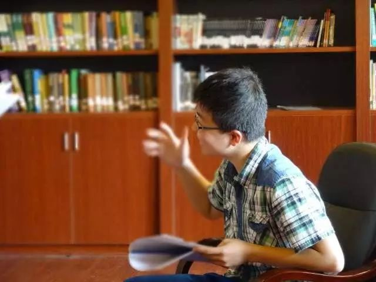

记得今年年初  空间秘密方兴未艾  当时我也发了一条

当时只是在设想一个情境  想着自己若是孤独至斯  将会如何  没想到评论区全是祝生日快乐的  谢谢你们  但今天  才是我真正的十八岁成年生日

衔瑜何许人

笔名  小神通 那畔烟渚  簿霁島 张衔瑜

英文名  Y Y SUN    (Coach) Bolton  cobo

生日  1999 07 31

绰号  大头  宰羊  仔阳  仔么么  娃娃  大师  司机  玛丽

home  湖南长沙

衔瑜的日常

粽子喜欢吃甜还是吃咸  吃甜

一点点喜欢谁 红茶玛奇朵三分甜少冰不加料

茶颜悦色喜欢哪个  十八岁 芊芊马卡龙

对什么水果没有抵抗力  必须是 芒果

葱姜蒜哪个不行  姜可以 葱最好不要  蒜走开

对辣椒怎么看 没你我能活?！

牛排要几分熟  三分或者五分都行

咖啡调制喜欢哪种  拿铁

鸡尾酒喜欢烈一点还是甜一点  烈一点

食味相投

对什么要求苛刻

日记本必须自己去挑

会器乐吗

单簧管&口琴

都只是能让他们响起来

会球类吗

开玩笑我也是院排球队的

social吗

最喜欢结交不同的人了

有没有 女票

以前有现在没了

有没有 男票

有啊共计1037人

联手可绕喻家山三圈

平常干些什么

除了尬文没别的爱好

服软还是服硬

不好意思我扶老爷爷

最喜欢的专业方向

中文· 训诂 学方向

最喜欢的歌手

Michale Jackson

最喜欢的写手

张衔瑜  (｡･∀･)ﾉﾞ

最喜欢的科目

the Science

of Deduction

喜欢城市还是农村

城市

有没有特别想去的地方

那不勒斯&佛罗伦萨

说谎

衔瑜来测评

狼人杀  老鸟级

三国杀  老鸟级

Ps  菜鸟级

Ce  老鸟级

尬文  骨灰级

尬聊  骨灰级

尬舞  菜鸟级

尬吃  骨灰级

尬书  大神级

商业互吹

化学理论  菜鸟级

化学实验  老鸟级

汉语训诂  大神级

比较文学  中鸟级

英剧/美剧  老鸟级

排球/速降  大神级

篮球/足球  菜鸟级

治疗情感不服  骨灰级

自己的感情世界  菜鸟级

做梦  骨灰级中的战斗机

寻吃  骨灰级中的战斗机

烹饪  大神级

衔瑜正经脸

你十八岁了 应该像个大男孩了  要去 做一些只有满了十八岁才能做的事情 比如去社会公益的献血站 献一次血 就像看到自己肘静脉上抽出来的血液  此后可以在医生的使用中救助到伤病患者

你十八岁了  不是说要去铁肩担道义  但在发现暗流涌动的时候  不能作壁上观  不是说要去在现在所学的行当里翻天覆地搅出个变化  但在该得涵泳各种的时候  不能浮游飘荡

你十八岁了  应该多多担待自己身边的人  无论在文字里还是在说话上  尽可能的消弭去不必要的戾气  你能吸收别人的优点  这再好不过了  你能看出别人的差  而从他的角度想到合理性  这是 哲♂学

十八年过去了  幼儿园小学初中高中大一  遇到了可以完全相信 见过我哭的 soul mate 有着一帮真正意义上的 老铁 有在某一段时间里足以托付自己思绪的存在  酸菜  某宝  逗罢  灵修  沁此  赭虞  反正我这种写在日记本里的词你们也看不出来到底是谁  日常谈天侃地的尬聊

做过很多疯狂的举动   于偏袒措施极其不满不惜搅乱一波节奏最后不听课了上课就 写日记 凌晨三点半的时候约着基友五辆单车在长沙城中心的主干道上一字排开一直骑上岳麓山顶 看日出 对学校施工极其反感于是乎趁着晚自习下课别人不注意时把 墨水 倒到学校的施工牌上      在赶不到既定时间的时候掩着月色在路人侧目的大街上像要被抓住的小偷一样 狂奔 五公里

有时候会比较 精分 比如深夜无聊点着蜡烛上kindle看李尔王   和人尬聊说着说着就乱入了一段哈哈哈哈哈哈哈哈哈啊哈哈哈哈哈哈哈哈哈啊哈哈哈哈哈哈哈嗝哈哈哈   无端的在看电影或者打球的时候抓不住重点兀自开心    最近要算传媒部门下期招新想找一点脑洞比较大的同学于是出了一份连老腊肉做起来都会不自觉朱颜凋敝的试卷

从小学五年级到现在的 日记本 一直保留着  一共十一个本子  从最开始的草草涂鸦到后来越写越多越写越杂  以致于现在为了节约纸张都很多时候转到了电脑里边  总了一下大一一年全部写过的  已经有二十万五千字  算上这几天的  应该接近二十一万了  没事就尬写  开了个公号推文章出来  其实是有些犹疑的  一方面  自己现在所写的除却文艺评论和对自我梦境的描述  此外只能对身边人举起刀笔  另一方面  在QQ里自己有山空间的习惯  在微信里有删票圈的习惯  这边把公号一开  即便以前的文章我已经删掉了  但还会存个痕迹在这里  这种关于公号的规定对于我们喜欢删东西的话痨来说就很不友好了

自己就这么蹲坐在道路旁 拿着纸笔 挂着滤镜  打跟前过的  或一骑绝尘  或匍匐前行  火热的眼睛看着冷冷的笔调  抿过目力所及中所有人的挂相  心中  依然没个定数

这是我最近写在日记本里的一句话

不算感悟扒  仅仅虾扯蛋

字数凑到1818  衔瑜成年生快呀hhhhh

蛋糕打call~~

