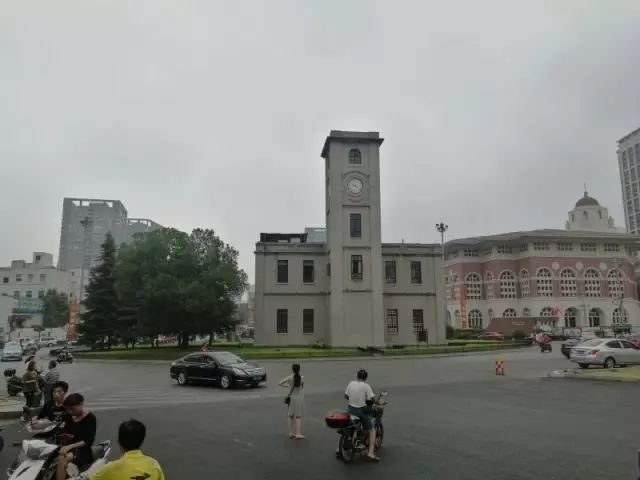

试着放首歌进来hhh

从别人的个人公号说起扒~

最近的一个  是07.04看到刘林在离开华科  要回到重医去了的时候写的 给华科的一封短书  公号叫 木木哥的纯属虚构 算起来  看到周边人自己开的公众号  从 贪玩的小孩呐 那个乐宝的公众号  她们六个人的 别丢掉呀 春姐开的 碎碎念的小鬼 真的在一直碎碎念  以及  吴伊端学姐的 听豆豆的碎碎念 还有陶书宝老部长的 洋流Current 有点点莫名其妙的写的一些貌似是韩国人物还是某种和货币有关的什么鬼  小可可的 奈何缘又起 以及从北大开始做到了我现在都看到了的 毕导 你们这样刺激我  写的一些都是自己走心而出的文字  这样的话搞得我很想自己开公众号自己写东西的  自己琢磨琢磨秀米  把美工排版做好一点  我所有所写的  也足够开两三个公众号了

突然尬舞

看你装逼

写公号   一个开刀的过程

搞

写个人公号  我都可以自己想到的是  作为一个拿着解剖刀的作者  最先解剖的  必定是自己的身边人  而作者的受众  也会是这些身边人  那么等于是  你用一柄解剖刀  解剖完身边人之后  再把刀下的结果给他们看  怎么说呢  一个技巧艺术的过程  首先来说  对身边人举刀就是一个需要勇气的过程  需要有能力把这柄刀举起来  然后下刀  先别说下刀多么高超  医闹事件屡见不鲜  在文者当中  下到快准狠一样会招致非议  纵观世间风骨文人  几个不曾被旁人说过  再者  现在我也只是一个初学者  无论从文字驾驭还是文锋指向  都还很青稚  难免错杀  那就更会引得一些人不悦的目光了

事

2017.07.05

今天坐高铁体验极差  坐我前面的那个有些白发的六十岁上下老爷爷  他一上车就把椅背靠到了最后  看了看  好像他前面那个并没这么做  那他一个人就巧妙地占据了很宽的座位  从窗户带有的反射中看过去  他一个人惬意地躺在椅子上  小桌板上放了一罐加多宝  时不时调整下睡姿  拿起饮料来啜饮一口  然后缓缓放下  看看窗外  好不惬意  后座一个小孩子  一直在踢着椅背  不停地大叫  似乎是他老妈  威逼利诱  呵斥什么的也好  不一会儿  哭得整节车厢都全是他一个人的尬哭声  哭得又假  我都不用起身反头都知道他脸上不会有一滴眼泪的那种  所以我现在写作的姿势就是  大概电脑只占据了小桌板的一半 视线都不和屏幕垂直  感受着后座来的小冲击  要是我想的话  得怼一怼才好  奈何就是听不懂话的熊孩子  不在一个频道上  边上一个岳阳的小姐姐一直在打王者农药  反正就是找个办法来 kill time  不在话下

情

这样回头看来  我比较反感的这两个  也就更容易写出来  但是  要说这两个其实和自己的距离比较远   很多时候  这样写出来  就是你管不到我  我也管不到你的这种样子  这样一来  想怎么写 有哪些想法 只管放开来就好  但要说身边人  还是举刀相向  就只能对很多事情持保留了  毕竟  知道是一回事  宽容和理解则是另外一回事了  对身边人  只能装傻装很多  而不是事无巨细地全部挑出来  大概  这就叫糊涂罢

现在   刀已经举起来了

2017.07.31

说起来其实今天也没干什么  不过是昨晚先在饭局狼人杀里边  为了守夜到十二点  和一个打过两把的小哥哥还有他拉过来的一个小姐姐一起怼到快十一点五十  收了一整个游戏房间的生日祝福之后  来到QQ&微信里边等   讲和我同年同天的  认识一个在衡阳的小姐姐  讲和我不同年但也是07.31的  一个六年小学同学  一个高中隔壁班  一个大学坐在我旁边做了一整个学期无机实验的直系学长  对了  中间和发小祝生的时候忘记了要倒到圣路易斯去的时差233333  这锅我背扒    BTW   靴靴为我守夜到十二点的你们哇

总算来到了十八岁  没有试过秀米排版  没有登陆过微信后台的我开始摸索  一边看着百度  一边对着秀米和微信公号登陆平台来看自己的公号状态   很新奇的一种体验  算到现在  公号已经有了几十个关注   毕竟还没写什么正式的 足够吸引人的文章  要数出乎人和人之间的友情在关注着我的公号  但两个看吧  本来自己埋在日记本里自己写给自己嗨也已经从五年级写到了现在  无论以后阅读量多少   无论点赞数多少  只要输机了的都还会一直在这里写下去  再者  我在QQ空间里也曾经造出来过 1.2万赞 的说说  就自己同学朋友转出去了一点然后立马火了起来  能够每上拉刷新一次就看见多几个赞  回头加上几条破千赞的说说  这个只能就时间和自己的嗅觉

早上起来  回复了一波  觉得挺困的  继续睡  摸到中午边  起来  午餐  困倦  继续睡  下午想着还是出去走走呗  上了公交  换个地铁  到了溁湾镇   这个暑假放假到了现在  还没到岳麓山去过一趟  高二那年和潇湘骑行盟一众大神一起踏长沙城的时候  几乎没事就要上上岳麓山去玩一波  骑行路线  正常情况下大抵从市四医院上行  至山顶观景长廊  尔后下行东方红广场   后来高三改徒步了  便从雅礼公交到二里半  从岳王亭到师大的教务处  循小路上蟒蛇洞  酌饮泉水毕  回到爱晚亭  今天想自己已经很久没有试着走过后山党校上古炮台的路了  骑着小黄一路过去    灵异地敲一下钟   也不知道为什么   在山下便心生警兆  越往山上走  越是觉得不对劲  反正也没什么事  索性放弃了上山回了五一广场

从西湖公园站上地铁后  我是想下来往国金街走的  蓦地看到在五一广场的8号出口处  有些新的自己不曾见过的模样  往里面看  上书  7.28  五一里盛大开业blah~（大意如此罢）   反正也是闲逛  不如一直走   随便回忆一下边上写着的  想和男神/女神告白成功吗  就来五一里约会吧    来了五一里  我想申请一个31天的假期   文案倒是挺新颖的  只是美工太过简约了一点  我所谓的这种简约是不太粗暴  但是有点像椰树汁的那种潦草

这一走  就到了中山亭  长沙市最高的建筑hhhh

回头一拐进了乐和城   茶颜悦色在这里  不仅不要太等  而且可以舒舒服服地坐下来  看看书等茶品出来  拿过杯后再坐下来  衬着背景美美地拍上照片  然后边喝边看书  今天十八岁嘛  点了一杯 ￥18 的芊芊马卡龙  去冰半糖五分甜  吃过马卡龙之后把奶盖和可可茶底拌在一起   前几天茶颜的公号推了一个茶颜的新品  还说有券  但我没领到  茶颜的公号也没说是什么  今天去看  上书杨万里的诗句 艳翠春销骨  妖红醉入肌 名曰  妖精   我在边喝芊芊马卡龙 看着芥川龙之介的《河童》的时候  一个漂亮的店员小姐姐过来问我  要不要试试茶颜的新品  然后给我倒了一小杯  问能喝出来些什么  抿了抿茶相  我说  这大概是水果茶系列的是不是加了葡提籽在里边  小姐姐莞尔一笑  说这是和筝筝纸鸢同款的朴山乌龙茶茶底  然后再调和的水果其他  挺有趣的操作

晚上回来

作为成年宴的

和爸妈一起去自助餐

一块芒果慕斯

一块芝士蛋糕

一个菠萝布丁

刷了一个巧克力软糖

倒上一杯冰镇的可乐

觥筹交错

干杯

仰头饮下

水木年华

文不加点的张衔瑜

gh_c65081605318

