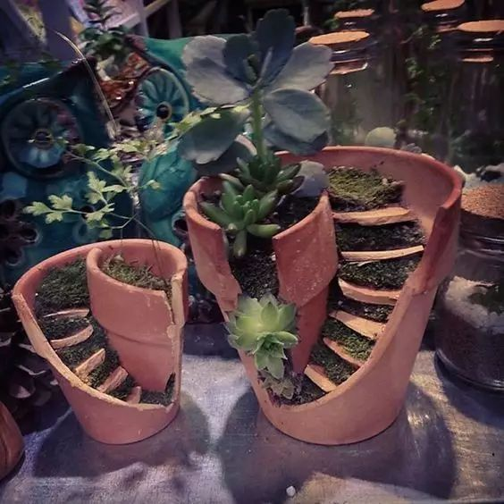
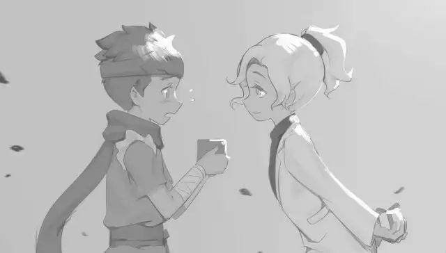

公交车上的偶遇

好久不见

2017.08.03

淅淅沥沥

雨声伴奏间

夜的帷幕悄然拉开

街灯也为之沉默不语

熙熙攘攘的人潮里

我被裹挟着

走走停停

●●●

不留情面地被雨刮器甩了一脸水,我略微清醒过来,勉强杀进一台泥泞满地的公交车。“到定王台不？”“到咧！到咧！”于是跌跌撞撞地,我蹚进车厢。历尽了千艰难万险阻之后，背着个大书包的我好不容易才挤到公交车最后一排。我打开窗户，希望风能涤荡去方才摩肩接踵时被人海螫出的疣。不巧,雨点也随风飘进，飘到坐在前座上——那个看着窗外——似大慈大悲大智慧之佛陀在思考着普度众生的男生脸上。

。・°°☆我忙道歉 ☆ °°・。

。・°°☆他转过脸来☆°°・。

。・°°☆ 我们惊呆了 ☆°°・。

他，是我最要好的小学同学。几年不见，变化了不少。却也是单凭着那时无懈可击的铁关系，我们轻易地认出了对方。“噫呀！好久不见啊！真是无巧不成书哦！就算初中不在一起，四五年不联系，终也有见面的时日诶！”“是咯是咯，嘿嘿,碰到你多好！”他笑着，接着站起身毫不吝啬地送了我一个大大的拥抱。

紧接着，我们侃侃而谈那些年的师从，那些年的女神，那些年与共的件件傻事，那些年两肋插刀的豪言壮语。一切的一切，我当早已在流年中潺潺远去了的,却全然历历在目,就像未曾片刻废离似的。

然而讲着讲着,不免谈及现在的同学、现在的课业和现在的各界领军人物。车流愈发缓慢，后排也愈发拥挤。不知不觉间，我被挤得东倒西歪的次数多了、他瞟向窗外的次数多了、我们有一句没一句地搭话也若有若无地多了。谁能预料到，才初中三年,我们的关系竟至于这般若即若离。

想当年，会半夜起来，戏谑似的，给对方打电话。不出片刻，戏谑的氛围逐渐淡去。拉开窗帘、坐在床沿，手机里传来的是声音，瞳孔里隐约着的是漫天星斗和他的音容笑貌。就这样，重又熟睡在床沿。

公交车的马达停止了运转，气缸的松弛像是舒了长长的一口气。向前看去，一片血红。雨，冲刷在柏油路上，净想着揩拭去那刺目的殷红，却将我们洗得静默无言。我只好戴上耳机，道声“我先做一个章节的听力”，随即进入另一个次元。

那时的我们故意穿一样的衣服，故意写一样的作文；故意留一样的发型，故意讲一样的口头禅；故意做一样的恶作剧，还故意唱同一个老师的反调。我们无懈可击的铁关系，就是铁到这样的形影不离、竟是铁到这样的情同手足。

城南路一线堵得粥样硬化，而且,这碗粥——怕还是在锅里胶着着的。我，似乎闻到了些许焦糊的味道。好不容易挨到简牍博物馆站，我逃也似的挤向公交车门口——只想如何能快些下车——之于那粥,想来也别喝了:这儿反正也离定王台只有两个街区了，就是跑过去都成罢。忽地瞥见他也站了起来，可见我要下车，先是错愕了一下，然后莞尔说到“以后常联系”并转而再次坐下。

下了车，我大口大口地呼吸着新鲜空气，直欲把这方空气中所有的氧负离子都强塞入我的呼吸道。即便雨再怎么下，路再怎么泥泞，裤脚再怎么被打湿，身旁的汽车再怎么吞云吐雾，但我的心情，却是好得不由自主地吹起了口哨。自己想想，也真是颇感奇怪。

我竟在白日感到沧凉

在黑夜感到炽热

在你推我搡的公交车上

感到荒芜

在寂寥无人的大街上

感到充盈

刚到凤凰台，迎面走来了一个和我吹着同样口哨的男生，不仅如此，还和我留着同样的发型，显露同样欢快得几乎要舞动起来了的脚步。我们面面相觑，随即又像刚刚许久未曾见面似的互相“客套寒暄”，一时间好不亲热。最后，他说道，“我那边赶时间，改天真应该好好庆祝一下！”“好的！你也注意安全，改天好好叙叙旧！”尔后，我狂奔逃离，拼了命地，不要命地。

。・°°☆ 无巧不成书☆ °°・。

好久不见的我们，打那以后，真的，真的好久，好久不见。

2017.08.03

按理来说  文艺风的唯美文字间  总是要配上些美美的图画  奈何张衔瑜图库里边全是些极尽夸张怪诞的图  遂而作罢

其实这是一篇我高一时候的随笔  高二改出来之后  已经发表在了湖南省几家省级报刊上面  若是去查  不难找到  昨天有朋友在线上和我说  自己和曾经玩在一起疯在一起哭在一起的闺蜜出门  听闻着对面念叨着许多近况  但却鼓不起勇气  找不到合适的方式来继续问下去

这算是 用礼节在弥补已然生疏的朋友关系 吗  记得  礼  这个概念在  礼记·王制  是说的  让那些情感太过于丰富的人能够有些控制  俯下身来能屈就  让那些情感太过苍白的人能融入群体  踮一踮脚能够得着   这么一来  得用礼节来维系的  几乎是在亲密关系维度的一极到了另外一极

我今天选的这篇  以前就听说过有人拿一篇另外的 从桥的一端走到另一端  来问我是不是参考了那一篇  我不知道  版权问题上如何来定义套作的问题  非专业人士的我只能说  这是我高一时写在随笔本上实实在在有我写了有老师批改过的作文  对面我姑且认一个巧合雷同  不服可以撕一撕

还有就是关于公号的推送  cello说14的字在文不加点的时候  看起来会是密密麻麻的一篇  但之前试的16显得过大了  所以这次上面那篇随笔带了标点  用的是14的字号  下面这里衔瑜的碎碎念用的是15的字号

觉得看起来有什么不舒服的  或者说觉得还有什么好玩的  可以直接在后台找到我张衔瑜  至少可以保证  这是一只 有血有肉会思考而且是活的张衔瑜 在后台看着自己的个人公号  文字我会看到了就回复你  但是表情包和图片的话  需得我回头在PC的后台才能和你尬聊了

文不加点的张衔瑜

懒得打标点的张衔瑜在日常尬文 2333333
