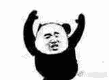
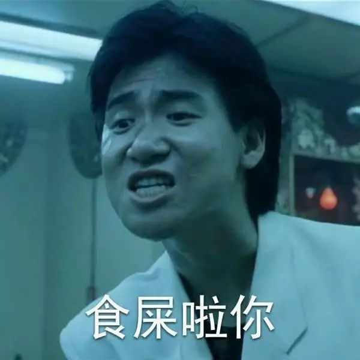
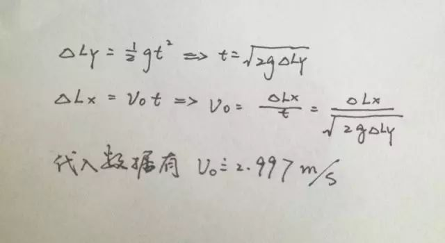
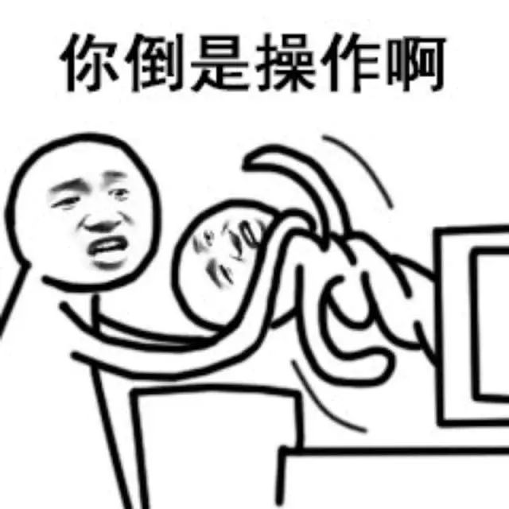
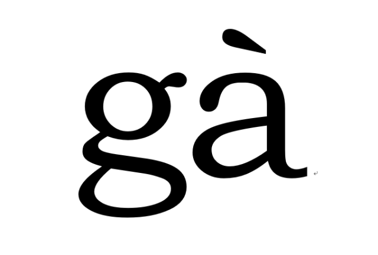
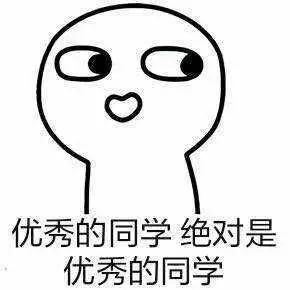
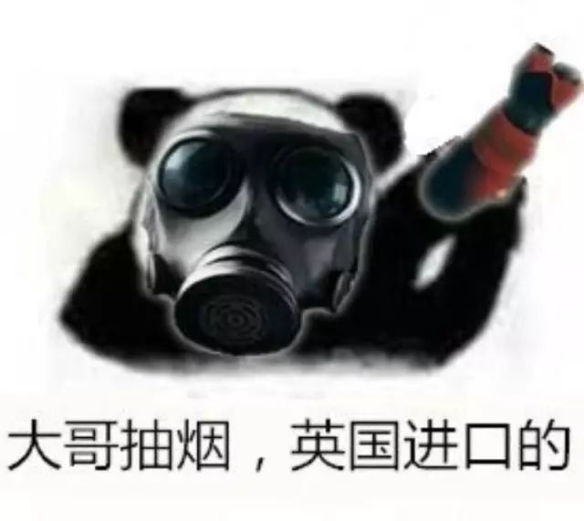
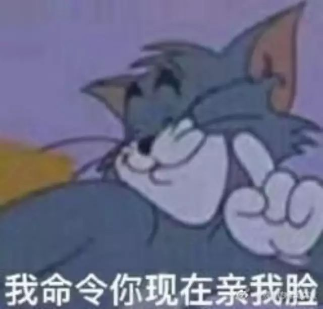
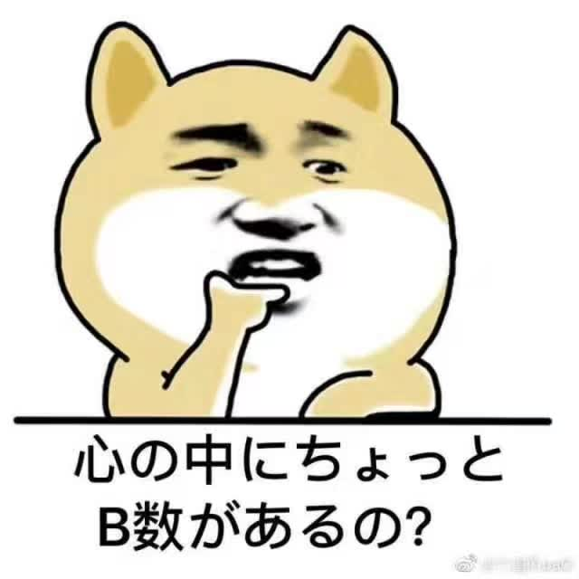

让我们一起尬聊

衔瑜说尬

来尬段freestyle

首先让我们来破一下题  看一张GIF

这只熊猫的面部来源于张学友在 旺角卡门 中的经典台词 食屎啦你  熊猫的身躯臃肿不堪  但自兀自地在空中挥舞着自己的双臂  加之臀部随之扭动  细看之下  甚至还有固体颗粒喷射而出  并形成了一圈像子弹出膛时类似火舌的效果

按照理想化模型  一具有初速度的物体在重力加速度的持续作用下  能在我们视野可及的范围里看到如图设的这般喷射效果  衔瑜简略地根据画布长宽比  并结合张学友的身高计算一下

已知张学友身高 176cm

援引网络上作出的国人体质调查报告显示  以肚脐为界   国人上下身比例约为 5：8 故出射点离地约为 108.3cm

原屏中  张学友臂展即全屏长  又有人体臂展即身高  加之熊猫的扭动出射  不妨设 X-axis 上飞行距离为其臂展的一半  也就是张学友身高的一半 88cm

按照人眼辨识飞行轨迹中  5%的偏差  其 Y-axis 偏移量不得大于 4.4cm

重力加速度按 9.8m/（s*s）

列式计算

这么说来出膛速度约合3m/s  大概就是能够一秒钟跑差不多两个张学友的距离  回头来还可以想想多大的压力才能达到这样的效果  比如瞬间的动量变换  也许有的来复线出膛  上溯还可以查查什么样的食物输入可以达到这样的效果  可我又不是学人体功学或者物理医学相关的 说这些有什么用呢hhhh

●●●

破题破着破着还是要回来的  明明只是一张尬舞图  张衔瑜非得在这里尬出一长段自己觉得自己很牛币的东西出来  只是想给出一个很尬的情境来培养一下这篇文章的氛围基调

以前说到尬  多为  尴尬  甚而至于有段时间和赤果果一起  出现了 监介 可以肯定的是  在鲁迅先生的 且介 亭 之后  没人达到过他那个高度  自然也就不会被文字审议的接受  大概这半年以来 尬聊  尬舞  尬吃  尬走  尬到爆  尴尬癌 还有词义关联的 ky 这里值得我衔瑜来研究一下

按照训诂学套路  得先翻翻字典

《康熙字典》考证道：《說文》尲尬，行不正。从尣，介聲。又《集韻》訖黠切，音戛。行不進。

《漢字基因字典》解釋【尬】〔倉〕叉仰人縱縱  ㄍㄚˋ  Gahˋ

字首〔尢〕：〔用〕曲脛不良於行狀。

字身〔介〕：〔體〕界面。

會意，形聲－小篆文

〔用〕不良的介面，行不正。

〔用〕：尷尬：介於兩者之間，左右為難狀。

limp, staggering gait; embarrass

看来看去  尴尬的本义应该是因腿疾而走路不稳的样子  由此引申为行为不正鬼鬼祟祟  总之就是偏离了正常轨道  处在一个苦难的境地里   其实说了这么多  最后想想还是叫不尴不尬来得痛快   其实刚刚总结下来 尬 这个字在描述上本身就有一定难度  红楼梦第四十六回 尴尬人难免尴尬事 说去向贾母讨要鸳鸯的邢夫人  也就处在 背后色中厉鬼贾赦的唆使 跟前贾母义正言辞的不许 进退维谷  dilemma

稍稍总结一下   这里的尬  adjective  取义 不正 硌意  后面的尴尬癌取的也是这个意思  但适用却有了新的补充  给个情境

我就是个有尴尬癌的人  哪怕是和再熟悉的人走在路上  也不能不说话  不然我会觉得尴尬  再怎么聊不开的人  我只要是同路走都要千方百计找话题  不然空气突然安静  更开不了口  简直要尬到爆

分析尬的来源  算是有心理上对于社会行为&社会交往的些许害怕  需得要通过像不停地说话这样的途径来打消ta  大家说的时候  都喜欢用尬  而不会用尴  一方面尴和干这个常用词汇相隔太近  另外尬的发音中  元音à的使用  无论是从元音视角还是从声调视角  都更符合现在追求极尽夸张怪诞的语言体验

现在尬已经不仅仅作为形容词  更多时候  充当了副词的角色  语法学里边似乎对汉语中副词的分类还有争议  这里只说  尬舞  尬聊  尬文  都是由 尬 这个副词加上后面的一个动词来构成的chunks  所谓 尬舞 是在旁人看来有些自己娱乐自己但没有带动别人的舞蹈 尬聊 是在至少有一方已经多多少少觉得这聊天没有什么营养 尬文 倒是只在写手圈里边流传  按我个人的用语习惯  常常指代没事写下来的随笔小札  这里的 文 名作动

反省一下自己平常的生活用语里边  尬也不是没有作为动词出现的  比如在某个社团迎新的大群里边  看到其中有个人总是发很长很长很大一段的表情包出来  说话总是跟不上别人的逻辑还总是尬吹自己有多么多么牛币  这时候就可以说  作为为人民除害的好少年 我且去私聊ta 尬ta一尬 这里的尬可以解读为类似使动的用法  意为使……感到尴尬  常用对象为人

这些尬舞 尬聊 尬吹 尬吃 尬吹 尬走  都有着中性及中性偏下的含义  除去尬本身带有的消极情感色彩外  一般的聊天中用到这些词汇  也常常以自嘲 自我解嘲 的用法出现  从心理学和语言学挂钩的需要上来看  也只有这样的词汇  在我们说出来或者说打字在对话框内的时候  才会满足我们情感表达的需要

之前有专家说  中华民族五千年  汉语沉积需要经过一定时间  而这些 新词 只是网友在网络上感到好奇的东西  胡乱拼凑起来的  所以受众较少  而且普通人看不懂  应该予以纠正  也不能出现在正常文章上

一个奇特的谜一样的时代往往被奇特的谜一样的词语所笼罩 包围和装饰  或者这就是这个时代的特征 本质和值得一提之处  时代越是奇特 扭曲和贫乏  其词语的发明和生长就越是旺盛  我们所说的尬字系列  到手癌而逐渐被接受的  张衔瑜真 素 文不加点  后台是个小 可耐 控计不住 计几 想要转发 滑中可稽 大学  还有也许我现在一下子没有想到的  但这都是文字生长中 甚至带有圈子特色的存在

补充一个前一段时间看到的 ky 撷取自日语的 空気が読めない 发音kuuki ga yomenai 直译为 不会读取气氛空气 的第一个字母  意思是没眼色 不会按照当时的气氛和对方的脸色做出合适的反应  例如 大多数的会议出席者都持赞成看法  却有一个人高唱反调  这个人就被认为KY  这个词最开始被中学生使用  后来日本前首相安倍在参议院选举中大败却坚持不辞职时  政治家和媒体等指责 首相真KY  233333  大概是说到 尬 的时候突然想起的

衔瑜好不容易回到了一下老本行  没事看看训诂学  也不知道现在真正的汉语言文学训诂考证考究是不是我这样做的  或者说有没有对我关注的这些文字现象给予一定重视  但至少很明显  我这边语言学 心理学 还有社会关系交织起来  不敢说全部切中肯綮  不敢说考据过程很专业  大抵只是一个业余选手瞄一眼然后自己玩给自己嗨罢

也许什么时候心血来潮了  就来说说平时遇到的那些有趣的尬聊/尬聊哇红红火火恍恍惚惚

文不加点的张衔瑜

懒得打标点的张衔瑜在日常尬文2333333
