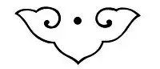
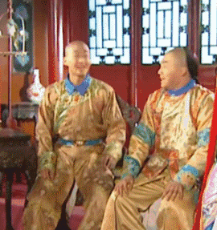

神佛若无偏私

为何独向拜他的人

展露他的神威

神佛若有偏私

如何当得拜他的人

所献供的虔诚

这样一来

神佛只是交易对象

回头一想

魔鬼也是交易对象

那么是谁

穿着不具名的外衣

听任三界

偷盗罗生门的须发

精心雕琢字句

仍抵不住闲碎侵蚀

他们反来问我

你写什么乱七八糟

我唯一的固执

也妥协在了这里边

破旧的外衣呵

将再也穿你不上罢

我在说不道德的事吗

我把手纸冲下盥洗室

我讥讽那些三更起的

我嘲弄那些十日曝的

我有过梦想

文不加点的张衔瑜

懒得打标点的张衔瑜在日常尬文 2333333
