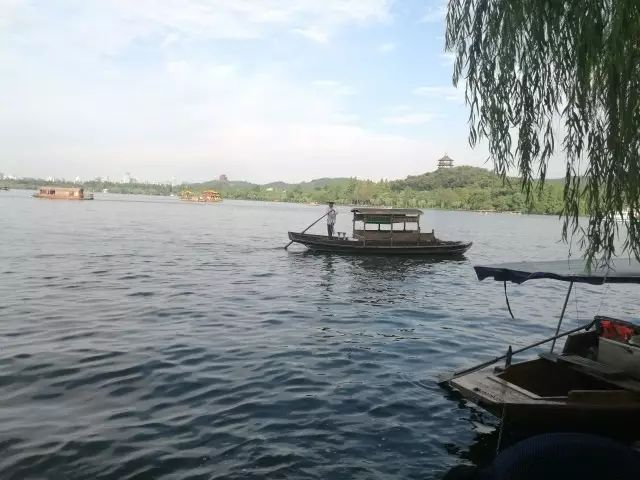
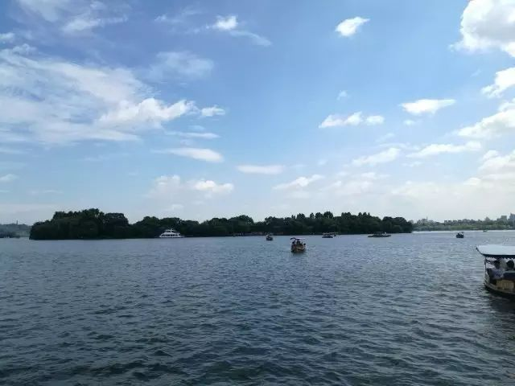
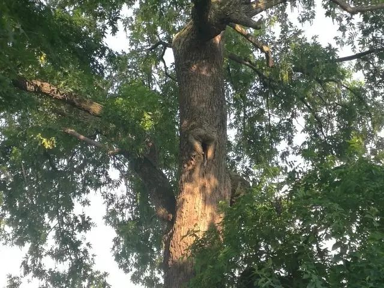
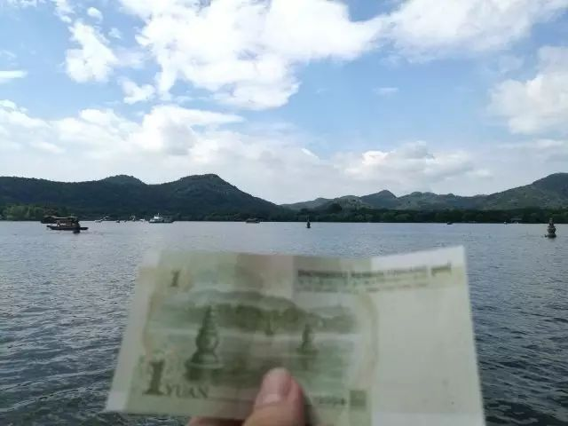
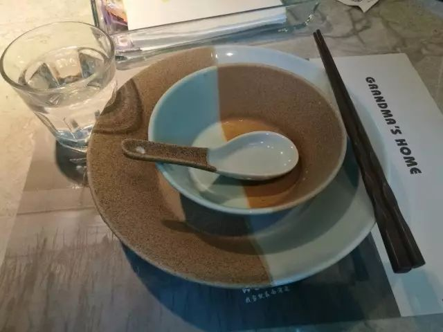
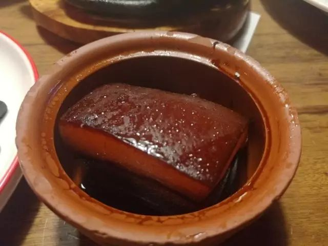
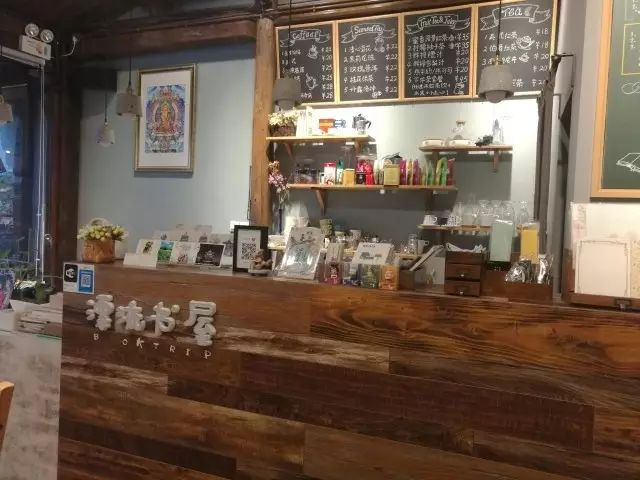
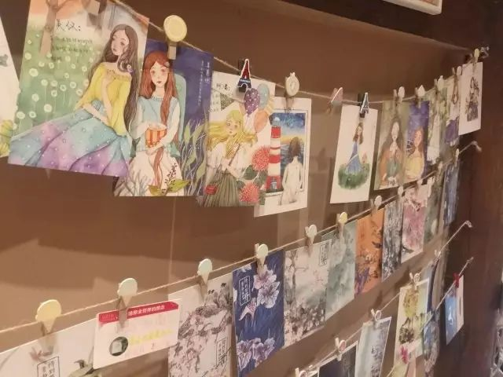
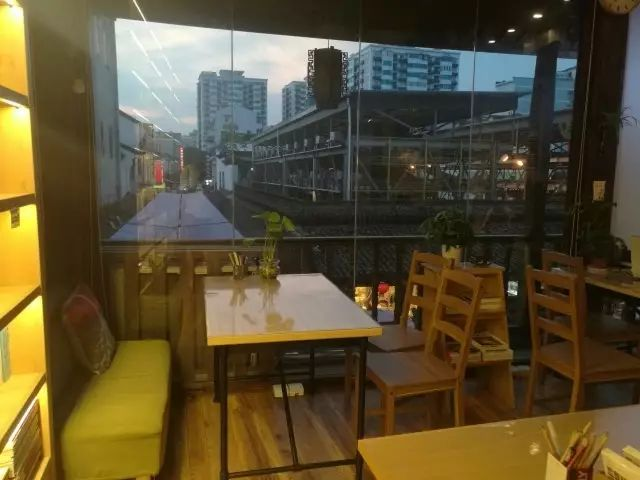

文不加点的张衔瑜

暑期尬走

杭州随感

苏堤跨虹桥上 | 夕阳

8.13

G1348

9:00----12:52

长沙南---杭州东

测评如是写道

8.13

中午简单地

在老娘舅解决了中餐

下午到了酒店后

旋即去了花港观鱼

径直走上了苏堤

找了条小凳子坐下来

看西子湖畔摇橹船往来

想着不具名的小事

以及苏堤春晓

小猫爬进了树洞里

只露尾巴和后肢在外

游人以为其为蛇所困

不料它反身窜了下来

晚上在曲院风荷边  看了一场G20峰会遗留下来的 最忆是杭州·印象西湖表演 布景仍有着彼时的精彩  水上芭蕾和众多借力西湖的光影效果令人大呼过瘾  可惜后来在梁祝等节目中的一众演员明显因长久演出同一节目而显得有些疲惫  倒是最后的群演撑伞  把《茉莉花》和《图兰朵》糅到一起的节目  其承载大型节目闭幕的意味过于浓厚   不予好评

随后夜袭了浙江大学的玉泉校区  在化学系门楼前停留了一会儿  坐了坐图书馆  没有感受到如蜗壳一般的妖孽学风  兴许是暑假的原因罢  走过竺可桢的雕像  看到校园内每栋楼都有支持声波付的自动售卖机  听说紫菘片区也引入了类似操作  消息有待证实

8.14

▲一块钱的背面|三潭印月

我尝试在湖心岛上以各种角度

拍三潭印月和一块钱的合照

奈何游船多  角度也十分刁钻

只得做罢

想起七年级下册的一篇课文

《湖心亭看雪》  （明）张岱

崇祯五年十二月，余住西湖。大雪三日，湖中人鸟声俱绝。是日更定矣，余拏一小舟，拥毳衣炉火，独往湖心亭看雪。雾凇沆砀，天与云与山与水，上下一白。湖上影子，惟长堤一痕、湖心亭一点、与余舟一芥、舟中人两三粒而已。

到亭上，有两人铺毡对坐，一童子烧酒炉正沸。见余，大喜曰：“湖中焉得更有此人！”拉余同饮。余强饮三大白而别。问其姓氏，是金陵人，客此。及下船，舟子喃喃曰：“莫说相公痴，更有痴似相公者！”

应景之至

▲中餐外婆家|精分的餐具

▲排着喜茶的队伍

来一杯黑金芝士

旋开杯盖后

芝士和红茶

同时啜进嘴里

芝士老饕的内心

有泡泡在往外冒

▲晚餐新白鹿|东坡肉

晚上依旧选择的

杭帮菜中有名的新白鹿

网红店的排队阴影

菜品没有因此而折扣

虽然湘菜系口味刁钻

但也还能接受

▲很有意义的漂流书屋

▲地点选在了清河坊古街

▲体验挺不错的

后记|杭州

杭州这座城市  一开始入城  在西湖区所感受到的绿意葱茏  而后滴滴司机热心地介绍起他生长在的这个城市  到亲身感受在苏堤  在柳浪闻莺  在断桥孤山  在浙江大学  这些地方之为湖畔居民的生活  总体看这座城市的人民风貌  不似内陆中部地区  两湖人民的这般性情

这么看吧  我想起两湖人的时候  最先想起的是湘西山林  临溪而渔  缘木而居  我想起黄土高原的时候  想起的是西岳华山上冷峻陡峭的崖面  我想起西藏的时候  想起的是在那曲根山上七月飞雪的蓝衣银饰藏民  而这番说起杭州  则是微风把西子湖面折出褶皱

若不是杭帮菜这一点与湘菜系相去较远  我会认为杭州是一个在每个方面都很宜居的城市  但若非得以辣椒的元素入侵杭州  那杭州也就不是杭州  不是那个西子湖畔十景献供的杭州了

鲁迅似乎讨论了两次雷峰塔的倒掉  也在这边说了说中国人没事也要凑起来的 十景病 这显然不符合我党在对于有心为共产主义事业献身时 成熟一个 发展一个 的基本策略  应该是有一个景点就说一个景点  像平湖秋月这样说起来有些虚无缥缈的  觉得在湖畔定下这么个景点始终有些硌脚  并不算个严谨的论断  不接受批评

待续

To be continued

8.15

G7386

09:35-----11:17

杭州东---苏州北

文不加点的张衔瑜

