苏州

苏帮名菜 | 松鼠桂鱼

8.15

G7386

09:35-----11:17

杭州东---苏州北

8.15

苏帮菜里的名人

大概松鼠桂鱼

无论如何

也绕不开的所在

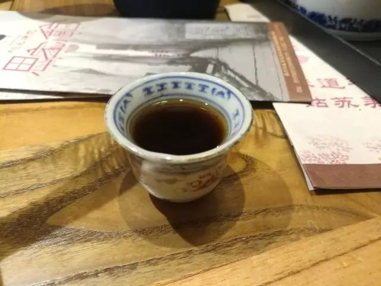

和女儿红同款的

是当地人自酿的黄酒

在滴滴司机推荐的

小馆子里边

风格别具

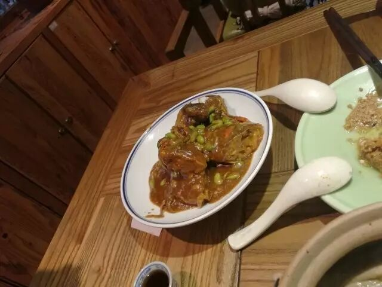

不吃蟹

怎么对得起

苏州边的阳澄湖

不造这么说

是不是游客了点

但这碗安利

是要出的

莫名其妙吃起了

桃花源记的酱卤凤爪

手型十分诡异

仍然经受着

九年级化学书上

苛性钠和凤爪

算了我不继续说

毕竟凤爪

是我很心水的

很奇特的

真的赛蟹煲3

不知道杭帮胖哥俩

会不会有点较好

这碗真的

不知道是什么

8.16

苏州是猫空的发源地

三天我看到了五家猫空

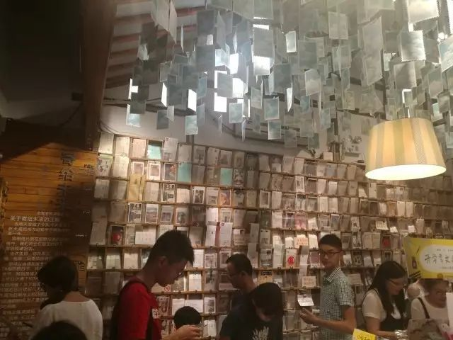

之前也就

武汉光谷昙华林

和大连渔人码头

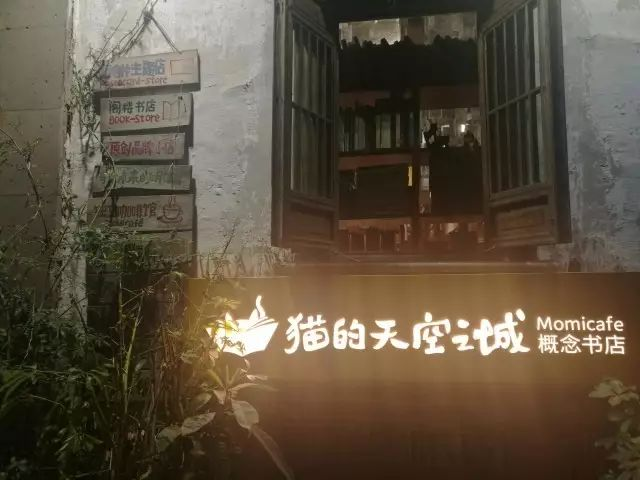

邂逅这么多

小确幸太突然

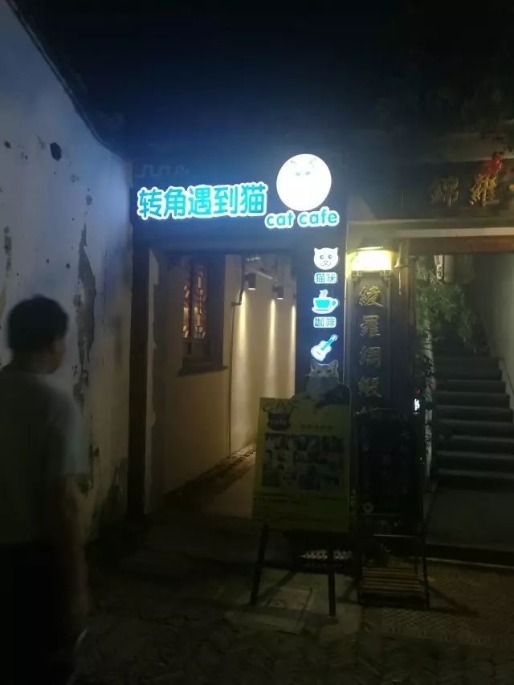

▲平江古镇上的网红店

▲学姐的推荐

不过我在小眷村

喝了一杯店铺同名

没有达到我

对这家店一直

的期望值

可能心情不对

或者受干扰

莫能名状

▲说是叫甜粥

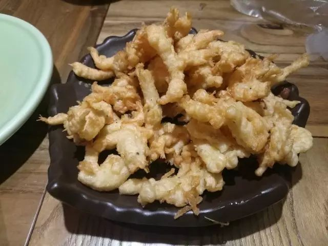

▲酥脆的蛋黄虾松

吃点小吃

看看窗外景

平江古镇

同里古镇

七里山塘

尽皆水乡

把江浙苏杭

定义进了

这江水婉转

和楼台起伏

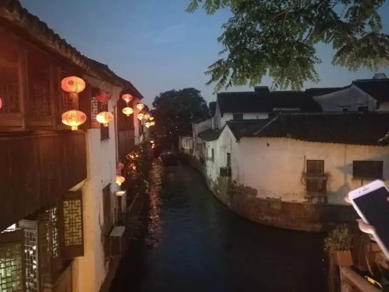

8.17

园林  园林

随手一拍都是景

随便一想都是诗

拙政园

狮子林

寒山寺

留园

枫桥

同里

集园林大成

榆柳荫后檐   桃李罗堂前

暧暧远人村   依依墟里烟

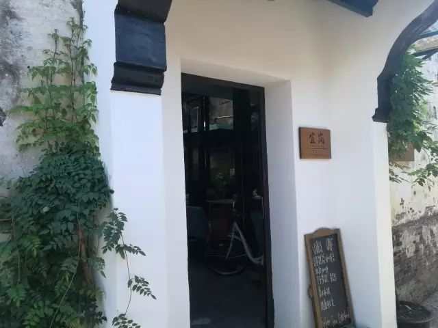

借问采薪者   此人皆焉如

薪者向我言   死没无复余

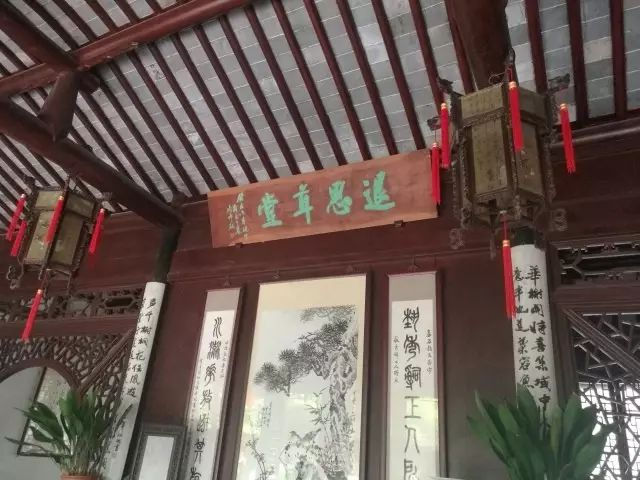

借问采薪者   此人皆焉如

薪者向我言   死没无复余

道狭草木长   夕露沾我衣

衣沾不足惜   但使愿无违

云无心以出岫   鸟倦飞而知还

景翳翳以将入   抚孤松而盘桓

归去来兮

请息交以绝游

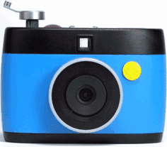

钟书阁

专门开的单章

一个有情怀有品位的书店

从装潢到选购

无可挑剔

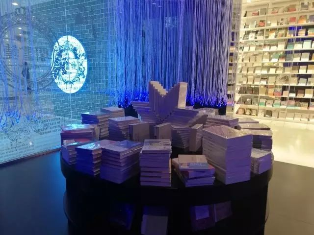

内置即是书吧

可悄悄尬聊

可静静看书

可写写推送

可脉脉瞟过

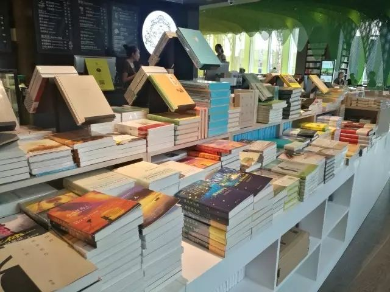

待续

To be continued

苏州

一座有文化气息

一座有园林底蕴

在平江古镇

在伏羲会馆

昆曲评弹

真正的创造力

日常演出

合作了念奴娇

荣幸之至

只是一切一切

稍稍违和了

湘楚的放荡不羁

并不存在

厚此薄彼的操作

只是一点感受

挺贴心的体验

但正如我之前说的

我只想有个

有园林兴趣的

朋友

应该不会

自己去捣鼓

一整个园子

有这样的地方

偶尔能去走走

消遣消遣

回到两湖的丘陵

江河湖的诗

比园林适合我

•

8.18

G7587

09:19-----09:54

苏州---上海虹桥

文不加点的张衔瑜

