魔都

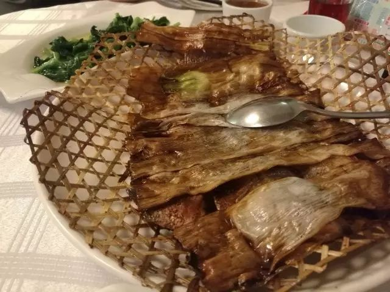

本帮名菜 | 竹网鲈鱼

8.18

G7587

09:19-----09:54

苏州---上海虹桥

8.18

中午在翠亭酒家

老板亲自迎客

本帮菜的竹网鲈鱼

尝尝总是好的

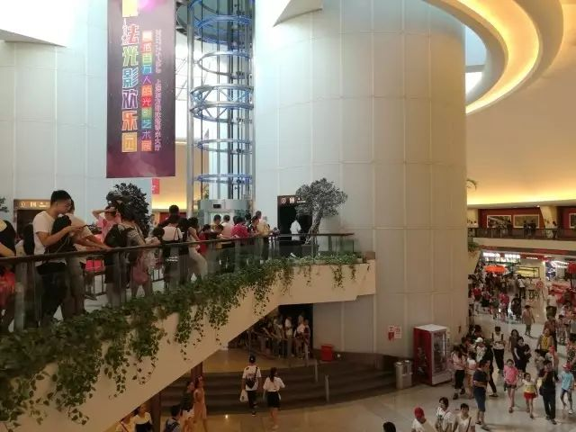

东方明珠塔

上一辈的网红

不对  中国红2333

13:41---18:12

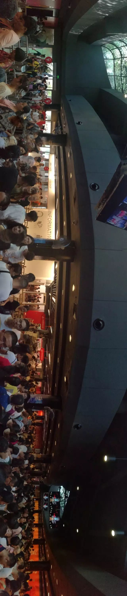

感受到

由衷的恐慌

旁边的小哥排不动了

坐在地上

任队伍向前

插队的被群怼

熊孩子跑到队伍前面

ta的家长紧随其后

“诶麻烦你让一让”

“我家孩子前面去了”

平均下来

排队两小时

拍照五分钟

身心俱疲

上几张图呗

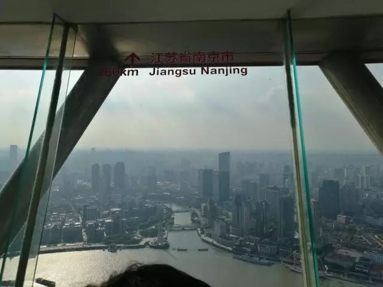

省会都在上边

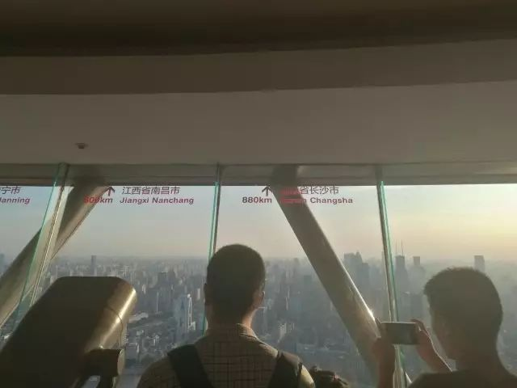

想找的

隔几个玻璃

都能找到

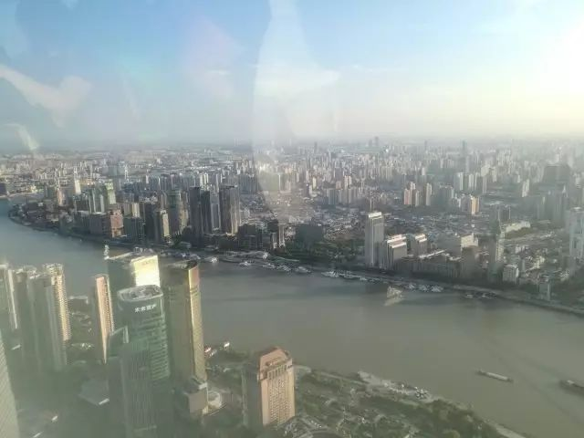

真  江景

水逝黄浦江

舸舰往来

可惜玻璃倒影

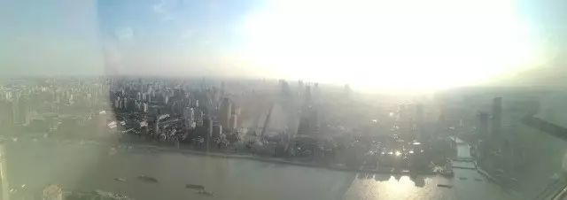

▲263m视角

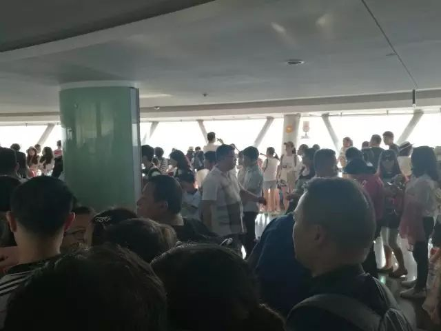

▲扛不住的人多

人多了是真的闹心

摩肩接踵blah

不待见直接接触

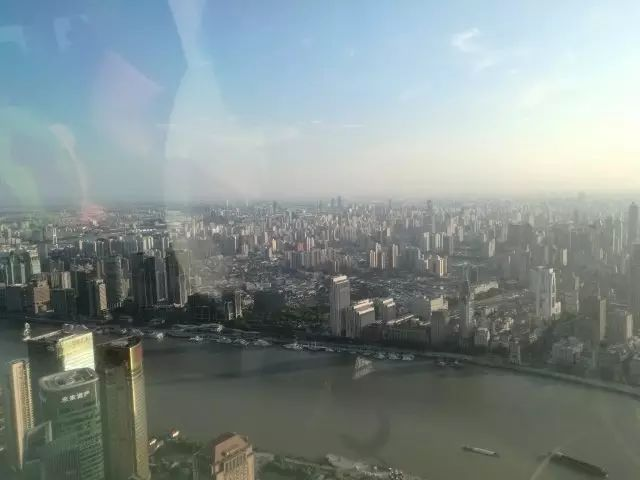

▲某个方位吧

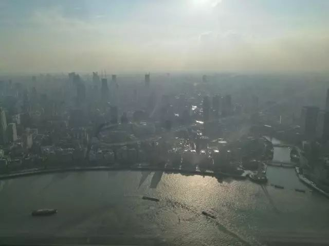

▲夕阳下的外滩

¥220的门票

说来排队拍照blah

倒不如我去正大广场

买他十杯奶茶

然后坐在塔底下

一杯一杯喝

喝完了你们下来了

我还觉得美滋滋

人和人的不同

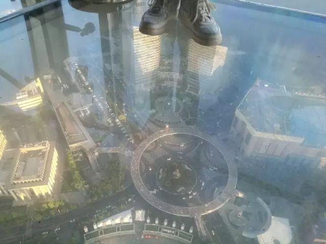

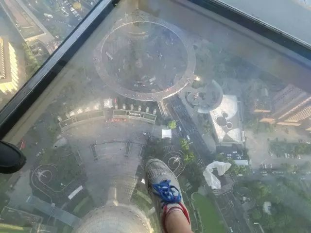

▲想起“践祚”的本意

虽然我知道不对

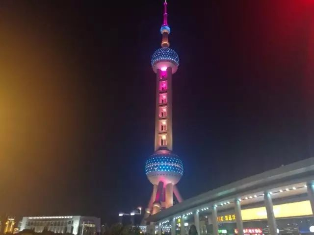

外滩

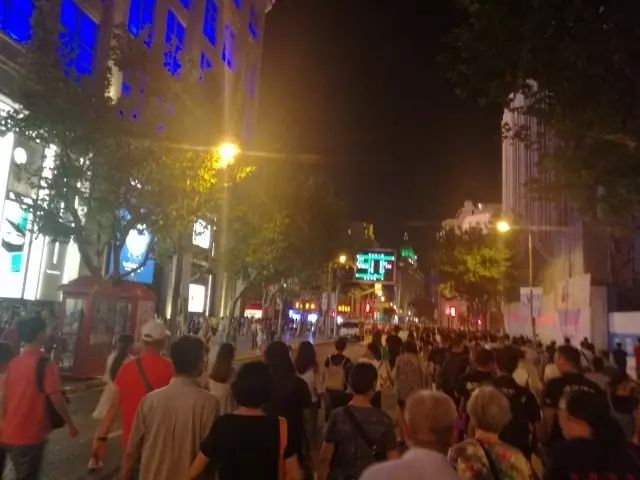

是真的人多

哪怕人群的流动

都要交警来引导

像行车靠右

得分流

才好

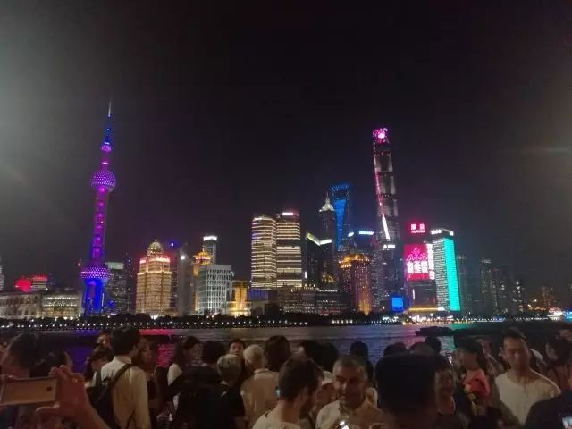

有人问交警

前面是发生什么事了吗

交警一脸轻松

没事儿  什么事也没有

这地儿天天这样

说着继续吹口哨

引导着人群走

别堵在路口

往前走

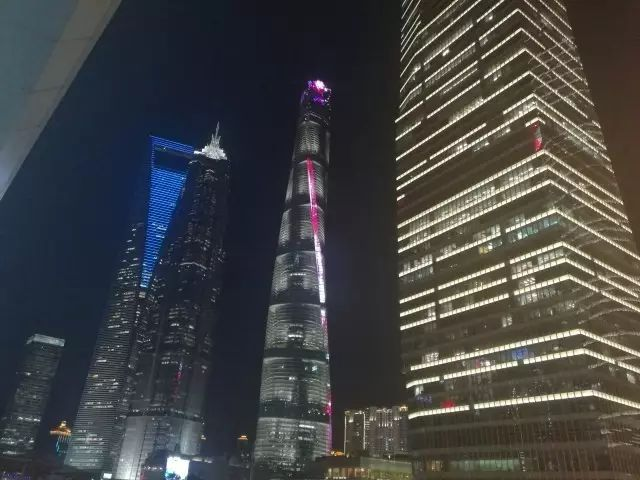

其实是在陆家嘴

拍的这张hhh

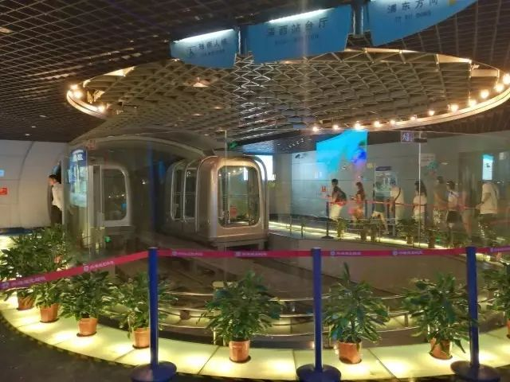

观光隧道

¥50

感觉像是给

小学生去玩的

然鹅

我也搭进去了

皮

待续

To be continued

黑色——“腹诽”

红色——“操作”

坐在书桌前想推送

想着十八号到人民广场

住在汉口路的民宿

觉得太热了想去洗澡

然后去翠亭酒家

开喷头觉得不对

哇怎么把眼镜戴进来了

摘了放浴室沐浴液上

下去去东方明珠

嗯排队一定要重墨

在陆家嘴吃完饭

没什么好说的

晚上回外滩

哇被人群裹挟惹

到卧室找眼镜

折返回梳妆台找

嗯大概率在床头

诶怎么回事

平常放的地方都没有

/-黑脸  在沐浴液上面

魔都排队印象很不好

比苏州走园子还累

上海有机所嘛

总有机会来

•

8.19

G1349

10:48-----16:34

上海虹桥---长沙南

文不加点的张衔瑜

