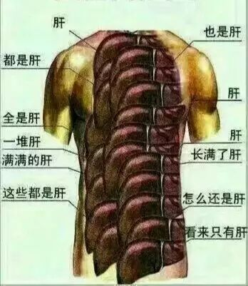
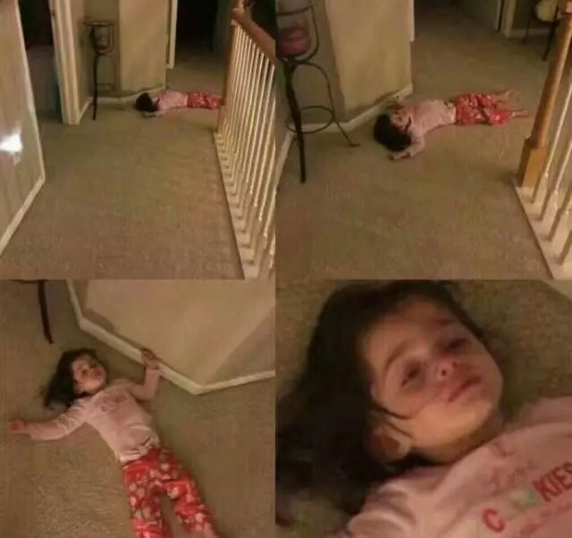

这是常山最帅

子龙截江救阿斗

由是人们说 子龙一身都是胆

我怎么说自己好呢

在不具名的演出中玩起了过家家

所以 衔瑜一身都是肝

对吧

​

返校到现在  拖拖沓沓  说得上能拿出来的图文消息  也就现在这一条  之前就很草率地找了最近的什么事  然后放到 Notepad 里边  尬出来  轻薄为文  之所以这样的原因  大抵是事情实在有些多

我曾经这样描述上周周二  也就是09.05  我说 我那天不死  之后就可以称自己immortal 早先返校  暑假去的大连和香港都要回来答辩  把钱τ回来  突然发现自己比别人学费多了1350  学籍系统认为我去年转了专业  而我并不知道  今年回看的时候  发现自己去年还欠了一千多  虽然是个子虚乌有的事  但学校不来催我交钱这就是个很神奇的事

九月五号一早不到七点起来  洗漱完  在小绿人胶鞋上漫溢出的气味当中  吃完了鸡肋过桥的热干面  胡乱擦过嘴巴就到实验室准备器材  八点开始  听完教授讲解完今天要做的实验  旋即在其他同学开始实验的时候  兀自走出  跑到新生开学典礼的片场 借我的尬聊  讲别人想听的话

那之后  一旦有人说

张衔瑜我觉得你很阳光呀

我都腹诽不已

脑循环《残酷月光》

努力微笑坚强

十一点回到实验室  开始接着别人上午的实验  自己却只能从头开始  稍稍问下旁边人上午操作中出现的问题  自己坐在分析天平前  右手捏着盛装有铁矿石粉末的试样瓶  左手捏着瓶盖  一点点把试样敲震出来  然后边敲边回正  盖上瓶盖  放进分析天平  0.1140g  bingo

中午随便捞点饭  回到实验室  取出通风橱里的锥形瓶  嗯 表征出的颜色基本符合  贼眉鼠眼地盯着锥形瓶  小心翼翼地滴下每个一滴试液

觉得自己很奇怪  明明很想恋爱  但可能就在寝室里想得好好的  也约了自己很喜欢的女生准备去自习或者出去玩  但刚迈出寝室门  就退却了

甚至上大物课之前  一度厌学  强行坐在教室里听   二十分钟后  觉得越听越有趣 哇  感觉自己好喜欢  状态好好  好中意  老师说的好棒 又过了十分钟  重归厌学

在恋爱  就像是把文章的格子已经全部划好  就差一个个往里面填字  可文章早就写好了  再懒一点  也就失去了写作的动力

蹭出实验室  从小吃城提个饭就准备去大活坐镇  刚坐下来  饭才吃了一半不到  约了周四面谈的导师突然叫我去百景园  说是 今天正好有时间  出来聊聊 我知道  导师是个忙得用粥代替吃饭的人  就把刚吃了一半的饭处理了  径直走出去

晚上和同学一起  把一千五百分报纸和八百份杂志  从大活运到爱广  四十分钟走得腰疼  稍事休息  便临时进行分配和指挥起了全韵苑的势力来进行扫楼安排  前主编说我 突然之间气场外放 感觉很能唬住人 好像我就是以此之为生计的  然并卵

将扫楼人员全部引导进了各个楼栋  我自己坐在爱广边小憩  这时一队新生从东操走来  我就站在爱广边  一手拿着报纸  一手拿着报名表  大概十来分钟  趁着新生刚刚走来 登即围拢上来的那一部分  发了一百多份的我  似乎找到了喜茶blah找人去当托排队的理由之所在了

端杯鸡蛋仔在手上  同身边隔壁寝同学尬讲  发现自己今天还没死  大概可以超脱生死之外了  但从东边走回时却发现  自己走到一半时   脚都抬不起来了  那种感觉  就是 脚步很轻  但腿很重 沉重地把脚提起来  但轻飘飘地在路面上滑行  同学说我差不多快累傻了  深以为然

想赶着个时间出门  却总是推脱  好不容易找个理由   也就只是去琴台  取个票回来罢了

昨天和金先生一起出去  在汉阳南边看整个汉阳老城区  金先生说  你看  我们对面的就是 龟山 当年伯牙钟子期  便是在这里相遇  当年钟子期上山劈柴遇到了俞伯牙  证明这附近便是有一个集市  你现在所看到的市第五医院  就是我指的那一栋白色的房子  前面那条街就是 西大街 是武汉现存的最早的街  距今已有2000多年  当年的集市可能在于此  整个 汉阳 的生命发源也在这里  不仅如此  我们所说的晴川历历汉阳树  芳草萋萋鹦鹉洲  我们回头看到是的 鹦鹉洲大桥 而这条街上  有一株武汉最古老的树  我们一会儿过去  那是真正的合抱之木  也就称之为 汉阳树

金先生是个很博学的人  每次和他一起出去  不管是自己摄影技术有多烂  需要金先生如何指点  但就只是跟屁虫一样跟在后边  听金先生讲这附近的事情  就像是自己身边的百家讲坛

可我自己行吟街市  确并不见得如此

渐渐地  连音乐也失去了  只是说 厌倦别人用情绪来掩盖我自身的虚妄 就像一个空壳  自己什么也没有  不想睡倒在过去  又开启不了将来  无趣而颓靡

无数次想听着战曲  从压抑的地铁上  冲出站台去  将扶梯掀翻  把闸机破坏  教腐朽的被击碎  令暴戾者立法  可每次  刚跨过地铁和站台之间的间隙  身体就会告诉自己 太累了 我们能支撑着走回去就很不错了

熙熙攘攘的人群中  吸留着不具名的演员  包夹了每个人的异样情愫后  一泓清流字云端倾泻而下  拿着所有外人以为的孤单  踽踽独行  兜兜转转  思路却显得更为清晰  奇怪配色和僵硬表情  好像只有充电宝上弹奏的电音才真实存在

李尔王里有这样一段话

要是在那样怕人的晚上  豺狼在你的门前悲鸣  你也要说 善良的看门人 开了门放它进来罢  而不计较它一切的罪恶

也许只有木偶  在黑暗的房间里才能保持干燥  捂着嘴偷偷哭的样子  像是在发出一些奇怪的笑声  颓圮的墙篱  想起芥川龙之介里边《侏儒的话》  像是弗里德里希一样的  浪漫

在招新笔试的考场中写下这些乱七八糟的  他们怎么还不交卷啊喂  这么认真感人的吗  我没准备命什么题  就随便尬写好了

早上来西五  明明是我借了的教室  微校园上也有登记  进来一看  四五十个人在里边自习  心里不爽  想强势尬走一整个教室的人

我也不说话  就在黑板上写下  招新笔试  09：30—11：00  然后在讲台上整理物品  也不说什么话  就把两个装了卷子的档案袋只往桌子上一放  摊开在最上面  然后自兀自地整理物品  不一会儿  一个人走了  两个人走了  三个人走了  整个教室就空了  操作

想来会是要去实验室的了

不定期失联

文不加点的张衔瑜

