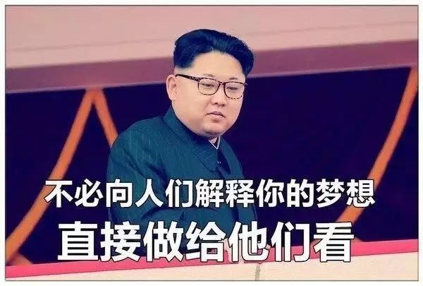
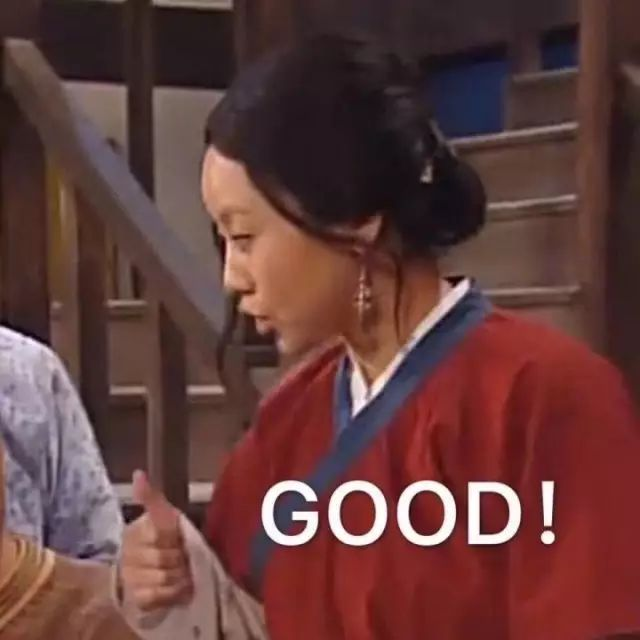
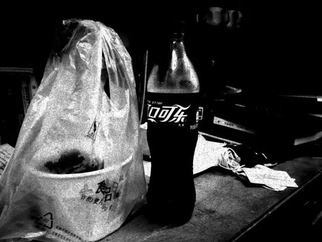
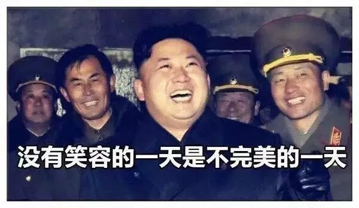
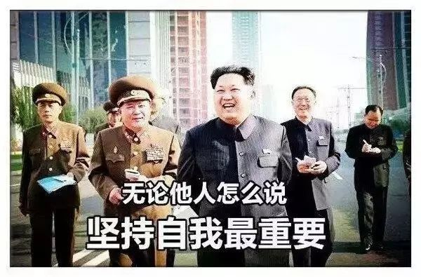
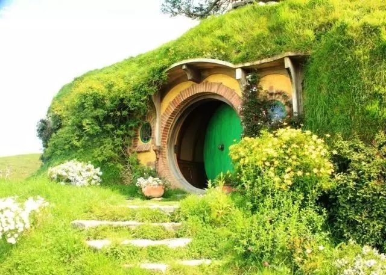
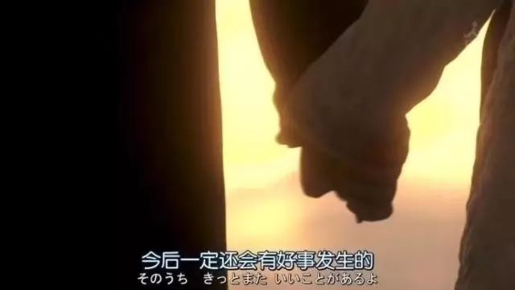
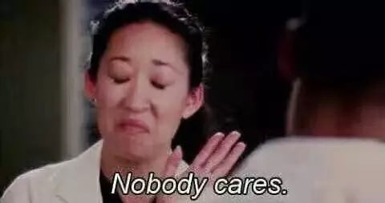
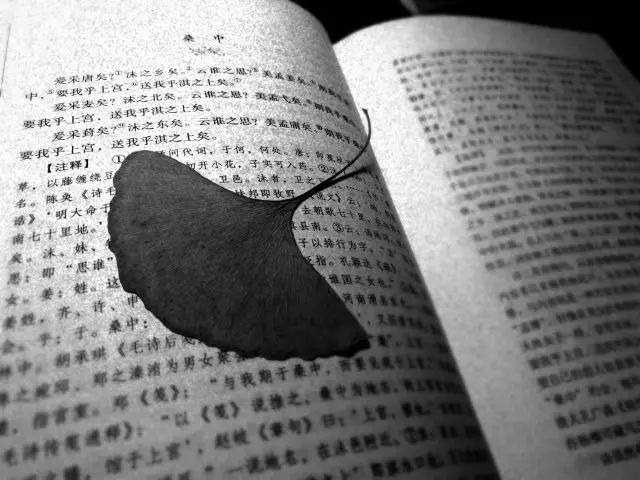

It’s a tough week Uah~

就像是突然被人告知

all that U’ve done means nothing

在上次的子龙一身都是胆之后

依旧肝得生疼

为了院务的一些  不可避免地  冲突自己既定的学习生活步骤  在一个巨大而庞杂的机器中  一颗小小的螺丝钉  也是需要被拧在其中的  不具名的劳动力 配合出演

倒是有些新的发现  无论是表演者  还是观影者  都疲乏得不行  以前在高中时听哲学老师的解释 思想的美学在于主体客体在双方共同需要的平台上愈走愈近  最后思维交融 便称之美学的最高追求 倒是无意去界定这一说法在人文科学中的正确性  诗人的特权在于  只要找到自己想要的点  可以任意杀捧  似乎听起来很教人向往

周五下午听学院学位点答辩完  回寝  一下午的尬聊  真正面对面地见识到了  之为真正国际化学家 化学大师身上 以及他们已经内化到骨子里的那份科学家的气质  就在你面前  就能够给你一种渊渟岳峙的学术大师的感受  可  自恃英语口语OK  为他们的气质和谈吐所折服是一回事  和他们聊天  尤其是带有使命感地去聊天  却是另一回不简单的事了  以下是我们聊完天后  大师们给完对我们presentations的comments之后的一点碎碎念  简单回忆一点

I hope you young students can be much more courageous . Someone may told you that there are some degrees or awards need your papers or conference certifications, but those are not matter. I encourage you young chemistry students can find your own way to solve real society problems. Typically, your environment, your energy, your education system. I wish you guys could make real progress to our world.

当时出来  虽然结果很是理想  但也已经十分心累 到话都不想说的程度  在食堂窗口打饭  就跟阿姨比数字“三”  然后指了指我要的菜  再做一个打包的手势  从小卖部提瓶可乐  回到寝室  稍稍尝了一点  然后喝下一大口  窝在寝室里自己的小沙发椅上 缩成一团  等着可乐沤气

归整了一下报告  整理数据的时候发现自己周二做的饮料中色素含量的分析  算数据的时候发现怎么有的饮料中色素的含量为负  讲道理  这是和含量/产率过百同样清奇的事  后来发现本来这一步应该测九根线的  因为对预习报告的理解不够透彻  就只测了三根  本来报告里应该有的其他六根线被我们遗忘了  当时整个人心里就惊出了一身冷汗  后脊背发凉

周六做了一整个白天的实验  牛奶中钙含量的检测  精力太过于集中  以至于上午实验做到后面  都不得不停下手中的滴定  而稍稍缓释一下自己的注意力  关上滴定管  然后用实验手套的外沿扶一下眼镜  坐在实验台上  像是跑完三千米之后  浅浅地喘了几口气  然后重又整理精神  回到实验当中来  气若游丝

下午也是画风清奇  四人的小组  两个带脑子两个带手  Unfortunately  我是那个带脑子的  差不多前后算完  三个半小时的实验  有一个半小时我是在算各种实验配备以及线性拟合  最后做出数据的一刹那如释重负  然鹅  如果把下午的实验分成十步  我们因为算来算去并且查了点资料  直接忘记了还有第四步还要做的条件检验  不多说了  感觉自己 学了一年理科的老脸在这两次实验中忘记步骤的操作里边都丢光了

晚上出实验室已经六点半  想去听七点半的琴台音乐会  是石进的  夜的钢琴曲  只见一个纯蓝色长裤的男生戴着耳机一路暴走  在地铁上啃着个不知道什么时候出锅的面包  然后在换乘站内一路尬跑  出站后直飞琴台音乐厅

倒是进场后  对身边的人说了声抱歉  然后坐下来  听着钢琴曲  一会儿就吸汗了  然后收进去的汗  全部变成了泪

不要喷我画风突变

在听石进钢琴曲的时候

就像是我被人暖暖地抱住了

然后我窝在ta的怀里

满心都是治愈

突然去到了  在一条挪威那边的北欧小镇上  枝桠型的路灯行道  晚灯此刻  踩着路面  被扫到路旁的积雪  一脚下去  能感受到自脚底而来的惺忪雪声  凉意从我的鼻腔钻入心扉  喜欢这种  连血液中也带有冰凌的感觉  走着走着  不远就到了老比尔博家的袋底洞  昏黄的灯光从小小的矮人房屋里透了出来  甚至能闻到丝丝醇酿老酒的酯香  兴许  还夹着些许壁炉里柴火没有烧尽的

有的火箭引燃时像是出谷的黄莺编队在空中飞翔，发出美妙的乐声。还有烟火甚至变成了绿色的树叶，黑烟成了火树的树干，一瞬间让人体验到春去秋来、花开花落的奇观。发出闪光的树枝也不甘示弱地绽放出鲜艳的烟花，落在惊讶的人们身上，火花在碰触到他们仰起的小脸前瞬间化成甜美的香气，消失得无影无踪。如泉源般涌出的闪光蝴蝶在树丛间穿梭；彩色火焰构成的圆柱上升化身成飞鹰、帆船或是展翅翱翔的天鹅；一阵红色的雷爆让天空落下了黄色的细雨；银色的长枪如千军万马般射向天空，随即如同万千长蛇般发出嘶嘶巨响坠落河中。为了致敬，节目中还有最后一项特别的惊喜，正如所计划的，它让我们大吃一惊：全场的灯光熄灭，一阵浓烟出现，化成远方朦胧的山影，山顶接着开始冒出光芒，随即吐出猩红与翠绿的火焰。从火焰中腾飞出一条金红色的巨龙，体型虽然和真龙有段距离，但栩栩如生的模样让人不寒而栗：巨龙口吐火焰，眼射强光，还发出巨吼，随即在人群头上连吐了三次烈焰。全部的人都不由自主地趴下，试图躲过这阵烈焰。巨龙发出轰隆巨响飞跃众人头顶，最后来个后空翻，在临水区上空炸成一片灿烂的火树银花。

心情美滋滋地返校  中途和有趣的人聊着天  地铁坐过了站……  还是很开心呀  虽然下午没参加原班的生日派对  晚上回来舍友都在准备明天班里的辩论赛  氛围从来是搞事的预兆

莫名其妙地被部门里边的薪酬给闹心  本来自己不觉得有什么的一个事  就因为钱来和别人攀比高低  不仅搞得自己趣味很低俗  也弄得心情很糟糕  想和刚刚招进来的部员说点什么  又觉得他们现在连自己的理想还不确定  就给他把现实的论调定得这么低  不妥更不忍

纠结于斯  还有两份分析报告  一份大物报告  一份大物作业  话剧《李尔王》  两个部门例会  一次院队训练  还有一个大实验在等着我  下周也不是什么良善之辈  做完了实验报告兴许也会发一下  心情所系

《诗经·桑中》

夹的树叶是我以前捡的

现在被压出茎秆印记了

这很项脊轩

文不加点的张衔瑜

懒得打标点的张衔瑜在日常尬文 2333333
