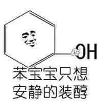

满纸荒唐言

一把锌酸泪

本篇具有参考价值

但

不具有法律质检效力

不具有法律质检效力

不具有法律质检效力

可

是我在实验室做出来的

是个学生实验

随意感受下

这次做了三个事 饮料中色素含量的测定  AD钙中钙含量的测定  食品&饮用水中亚硝酸盐含量的测定 导师特别提醒了我  如果要发出来的话  因为我们只是本科生实验  没有经过完整的质检人员筛选  发布的时候指名道姓 有些不妥

引述红楼梦第一章 其中琐事 或可适情解闷  然朝代年纪 地舆邦情 却反失落无考 也就是说  之后我指名道姓的  也只能  是石头记

按照倒金字塔展开  首先要给出最重要的  饮料中色素含量的测定  AD钙中钙含量的测定  食品&饮用水中亚硝酸盐含量的测定   三个实验的结果

市售美年达橙味饮料、樱桃味的可口可乐、普通版的可口可乐、听装百威啤酒、西柚味RIO、盒装维他柠檬茶、罐装王老吉、罐装红牛、市售美年达苹果味饮料 检出合格

色素含量

市售哇哈哈AD钙  标示值为60mg/100g  第一种方法检出为  60.363、60.409、60.431  第二种方法检出为58.653、58.653、59.770、60.271  第三种方法检出为61.260 基本符合

钙含量

市售紫山·什锦水果罐头、无穷·无穷农场的盐焗鸡蛋、母亲·早餐牛肉棒、乌梅·溜溜梅、ZS十栋的水、ZS四栋的水、C5楼一三五楼饮水机里的水、C12教学楼三四五楼饮水机中的水 检出合格 其中C12西南角检出亚硝酸盐含量超标 超标了18.3%

亚硝酸盐

在做完了这波的三个食品饮品的实验之后  我知道  有些东西虽然我检出来ta没有超标  或者说甚至于根本都还没达到我的检出下限  但就看着这些东西在我化学分析的手段之下  一点点地还原其本来面目  就已经令人有些不适了

饮料中色素含量的鉴定还是又好看又有意思  比如拍的这几张图  还挺有专业认同感  也觉得自己还挺有用的那种

字号为15的  不需要化学基础的尬聊文字

字号为13的  是原报告的感想部分  复制而来

这个实验倒也还没什么  就把碳酸饮料的气泡用 纯手摇 的办法除去  然后做完省略四千八百字的条件实验  就可以开始进行自己带的样品的测定了  当时觉得一点点除了8冰绿之外的样品好像都不适合进行检测  8冰绿又不好喝  于是叫了几杯 happy lemon 来实验室  可悬浮物还是会对分光造成影响  作罢   只是上几张图好玩

下午实验过半后，我们还想继续测量平常所喝的奶茶饮料，于是用“饿了么”外卖平台将平常喝得比较多的“happy lemon 快乐柠檬”的部分商品叫到了实验室。愿景很好的时候，当我们用吸量管将奶茶吸起之后，发现非溶液体系的奶茶因为有对光的散射而无法进行光度分析。下图则为吸量管所吸得的

此时本可以对奶茶进行过滤，但过滤所得的那一部分残渣中势必会吸附部分色素分子，而导致所测得含量的偏低。这时虽然要求我们对这部分残渣进行处理，可小组内在经过一段时间的分析讨论后，发现无法根据我们现有的知识或者说常识来对残渣成分予以判断，也就没有比较好的办法来对其进行处理，故而这一份样品只得作废。

同理，在同店铺所出产的“金桔柠檬水”中，我们看到的这份柠檬水的颜色明显偏黄。而将样品倒入锥形瓶后我们发现，这份柠檬水中明显有柠檬果肉的悬浮物存在，自然也需要过滤等步骤才能对其进行检测。所以这次心血来潮时“饿了么”外卖平台所配送的“happy lemon 快乐柠檬”样品全部作废。

最后把准确含量附出来吧

最后关于实验结果，仍然有几个误差项。首先，参考文献《GB2760—2014》中对于食品中添加剂的规范要求的表述为x g/kg，而不是我们现在所使用的y mg/ml。从数学运算上看，体积单位之间的相互换算、质量单位之间的相互换算只是倍率问题，但体积-质量间就有密度的要求。我们查找了许多文献的资料，最终都没能找到我们所想要的各种饮料的密度，所以本次实验结果中所使用的是将饮料近似了水的密度之后得出来的数值。

不仅如此，在我们关注了可乐的单项成分表后，我们并没有找到饮料配料表中有明确提及柠檬黄，但所测得的在柠檬黄那里的吸收峰却是很大。对此我们怀疑，是否可乐中的色素如“焦糖色”在我们所测得的波长处也有吸收。这样一来，我们计算的方程组以及计算结果就都需要改写。这些便是对于样品准备和实验设计中的问题细节的描述。

此外，在医用行业给出的人均每日色素建议量（只有网页，没有准确文章来源）当中，提到每人每天摄入的三类色素量都以不超过2.5mg为宜。也就是说，以后喝大部分含有色素的饮料都最好不要超过500ml，最好不要超过一瓶/天。

第二个实验  AD钙中钙含量的测定  其实本来不叫这个名字  本来叫  牛奶中钙含量的检测  只是因为我们组四个同学都已经很少喝牛奶  而转向AD钙了  所以我们组就测的AD钙

从数据上看  这组整体蛮符合AD钙在瓶子上标识的那样  但实验过程  和结果来比也同样有趣

当我们把AD钙的试样转入能放到电磁炉&马弗炉里边进行高温处理的容器中的时候  最早是须得放在实验室而不是专门的马弗炉室里面的 就可以 在实验室闻到一股酸酸甜甜的味道 就是那种AD钙在比室温要高的温度下  分子热运动而逸散进了空气中时  酸爽至斯

别的组有冲泡了新西兰奶粉的  蒸得整个实验室里都是奶香味 唤醒了我对牛奶的味蕾记忆！！！！！！ 回头也搞点牛奶回寝室煮一煮  虽然估计也还不会喝  但就是煮着闻闻  也真真是极好极好的

这个实验的结果  除了对AD钙本身标识的符合  就是用统计学的几种检验方法  做的对方法内数据的显著性检验和方法之间的优劣对比  似乎不那么有趣

结论还是要有的   AD钙钙含量确实如瓶子上所写的60mg/100g  基本可信

第三个实验显得多少有些尴尬  名曰  食品中亚硝酸盐含量的的鉴定  事实上  我们还测了水  中间的过程并不可人  甚至当时我在票圈里吐槽的是  做完了这个试验之后 我饿  但就是不想吃饭 刹那间有一种对这个世界的食物的深深的绝望  并不是因为有哪个含量超标  而是真的丑

本次实验的样品可谓与我们日常生活紧密联系。我们组测算的溜溜梅、早餐牛肉棒等食品样品也好，在西五西十二教学楼采集的水样也好，亦或是其他组测算的辣条、麻辣烫、火腿肠和老坛酸菜牛肉面，本次实验因为样品直接与我们的日常生活相关，故而大家的积极性以及认真对待的程度都有了主观积极性上的极大提升。甚而至于我们在实验室摆开样品时，有同学戏称“这是在开美食汇吧！”

以下为样品及其预处理阶段：

在上一步当中，像什锦果脯搅拌榨汁，看起来十分可口。可接下来的步骤中，当我们对其加入硼砂试液、加水煮沸并加入亚铁氰化钾和乙酸锌后，容器瓶中的样品变得有些难以接受。尤其是看到自己所熟知也经常吃的食品样品在经过一番化学处理后，一方面还能多少闻到自己手中样品还算熟悉的味道，一方面又须得直视这一份已然面目全非的样品，实在有些难以接受。如果说不少同学在进行完样品破碎后还对这一食品仍然存有喜爱，那么在这一步处理后，大家都顿生了对自己手中样品的原食品产品的厌恶。有图为证。

左图为从其他组拍到的经处理后的卫龙辣条样品，右图中从右到左依次为乌梅溜溜梅样品和母亲牛肉棒样品。当我手持玻璃棒对原破碎样品进行加了硼砂之后的搅拌处理时，闻着空气中弥漫的油脂和风干牛肉的气味，看着手中烧杯内那一份深紫红的混合物，心下想着“即便这次实验测出来母亲早餐牛肉棒中亚硝酸盐含量合格，我也不会并且是再也不会碰这个食物了。”

同理，我也对下图的老坛酸菜样品和盐焗鸡蛋样品产生了生理性厌恶。

另外，根据常识有，多次煮沸的水中，其亚硝酸盐的含量会增加。原理在于，一方面亚硝酸盐较之水而言更难挥发，煮沸多次会增加其中的浓度；另一方面在水在煮沸时，在某些菌类的作用或可由其中的硝酸根而产生微量亚硝酸根，甚至有某些水中含氮类有机物的分解。而亚硝酸根在人体内可转化为致癌物质亚硝胺，对人体健康有极大的影响。

我校ZS学生公寓、C5教学楼和C12教学楼都有每天供大量学生使用的开水饮水机。鉴于以上关于久沸水中亚硝酸盐含量增加的原理，我们对化学院所在的学生公寓、C12教学楼高层的每一个饮水机和C5教学楼的三个饮水机进行了亚硝酸盐含量检测。

我们采用分组分头行动的工作形式，以下是我们在出发前的合影和我在行进中随手记录的照片。

C12教学楼每层楼有四个饮水机，分别在东北角、东南角、西北角、西南角，故而我们总共采集了4×5=20个C12教学楼的水样。在前四个食品样品和ZS的水样都没能检出明显的亚硝酸盐含量时，我们决定先对C5、C12的不同高低层的水样进行检测。

当检出C12五楼西南角的水样中出现明显的紫色时，一方面感到了对自己平常上课所喝的水的水质的担忧，另一方面也是欣慰与自己一天的实验室工作学习有了产出的回报。

在检出这一个超标样品后，对比发现低层楼的水样中亚硝酸盐含量明显低于高层楼。所以我们决定从高层开始进行测定。图中泛紫的容量瓶即为含亚硝酸盐的样品，颜色越深代表含量越高。可见各层楼的各个饮水机的亚硝酸盐含量都有差异。

根据我们的分析结果来看，各样品的结果显示，饮水机内饮用水的亚硝酸盐含量大致按照楼层越高，检出含量越高的趋势分布。根据我们所说的久沸水中亚硝酸盐含量增加的原理，以及越高楼层接水的人越少的这一事实，可以发现理论预测、实验结果和现实情况是吻合的。

由是我们可以分析出，我校的同学们在C12饮用接水的频率和规律。比如C12教学楼五楼作为学校艺术方向的教室，教务处在这些地方排的课不是很多，自习的同学也不会首选五楼作为他们去到的地方。这样一来，五楼的饮水机使用频率就会明显低于其他楼层。而且从整个C12教学楼的排课以及大部分人的自习倾向来看，也都是从低层到高层人口密度递减的。这算是，从化学检测的手段反过来进行社会心理学以及人类行为学的相关分析。

回到化学上来，本次实验中仍然存在一些未曾考虑周全的地方。譬如食品样品的破碎物可能因为未浸出完全而存在残留物，可以选择取样进行对实验的再次实验；再者，我们只是选了15:00这一个特殊的时间点对这些楼层的水样进行了提取，真正对一台机器进行测评还需要更长时间维度上、更高频率的对其进行监测；不仅如此，我们在实验中只进行了单次检测，故而无法进行方法内的比较。单次实验只能给出单个值，即便是学生实验在给出较准确的值时也需要至少三组的平行实验。

实验后，在小组内部的讨论反思中，我们一致认同这是一次非常有意义的实验。我们自己虽然在日常生活中也有感到过C5\C12的水和主图书馆、和寝室楼的水有口感上的出入，但真正从分析化学的角度来考量我们身边的水质，也是提高自豪和自我专业认知的一次绝佳实验。

当我们在朋友圈晒出自己在C5\C12检测之后，不少校友也邀请我们去ZS、YY、QY的其他寝室和D9、D12进行检测。我们希望学校能重视并重点检测C12教学楼西南角的饮水机，并在适当的时候对校内每个饮水机进行测试，安排专人每天对高楼层饮水机以换水，甚至取消部分饮水点的设立。

好饿啊但还是想吃饭  怪不得多认识一些世界的本质会给人以有些难受的感觉  大抵就是这样吧  实验本身是教育我们来用专业的办法去考量整个世界  去用具有学科特点的手段来对世界认知拨云见月

但这次三个实验后  我真的  看好多吃的和喝的  就像是换了一个角度  有点  在关注些别的东西  在想别的事  教授让我多出去走走  多看看蓝天白云  感受感受自然的美  我是有必要再去多听机场音乐会  趁国庆休息休息了

回到最开始

满纸荒唐言

一把锌酸泪

本篇具有参考价值

但

不具有法律质检效力

不具有法律质检效力

不具有法律质检效力

可

是我在实验室做出来的

是个学生实验

随意感受下

想知道我换了哪些名字吗

关注后 后台回复“ 偷梁换柱 ”

不是在这篇下面留言

告诉你哪些地方不一样了

( ˶´︎*&*`˵ )

文不加点的张衔瑜

懒得打标点的张衔瑜在日常尬文 2333333
