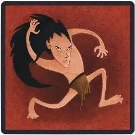
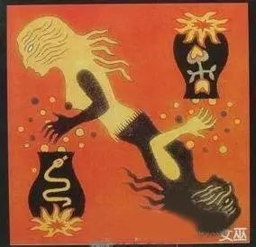

暑假的时候打狼打得比较多  虽然逻辑推断来说  这个游戏不如普通的数独来得直接  但对于一个人言辞之间  语音说话的细节  术语叫 抿 的这种操作  却越来越精熟

所以重又拿起之前没看的这本李尔王  看作为一个剧本写来  剧本中人物的这些咏叹  像是抿身份一样  来从言辞造句间抿出他们的情感  摘一段李尔的话

女儿  请你不要使我发疯  我也不愿再来打扰你了  我的孩子  再会吧  我们从此不再相见

可是你是我的肉  我的血  我的女儿  或者还不如说是我 身体上的一个恶瘤 我不能不承认你是我的 你是我的 腐败的血液里的一个疖子 一个瘀块 一个肿毒的疔疮

可是我不愿责骂你  让羞辱自己降临到你的身上吧  我没有呼召它 我不要求天雷把你殛死  我也不把你的忤逆向垂察善恶的天神控诉 你回去仔细想一想  趁早痛改前非  还来得及

我可以忍耐  我可以带着我的一百个骑士  跟里根住在一起

就像在打狼的时候

在真预言家已死的情况下  悍跳狼预言家给你一个查杀  作为一张双药已出无法自证的女巫牌

在看清了自己底牌的情况下  首先把之前全场盘自己盘成了一张焦点牌时  对一打十一里所有的情绪全部宣泄而出

而又话锋一转  可我还是村民阵营的人  我不能不帮好人来盘逻辑  我要是是狼我早就自爆了  可我又不是狼 全场的愚民愚神被金刚狼深水狼悍跳狼倒钩狼 打进了毒素带跑了节奏

我没有呼召什么 没有要求能思考的猎人来枪你们  没有办法凭空生出一瓶可乐来喂给你们喝 你们仔细想一想  跟着能思考的  会判断的我一张会玩的女巫牌走

我可以忍耐被盘成一张主要发言的焦点牌  在场下分析盘清全场

这两者的言辞  以及两者所产生了历史环境  在我这里看来  从纯粹的言辞上而言  几乎如出一辙  虽然后面这段打狼的是我自己写的

还是回到我最开始对剧本的理解  在一些自证身份  关于自己情感  阐明自己身份的情况下  只是在最近越来越打狼深入的对言辞的体验之后  才越来越理解文学作品中的出言

上周还是上上周去中南剧场看话剧  是英国皇家莎士比亚剧团的《李尔王》

文艺批评或是比较文学blah  那些我不了的专业人士  也许会用一些专业术语  来很明晰地给予作品以一定的定义  并在之中（并不是海德格尔的那种）挖掘出一个还算全面中肯的中心思想  甚至从英语的语言脉络上去考量莎士比亚

但 仅仅只从打了很久的狼  然后从人物的语句当中来看待整个剧作  来回想剧中人物此时此刻的言语  真的能感受到从剧幕的表演者传递出的情感  以及笔力透纸而出的莎翁  在他生活的时代对于人本的悲悯

在我比较深入地打狼以前  看剧本看剧中人物说话  只是看过了  理解了剧情的推进  就过去了

而在现在  才有更深入的看到了在剧本里边  人物说出这样的话来 他内心的纠结  对于自己原则的忠诚  对于世间规则的冷眼热心  对亲人乖违的痛恨  以及对自己所处尴尬境地的心肠杀斩

老套地来说  阅读即阅世

没有生活的积淀也就没有文学的体验  我看李尔王  便是如此  虽然没说在一次读书笔记/看一场话剧的最后  一定有做出什么对自己提要求blah滥觞的陋习  所以  不过鼓噪  看书去了  溜了溜了

饭局更新了之后狼不了就是个很气的事

想看《浮士德》和《仲夏夜之梦》

哪天去西操或者青创开波野狼？！

文不加点的张衔瑜

懒得打标点的张衔瑜在日常尬文 2333333
