难得地

正经

说

点

正

事

01

如何在大学油腻的生活中诗意地栖居

自然 很少有人能完完整整地将这个问题回答好  不如我们来修改一下原题  就说成是 如何能在大学油腻的生活中 尽量 做到诗意地栖居  这样一来或许比原题要容易回答  自然地  也就不存在对原题解读后解答的许些争议

我也不过是以我自己 做点探讨罢了

背景圈定一下

地点在 武汉

文字传媒部门

我在各类校级的社团中  只选择参加学校里的文字传媒部门  不在于究竟在部门内外交互了多少  而在于 无论是哪个文媒部门  都至少会有

一方面 校内或者院内各大活动前去报道跟踪的契机  这个可以在某些 从个人而言无法参加的活动  假借组织之名前去 不过是多了篇稿子罢了

另一方面  所有的文媒部门都或多或少有具备的是对前沿的观察  不管这个组织是在音乐艺术 还是理论科研  都一定会对该方向的最前沿动态予以关注  一定程度上 是有另一部分人在帮助你完成 对于mess media的总结拟合

从基本的往上走 如果这个组织还有情怀有胆识也有能力  那就会 对周遭的事务予以关注并剖析之

譬如去年贰倡钬車站一件闹得沸沸扬扬的事情  其大众传媒未曾言说的背景有 主体人是到了钬車站之后 身上所有的钱因为扒手而全部不见了  这时候到了店中 发生了口角 遂而闹得世人皆知  但只知其一 不知其二  未免有些乖违我们认知和考量世界的本意  因为情报来源GG

在这样的组织里  可以自己下手 有人带着来做一点符合自己内心  能够表情达意完整的稿件  这时候 也是对自我认知的反思

我自是在三家校级文字部门供职  虽然新进卸任了其中一个的管理层（内中原因可以下次分析）  但这三家组织共同给了我以很多的 叫惊喜吗  反正 是在引导我去接触人  然后在接触中通过观察别的人 别的事来更清晰 更容易认知迁移的来考量自己的周遭

武汉其城 新闻的富矿 我也是经过了一年之后  最近在武汉的城镇中间任意东西  才觉得江城有其让人捉摸不透的地方  这就像是足以吸引人的艺术感  既不会全部袒露于人 由着一览无余 又不会冰封沟壑 拒人千里之外  只是朦胧的 像滴漏式的咖啡壶 明明知道上边还有很多咖啡液在  但就是慢慢地滴漏  one drop at one time

有时候觉得自己的情绪需要调适了  就从学校出来  搭上地铁 朝江汉路去  看着两边的租界时期的欧式建筑

走到江汉关边 回想当年的报关场景 听整点钟声  人群熙熙攘攘  被裹挟着走走停停

沿江走一小会儿  从南京路北行  同学告诉我说  之所以在武汉 上海这些城市有着以别的城市命名的道路  很大一部分是当年那些在攫取了居住权的外国人 因为记忆力受限 故而以他们以前在中国所居住的地方来命名了现在所在的城镇街道  所以汉口的南京路北京路好像还有青岛路  多来源于此

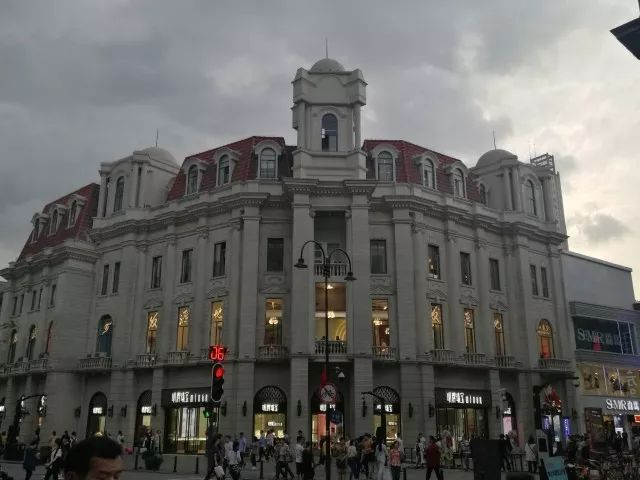

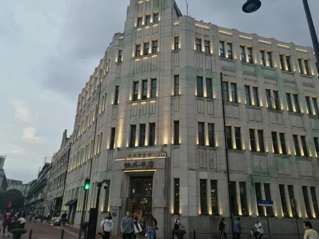

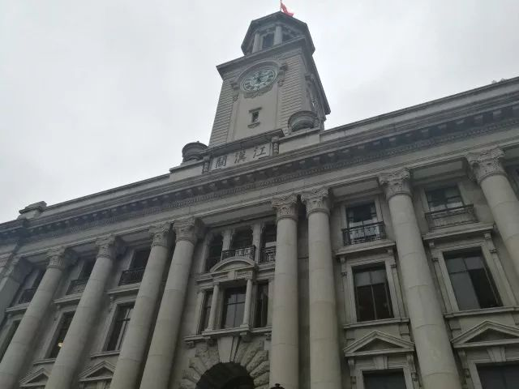

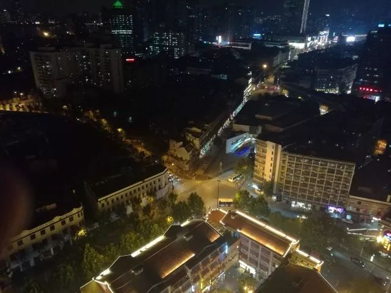

想着想着 不觉到了南京路和中山大道耦合的地方  就在星城长大的我来说  在一个路口出现五个和五个以上的岔口  除却山路外  在正常的道路上是不多见的  旁逸斜出  不规整化的设计  其实蛮生活化和市井化的  正对着路口比较有意思的 一个是武汉美术馆  另一个 就是 物外书店的汉口店 武汉美术馆自然不肖多说  但谈到物外书店 冠以灵魂的栖息地未免有些强冠以名的嫌疑  但流连休憩 小驻邂逅

物外是一个很沉静的shelter 我竭力不将物外描述上一个令人难以企及的文化高度  好的文学 好的书店 不会离烟火太远  这一点  当从物外出来  吉庆街 保成路 这些汉口最生活化的烹调饮去处  也就步行可达了

甚至再一路向北 到黎黄陂路街头博物馆 端一杯cappuccino 回想胜利路峥嵘岁月  又或去到汉口江滩一个轮渡搭回了武昌江滩去首义门 户部巷之类的地方走走停停  武汉其城

行走个中  忖度左右

生活便就是在这涓滴中

泛成一行行小诗

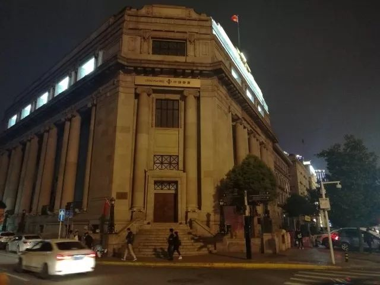

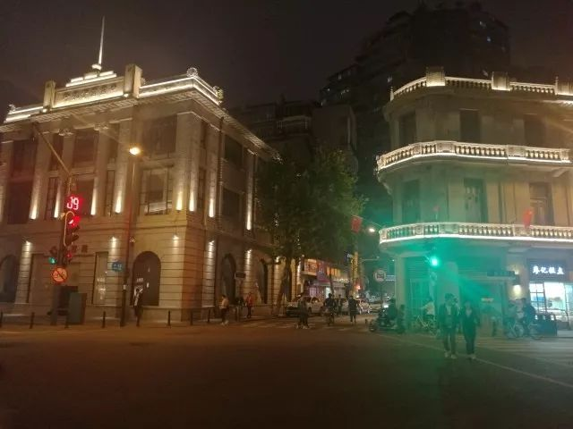

武汉这边长江和汉水将三镇分开 武昌汉口和汉阳  了解一点小知识  譬如 汉阳明明在汉水以南  按照中国古代水之北山之南定义为阳面来说  现在的汉阳应该叫汉阴才对

actually  据小型考证看来  是明朝时期汉水的一次改道让汉水到了现在的地方  自那之后 才有了汉口 而汉阳原地则继续沿用当时的称呼 不假赘述

像这样的背景 如果说 究竟能够在怎样的地方产生怎样的作用  从我一个理科生的角度来看其实未必多少  但也正是一些这样的小细节  使得我所生活的这座城市变得饱满鲜活有趣了起来  使得武汉逐渐并终将可以预见地成为一个能让我在离去后仍旧念兹在兹的城市

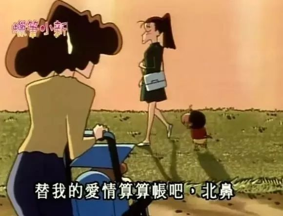

至于汉阳当地  除却长江大桥  则不得不提 琴台 当年俞伯牙遇到钟子期  高山流水  洋洋兮若江河 峨峨兮若泰山  变就是在而今的龟山古琴台  自然 也就应运在月湖边建了武汉最好的剧院和音乐厅 命名了知音岛并配了许些创客空间

这个学期算是我比较多地去琴台听音乐会的  从比较早的石进音乐会开始  到之后的武汉爱乐blah  以及即将要去听的皮亚佐拉 保镖 卡门这些的  都是挺心水的  昨天因为部门轰趴所以出了张《聆响行歌》的票给学妹    今天晚上也是我团请了两次假的例会都不好意思了 所以把吴牧野音乐会的票给了一个学弟 其实今天看到学妹在空间因为不虚此行感慨颇多而留下的日志   心里还是有些羡慕这样的艺术体验的

在颂赞类歌咏以及极尽夸张怪诞的剧幕表现形式上  到音乐厅或者是剧院里  花上几十百来块钱  从学校到琴台  听听别的艺术家在他们的生活中  如何来以具备艺术理论支撑的架构自己的艺术维度  我以为是很对自己的所谓诗意世界以启迪的

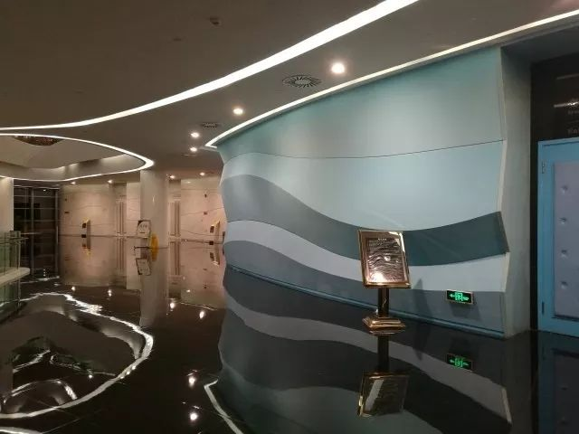

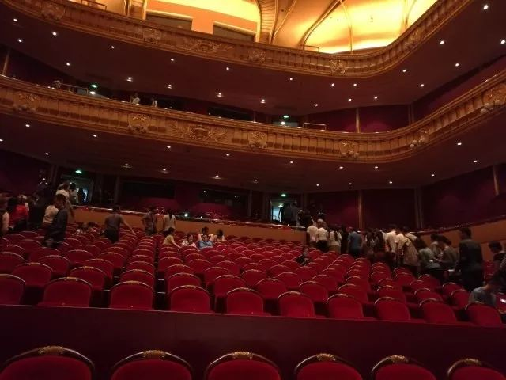

人 一株会思想的芦苇 是在晓天地之大后知自我的渺小和人类文明事业的伟岸

光谷作为武汉的科技高新产业和研究机构的密集区  也配置了一些商业娱乐的机构在  比较大型的即是珞喻路上的光谷转盘&光谷步行街 其重要性被认为是从中心武汉城区到光谷的门户  也可以说成是全光谷的西界

这些天我和几个小伙伴连续两次  凌晨五点半的时候打着手电 偷渡到光谷的东南角的尚都楼顶  从三十楼的公共天台朝外尬看

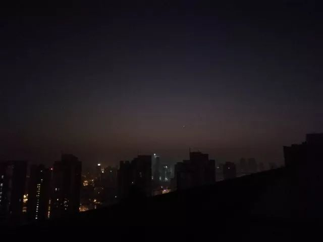

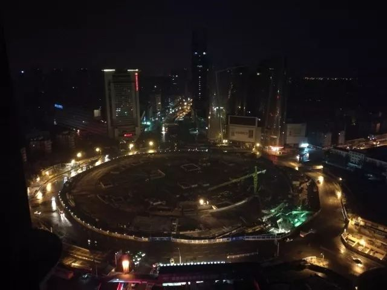

向东  启明星从刚刚有些橙黄色的地方升起来  光谷转盘里嘈杂的机械转动声音 嗡嗡的 像是浅浅的背景噪声 在耳边低低轻语 有点痒

朝南边看去  远处有几点灯火 一排在上 一排在下  上面的一排光线明亮 集中  下面的一排线条有些粗 模模糊糊的  那便是南湖了  南湖再往南  便是民大  楼台北望  有长桥成了一团线  同学说  那里就到了光谷大桥  桥上的灯光映着东湖的湖面  沟通了离我们近的南望山 和更远些的珞珈山

天渐渐地  越来越放亮  蜗壳西十二的一楼的大灯一直亮着  紫菘的灯也陆陆续续亮起  正疑惑着  是什么使得这些人方才六点就起来学习  况且最近还在运动会期间  不敢多想  不久  这些刚刚亮起来的灯又一盏一盏地熄灭 兴许只是前夜的灯忘了熄  早上乍一通电都被亮醒了罢

路灯熄灭 光谷广场风情街的走廊灯熄灭  启明星在东方已经需要费力地去找一找才能找到  而车轮碾压路面的声音也让这三十楼的楼顶变得越来越嘈杂 我知道  这座城市正在一点点醒转过来

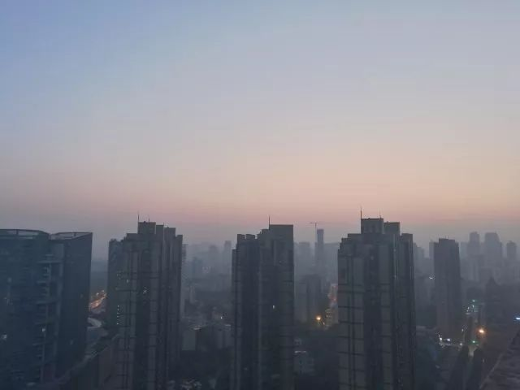

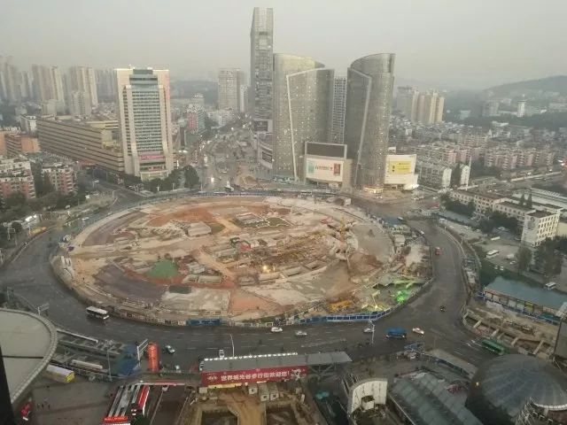

我言诗意地栖居在一个学校 一座城镇中  是要外出了不断地去看 去认识这一座城市 去找寻这座城市的文化脉络

此外 自己平常时间中不得不提的  便还有物理性居住的地方 亦即自己的寝室宿舍  从在宿舍里用一整套茶具配置那些湘波绿和金骏眉之后  这段时间我开始在寝室自己进行着手冲咖啡的调制

从纯正的咖啡豆开始 一点点地  把豆子放进手磨的工具里边  一边听着油腻的rap  一边点着旋律转手柄  看中度研磨的豆粉落入承接的杯中  预热了滤纸和咖啡杯  用刚凉的沸水把咖啡液萃取出  敷上奶泡 套用模具撒上一层可可粉  便是一杯手冲的cappuccino  不加糖 微微一抿  耶加雪啡 初吻的味道 这之中  下次可以出个单篇来说

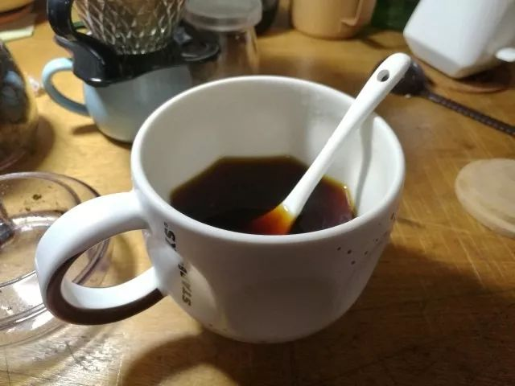

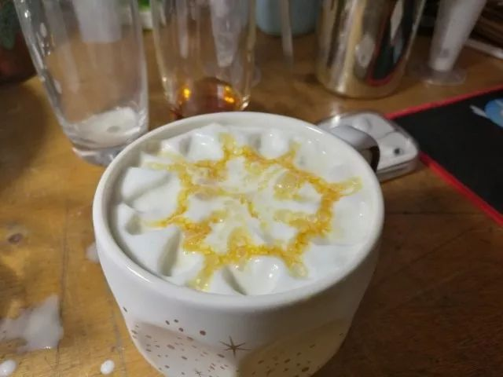

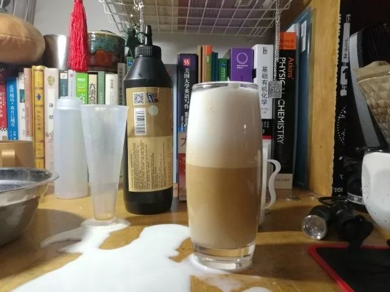

备上几种风格的服饰  或套装出行 或混搭精分  加一点有趣的滤镜给自己做一点粗暴审美的特效  谁的心里还不住这个小仙女

我曾经有试过把每天自己和别人讨论的时候  说的一些表达十分油腻的话语在晚上回来之后偷偷地记在自己的日记本上或者用说说票圈的办法发出来  再加上一点莫名其妙的表达  其实是在拟态当年纪晓岚写 《阅微草堂笔记》 的初衷

再加上一些高校自带的“水管”项目  比如蜗壳的PT站 蝴蝶 虽然我作为一个对信息传媒方向所知甚少的同学来说还是理解不来者之中的逻辑 但也还ok

我只要能用到有一个资源丰富的PT站  能找到几乎所有的我想找到的学习资源视频资源和游戏资源 而且下载速度一度能达到8M/s左右  同时我自己也能在这个站点上生存下来  这就已经是在高校读书  蝴蝶落樱这些的内部十分福利的资源所在了

回一下大学里诗意地栖居这个题目  遥远了昨夜的记忆  明天仍然只是一卷缣素 是波澜壮阔 还是冷月舷窗  是鲲鹏万里 还是归园田居  悉听尊便

最近的两任主编 一个卸任后专心致志地开始了女篮的训练  我卸任后也就只在院排球队还挂了个队长的称号  也许 从文字到球  不失为好的去处  但想着要如何在实验室做些什么  还只是停留在日程表上 不是计日程功的那种

油腻了这么多的特立独行  大二上期已经到了midterm  从暑假到现在 情感经历像我那在初三就打了腹稿框架的小说一样  苍白无力  渺茫无踪 处于同一状态中太久了的人  越来越深刻化内涵化 阐发张衔瑜的周边

算是我把自己的经历拿出来之后

的一种探讨问询罢

等十一月底再能闲下来的时候

想去暮秋初冬的南京

先只是写在这里

来日再议

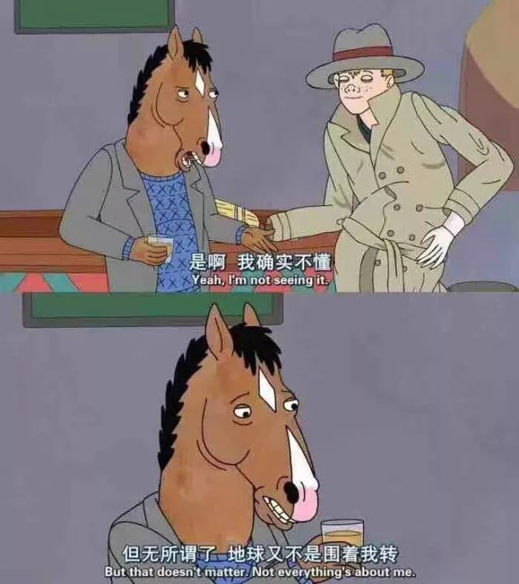

以上

文不加点的张衔瑜

懒得打标点的张衔瑜在日常尬文 2333333
