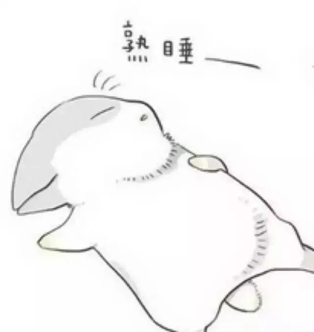

无以言表

集体感觉

有些事  你不说  也许就过去了  但过去了 纪念了 怀念了 忘却了 抑或是刻骨铭心 永生不忘 又能如何呢

某年某月某天和某人尬聊 谈到对生活的一些态度  我每时每刻都在提醒自己对文字的态度要虔诚 不对文字撒谎 要让从我这里出去的文字  不说达到天然去雕饰的返璞归真的佛偈级别  但至少 不能粗糙油腻到给人的感觉像是吃了一口的地沟油 还是夹了砂子的那种 可是 最近但凡一懒 先不说自己究竟写了多少又出去了多少 就只是对一些交付与我修改润色稿件的 这些挂了我写的或者是我审的稿件 大多是不满意的

Perfectionist 没有那么高的追求 可我要的 就更会企图去触及  今天周三 上个周末带着大一新生打新生杯 五场排球赛下来  第四场刚开打就觉得自己已经疲到尬了  左腿有点小疼 约莫是更久远以前留下来的问题  作为队长 前期基本是队内的东方教练在督促大家练习 我就吃喝玩乐尬聊最后附带一点技术指导  上场之前  好不容易正经了一下 教练讲战术和对面的缺点 我动员时讲了下面这段话

现在说什么我们要赢谁都没有必要 球是圆的 转到哪就会在哪  我们要做的 是对待好每一个球  上场了 我们就是一个队伍 a team 你的身边 就是你的队友  无论发生什么 都要保护好你的队友 和你的队友站在一起 同进退 共甘苦 这样我们才是一支真正的队伍 才有之为集体的那种开心  最后也是最重要的 不要受伤 注意安全 走吧！

球赛完后 像是历练玩大风淬体的那种体力风暴  略去中间过程的具体描述  嗨得在球赛完后抱住了身边的队友 紧承着的即是饿 无止境一般的饿  先和队友小纪念地在西二二楼吃了一餐 回寝洗个澡 又跑出去和另一波吃烧鸡公 晚上还觉得路子不对 又叫了个12寸的pizza回寝室  睡前还觉得不ok  猪精男孩一不小心吃掉了备与次日的早餐  真真是心肠极其之好的 主要是肠

队里本期以来素有写训练总结的习惯 虽然根本就没有安排新生杯的总结  但大家就像写日记 写同学录一样  一个大二的女生因为实在脑子里事太多 写了一点发出来之后  群文不断增长  像是有一股发自内心的力量 教人必须得写点什么来还酹自己在此中的生命  我究竟是有多久没有体验过这种 像是淘金者看到了一方绝佳的矿藏  然后登即写下的这种年轻的文字冲动  竟也是重又想通了  为什么这边报社里往届离开的主编 最终都走向了球队

2

3

3

3

3

h

h

h

h

h

集体的感觉  想想最早 也是印象最深的 2012.11.28 日子也记得很是清楚  初中时辩论队的四个人坐在当时学校能提供的最好场地里 说是要构思第二天上场 辩论中学生是压力多于幸福 还是幸福多于压力 这个辩题  但实际上 和我一起的三辩打开话匣子之后  这大概是很少有的有人看到我流泪  便唤作一个团伙  于是 soulmate仍在我的特别关心列表里  集体的归属和认同

情愫的淙淙溪流 蜿蜒叩关 内之 会知道自己的苟活并非一无是处  如果无际的汪洋也有情感  便不肖问征夫以前路

不想强行给文章加入如何深入浅出的论述 并不是因为饺子在壶口倒不出来  而是这壶中酒 我只敢稍稍打开一丝缝隙 自私地 自私得 甚至不想被人闻去太多

艺术的体验更迭不定 能说出来的 不足我心中所想的十一  能为人所知的 视思路亲疏 看是否能达到十分之一  今天有点感冒  言尽于此

-END-

-文不加点的张衔瑜-

