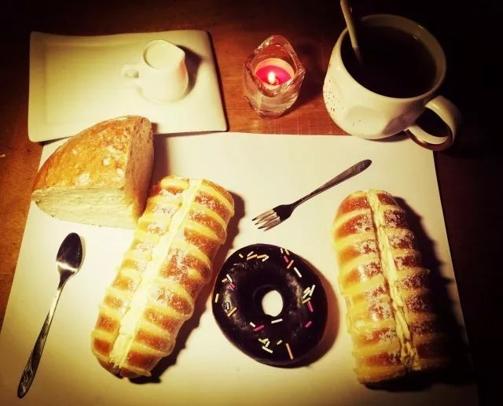

衔瑜的双十一夜间小札

ACEDF

昨天说 今年双十一没点长进吗

好像还就是没什么

入夜，凉风。打开小灯在衔瑜的书桌上，铺开一张洁净的餐纸，用小刀将长毛毛虫面包截断，一个朝自己放在左边，一个朝书垛放在右边。中间放一个巧克力甜甜圈，要巧克力酱不那么均匀的，涂料五彩斑斓的彩虹点。尔后在餐纸的左角上放上奶酪包，在它的背后，放上内中温热牛奶的盎司杯。不安的世界里，人们总是给咖啡以奶精、红茶、焦糖等各种矫饰，而在衔瑜的餐桌上，右手位的马克杯里只是一杯黑色的耶加雪啡，醇正而温和。末了，点亮今夜用餐的蜡烛，熄却小灯，给自己系上餐巾。不安的夜晚，缓缓流淌着德彪西的乐章，用安静的烛光晚餐，守护最后的宁静。轻轻柔柔，软软糯糯。涟漪、雾霭、凝云、雷电，所有的一切，自然中的无尽气力，皆在此中消融、冰释。

今晚助攻一个表白

一杯教父壮胆

一杯蜜桃洛丽塔给患者

希望TA

还是要好好的

第二波晚逛某宝

像极了农忙的双抢

●End●

文不加点的张衔瑜

明天不出门

