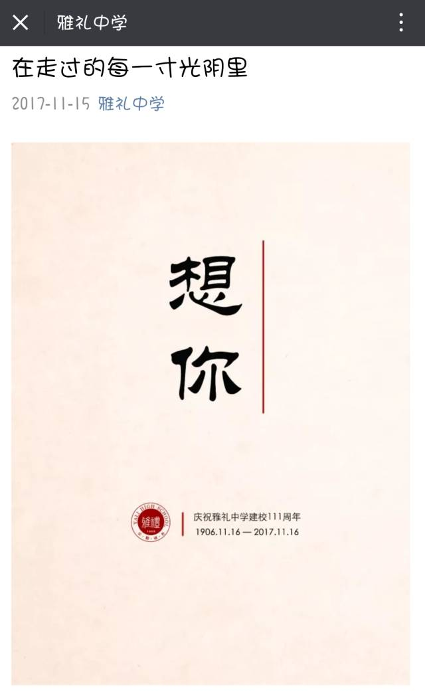
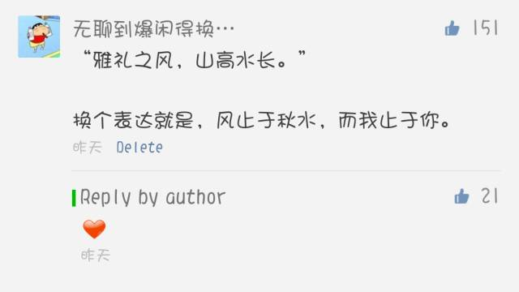
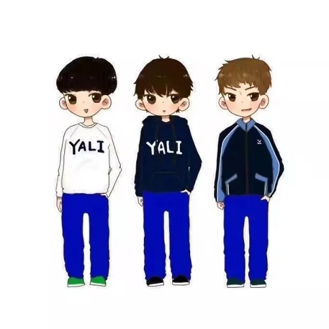
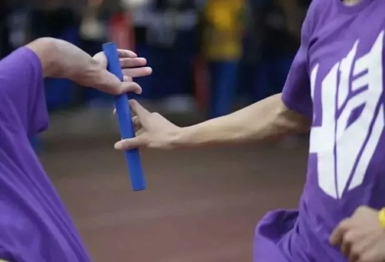
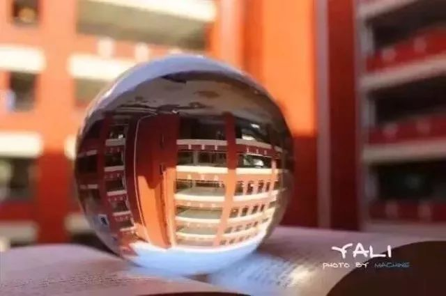

特别的日子  特别的颜色

ACEDF

今天的配色

雅礼蓝

在

走

过

的

每

一

寸

光

阴

想

你

回

家

昨天

11.16

我当即在后台回复

然后即刻上墙

就像还是在两年前  老师布置了一篇句段练习  然后看一看 谁写得比较好呀 接着便把优作张贴在走廊公告栏里

这次上墙  就有这样开心而熟悉的感觉  因为这是雅礼  111岁了呀

这是一篇张衔瑜的 旧文

雅礼110周年校庆随笔

我 不过雅礼校内的一个2013级的学生 比起雅礼各路大神而言 在理科的我 正常情况下常年徘徊在年级两百二三十附近 正是全级最浪的人集中的地方

22号 也就是明天 万众瞩目的雅礼校庆 这个纵使我不说 今天 甚至早在十几天 甚至更远的之前 便早已有刷屏党让路全网

很多人在传 传学校翻修之后的照片 我看到了新翻的花卉草坪 看到了四个月前害我不浅的操场 看到了人车分流的林荫道 看到了原来只在80 90 和100年校庆纪念册上看到的旧式大门 也有人在传各界人士发来的贺电 有奥巴马 有英国大使 有二十所国内久负盛名的高校 更有不知从哪里来的校友所写就的怀念母校的文字

有外人表示不服 不就是一所高中吗 可有人能真正言明 雅礼如何之成为雅礼 思考了一会儿这个问题 虽然我只是雅礼千千万毕业生中的普通一个 但这并不妨碍我来探究这个问题

听着Robbie Williams 的 Candy 大概是高一的时候在寝室听过很多遍的吧 仿佛自己回到了对自己的高中满怀憧憬的高一时分

在雅礼中学读书是种怎样的体验 为什么雅礼中学的学生毕业后都爱穿校衫 在雅礼中学谈恋爱是一种怎样的体验 在雅礼中学谈不了恋爱是一种怎样的体验 在操场上有太守墓的学校读书是一种怎样的体验 知乎上不乏雅礼人的自问自答 不乏外校人对本雅礼系统的评价 这里面 约莫是非官方里最正式了的罢

雅礼的微信公众号里 也开始推送各种各样的纪念雅礼的文章 我还在高三时 语文组就开始布置 我和我的雅礼老师 系列征文 高三毕业后 学校又开始面向所有毕业生收集纪念雅礼的怀念文字  当时我写了一篇名为 三年栀子雅礼人 的怀念式两千五百字长文 或许是公众号须得面向大众 而我的成绩只是雅礼里面一般般的 出于公关考虑 最优的那一部分同学的文章肯定最先发表 而我 也幸而能自得其乐

回到雅礼之何为雅礼而不为其他学校  是我们的校服吗 十一返校听杰哥说四川一学校全盘照搬雅礼的校服 我们的文化衫 我们的经典雅礼蓝 全盘照搬  虽然我不知道对方是哪个学校 但雅礼的校长曾经告诉我们 雅礼的学生 即便在校外不穿雅礼校服也能辨认出来 因为我们有雅礼气质 所以十一时我们如是揶揄 他们拿得走雅礼的校服 他们拿不走雅礼人的气质  虽是玩笑 但我们的笑声却是惊走了食堂边休憩的鸟儿

既然不全是校服 那是耶鲁附中的缘故吗  诚然 雅礼自建校伊始就与耶鲁有着密不可分的联系  直至现在 每年依旧会有两名来自耶鲁的应届毕业生来教授我们的Oral English Class  新来的与两年前的一批完成交接 这样每年在学校的四个人中老手带新手 耶鲁的新鲜思想在雅礼薪火相传

作为一名三年都在高考实验班 也就是往届校友口中的英特班 我有幸上过两个学期的Oral English Class 并亲自加入或见证了英语音乐剧 Aladdin  High School Musical   Westside Story  Bye Bye Birdie 从迪士尼向百老汇的转型  可能其他学校的人很难理解 不就是普普通通的二三十个同学在场上所表演出来的一幕舞台剧  历时三个月抽出课余时间排练出的一幕舞台剧 除了演员的口语比同龄人强了不少 除了编剧指导都有着 耶鲁支教中国雅礼协会的应届毕业生 这个头衔之外 还有什么比他人特殊的呢 这又能代表雅礼什么呢

我想说的是 就从最功利的角度而言 来谈这些学生毕业以后的方向 我所知道的里面 有拿了清华一本线在做化学研究的 有报送了牛津大学并拿到全额奖学金的 有在UCC UCB 做计算机程序研究的 有在康奈尔做经济方向的 有成功考过新加坡全额奖学SM2计划的 还有我这样事情不多偶尔更一两篇小文章自娱自乐的  之所以列举这么多大神的例子 是因为我想说明 无论是耶鲁外教 还是他们指导下的英语音乐剧 这只是这些参与的人 不求最终结果的一种so-called很有意思的娱乐方式

这些人 不是为了去练习口语 不是为了去排出一幕足够好的剧来撑场面抑或是提升政绩  我可以毫不脸红地说 雅礼里面做得比我们好的多了去了  正如高三时雅礼老师打击我们膨胀的自信心一样 雅礼不缺你这一个清华北大 百有十年的光阴里 杰出校友海了去了 没有必要更没有资本把自己看得多么重

我想 大概也正是抱定了类似的思想 雅礼人 所做的每件事  都不会是为了求取某一个特定的功利目标而去做无聊的重复 比如高考 不会因为是要去应付高考而有意无意地回避一些无需掌握的知识点 比如社团 不会因为学校要求每个社团必须要出一个活动给社团节 这时候才会开一次半数人不到场的例会 比如校庆 不会因为有诸多社会名流到场而特意在校园里给出某位校友的特别关照  在雅礼 每个人都是一个不可或缺的个体 不会 因为能力之大小 成绩之好坏 脱单之与否而受到老师的区别对待 而受到他人的冷嘲热讽 而受到社会的病态关注

所谓雅礼人的做事方式 是在追求卓越 想着 千百年来 我们 所做的一切 都给予我们的责任 和对于美好未来的希冀  这 就可以称作为一个典型的雅礼人  这 就是校歌里 经天纬地才能 又学问成就 及时奋发精神 好担当宇宙 的豪迈情怀

不可避免地要开始谈我自己了 反正我本意也就只是写篇随笔无聊自述 姑且继续码下去

再次重申 我只是万千雅礼人中的普通一员 但我的高中存在并将长存于我那六个本子十万字日记里  偶尔去翻翻以前的文字 也还会为斯时的幼稚而发笑 也还会因斯时的难过而忧伤 也还会因读到了某一段文字而去联系某一个人

风止于秋水

而我 止于你

我竟在白日感到沧凉 在黑夜感到炽热

在你推我搡的公交车上感到荒芜

在寂寥无人的大街上感到充盈

以上两个选段 算是我高中日记里比较满意的两段句子 心情不好时 写点东西 心情甚好时 写点东西 心情波澜不惊时 去找本书来翻一翻 又可以开始写东西了  就像我今天写这篇随笔一样 从来不会有固定的文体 从来不会有固定的篇幅 固定的内容blah~ 总之就是各种随意 虽然到了高三时也集齐了报刊发表的千字文十余篇次 并顺带借以北大先修课的成绩去冲击梦想大学梦想专业的自主招生 虽然没能成功 但至少我曾在梦想的道路上努力过而且无忘初心 这就可以令某聊以慰风尘了

除此之外 英语音乐剧不再多说 雅礼学习的氛围随处可见评述  个人的情感经历也就让它封存在高三的日记里 社工活动也好各种坎坷在现今看来也就只是微不足道的存在  纵使我的哲学研究和单车故事还可以讲一年 但这已只是过去 这些 不应 更不被我允许成为我未来路上的羁绊

便是我现在返校 我所能持有的身份 只有原班同学 教授过我的老师和那校友名单还知道我曾经在雅礼读过三年书 给雅礼的诸多辉煌中在背景上勾勒过惨淡而浅的一笔 在其他人 雅礼 会是属于他们 和他们之后的人的

十一返校 有个感觉叫我含辛茹苦养了三年的猪就在我不经意间给人拐跑了 当我和老友在操场上看学弟学妹们打球 在教学楼里看到他们在问以前教授过我知识的老师同我当年相类似的问题 我的心情 诚如斯言 往后 走下雅礼出校门的坡 一样地挥别老友 只是一别 便又是一个学期

但我也说过了 我已只是雅礼的一名校友 我现在的身份是一名华科学生 说得更细致一点 是一名与中文关联不大的纯理科的化学学院的学生  雅礼所能遗留给我的除了诸多校友的资源 除了那段记忆 除了偶尔的激动或悸动 除了还能时不时用校园卡买到的雅礼校服 也就只有那一点深入骨髓的雅礼精神而已

麓山苍苍 潇水泱泱

雅礼之风 山高水长

the end

一日雅礼人

一生雅礼人

今天又是雅礼人在空间刷屏的日子  期年之后  许多自己开了公号的小伙伴 也都开始在写和雅礼的文章  转到了我这里的  大多是刚刚毕业的  但我想了想 从最早进雅礼以前只听说着里边如何厉害  到了自己从这个学校毕业出来到回访  毕业两年 雅礼给我的 能用我可怜而贫瘠的文字描述出来的  只是很少的一部分

今天中午我们几个在紫菘的校友聚餐  席间说起当年在雅礼的种种 还是那么地自由  甚至会突然尬起长沙话  种种  我现在四条蓝色的校服长裤在寝室里  虽然别的裤子也有（谁说我没裤子穿的出来我和你谈谈梦想）  但就是喜欢穿着一条有点松垮但质量就是OK的蓝裤子四处游荡  很多人说在学校里虽然不一定能要看到我人  只消看到穿着纯蓝裤子的长腿在校园里游荡的  那就是张衔瑜了

现在来说  看文字什么的  感情已经有些 不像过去似的会被撩拨得一阵涟漪  但只要听到校歌的前奏   人竟不禁潸然下

地球旋转无停  惜光阴易逝

吸收欧美文明  乃吾侪素志

经天纬地才能  由学问成就

及时奋发精神  好担当宇宙

LAY A FOUNDATION

FOR STUDENTS'

LIFELONG DEVELOPMENT

写完这篇就很想回雅礼去看了  但最近又没什么名头  人更是在武汉  难得回去

不如再来个互动  最近正在评一个奖项  是全国的一个赛事 承办单位是湖南大学  这也就意味着  如果评上了这个奖项   就可以公费回长沙  借领奖之名 回一趟雅礼  回一趟家

后台回复 车票

将会有一个投票链接

求一波助攻 想回一趟家

再祝生快

希望120周年能去千报

●End Again●

文不加点的张衔瑜

今天也很雅礼蓝

