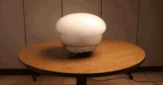
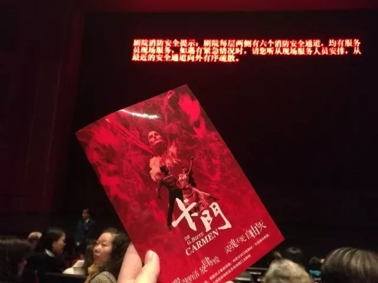
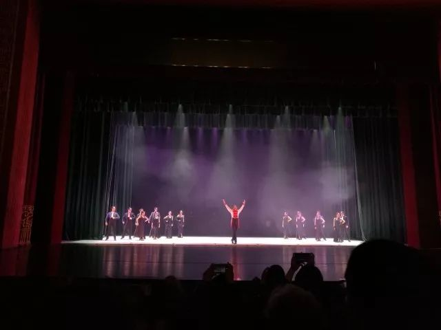
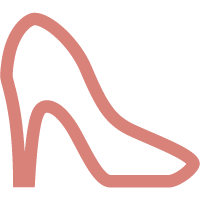

一个礼拜

五天早课

早上 舍友定的 比我们其他三个都早的闹钟 开得很大  舍友自己在床上 手机在桌上  最近睡眠很浅 舍友过了好一阵子才下床了去 关了闹钟 慢腾腾地上床穿衣 他穿衣的间隙 闹钟又响了起来 还在持续

用手指挑着不住下垂的眼皮 我摸下床来 把毛巾打湿  昨天在实验室用酒精喷灯烧玻璃管 烧得很细  当时没发现的 但回来之后洗热水澡 右手指尖 指节 三四个的细碎小伤口 生疼  早上洗脸想拧毛巾 把毛巾稍稍卷了之后 抵着掌心 蜷着手掌 才拧了个五六成干  冷水敷到脸上 在宿舍里走都觉得脸上 脖颈间凉飕飕的

过早后 坐到教室里 一阵心悸  知道老师上课正在复习上节课的 也在讲一些今后科研中必然会要碰到的事情  我没有睡觉 只是一时间心里怪怪的 拿笔的手也有些颤抖 仿佛从笔袋中拿出笔来写下一两个字 会耗费我刚加载没多少还很容易用光的精力条 上课了 我听到了老师的每一个单音节 也偶尔能连贯起来一句话 把大部分的要点用铅笔一笔笔写在书上 但根本 没有听懂

现在 每天上下课 路过紫菘大屏幕和紫菘花坛 看着流浪猫狗们 没人给他们整理毛发  偶尔碰到有同情心满满的同学给一点吃的  大部分的时候  就随便找块地方 懒着 懒在路演的帐篷下 懒在水卡充值点里面 懒在治安岗亭旁 懒在随便一块地砖上 也不大走动

只是懒懒地 耷拉着耳朵 随遇而安  就算毛发如何蓬乱 也不管  有吃的就凑过去吃着 没吃的和之前那没事人一样 懒懒地懒着 晴天就翻着边晒太阳 躲在树荫下帐篷里消暑  雨天就在充值点躲避着 在岗亭边树底下听雨 没什么波动 没什么起伏  风云变化 侵扰如何  狗生反正就是懒懒的 懒懒地

只是羡慕它们

可是  今天 本来丧丧沉沉的

但是 我 今天 晚上 去看了

弗拉明戈

卡门

卡门啊

卡门！！！！

请配合歌曲食用

（并请将外音开到最大）

卡门！

说你爱我

不然我就杀了你

嚣张地活  放肆地爱

灵魂不死  自由不灭

要知道  每个人都会死

你 我 TA

每个人都会死 但是

不是每个人都活过

你是天使 你是恶魔

她很放荡 但又纯粹

她不忠于金钱 不忠于上帝

她不忠于情人 只忠于自己

和现实说再见

我可以和你一起死

但我不可能和你一起活

你可以杀了你的卡门

但卡门永远是自由的！

今天的甜

我能称呼您吗？

因为我想把你放在心上

BTW

我可以邀请您跳一支舞吗

-END-

-文不加点的张衔瑜-

