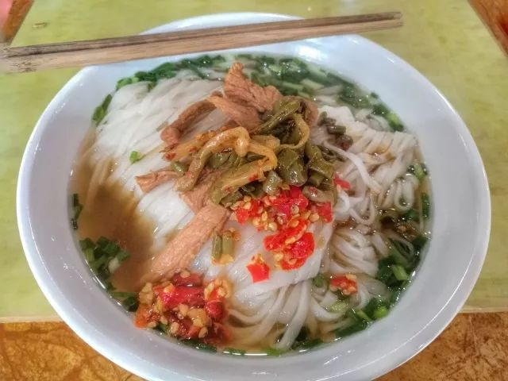
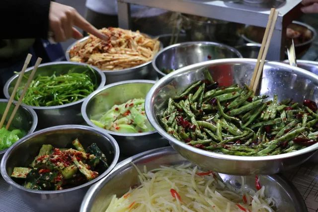
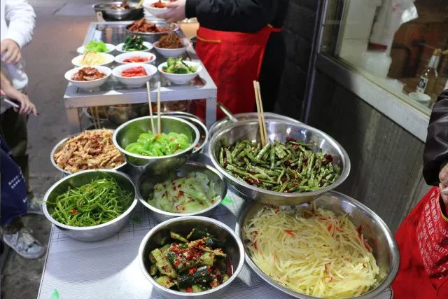
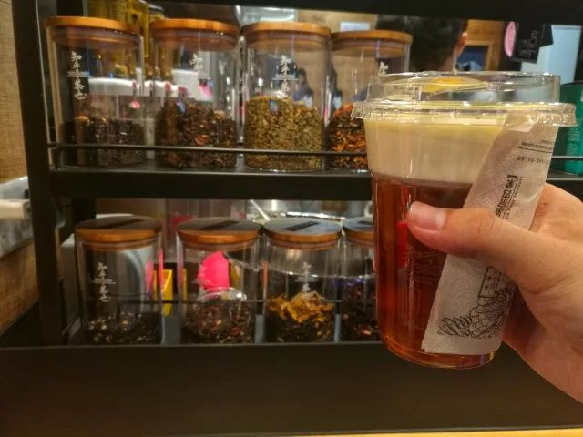

一不小心

嗦

了

碗

粉

上周末 拿到了回长沙的车票  此处感谢词有一万字 谢谢各位聪明的人23333

周六下午 和我同行的小伙伴们都不想上岳麓山 我于是像个导游一样 领着大家从湖大出发 向着市中心去 因循我自己对长沙的记忆来串起这座城市的文化脉络

从太平街的北门进入  当年那个飞鸟和鱼黑胶唱片馆已经改作了一家静吧  一旁淡紫晕塔罗店门口还写着 无事不占 再纵深 日式小店门廊上的帷幔 还在小巷里怀念着海岛自然而然的创痕感

沿路一直走 其实就是 算我自己的记忆吧  一方面 屈贾谊于长沙之类的文学典故在脑海中 像拈花一般触景之时便可信手弹开  另一方面 这条街上 我骑自行车走过 我自己一个人走过 和老妈一起走过 和同学一起走过 走到哪里 都不止是一条街那么简单  只是和同学点一下我平常来这里的时候会去吃的店子 踏着麻石路南行 昂首便是街尾 天下太平

三王街 坡子街 解放西 黄兴路 南门口 文庙坪  作为长沙繁华而集中的商圈 这里 也承载着长沙文化的中心

哼着老长沙的弹词 随便和哪个看起来还面善的店老板用地道的长沙话策上两句  真正的老口子 一说话 就知道路数在哪里

我不敢说 每个老长沙人的记忆 都是从这块地方起来的 并不是每个人念兹在兹的记忆都从这里发扬滋长 但至少 没有哪个长沙人能绕开这里 凡是长沙人的生活轨迹 没有不和这块地方搭边挂钩的

我和同学说 在长沙的早餐铺想要嗦到一碗正宗的米粉

首先 需得关注老板店里粉的宽窄 此处省略常德牛肉粉的 七圆滴七扁滴 比较适宜的是成人小拇指的一半宽  即便是手工粉 也能超过这个宽度

此外  剁椒 榨菜 酸菜 酸豆角米 酱油 陈醋 这六样是粉店必备的 有的还可能有香菜葱蒜blah 不一而足  但无论是6+n的哪种模式 剁椒的出彩是每一个长沙老口子所公认的 如果 端起剁椒罐子一闻 这个味道不足以让你唾液腺一紧 然后口水像要洒出来一样的话 那这个铺子也就没有存在的必要了

至于是无名粉店 还是杨裕兴 还是和记  嗦到嘴里的才是粉

那天在长郡门口的 天下第一光头粉 的店子里面 和小伙伴们点了几个凉菜

光头粉上桌后

拾起筷子 在碗沿撩起一撮 将碗底的油酱拌上来 一半酱黄 一半米白

匀称之后 稍稍提高夹着粉的筷子 从侧面吹了吹因为刚出锅还有点小烫的米粉 然后从侧面一口衔住

筷子一送 吮住一嗦

砸吧砸吧两下

便才能说是长沙人的灵魂嗦粉方式

那天 那碗粉给我的感觉 像是被抱住了 几乎感动得要哭出来的样子

米粉这种

在我的记忆里  是从小时候刚刚长出乳牙 刚刚开始记事 刚刚味蕾开始发育的时候 被抱在粉店边上  大人专门拿着一个小碗 然后用筷子将一长条的粉夹断了之后  端到嘴巴边上 喂进嘴里

这样的味蕾记忆 不因人事沧桑和时空变换而更易丝毫

下期预告

末了 勾勒过岳麓山上 路灯缀出的一线轮廓 目光追随着橘子洲的小火车 从杜甫江阁离开

天心阁 阁上鸽

鸽飞阁不飞

水陆洲 洲旁舟

舟动洲不动

送过小伙伴之后 在知乎茶也点一杯 素笺红袖 是混茶类型的 将花草 水果食用香料和茶叶搭配  店员说 这是肠胃的抚慰者 抗寒暖心的糖心红茶

我将淡奶芝士敷在茶底之上

今天一杯 不问 花遣离人

（部分图片 via同行小伙伴）

-END-

-文不加点的张衔瑜-

