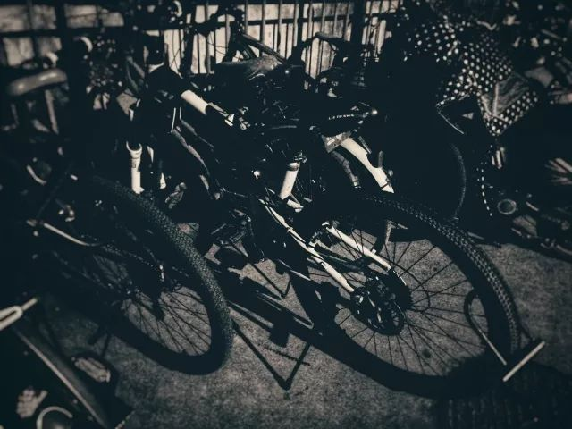
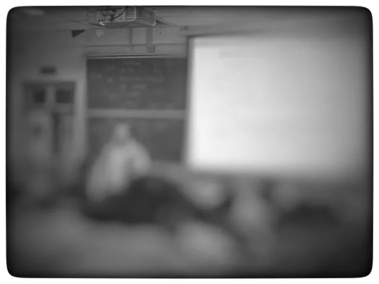

像往常文章的开头一般

这几天心里颇不宁静

一方面 自高二暑假开始的梦境相关 包括一些杂七杂八的梦境 光怪陆离的本梦上层叠出多重的梦境 这个留待之后慢慢说

另一方面 是最近 发生的一些杂七杂八的事  我虽然已经在科研实验室 不直接参与文媒相关  但根据以往在个中浮沉的经验 也捕风捉影到了一些支离破碎的信息

这样吧 今天想分享一篇文

鲁迅文集·集外集拾遗

《今春的两种感想》

我只是节选一个小段

选段外的也很是精彩

我们常将眼光收得极近，只在自身，或者放得极远，到北极，或到天外，而这两者之间的一圈可是绝不注意的，譬如食物吧，近来馆子里是比较干净了，这是受了外国影响之故，以前不是这样。例如某家烧卖好，包子好，好的确是好，非常好吃，但盘子是极污秽的，去吃的人看不得盘子，只要专注在吃的包子烧卖就是，倘使你要注意到食物之外的一圈，那就非常为难了。

在中国做人，真非这样不成，不然就活不下去。例如倘使你讲个人主义，或者远而至于宇宙哲学，灵魂灭否，那是不要紧的。但一讲社会问题，可就要出毛病了。北平或者还好，如在上海则一讲社会问题，那就非出毛病不可，这是有验的灵药，常常有无数青年被捉去而无下落了。

在文学上也是如此。倘写所谓身边小说，说苦痛呵，穷呵，我爱女人而女人不爱我呵，那是很妥当的，不会出什么乱子。如要一谈及中国社会，谈及压迫与被压迫，那就不成。不过你如果再远一点，说什么巴黎伦敦，再远些，月界，天边，可又没有危险了。但有一层要注意，俄国谈不得。

昨天 余光中逝世后  身边同学的公号也好 各路官媒公号也好  都在为这位乡愁诗人送去悼唁  并有很多人 找出了自己在中学阶段甚至更早的时候 那些还在纸上抄诗的岁月里的记忆

明天下午考六级 杂志社的小伙伴约着明晚找个文雅的地方去读诗 想来不会少余光中的诗 或者说 那些像诗一样的散文

今天读的这篇鲁迅的文章 是因为再次看到了一些事情  回想起之前还在文媒做主负责的时候  指导者鼓励中带一点挑衅地叫我们大胆地做一些契合当代学子所关心关注的问题予以讨论  而后却说一些“评论中不能带有观点”、“现在社会上有一种批评老人的错误观点”之类的莫名其妙的话

脑海里重又出现了那一句 和增广贤文统一了思想精神的 勿交浅而言深 还有一些社会人士对于 大学 象牙塔 的嘲讽笑弄  想起教授给我们上课的时候说着的 自己在研究所里 本来因为怕丢 所以每天都把电脑背回家  但实验室其他人用完笔记本后 都直接盖了往桌上一放 都不用锁紧柜子里  久而久之 那位教授也这么做 也从来没出现过意外  大概 科学家也就会是这样吧  联想到最近看到的 华北供暖告急 以及其连贯带出来的 清华教授爆贪污220万，师生竟联名上书求情，清华：我并没损失（还赚了）

没什么多说的了  最近要不是懒得上秀米配图 其实还有很多已经写了的 只是放在便签里 或者脑海里 没有拿出来罢了  自己作为放松休闲的方式  只是因为和别人的放松方式不一样 就要被说着去接受别人的放松方式 不管怎么 我的院系要求我要心态好

同学你哪个系的啊

佛系

实验室一百来种药品 这个小实验只要用其中八种 师兄你去忙你的把 我自己找找就好

来回实验室的路上有四公里 几个长的上下坡 翻山越岭一样 我自己慢慢蹬自行车吧 太冷太累我就停下来搓会儿手 把袖子放下点就好

食堂又看到有男女朋友相互喂饭 乖 来吃 我坐过去之前 他们已经开吃了 我吃完自己这一盆之后 他们才吃完一半 没事我吃的是全热的 出门还可以做一个lecture的听力

唵嘛呢叭咪吽

-END-

-文不加点的张衔瑜-

