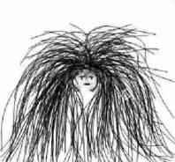

知我者 谓我心忧

不知我者 为我何求

这两句选自于诗经 王风 黍离  原为事关黍离之悲社稷之痛的先秦诗歌 选此开头 大抵 是没有用其原意的

之前不知哪一天 我在日记便笺里写道

时间错位 感情也就跟着错位

这说的好比 一个人在长江之滨 做个精致的湖北人那样拿勺子吃烤红薯  闻得到的红薯皮被烤焦的些许糊味 吃得到的却没有那层生涩的柴火气  当你想同想分享的那个人分享时  对方同你的时间恰好错开  等到对方来的时候  只看得江边 涨也是那潮 退也是那水  听你讲的小故事 看你手中加了增塑剂的塑料袋和嘴角残余的红薯屑末  感情也就跟着错位

恋人之间总在说些前尘过往 除了未来太过虚无缥缈之外 怕也更多的 是想让对方以这种形式参与到那些不曾参与的生命之中  仿佛这样 才是为完整

身着深蓝色底碎楔细楞彩条连衫长风衣的大妈 戴着护额帽 倒提着长扫帚从校车旁骑着电动车奔驰过  校车向着实验室的方向去 一辆垃圾车刚刚卸下空的清洁箱 盛上一个满了的 校车停了下来 垃圾车缓缓起步前去 校车停了一会儿 才又上路

我也会花时间去想实验室的事情  班主任跟我说 你到了科研实验室 意味着 别人睡觉的时候你不能睡觉 别人出去玩的时候你不能去玩 别人吃饭的时候你不能去吃饭 你应该一不上课的时候就去实验室坐着 哪怕是要做别的事比如准备期末考比如做选修课PPT 但是人得去 不懂的要自主地去问

我想了想自己在课题组里  不是别人叫着我走 基本上也不会有想去吃东西的感觉  今天下午一点半开组会 说实话 开会之前真的挺困的  一个向来习惯睡午觉的人 早起翻山越岭奔袭四公里外的地方做实验 过去半天后继续头脑风暴  但一旦进入状态后 则个人变得愈来愈兴奋 像是头脑中的某些能迸发出火花的打火石在这一刹那间摩擦了起来 前方原本黑暗的世界 在一闪而过的灵光之下 约莫看到了一些雏形和一点轮廓

师兄师姐说 越做到后面 这样的灵光会闪现得更多 照得越清晰 范围越广 Knowledge is knowing more and more about less and less 我想是不假的

科学研究 靠着满心对真理的执着  就像有人说 作为一个教师 我想我有必要教给你们一些智者的积淀 但人与人之间的交互 却并非勉强可得  人离得近 和灵魂接近 是两个不同维度的对话  在这样盘根错节的结构当中 剪不断 理还乱  其使人抓狂的  不亚于 一个直男反复问自己为什么自己不是弯的 那样对自己不友好 还没办法改变

很多人认为你有许多暧昧关系 但其实你孤独得像条狗 甚而至于 狗都不会活出你这么多戏

老戏骨上台 扮演着老将军 背后插满了flag  以数十年来经验里说的 足以引起人共鸣的自信演绎者剧本所有  老戏骨并不是想吓唬谁 也没有非分的目的 而只是作为一个世俗的人 和台下的交谈着

厚重下垂的眼睑和 稀疏零乱的头发 他并不知道未燃尽的灯花攀上的房顶 结成龛里特有的那分颜色  烛泪落下 不尽语言

佛系中人  也不能少吃哪怕一口肉

-END-

-文不加点的张衔瑜-

