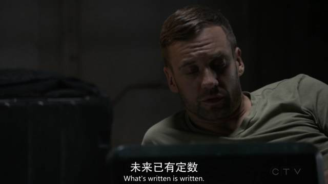
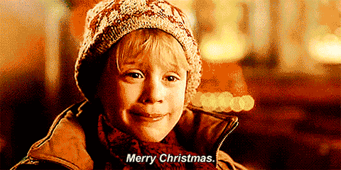

弃我去者 昨日之日不可留

乱我心者 今日之日多烦忧

有时候中午醒来会很茫然 和起床气不同的那种  会回想好久 算一算 今年自己多少岁了  又或是给自己个难题 只凭记忆来推测今天几号  往往这时候 就会和真实的情况脱节出来

并不是说真的每天没做什么 我的日程计划和时间排布都是定好了也排得很是紧凑  只是会偶尔像是 心跳漏了一拍 打个不响的响指 发现事情并不如原所料

噢 自己十八岁了  算一算 六千多日子已从我手中溜走 像极了小学课本上 朱自清的那篇《匆匆》  有些无关年龄的同时 也在淡漠一些节日

今天 Christmas Eve 每个人都知道  但 好像和我也没有很多关系  热闹是他们的 庆祝圣诞欢度双旦的 宣扬圣诞是毒害中国下一代的 还有趁此买一些我也不造怎么扯上关系的平安果的  总之 热闹是他们的

看完神盾最新的熟肉 把一垛一垛的书换着新的地方放  昨天和人拼单的高乐高到了 得放到显眼的地方  但就是这样 也很容易满足于 只要看到就可以了 都不用吃

圣诞节打算送自己一面旗帜 就坐在主图插了根flag 看完这一章的大物再去吃晚饭  这道题算不出 没事 休整一下慢慢想

抬头一看  两排桌子以外 和我做对面的事一个在之前组织校级活动的时候看到过的 很好看的小姐姐  只知道院系 年级  不知道名字喜好&其他所有  对了 还有微信 但没有搭话的借口  BTW 她应该是不造这些的

就这样 从四点半坐到九点 看完了 电脑也没电了 草稿纸用完了 饿了 出去吃晚餐

走过鲁磨路想去吃冬至日没吃到的饺子  虽然说 对长沙人而言冬至并不算个什么节  但 节日也就只是给个名头来安排一下伙食 今天去吃 也没什么不好 不好的是 我去了 打烊了

用口罩捂严实了 戴上卫衣的帽子 手插在口袋里  有些冷的天里 保暖是很重要的  路上的人想要认出我来 不知道是不是只能凭我纯蓝的长裤 和瞌睡的河马包

忽然后面有人轻轻地拉我的衣角 回头一看 一个面相清秀的小姐姐 正亮着手机屏幕和我打招呼 你是一个人出来吗 我摘下了口罩的一边 没摘帽子 点了点头 你会不会抖音啊不可以和我一起录个小视频 牛仔衣的小姐姐 卫衣打底 不是很明显的粉底液 涂着浅色深的口红 不及肩的头发 没有过多的矫饰 我今天也穿着牛仔衣 罩在雅礼卫衣外边 有些尴尬的笑了笑 但我不玩抖音快手诶 聊着些有的没的走了一段 路上碰到班上的女生 像是捉到我的小秘密可以有脱单饭了一样地冲我笑  但 我又不认识走我旁边的 噢你不是不会抖音吗  嗯呐是的....  那 可能就会有点麻烦了 算了吧 祝圣诞快乐 (挥挥 过了会儿我买了吃的 又有也很好看的小姐姐问我以前玩不玩快手 想来是vox或者prison在做什么活动

本来有例会的晚上 几个组织一起办联谊 刷票圈看看 同样热闹

回寝桌上放着苹果 还有一张贺卡  小小地写一篇日记 就像是吃饭之前让饭菜有个心理准备 说一声 我开动啦

希望下一周看完这篇后 会重新认识好自己 变成开心的一周吧

merry X-mas

-END-

-文不加点的张衔瑜-

