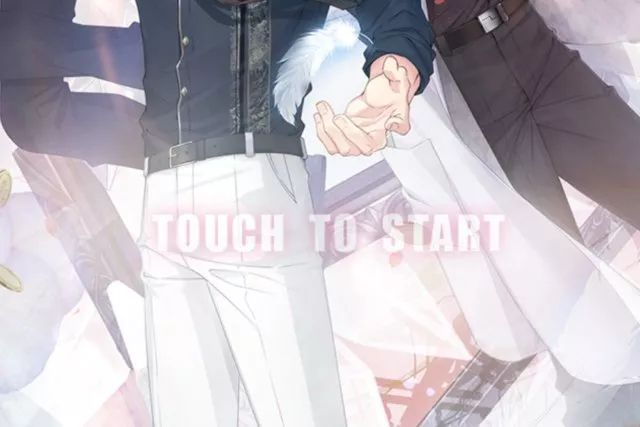
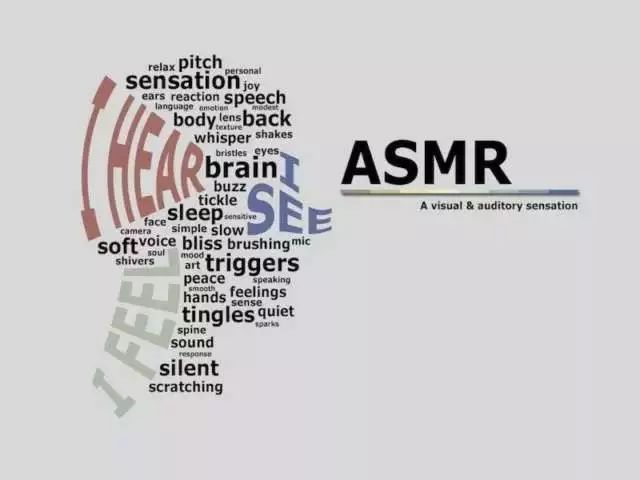
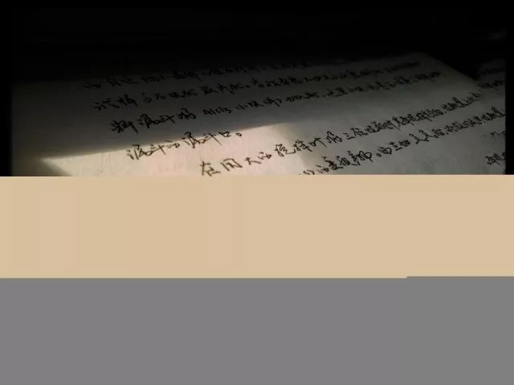

汪衔瑜，Merry Christmas ! 看到雪了吗？

嗯……我正在候场准备呢，最后一场戏特别特别难，所以想打个电话让你鼓励鼓励我。

哈哈，突然感觉很有动力了，谢谢你，汪衔瑜。对了，你圣诞节有什么打算？

汪衔瑜，当圣诞老人这个任务还是交给我吧。

你猜我现在在哪里？

其实……我刚才和你说谎了，我今天跟导演请了一天的假。就让我做一天不敬业的艺人吧。应该说，今天，我是只属于你一个人的周棋洛。

快回头，我就在你身后。

这是前天 圣诞节晚上 过了着实无趣的一天后 我把 恋与制作人 下下来 解锁的剧情里 很靠前剧情的一段话  虽然这是个女生向的虚拟养成  但 抛开以前玩secret love的时候女版比男版容易玩之外  游戏以外的 听着耳机里有些酥麻的声音 当时我真的回了一下头 想着 what if the one do appear, however, none

记得以前有个小伙伴和我说过ASMR autonomous sensor meridian response 算是对视听触嗅等感知刺激 使人在颅内头皮背部或者其他地方产生的独特而令人愉悦的刺激感  直译为自发性直觉经络反应  机理上是一种弱电流经过肌肉时的 喷薄感 这段话是剪辑过来的 但恋与制作人里的CV Character Voice 可以给人以类似的感觉

一天又一天 就像是菜里少了调料

坐在主图看大物 看宏观物体在时空上表现出的规律特征 到波动光学中前人总结出的林林总总 十年生死两茫茫 不 要自行 思 索 量 子力学 自 然哲学的科学原理的 难 度是可以使任何一个接触过ta的人都 忘 不了的 千里孤坟 无处话凄凉

全神贯注的状态 毕竟不会长期出现  一般一两个小时之后 都会出现一段有些疲乏的空缺  最提高效率的办法 就是尽可能地把全神贯注的状态发挥完全  而这样的状态 经常在四点五十左右出现开端 意味着 我想全部用好的话 就总也要挨到快七点再去吃晚饭

之前写过一句话  叫做时间错位 感情也跟着错位  这不仅仅适用于男女朋友之间的亲密关系 也适用于小团体里面的亲密友谊  拖着被饿空了的躯壳蹭到食堂去 打开手机 晚餐饭点的一波尬聊高峰已经过去  在食堂试图找一个饭菜还在冒着热气的窗口  眼中 嘴里 两边炒冷饭

看到我要WYN出了一篇文叫做 现在 只有李泽言会秒回我了

不少人把这个锤子游戏当成分别和四个男友纠葛不清的小游戏 也有把这个当做和女生聊天搭上话的契机  在我 衔瑜本汪而言 其实只是看到了一个有确定聊天的轨迹

不管怎么说 只要我点开了 就会看到结果 回复也还有虚假的暖心 声音也还有酥酥的效果 画面也还有一些精致到过分的布置  原本挺无聊的游戏 正好搭配着同样无聊的魂灵 和同样无聊的生活

当 话题和生活圈子开始趋于稳定 起床 看书 按照计划看有机物化大物概率论马原  三餐 或者不足三餐  午休 或者不午休  和人搭话 又怕一下话太多  被人搭话 又可能马上要去做别的事

白天的时候关掉朋友圈和空间 在自习室的时候手机关机  好像重新回到了 刚刚开始与人社交的时候 我不太懂 偏渴望别人懂 幸福 轻得沉重   这样一不来 二不去 活脱脱哲学意义上关于亲密关系的二律背反

岩壑清奇 柴扉袅娜 禽鸟鸣唱 流水吟哦  冰点周刊有一篇文 是机关里的年轻人  其一是一个新入职的小伙子 被告知他是来顶替一位刚刚退休的老职员的

你不愿种花 是不愿见花一点点凋落 我刚刚打字想写周棋洛 打到zhouqil 出现周期里 我就知道 避免了种花的开始 也就不会有一切的结束

-END-

-文不加点的张衔瑜-

