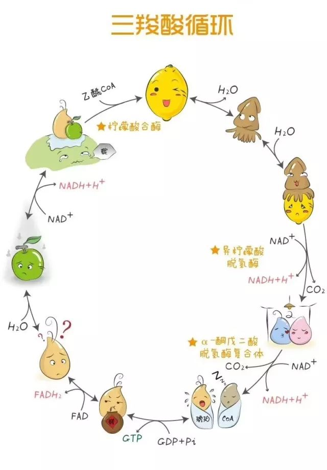
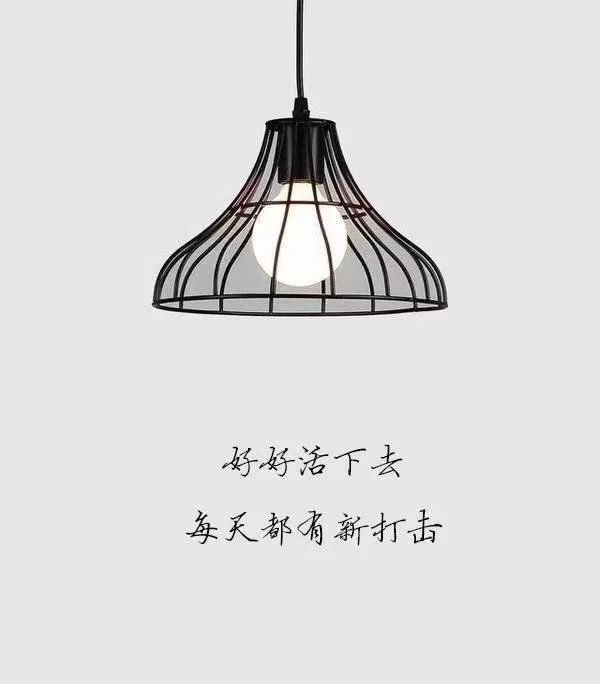
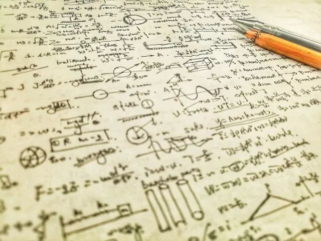
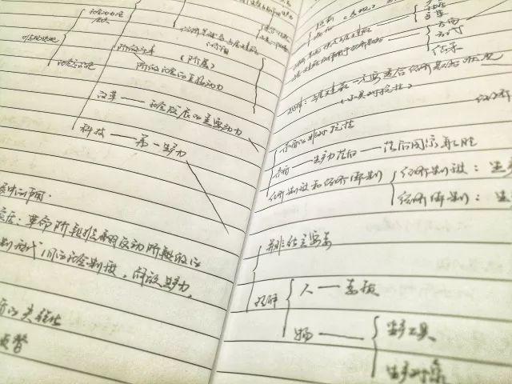
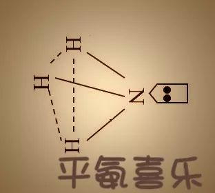
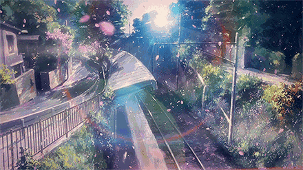
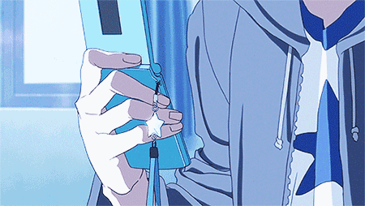

没有什么特定的词句可以来记述自己的日子  上午上完大物的复习课之后 觉得去主图的路途离C5有些小远 转身进了学校里暖气开得最足的食堂

反正也还没到饭点 就坐下来自习 饿了就吃饭 然后回寝午休 去上下午的课

这几天睡前 除了跳一跳之外 也把李泽厚的《美的历程》翻开了来  摘一段话

原始巫术礼仪中的社会情感是强烈炽热而含混多义的，它包含有太量的观念、想像，却又不是用理智、逻辑、概念所能诠释清楚，当它演化和积淀于感官感受中时，便自然变成了一种好像不可用概念言说和穷尽表达的深层情绪反应。

某些心理分析学家(如Jung)企图用人类集体的无意识“原型”来神秘地解说。实际上，它并不神秘，它正是这种积淀、溶化在形式、感受中的特定的社会内容和社会感情。但要注意的是，随着岁月的流逝，时代的变迁，这种原来是“有意味的形式”却因其重复的仿制而日益沦为失去这意味的形式，变成规范化的一般形式美。

从而这种特定的审美感 情也逐渐变而为一般的形式感。

草稿纸又恢复了高中时期的那般 密密麻麻  用黑白色光调整了之后 把一些参数系数进行优化 便成了底下这些 我们不一样啊衔瑜 很难话语和自己生活相距太远的人 即便是很吸引或者是很令人想去亲近

又卡在了量子的问题里边  推导过程里 那些全世界最智慧的大脑还在不懈努力的东西  我是不可能去理解的

学习和其他事情都一样 努力应该要适度 否则 对这些杂七杂八的知识框架或者体系一旦抱有希望 便会被这些锤子套牢  当然 这些是不讨喜的

脑CPU的占用率 和转笔速度的快慢呈正相关  左手撑着头 想出来了什么的时候 蹭着脸刮了下来  又要去整理鬓角胡须了罢  就算在自习室或者咖啡厅或者食堂里 也要把秋裤塞进袜子里

把书和电脑放进背包 把卫衣的帽子叠好 翻戴在头上  把口罩的拉绳挂上耳朵 像车里开着内循环一样 减少呼吸相关循环的热量耗散

除了昨天初雪之外 最近小雨不断  没戴手套的时候 往往会陷入权衡的纠结陷阱里  打伞吧 就算用袖子蜷着伞骨也还是很冷  不打呗 冷风直往眉心里钻 宛如给高烧病人准备的冰敷袋放了上来

数学的课本里间或夹杂着关联数学和物理学的一些方程  而在大物的量子版块里 分明夹杂着无机化学和结构化学最开始讲授的原子结构泡利不相容blah

前几天觉得自己的数学学得太没有精神了 就蹭到大一的高数课堂里去重新听一节邵神的高数课  邵神的气场还是那般奔放不羁

微积分的卷子判卷人可能是随便找的 但数学系的卷子只有数学专业的人才能去判  因为微积分太简单了 你也会啊 数学系的卷子里面那些符号什么的 别人是用数学的语言在交流 而你的数学这个微积分 还是在用汉语和别人说话

常数齐次非线性微分方程及其衍生物 反正这些都学过了 也没多听 就一边写着概率论一边偶尔张着听一点尬聊  仿佛看到了金刚打拳颜真卿

麦克斯韦速率分布函数和重力场中粒子按高度的玻尔兹曼分布 这个不好考 他只有单纯的概念在里边 我们想考的是有概念而又带一点点运算技巧在里面的东西  这个只有概念 背就完事了  所以没有明确说不考 但往年也没有考过

看了半天的大物  想纠一点细枝末节的时候 却被告知这个东西不考  不管花多少时间抑或是精力 不是物理系的学生 但有义务有责任去对概念进行剖析 却因为一句 没有必要 遂而 适可而止 神奇的是 并不总是能那么幸运地契合所学和所想学

复习要适度 不然对考试抱有希望了 就等于是被套牢并绑架了  有机的东西就是很玄妙 玄之又玄地 动一动 断个键成个键 化腐朽为神奇 变高尚为庸碌  同学说北师大的英语有机考得像完形填空  也是有趣

vx里的票圈 从Do not Share过渡到了Share to  想来看一看 减负不少  票圈 空间 公号 日记  除了看的人有些不一样 在我自己写下每一个字的时候 没有区别

看到朋友的个人公号里写到一个piece

有时会在下雨的晚上跑到楼下的便利店里买一些觉得不可或缺的东西，买到了，便觉得可有可无了。

上升到文学的时候 好的作品就是让人感觉ta所写的人就在自己的身边  当我看到这句的时候 久违的触电感

紫菘片区2.0L&2.5L装的可口可乐好像都被我们寝买完了  actually 我寝室还屯了不少吃的 早一个月之前和同学拼的酸奶饼干 前几天拿着支付宝红包去买的瑞士卷 一点汤达人的豚骨面 一罐香瓜子 blah  给老爸拍一张寝室照被说是开南食店的  whatever

日子就很平常 没有什么惊心动魄的瑰丽色彩  没有出去做暗访才采写 没有跑音乐会话剧去感受艺术熏陶  寝室里的手冲咖啡整套出给了一个新闻的学妹  图书馆C12  朝而往暮而归 景致各异 如果有的话

回文一下最开始摘的《美的历程》中的那段话  将自己的生活放还在了现在的这般模样中 战战兢兢日复一日 也可曾想这就是自己在外游走的时候 所希冀的安稳的校园生态 光线沿着和晶体光轴呈不同的角度的形式入射 布喇格父子由此得到了面间干涉极大的公式 life 便在这一点一点 人做出来的事中间凝结

今天有我团的学长学姐来问我杂志纸质刊的事  蓦地想起上期期末的时候 写的那些杂七杂八的文字  今天没有雪 适合回忆前文

于每一个人而言，

生活都还只是一卷缣素。

期年以后，

是浓墨重彩，还是素淡清雅，

是波澜壮阔，还是冷月舷窗，

悉听尊便 。

-END-

-文不加点的张衔瑜-

