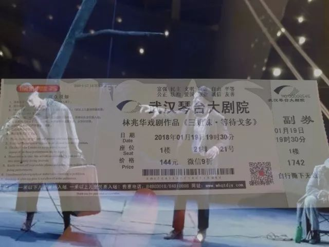

《三姐妹·等待戈多》

林兆华的这个剧算是 杂交剧吗 对话了两个经典的荒诞作品  作品从一开始就很压抑  很 沉闷 沉郁 顿挫  说看话剧的作品都是在看自己的人生 但当真正好的作品由好的话剧演员来表现  则是一种 令人感到浑身被枷锁桎梏着  想呐喊 想狂吼 想咆哮

两个乞丐蹲在树旁。

你在干什么？我在等待戈多。

Ta什么时候来？我不知道。

这种等待注定是漫长的，

我在深似地狱的没完没了的夜里等待，

生怕在哪个没有星光的夜里

就会迷失了方向，

开始是等待，

后来我发现等待成为了习惯。

等待戈多

契科夫在《三姐妹》中写到

莫斯科！这是解除一切疑难杂症的仙丹妙药，这是一种完全不同的生活；那里将得到愉快的有意义的劳动，为着全人类的幸福，为着爱，为着诗。

三姐妹离开莫斯科十一年了 却一步步 回不去莫斯科 一步步 开始自己的新生活

大雁为什么一直在飞？也许它们之中也有哲学家也有艺术家但它们逃避不了要一直飞的命运。它们知道自己为什么一直在飞吗？上帝不告诉它们答案。

三姐妹

太多太多的台词  置身台下听着台上演员的词句看着他们的一举一动 心里宛若有种被万蚁噬咬的愤怒  只想挣脱这些太痛苦太明显的东西  来找寻安宁处所

诗经中擅用比兴的手法 其定义为 先言他物 以引起所咏之词  这是因为 我告诉你 我很伤心 我很开心 我爱你 这只是个结果  但过程中 我因为什么而伤心 我经历了什么而痛苦 我从什么时候开始知晓自己爱上了你 一无所知  于是 我想要给你讲一个故事 或者给你唱一首歌 朗诵一首诗或是给你开一瓶酒 环境的构造  是文作者剧作者的功底

我从琴台出来  走进地铁站

耳机里的歌听起来索然无味甚至比不上地铁加速启动时的背景噪声

在江汉路换乘 站内的浮雕刻画上 洒下的小碎片像是被镶嵌在了石头里 像各个方向发出求救的信号

我知道 我明白

a

扶梯下行

身着大红色羽绒服的女士左手把住伞骨 右手将伞面顺着一个方向叠起来  调整了几个金属结构的错落位置后插到伞托中

找到有粘钩作用的丝带 狠狠地缠住 粘紧 然后塞进伞套 用小指勾住伞托下的挂带

我看到 我理解

b

倚着握柱的女生

带着半截手套 手机里打开着蓝白色相间的界面 她的手型便告诉我  刚刚在知乎打开了一问题的回帖 点了个赞 现在要继续看下一篇了  她斜角踮在地上

站她旁边穿着深蓝色金纽扣上夹克的男人 想提着写有社会主义核心价值观的鼓鼓囊囊蓝色布袋子下车  挤下车门时 男人一手开路一手护着袋子

她转过来 戴着桃红色圆边框眼镜

我发现 我讲述

c

背着双肩包的男生

看着手机屏幕开始笑 浅浅的会心的笑 手势像是在打字  他忽然抬头 从眼镜片后折射出的目光说出了他只是想和周围人分享他的快乐 甚至是娇羞

他又低下头去  他关了屏幕  他抬起头来看向黑洞洞空无一物的地铁窗外  他长出了一口气来缓释刚刚的笑意 冲着黑洞洞的一切又开始了浅浅的会心的笑

我敢说这如果不是一个顾影自怜的自恋狂魔  那手机的那段必定是热恋不久的可爱女友  看着消息都能甜腻的那种

小年轻的恋爱

我羡慕 我嫉妒

d

坐在座位上的女生

把卫衣的帽子翻起来 仰头对后一靠  女生的帽檐很低 低到我看不到她的眼睛  丹唇未启 换了个姿势而靠在地铁栏杆上

前几天我在路上听到背后传来一阵金属撞击和丝绸摩擦的声音  回头是一个女生倒在地上 抬头的时候 短发全摆到了额前  小黄车倒在右后侧 小黄车的后轮在空转

我有把握这是一个考试周中在自行车上骑车起到睡着的女生  在地铁上这也会是一个疲惫到了极点的躯壳

我经历 我一样

e

写着翠华纸业的塑料碗里

盛着一碗 像是炒饭的  水汽从碗里边蒸出来  凝集在塑料袋袋顶

对座的人拨弄着袋口缝隙里边的勺子  垂涎的样子 是想舀着吃 但又怕这气味和动作会打搅到邻座的人 有悖乘坐地铁的社会公德

我的脚底传来扶梯机械的震动触感 防成龙上 还有些未干的水滴

我知道 我知道

f

我知道 这些我看到了之后 我全都知道 我没有一个不知道 所有的细节所有的心路历程  群相所有  因为这都是我经历过的 这都是我知道的 这都是我了解的

荒诞的人们和荒诞的生活  光怪陆离与消逝流过  佛门的看破和避世建立在对世界的悲悯  但斗士 却是在看到了无尽的无穷的无解之事但依旧选择和这个世界继续下去  暂时的和解 和永恒的斗争

听过话剧便在心中憋了一团火 想说却还没说的 还很多

-END-

-文不加点的张衔瑜-

