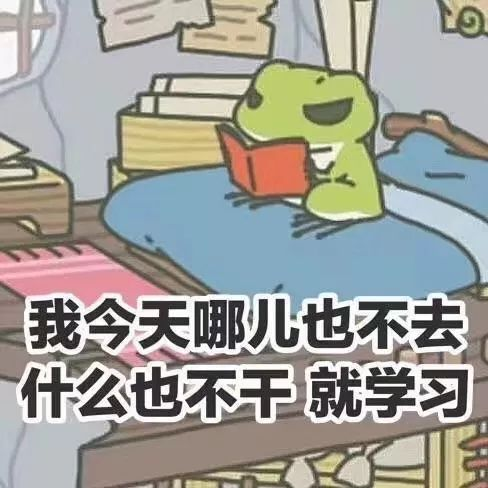
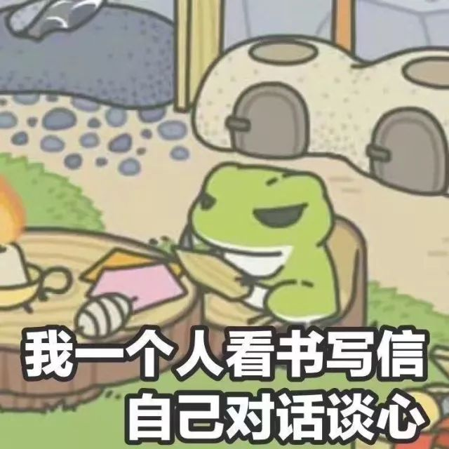

配乐 有一个更中文的名字 叫 乌托邦

融合了科幻和人性 被称作是不适宜任何年龄阶段的人观看的Rick & Morty S03 E09中有下面这两段对话  在我前几天补番看到这段话的时候 感觉到有人剥离了世界的虚妄外表 而用粘附着动物结缔组织的表面展示着真实

昨天 准确来说是从前天晚上到昨天凌晨 是没有睡好的 也许就是没有睡也说不定

早上七点钟想着不睡了就起床吧 过早 我坐在一辆不会开的校车上 从西操的这一端 看不到西操的那一端  雨不大 但雾很重  我不知道在眼镜上的  是从口罩夹鼻漏上来的 还是空气中本凝的那些

实验室组会是九点整 现在还早  我于是在D9下车 绕道孔子像前 迎着八点整去考思修的大一人潮逆流而行

我插上深咖啡色的耳机 黑色的双肩包和黑色的口罩 穿蓝色的棉袄 蓝色的裤子 无聊 配了一双殷殷猩红的鞋子  从路的一旁 没有人和我走同一个方向 这样 我才好看到正面朝我走来的这些人

双肩包将男生的脚步压得有点重 行李箱的小轮压过D9路的砖石 **作响  两个女生手挽着手 一个带着拉文克劳的围巾和土黄色半截手套 手上拿着一本写着笔记的B5大小的本子 想来是在抽背挽着手的同伴

一杯豆浆和一袋馅饼从我面前飞过 豆浆用大拇指和食指轮成一个圈夹着 馅饼用中指和无名指夹着 小拇指托在底下  戴眼镜的男生一手拿着豆浆和馅饼 一手拿着思修  可惜我戴着耳机 辨识不了他嗫嚅的嘴里是在咀嚼方才吃进的食物 还是在小声地背诵着思想道德修养与法律素质

走到实验室 今天我是第一个  隔夜的样品还在实验台上搅拌着  避光保存的样品用袋子罩得好好的  我将通风橱关上 窗户打开  新的一天和新的课题

诚然 我不知道早上为什么自己会突发奇想 在路上去逆流而行观察路人

我并不希冀路人投来的一瞥而过的惊讶目光 因为这些我很久以前就已经领略过 我不需要用这些肤浅的转瞬即逝的东西来满足自我内心的虚荣或是对安全感进调适  这些是没有用的 我只是在看路人 capture details

正如在科学实验中的控制变量法  涉及文学认知科学以及心理学的观测中 从批评地眼光里将一些人物先行扁平化 再用特定的手法将之进行复合 形成圆形人物

我以为 在这一过程中的扁平化阶段 是可行而必要的  但扁平化的组合 是幼稚的可笑的

易证 所以我不证

今天早晨五点多 从噩梦中醒来  醒来就醒来了吧  也没打算再睡了

去食堂 早上吃饭的时候 刷卡  暖色调的食堂装饰 我想端出来一碗热豆浆 却一个滑指 把饭卡掉进了碗里  手不稳 不宜实验 那就看书 读诗

高二的时候因为想看荷尔德林和尼采 便开始顺带着看海德格尔 当我用他者隐藏存在问题，从而逃避了回答“我是什么”这一责任时，这些关系就是非本真的。 我没打算理解或者说去用这种很佶屈聱牙的语句 但也没有忘记这些论断条条

走到蜗壳所谓校园内最宜晨读和情侣流连的青年园里  还没有要天亮的迹色  我打开手机 翻找到在备忘录里存下的雪莱诗选开始看 看也不中意 倒是要读出来  《西风颂》

哦，狂野的西风，秋之生命的气息，

你无形，但枯死的落叶被你横扫

犹如精魂飞遁远离法师长吟，

黄的，黑的，灰的，红得像患肺痨，

染上瘟疫的纷纷落叶四散调零：哦，是你哟，

以车驾把有翼的种子催送到

林翳间的草鹀和灰喜鹊 在天空微微方亮之后也渐渐醒来  一阵长风总青年园里刮过 我看到在水泥小路上团簇着的浸润之处  满园的动植物经历了一晚上的呼吸作用 就在这刚刚开始 天空中吐着白色 一切要苏醒了的时候 伸着懒腰 和真正的自然一起醒来

哦，请听从这一篇符咒似的诗歌，

就把我的心声，像是灰烬和火星

从还未熄灭的炉火向人间播散！

让预言的喇叭通过我的嘴巴

把昏睡的大地唤醒吧！哦，西风啊，

如果冬天来了，春天还会远吗？

-END-

-文不加点的张衔瑜-

