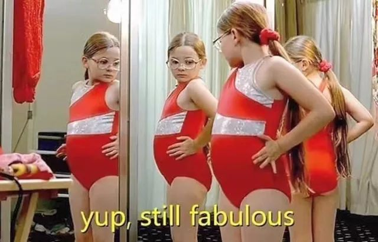
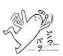
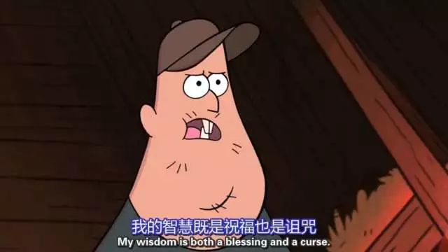

老龄化的开端是碎碎念的增多 如果要用颜色的渐深表示吐槽的盈亏  我最近大概经历了红色中暗红、褐红、赤红、粉红、浅红、紫红、丹、朱红、橘红、大红、玫瑰红、深红、绛红、土红、赭红、殷红、鬼怪色几个阶段 现在已经累计了一个冲程 准备接着再来一遍

左边手臂还生疼 是几天前在蜗壳往返东西边的时候 在路上和冰面接触时留下的肌肉记忆  也是在武汉真正降下大雪的几天过去了之后 挑着一个雪映朝阳的早晨 我打点好东西 回了长沙

如果让我给这几天的生活作息打分的话 我可以打满分 约莫是小学往后记事以来 生活最稳的一段时间 （repeat昨天的纯文本推送） 早上七点多和太阳一起醒来 想赖床赖赖床 饿了就出门去吃早餐  回家后也许顺手从菜市场顺条新鲜的鲫鱼blah  坐在书桌前 打开一本《都柏林人》 当然我没带回来 或者打开电脑 像今天一样地写点小文 或者看看德国应化or先进材料这些的

偶尔吃点小东西 少食多餐 只是不一定需要保温杯 因为有热水 &我也没有泡苟且不对枸杞的习惯  中餐一会儿过去 不肖睡午觉地 要么继续上午的生活 之前也会去实验室 现在也许会在爸爸妈妈出门之后去找人玩  晚餐之后 七点多就开始困 洗漱了熬到九十点 刷波消息之后就去睡觉/做梦

每天生活究极稳 三餐&睡眠 充分而安逸  actually 去问了问奶奶和外婆 似乎和我时间差不多同步 甚至比我还更lay back一点  照镜子看到白头发之后内心OS鹤发童颜  大概到了爸爸妈妈都要策我是老年人的时候了

坐高铁回来的时候 因为不能根据晚点的时间买票而只能根据发车的时间买

我到高铁站的时候是14:12 最近的是14：27  我觉得OK  进站之后发现已经晚点103min了 算了算四点左右发车也算是认了吧  和同学有一句没一句连麦尬聊着

三点+ 发车时间改到16:31  晚点124min  我说那好吧只是别再增加时间了 后来发现这是一口毒奶  在站内碰到了经济院的同学 聊着聊着就看到时间表上G817跳到了17:01 然后就是18:01

同学说 我们去找点什么事情做吧 我没带书 吃饭也可以 吃饭也算是找个事情去做 在强度不小的紧凑生活中待久了 就会觉得被迫什么也不做什么也做不了的生活是一种浪费

等到像等待戈多一样的两个人从高铁站吃饭的地方出来 看到G817已经提前到17:49发车 也正在检票  我稍微犹豫了一下 毕竟同学的车晚点到了七点多  但我刚刚上车 看了下表17:14  忽然17:18车就开了  就 说好的17:49就直接开了  铁路有些事 anyway 只是时间点比较准的陈述

不能生气 不要生气 不要拿别人的错误惩罚自己 别人生气我不气 气出病来无人替 我若气死谁如意 况且伤神又费力

像尬聊界开山鼻祖那样 邻座的情侣从西安南下深圳 去做个短期旅行

列车时不时地直接停在了路上 没错就是停在路上  也还会用30km/h的速度陌上花开缓缓而归

六点一刻左右 乘务员推着小车 车上是成箱的热干面  邻座的小哥问乘务员能不能买 乘务员回了一句 抱歉 这个是免费赠予重点旅客的 当然也非卖  所谓重点旅客 是老人和小孩 但到底谁是小孩谁是老人 大概是1.3m一下&七十岁以上 全凭目测 张衔瑜鹤发童颜 不在此列

往常一个半小时左右就能到长沙的列车 这波开了两个半小时  我把身上带着的一块岩烧奶酪和一条毛毛虫送给了邻座的情侣 毕竟下车我就能次到长沙 五点吃了晚餐 稍微饿点吃下一顿也哦可

昨天跟外婆说我没事会碎碎念一些无关紧要的东西  外婆说 有个词叫 百常经 （音） 意为总是念叨着一些重复了多次的事情  长沙有句俗语 翻译成普通话可以听的是 剩饭炒了三道——狗都不去闻

今天这一篇是灌了不少水的  of course 我需得要先写写来回顾一下写作的感觉 不然手生了 直接上那些我想要讨论的宏大命题也好 或者长沙武汉周边测评&游记 都不合乎我的习惯

这篇先写到这里 没什么别的 就是饿了想去做点吃的  助力老年化进程不可怕 但中青写了句 怕只怕，水滴里也蕴藏着大海的一些潮流 是见微知著还是上纲上线 自己去评判吧哈哈哈哈 我弄吃的去了

-END-

-文不加点的张衔瑜-

