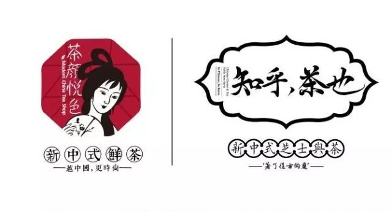

本文适用于非长沙人士

培养对长沙人民的嫉妒情绪

亦适用于长沙人民离乡之后

反刍YY味蕾记忆

张衔瑜曾经做过《关于中部地区喝奶茶人群的调查》 也就是推文 [《奶茶要不啦~奶茶》](http://mp.weixin.qq.com/s?__biz=MzUzNjE3NzA3Mg==&mid=2247483944&idx=1&sn=57abcf05d394a4e2c99d1433c8e8dfcf&chksm=fafb72f7cd8cfbe1fb907882fb38a711bef998dee2c7dde651f5aa7ed1dbd24b610dc4f622dd&scene=21#wechat_redirect) 虽然大家的选择 从覆盖程度到最心水的一款都有些不一样  但在我看来 一点点贡茶皇茶喜茶丧茶coco快乐柠檬益禾堂and so on 没有一家 可以比得上茶颜 对 就是 一个能打的都没有 一个 都没有 为了写这篇 （借口 我胖了 但就是不说胖了多少口亨

首先 是奠定了茶颜名声的一款 幽兰拿铁 中国风的茶颜杯里 红茶茶底上加入鲜奶 三圈半的忌廉奶顶稳稳当当地盘踞出杯沿 撒上碎碧根果

首先挑吃坚果 然后舔下奶盖 最后饮毕茶汤  喝幽兰拿铁的时候像是长出了花白胡子 cuz忌廉奶顶会赖在嘴唇上  茶颜凭着这款 不知道俘虏了多少人的心  to be honest我自己最早被同学拉到长郡门口喝的第一杯 也就是这个

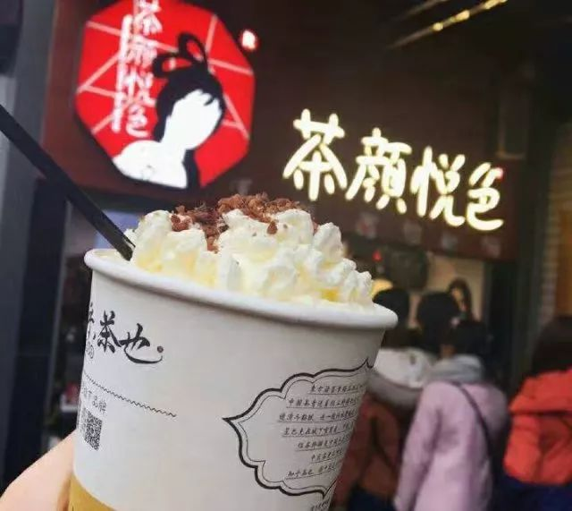

幽兰拿铁

同系列 也就是红茶忌廉篇底下还有一款 叫 纤纤马卡龙¥18 同样是红茶茶底 不过敷的奶料换成了马卡龙

由于人本能地想要凸显自己对一个品牌的了解程度 不在于找到ta最光鲜的那一个而是发掘小众又好喝的  纤纤马卡龙便符合这样的特质

需要注意的是这杯虽然和幽兰拿铁都位于红茶忌廉 但茶底是有区别的 这杯的茶底相对较浓 建议不要点去冰和或者是热的 以此调和口味

关于甜度的话 幽兰拿铁无需备注 正常甜加之忌廉的甜可能对正常份的人士已经有点点小过了 但纤纤马卡龙like I said茶味较浓带一点点苦 这时候若非像我一样的茶中老饕 还是不要像我一样地点半糖

纤纤马卡龙

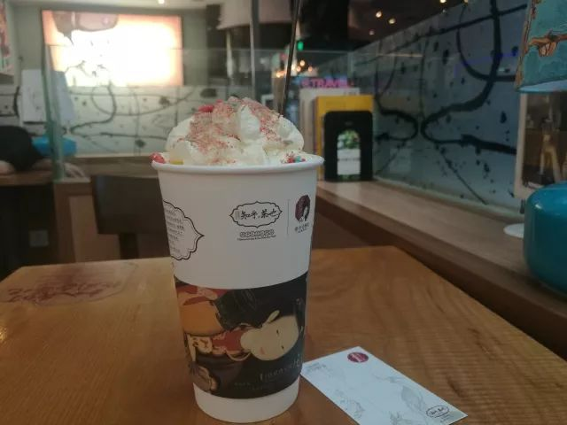

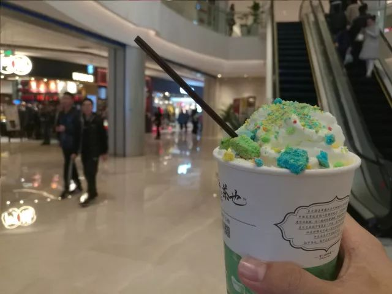

顺着红茶篇往下写 素颜锡兰¥13 是唯一的一款红茶沫泡  所谓沫泡 是在红茶茶底上 用鲜奶打出奶泡 敷上茶汤之后佐一两点奶料

但同样地在绿茶篇里 茶品便变得丰富了许多 筝筝纸鸢¥17 声声乌龙¥15 凤栖绿桂¥12 桂花弄¥15 这几款里像高海拔四季春乌龙茶茶底的声声乌龙 以及喝起来如沐春风至于草长莺飞二月天的筝筝纸鸢 &淡淡桂花香是不是半价的桂花弄

红茶绿茶在沫泡篇里 不如在忌廉篇看起来那么的华丽 & 外观差异也不大 比如下图的素颜锡兰和桂花弄  but之前我有推介茶颜给同学的时候有和我说看到那三圈半的忌廉奶顶就怕的 well 沫泡哦可

红茶奶沫

绿茶奶沫

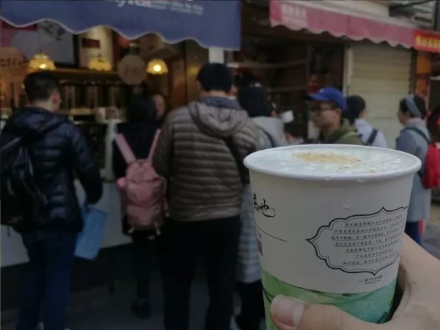

←桂花弄

→素颜锡兰

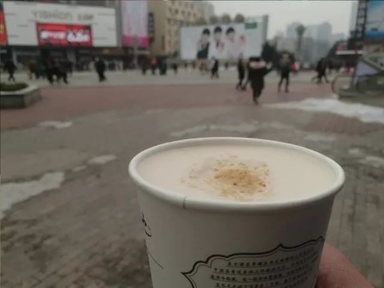

仍旧说一下红茶篇 有个雷就表去踩了 蔓越阑珊¥17 写在红茶篇的果香忌廉  蔓越莓的酸度令人有些接受不了 当我逛了逛茶颜的大众点评是发现还有不少人挺心水这一款的说 whatever

张衔瑜的测评从来不会客观中肯只是主观臆断 推荐也没什么根据全凭自己嗨皮 于是冬季特供的 臻享拿铁¥22 写在红茶篇的坚巧忌廉  maybe奶料有点小多 使得这一款在我心目中的地位一直不高

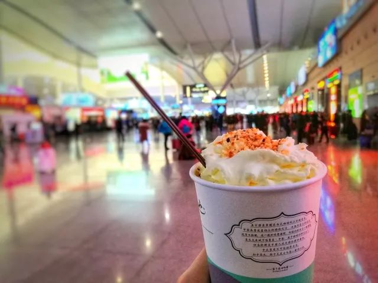

有个意外之喜在绿茶篇的忌廉之处 这便是 抹茶葡提¥16

葡提不肖我细说 但我喝过也吃过不少的抹茶 从宇治抹茶的抹茶千层&抹茶拿铁 到盒子实验室boxlab的抹茶卷  我想我的味觉很能分辨出一款题为抹茶的饮品其涩度其甜度其表观参数甚至气味应该怎么样才够得着怎样的评级

但这样的 抹茶葡提 能以这么亲民的价格加上忌廉奶顶和葡提奶料  喝到 和喝到的幸福

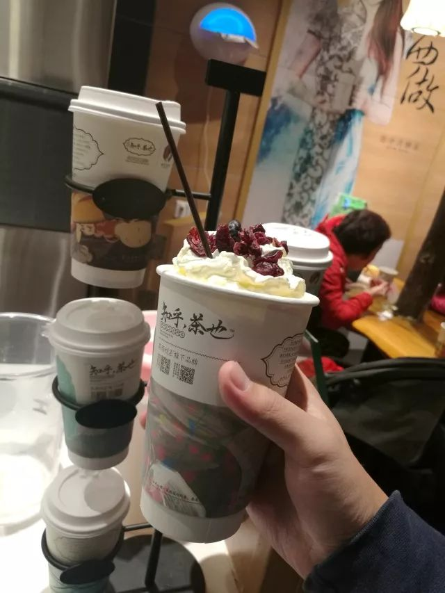

抹茶葡提

茶颜最近出了两款新品 一个是夏季特供的 妖精¥20？¥22？ 一个是双旦前后的 人间烟火¥17

妖精作为果茶的题词是 艳翠春销骨，妖红醉入肌 诗源杨万里《芗林五十味》

而人间烟火 则是配了一段年节的喜庆文字 先挑着开心果吃掉一些淡奶油，怕热饮太烫，慢慢吸一口茶汤。咦，一杯奶茶里竟然喝出了烟火味！随后这意外的味觉体验散开，感受到的是武夷岩茶的岩韵花香和牛奶的香甜盈满口腔。像是把一个记忆里的新年具象到这一杯，早晨楼下的爆竹声，茶几上待客的瓜子花生豆子茶，厨房里热闹的锅碗瓢盆碰撞，街头的熙熙攘攘，此时此刻捧此一杯，最合宜的就是许一个新年愿望吧。

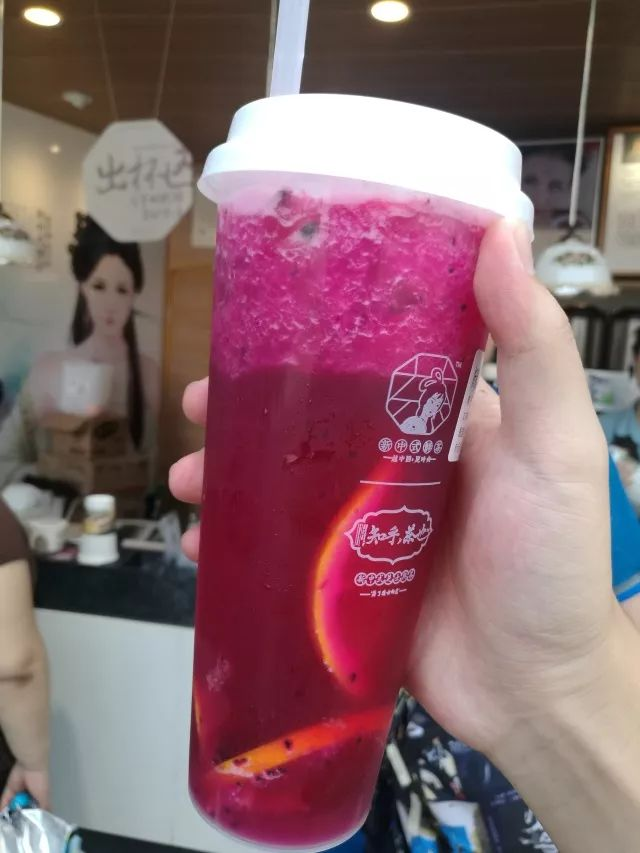

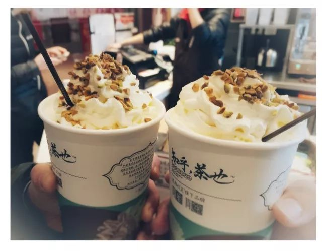

←妖精

→人间烟火

大家粉上茶颜 不单单是茶颜的取名 茶颜在奶茶界还算亲民的价格 茶颜的杯身 茶颜的食味 茶颜出杯的时候顺应节气提醒的饮食和注意事项 更多的 也还在于茶颜每出新品时的公关策划

记得有一批纸杯出了小问题导致那一批的体验不好 茶颜当即在公号&各个地方开始进行承担责任的担当宣传 内容用语也很是恳切  在同样也做过或多或少相关的文媒张衔瑜看惯各种冷公关 清流难得

最后是店里有些的永久求偿权 说的是 只要喝到不满意的 就可以走进任意一家茶颜要求重做一杯 这个要求在茶颜的公号中被屡次提及  我在高铁站用过一次 是因为知乎茶也的杯子问题 在没有告知我的情况下用的纸杯而不是知乎茶也的专用杯（稍后会有图  但实实在在地求偿成功 也没有多费口舌

茶颜悦色的子项目还有知乎茶也 这个兴起大概也才一年左右 不算久  茶颜之前做的红色 而知乎在招牌一段时间的蓝色之后 换成了现在的白色素纹

知乎茶也不同于茶颜悦色的忌廉奶盖特点 是在于其芝士奶盖  只是奶盖有淡盐奶盖和榴莲奶盖之分（当然也有斋茶可我也不喝 佛祖曰¥19

由于张衔瑜不喜欢榴莲 所以喝的都淡盐奶盖 下面的价格也都是按照淡盐奶盖而不是榴莲奶盖或者斋茶

知乎茶也

知乎茶也的茶底配方写得很清楚 比如 桃花坞¥18 的茶底是七泡有余香·一见钟情白桃乌龙茶 素笺红袖¥17 是肠胃抚慰者·抗寒暖心的糖心红茶 清末¥17 是一芽二叶·五窨高山茉莉绿茶  喝的时候应该把杯盖旋开一半 在杯口出吸食 一半茶汤一半芝士 每一个味蕾都经受了一场熊抱

事实上 衔春燕¥20 陌 桂¥17 这些的 因为知乎同属于茶颜旗下 自然而然地也就能在茶底当中找到知乎茶也和茶颜的共通之处

每一杯喝到最后三分之一时  按照茶颜官方推说的 展现化学系学生专业素养地将杯身在手上 施展腕力振荡混合均匀  平素最喜不过芒果和芝士 想起喜茶也有黑金芝士这些的 但总也还 有着捧高本土品牌的私心在

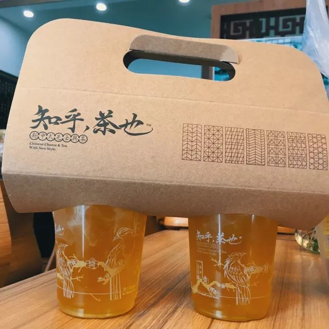

知乎茶也|衔春燕

知乎茶也

茶颜还有些周边 像茶颜的胶带春夏秋冬 每次积点兑到的都不一样  茶颜的保温杯 写着湘方言里那些有标志性特征的词句段写是写在保温杯上 但看在眼里 自然而然地就从嘴边跑了出来

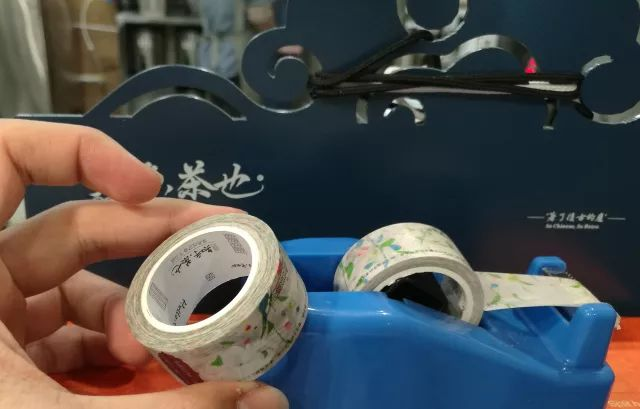

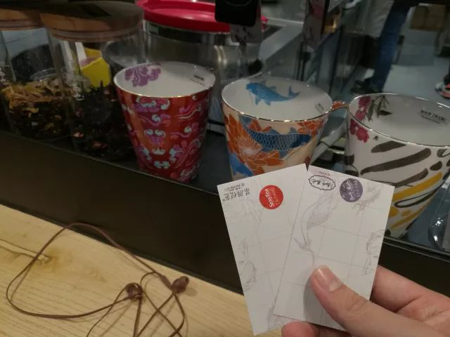

茶颜周边

有些的我没有说到 像茶颜原叶现沏的 茉黛绿 和 枉凝红 以及我总在高铁站点的 花遣离人

我高捧了抹茶葡提和纤纤马卡龙 也轻踩了蔓越阑珊和臻享拿铁 茶颜之茶在于其茶 在于其奶泡忌廉和芝士奶盖 在于其中国风改性茶杯 也在于这个品牌所具有的良好特质

E

L

S

E

茶颜是有些搭配套餐的  比如一杯端茶颜 一杯敬知乎  比如 茶颜+N 的模式 左手一杯茶颜/知乎  右手一碗文和友臭豆腐/黑色经典臭豆腐/心太软糖油粑粑/正宗湘潭葱油粑粑/天下第一光头粉

如果胃口大blah承受能力强全包fine张衔瑜抱拳为敬  但我这边是 边喝茶颜边打胰岛素 的选手 边喝边扎针 有不服想拿别的配方的可以尝试和我上一波PK台

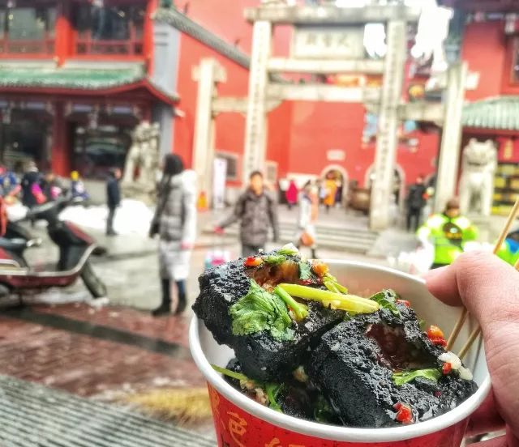

文和友臭豆腐|不在火宫殿里面

套餐研究

端着茶颜在街上游荡

有时站在国金街的楼梯上 看三五成群的校服中小学生 把手插在口袋里吊儿郎当地边走边偷偷摸摸看旁边人

有时在湘江一桥底下看一堆人围着看一局好旗 看一步喝一口

甚至可以先把茶颜放在一边 抢过老爷爷提着水桶在地板上写字的毛笔 写上一行 帝子降兮北渚 目眇眇兮愁予 再放下笔重新端回 对着自己写的横竖撇捺议长论短

这篇茶颜的测评从前到后断断续续写了很久 2500+平常一篇两倍的量还多图的大章测评 不是什么常有的事

只想着茶颜能做得更久一些 好在将来 茶里有着故事 发酵出的醇香 或许会和忌廉奶朵同样动人

BTW 你什么时候来武汉哇 总不能我在武汉就只喝苏打不喝奶茶 省了所有的奶茶回来一次吸食real害怕

-传送门-

[-别到了长沙 还不知道怎么嗦粉-](http://mp.weixin.qq.com/s?__biz=MzUzNjE3NzA3Mg==&mid=2247484143&idx=1&sn=810a22e54daeb9d740761733f97248b2&chksm=fafb7230cd8cfb262af676045852e6982fb8d73b9e011777850e235624d8f621d6e3a7df01db&scene=21#wechat_redirect)

[-奶茶要不啦~奶茶-](http://mp.weixin.qq.com/s?__biz=MzUzNjE3NzA3Mg==&mid=2247483944&idx=1&sn=57abcf05d394a4e2c99d1433c8e8dfcf&chksm=fafb72f7cd8cfbe1fb907882fb38a711bef998dee2c7dde651f5aa7ed1dbd24b610dc4f622dd&scene=21#wechat_redirect)

[-在油腻的生活中诗意地栖居-](http://mp.weixin.qq.com/s?__biz=MzUzNjE3NzA3Mg==&mid=2247484053&idx=1&sn=641b2d53fd7c2201de6d5ad2465cf60b&chksm=fafb724acd8cfb5c049a933992031abc0c06571b0d0eee30efd056d1d8991fc0b3bec69730ad&scene=21#wechat_redirect)

[-化学生的求生攻略-](http://mp.weixin.qq.com/s?__biz=MzUzNjE3NzA3Mg==&mid=2247483980&idx=1&sn=098a85465c6b7d28e6c50d65486113aa&chksm=fafb7293cd8cfb859e34392b6b6da337cc843c5221300909ce54cf7fc774371442475e0eec92&scene=21#wechat_redirect)

-文不加点的张衔瑜-

