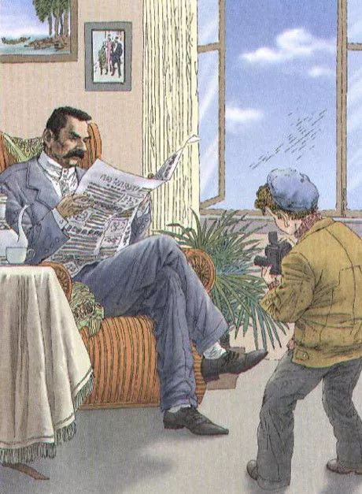

这一篇是我随手编的

边听歌边看可以听到放完假hhhh

首先 如果没什么事情做的话  可以去看看小学语文课本   小学语文课本篇幅短 教育意义好 能在装嫩的同时把自己带回到那个时代

我选的这篇是苏联作家列·波利索夫写作的故事短文 为人教版语文三年级上册第6课课文 译者是赵华昌

小摄影师

11928年夏天，高尔基住在列宁格勒。他经常坐在窗子旁边工作。一个阳光明媚的早晨，高尔基正在读书，突然，一个小纸团从窗外飞到了桌子上。高尔基打开纸团，上面写着：“亲爱的高尔基同志，我是一名少先队员。我想给您照张相，贴在我们的墙报上。请您让他们放我进去。我照完相，立刻就走。”

高尔基从窗口向外望去，看见人行道边上坐着个10岁左右的小男孩，手里拿着一架照相机。

“是你扔的纸团吗？”高尔基问。

“是的。”小男孩站起来，鞠了个躬，“请让我进去吧！”

“来吧，我让他们放你进来。”高尔基说。

过了一会儿，小男孩站在高尔基面前了。他仔细打量着高尔基，咧开嘴笑了，然后用手指了指沙发，说：“请您坐在这儿看报纸。”

高尔基拿了张报纸，按小男孩的吩咐坐下。小男孩摆弄了很久很久，说：“一切准备停当。”高尔基侧过脸，对着他微笑。突然，小男孩往地上一坐，哭了起来。

“你怎么了？”高尔基不知出了什么事。

小男孩哭着说：“我把胶卷忘在家里了。”

高尔基赶紧站起来，小男孩已经提着照相机跑出去了。高尔基走到窗口，大声喊道：“孩子，回来！我给你胶卷，我这儿有很多胶卷。”

小男孩哭着，跳上一辆电车。电车马上开走了。

晚上，秘书告诉高尔基：“外面来了一位摄影师。”

“是个小男孩吗？”高尔基问。

“不是。是一家杂志社的记者。”

“请转告他，我很忙。不过，来的如果是个小男孩就一定让他进来。”

这篇文章的后边写了一个小练笔 【我想接着往下写这个故事】 当时大概没往下写 cuz这篇读得..... 我没拍自己书上的图是因为画得很不像样子了hhh

想看中心思想的请后台回复【中心思想】 不是在这篇底下留言啊喂

过节怎么能少了歌单

喜庆 | like

沉静 | yep

最好听的 | 儿歌

你汪我汪大家汪

公号小福利

Q：这张图出自哪篇课文

（假装我可以想一个小福利

-END-

[-听说这样play tricks的脱团了-](http://mp.weixin.qq.com/s?__biz=MzUzNjE3NzA3Mg==&mid=2247484063&idx=1&sn=bd02c8b62e3476bb667598e68daa13f3&chksm=fafb7240cd8cfb5672ca937ab19424400a723be30e3ac13593e4784c9dddec158fe69e3c637c&scene=21#wechat_redirect)

文不加点的张衔瑜

懒得打标点的张衔瑜在日常尬文 2333333
