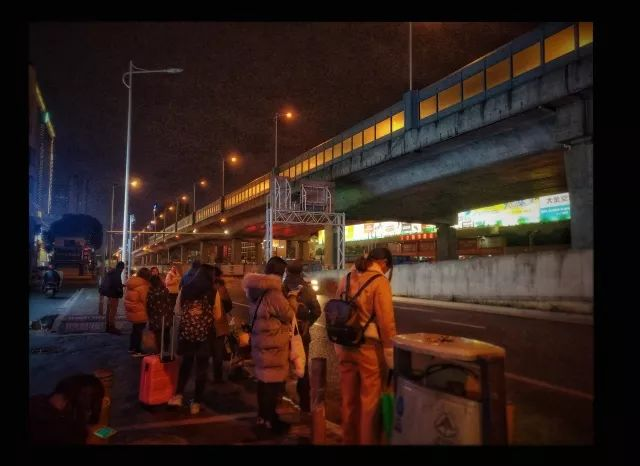
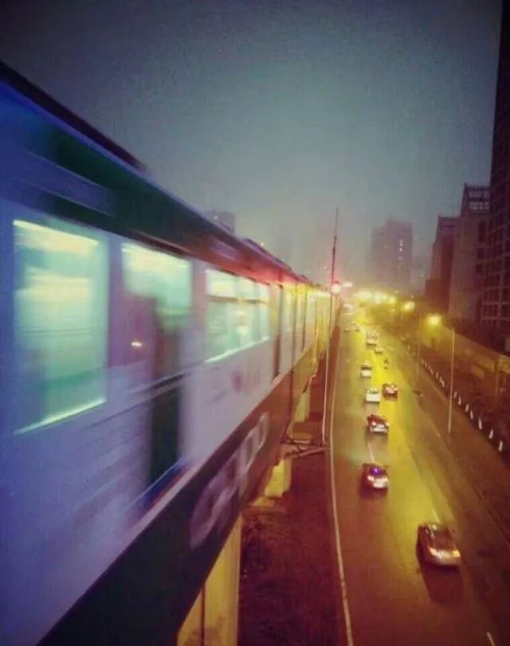

本文共计886个字

如果看到一半就睡着了

笔者会很开心

雨落芭蕉 梧桐双老

自然而然地 在一个季节 就理应有这个季节的风雷水火  古诗文当中 作为典型国人思维的 常常用着迂回的 不一样的事情来表达对所想言说的事情的认知

就像梧桐和芭蕉 小雨落梧桐 帘栊残烛红 文字终究只是文字 五感中的视听尝嗅触 没有哪一样可以完整地表达

可如果只说雨 是和风细雨 还是倾盆大雨 雨的声音 雨的线度和湿度 直说出来的话 便丧失了文艺的乐趣  唯有芭蕉与梧桐 因人知其型叶之大 基于共同的对于这两种植株已有的认知 来引导人自行想象山雨意味

轻点入意境之中 却并不道破意境为何

山色空濛雨亦奇 是余留自己所思所感的地方

像这种到了深夜的时候 倘若噪声不太芜杂 以前家在路旁的时候 常常可以听到一阵鸣笛声

怎么解读这种鸣笛声呢 约莫可以理解为民国散文小说中的轮船汽笛 或者五六十年代那种还能摇下窗户的绿皮火车 进站时发出的响声  这时 我家的窗户不完全封闭 可以听到鸣笛声渐行渐近 渐行渐远

可以想象呐  这会不会是一辆载满生活必需品的货车 因为交通管制而必须在深夜进城  司机在车辆通过路口时 为了尽可能地保持车而又提醒深夜行人&行车人 故而从离路口很远的地方开始 就鸣笛示意

可以假想这是一位靠着驾驶技术供养家庭的父亲 夜晚 离开妻儿  熄了车内的灯 独自在空不见人 排解了白日喧嚣的城市主干道上行驶着  驾驶人清了清嗓子 眼睛瞟了一下后视镜  顺着后视镜上的一段编好的红绳看去 绳的下端吊着一个小玻璃块 玻璃块里有一张照片 是这位驾驶人的全家福

他会有路灯的陪伴吗

他会注意到远方一闪而过的匆匆行人吗

他会留心路旁躺在长椅上的乞丐和撕心裂肺哭泣的白领吗

也许会 也许不会

也许他看到了 也许没有

他这一趟能挣多少钱 车上装的这些货品是不是在破晓之后集散 在中午时分进到另一个家庭的餐桌上 这个家庭的人会不会意识到桌上的这些里边带着另一个家庭丝丝缕缕的祈祷安全

夜雨顺着柏油路面攀援上货车 停在我的日记本上 信笔成文  如果我以后将能写出一篇中篇或长篇的小说 必定有这货车的远光灯照亮开头

惊蛰 雨夜听雷声醒来

宿舍后的自行车车棚上 像是打翻了道尔顿板 小球一颗一颗落上 而后弹性地非弹性地离开 这样的深夜 没有人声  学校宿舍 也没有梧桐芭蕉

黑夜将人的视觉屏蔽 只叫人用耳朵去捕获这在白天的噪声中 过滤不来的声音  若是这样 再枕着雨睡去 不失为一件足够快乐的事

睡吧 祝好梦~

-END-

-衔瑜文艺 | 好久不见-

文不加点的张衔瑜

懒得打标点的张衔瑜在日常尬文 2333333
