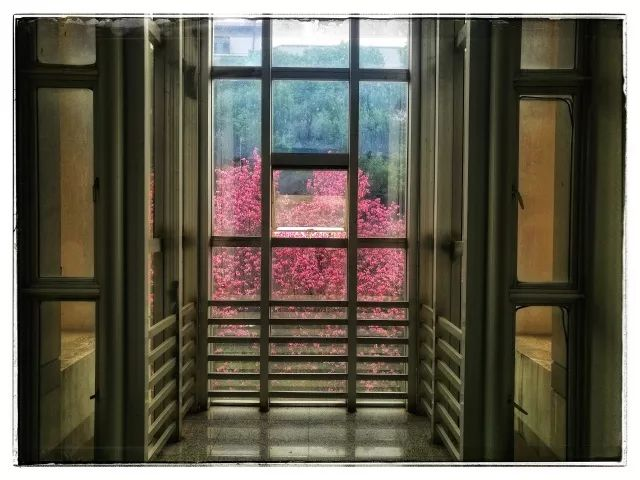

本文共计1261个字

预计要用一场雨的时间看完

阿拉伯婆婆纳眨着湛蓝色的眼睛，我猜它们是大地派出的使者，怀揣着查看春天步伐的任务。

一开始只是零零星星冒出几株，不出几日，它们就越来越多，蓝眼睛此起彼伏地扑闪，仿佛是春天的万象太引人贪恋，大地的好奇心一发不可收拾，争先恐后地张望这个世界来了。

引语摘自作家涂昕的《采绿》

我在写这篇文章的时候 武汉瓢泼大雨  小学课本上的谚语里 有一句叫 春雨贵如油 隆隆的雷声滚过江城的楼榭 连文字也变得舒缓了起来

昨夜的雨 湿了今晨的鞋 前人说东风夜访花千树 是不假的  惊奇地 在兵荒马乱的白日间隙中 看到寝室楼下 教学楼前 不知不觉 静悄悄地说着初春已然来到

车轮压过青年园南边的铺路砖石 砖石的一段翘起 车轮过后 重重压下 溅起浑黄的水花  有一些顺着车轮攀援上了我的裤腿 回寝了会在洗之前 端倪良久  也许这之中带着的 是化为泥水的商鼎广场蜡梅

昨天上完毛概课出门 在C12的S203 & S204之间 斜角度带着暖黄的日落色 从开着的天青色滤光玻璃缝隙中探进身来  一树火红跳跃的朱标胭脂玉兰 仿佛已经在另一个时空维度中培育完好 只趁着雨的尼伯龙根来掩人耳目 为地在这日常经过的地方 蓦地给人一个惊喜 玉兰临窗

廊的导引 玻璃窗的滤色 日落的暖黄 和玉兰的火红  这是春天C12的绝好去出之一

另一个 便是N104 & N103窗外的过道  如果说玉兰临窗是人们在这个季节 多加留心还能注意到的地方 但这一个 北廊晚餐 我想是除了我之外很少有人知道的  如果要去这个地方的话 还有几分出人意料

正常的走法是傍着老子像旁的小路 从N101外墙墙根拐进来  我很少这样  当以前还在N102、N104上高数 N103上天文学导论的时候 我会选择趁着教室里的人不注意 把自己掩盖到窗帘之后 径自翻窗出去

这时候写作业看书的话  内电灯的自然白光和外日落的昏昏黄光交织 按理说来很伤眼睛  于是 在这翻窗出去的北边飘窗廊芜之下 叫一份外卖直接到老子像 端坐着 双腿半悬在空中 踢踏瓷砖

C12的北边是五六十年代的矮矮破破的电机楼  暖黄色的夕阳镀上青褐色的砖瓦 苍翠的梧桐树林之下 往来C12的人们在离你三五十步外的地方匆匆来去着  夹起一块白菜 也许是陕菜大厨花打四门的惊人操作

他们的悲欢并不相通 很吵闹

但夕阳是公平的 时间也博爱

我在写这篇的时候 C12窗外的世界已经模糊不清

兵荒马乱的多少天里 大多数时候都是沾枕即眠 留不得多少思考的时间 疲惫地睡下  没多久闹钟就想了 醒来的时候 不觉得自己睡了觉 感觉自己刚刚才躺下呐 怎么就要起来了呢  但身体状态明确地告诉自己 刚才确实有过休息 疲惫的状态虽然没有完全消解但缓释了不少  仍然想留在床上

清早起床睡意浓 睡眼尚迷蒙

中午起床睡意浓 睡眼亦迷蒙

炉熏檀香 伽蓝寺

在雨夜醒来 在雨夜睡去

以及樱花草丛樱花雨

我特别喜欢月光下的夹竹桃。你站在它下面，花朵是一团模糊；但是香气却毫不含糊，浓浓烈烈地从花枝上袭了下来。它把影子投到墙上，叶影参差，花影迷离，可以引起我许多幻想。

我幻想它是地图，它居然就是地图了。这一堆影子是亚洲，那一堆影子是非洲，中间空白的地方是大海。碰巧有几只小虫子爬过，这就是远渡重洋的海轮。我幻想它是水中的荇藻，我眼前就真的展现出一个小池塘。

夜蛾飞过，映在墙上的影子就是游鱼。我幻想它是一幅墨竹，我就真看到一幅画。微风乍起，叶影吹动，这一幅画竟变成活画了。

——《夹竹桃》季羡林

-END-

[-衔瑜文艺 | 好久不见-](http://mp.weixin.qq.com/s?__biz=MzUzNjE3NzA3Mg==&mid=2247483702&idx=1&sn=714210bdcd5739c46d523a9a990f5295&chksm=fafb71e9cd8cf8ff6594aabb482cd29b95c0bcde0597ffc80fa1f873bb1529073d41f0ac01a4&scene=21#wechat_redirect)

[-只是不想取一个《深夜文摘》那样的题目-](http://mp.weixin.qq.com/s?__biz=MzUzNjE3NzA3Mg==&mid=2247484341&idx=1&sn=ad15f64740eb62bdf82004df8664838e&chksm=fafb736acd8cfa7cd205fbe2a4195cfddcc02c2c1e087ef6082ca40b0f9c0de79525e159b3e2&scene=21#wechat_redirect)

[-写在大物草稿纸上的小说-](http://mp.weixin.qq.com/s?__biz=MzUzNjE3NzA3Mg==&mid=2247484223&idx=1&sn=ce8805a1f8593b58eb093fec6d1361a2&chksm=fafb73e0cd8cfaf604f3335b9c8835dd2bb7f9361b70f4becbafab61406f3b985c1c9155bcd5&scene=21#wechat_redirect)

文不加点的张衔瑜

懒得打标点的张衔瑜在日常尬文 2333333
