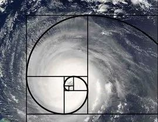

本文共计1619个字

不造要用多久 记时请告诉我

斐波那契是一个数列

0,1,1,2,3,5,8,13,21……

这是我周二那天 C艹老师演示的一个程序设计 大概就是用循环结构来求算斐波那契数列 数列中在定义前两项之后 此后的每一项都等于前两项之和  我的日程表也是这样

斐波那契螺旋线

天下着毛毛细雨，人们撑开伞遮住脑袋匆匆走着。一下子，圆拱形的伞篷互相碰撞，街上拥挤起来。

特丽莎前面的男人都高高把伞举起给她让路，女人们却不肯相让，人人都直视前方，让别的女人甘拜下风退缩一旁。 这种雨伞的会集是一场力量的考验。 特丽莎开始都让路，意识到自己的好心得不到好报时，也开始象其他的女人紧抓住伞柄，用力猛撞别人的伞篷。没有人说“对不起”，大多数时候人们都不说话，尽管有一两次她也听到有人骂"哔-"或"哔---！"

上段摘抄自米兰昆德拉的《不能承受的生命之轻》  不在shelter的下雨天 总归是有些难过的

下课的人潮流泳当中 一把十二骨三折四节彩虹伞停在了路口 男生踩在浅浅的水滩里 将伞斜架在怂起的肩膀上 偏过头去夹住 伸出手来系上泥白间色的鞋带  彩虹伞的伞尖滴下雨水来 滴在系鞋带男生背着的书包上 打湿了粉色的小猪佩奇

西小门外边 一二对冲的三辆饿了么电动车 像英语音标中发出 /θ/ or /ð/ 地那样迎面撞上  骂骂咧咧的cyclist追尾上来 一手打着伞一边嘴里嘟囔着不给自行车一点过路的空间

老奶奶拽着小推车往前冲 小推车上写着“华阳纸业” 蓝色的隶书字 被滑轮甩上来的泥泞棕褐点了许多

加装违规雨棚的老爷爷 骑着黑灰色小电驴也到了这里 后座上的小女生 背着粉红色的书包 端着一碗酱色米黄的热干面 竹黄色一次性筷子夹戳住面条后扯翻许些 但并没有吃下一口

我把YALI蓝的长裤裤腿倒卷到足三里纬度圈 再把平端裤腿放下 类似于八分哈伦的样子  出门走了有一会儿 感觉还是滑稽了些 放弃 把束腿放了下来 最后还是决定买了两条九分 省得饶舌费事

手上的稿子在积攒 科研在积攒 托福在积攒 作业在积攒  我也想找到一块时间来把事情做完  回一下题 这个叫斐波那契

长出气 长出气也救不了我

六朝兴废事 尽入渔樵闲话

最近看了不少 关于读博读研的 也有武理又跳了的研究生  石锤不石锤 倒自会有人去分说 幸好我碰到 现在三个带过我的老师都非常非常nice  可以后读研读博呢 其实都是一些assumptions  很模糊的概念

好像去哪里都不对 也没有一个地方是大体能够满足的 更何况 还要是自己有资本有能力去挑的地方

在新东方听老师上托福课  老师提着一个话筒在前边 扩音器倒是在教室的后方  四平八稳的语气像是放进了CE或者水果里去压限 虽然也还有抑扬顿挫 但没多少起伏

十一点半了 他刚刚讲了一个段子吗？ 旁边的同学在笑 清晰可见同桌的牙齿镶凿在牙周骨上（也有叫牙槽？） 可以看到牙龈的笑容大多是真切的

我尽量让手臂多和窗户边的瓷砖接触 好让热交换更快一些  没吃早餐 离下课还有一个小时 垫了一块我再也不会吃的海岩高盖 我是真的觉得燥热

我打开了窗户  珞喻路上从光谷转盘泄洪出来的车辆暴躁地发出自己低沉而粗宽度的声音  我关上了窗户 我不想去想通这些和别人的感受  sympathetic 这个在初中时背的感觉woooh好牛逼太厉害了的词简直用起来就不可一世 不过尔尔

扔掉了桌上受潮了 不能再吃的芝麻片  拆开一本新书的外塑料包装 随手把腰封撕成碎片

书的所有部分里 书里的字是知识 不管好坏深浅  书的包装封壳是保护 保护书里字的完整  摩挲作为文字载体的纸张 这是一个作者和一个出版社的匠心  唯有腰封 “他们是纽约的最后一对恋人，却是世界的第一对。” 《柏油娃娃》 我刚拆的就是这本书的外包装 这是腰封上第一句话 剩下的没来得及看 因为已经撕碎了

倒并不会因为要写篇什么 而写篇什么  一些自己习惯的笔法 其实很容易在小地方告诉别人 我吃饭的时候喜欢用筷子还是勺子 冰淇淋喜欢吃牛奶的还是草莓的  人们一时太多的细节暴露在我的眼前 我并不想一个一个地去演绎or the science of deduction  自己心里有数就有数 没数就没数 越来越佛

写在便利贴上的事情越来越多 强行肝一篇 是因为运动和暴食/少食 甚至日记也都些难以缓释

疲乏地从抽屉里拿出檀香盒 摘出一盘来 点好 放进熏香小炉  感觉整个世界都越来越暗 整个房间都开始在空间上变得辽远  至少还没到Fitz那样

书本上的字开始变换 手的影子仿佛留下了越来越多  写下一个字 看墨水慢慢干涸 固化到纤维素纸面  只是台灯没电了 不是斐波那契不算下去了

-END-

[-今天这一篇是凑数的-](http://mp.weixin.qq.com/s?__biz=MzUzNjE3NzA3Mg==&mid=2247484193&idx=1&sn=f9d56a31ce08210d56572618e9d61097&chksm=fafb73fecd8cfae8aa86f81a5f31b72a163083142b0c3cdbb576239a51cb652d45633d787580&scene=21#wechat_redirect)

[-一周之内 而气候不齐-](http://mp.weixin.qq.com/s?__biz=MzUzNjE3NzA3Mg==&mid=2247483955&idx=1&sn=b236fdeefdf1948338b6483361580ea6&chksm=fafb72eccd8cfbfa64ecc79648ac83ab2255615dc0a18d8792602a7e984023e669498186cfec&scene=21#wechat_redirect)

[-子龙一身都是胆 我一身都是肝-](http://mp.weixin.qq.com/s?__biz=MzUzNjE3NzA3Mg==&mid=2247483925&idx=1&sn=4dd47ff8730d1f66df54f70a251cd979&chksm=fafb72cacd8cfbdc565b6a45314ab65aec801298e9ac8b3be48a657f6b6f25bffd249e90bb85&scene=21#wechat_redirect)

文不加点的张衔瑜

懒得打标点的张衔瑜在日常尬文 2333333
