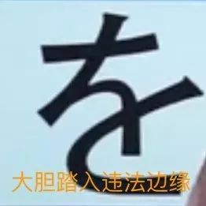
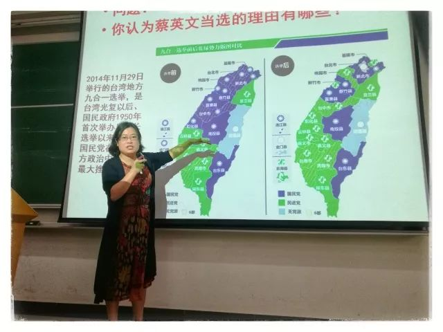
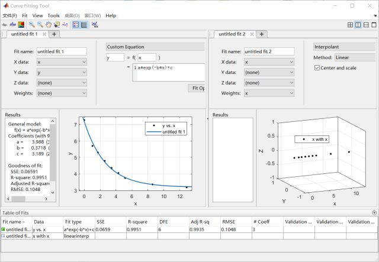
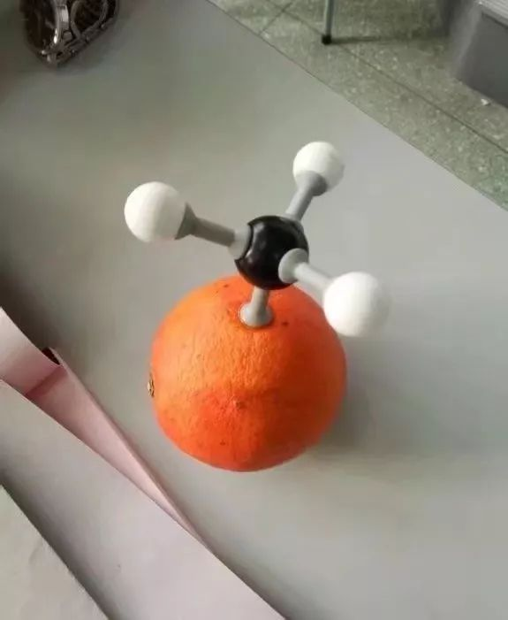

本文共计3309个字

少量英文串场

今天冷不丁地写篇文章 倒不是busy as a bee的生活有了closure 而是有些更要考虑的问题生发了几个小波动  西边的太阳就要落山了 微山湖畔静悄悄  不知道为什么最近在不同的场合 听到几个人在用或调侃或奇怪的声调唱这首歌  土琵琶一拨 倒也是有一些新的动人的歌谣出现

近在准备托福 checked  真的很难orz  找到英语系里专门做linguistic研究的老师 听了一些真正从语言学的角度来审视native English-speaker的文举段构筑方式  正好最近也选了专业选修课里科技英语的课程 提到导师们操刀来写的大多是introduction部分  如何从语言学角度来看待在introduction部分里边出现了又定势background--gap/challenge—purpose—research experimentation—result—conclusion这样

前几天组一篇稿子 讲学校的刷分制度 学校现在教务条例规定不准 但我觉得可以 于是想要讲逻辑地理性地证明一下

操作稿件之前顺便读了一本小书 其实也没找到书 读的TXT 苏霍姆林斯基写的《给教师的100个建议》 最早是在家里的书架上看到这本书 写刷分的时候想看一点教育理论的书就把这本翻开了来  没找到什么关于我想写的的内容相关 却被其他的内容吸引了

我摘一小段

在经验丰富的教师的实际工作中，教学和教育的这一方向性体现为：在学生的脑力劳动中，摆在第一位的并不是背书，不是记住别人的思想， 而是让学生本人进行思考 ，也就是说，进行生动的创造，借助词去认识周围世界的事物和现象，并且与此联系地认识词本身的极其细腻的感情色彩。

我领着孩子们来到秋天的果园里。这是初秋的一个晴朗而明媚的日子，柔和的阳光温暖着大地，照耀着披着各色盛装的苹果树、梨树、樱桃树的纹丝不动的枝叶。我给孩子们讲述金色的秋天，讲解自然界中一切有生命的东西怎样准备度过漫长而寒冷的冬季：讲到树木、落在地上的种子、留下来过冬的鸟类、昆虫等等。

当我深信孩子们已经体会和感觉到词和词组的意思和丰富的感情色彩时，我就建议他们谈谈自己的见闻和感受。我亲眼看到，儿童当场就产生了关于周围自然界的惊人地细腻而鲜明的思想。他们说：“一群白天鹅渐渐在蔚蓝色的天空里消失了”；“啄木鸟敲击着树皮，整棵树都发出响声”；“路边开着一棵孤零零的野菊花”，“鹳鸟站在巢边上，向很远很远的地方眺望”；“一只蝴蝶落在菊花上，它在晒太阳……”孩子们没有重复我的话，他们说的都是自己的话。思想在活动，在丰富，儿童正在养成思考能力，于是他们体验到一种无法比拟的思考的乐趣和认识的享受。他们感到自己变成了思想家。

你们是否观察到(或者从别的教师那里听说过)，儿童有时候对教师的话抱着一种爱听不听的、无动于衷的态度?譬如，您给儿童讲述一件很有趣的事，可是他目光黯淡，木然地坐着，您的话并没有触动他的心。您完全有根据为此而感到不安：这种对于词的冷淡和不易接受性，是学习上的一大缺点，如果这个缺点扎根很深，一个人就会对学习越来越疏远。

有理由相信 能写出这样的话的作者 必定对教学有着赤诚的心灵和博爱的情怀  在这些时候 我对此定然毫不吝啬自己的赞美词句

仍旧是全篇开头那一位语言学英语老师的分析 有一次讲到一篇阅读 是一个人写ta的一辆会被ask if it is an antique的旧式Toyota  虽然很老很旧但就像是一个老朋友  尾段作者写道 I prize my 20-year-old Toyota’s economy and dependability, and most of all, its familiarity. It is faded, predictable, and comfortable, like a well-worn pair of jeans. And, like a well-worn pair of jeans, it will be difficult to throw away. 前句的三个形容词分别把body paragraph 里边的三个主旨概括了  后边提到的well-worn pair of jeans便是native speaker的精髓

在这些国家的常见经历是 很多人都有一些穿了很久的牛仔裤  这些牛仔裤往往款式有些过时 甚至裤子上都因为常年的水洗而出现了明显的水洗掉色（不是那种配出来的颜色 是真的年岁洗出来的）  这些牛仔裤按说已经过气很久了 但是因为以前穿得多 牛仔裤的面料逐渐变得柔顺  按照化学生的理解 其内部结构的化学键被打断 整体表现出来的就是更为松散

这样的裤子说出来每个人都会想到那么些 总会在不是特别要求outlook的场合里穿出来  浓缩到作者想写的old Toyota 就很能在真正能读懂的人面前进行具象迁移  语言学老师讲起这些的时候 可以说是惊为天人 以前张衔瑜的梦想是做中文系训诂研究 这之后觉得自己也能触碰到英文语言学的研究的趣味

前段时间武理的那位陶硕士 看看我的票圈里 已经只有很少数的人还在持续关注着动态  以及北大的高同学 写文被找去约谈的邓同学

很幸运的是 我目前还没有遇到过所谓的类似斯文败类 周围的同学也没有听到有类似的事情  假如有一天有人在怀疑些什么 至少我可以就我本人的经历给周边的人辩护

辛德勒的名单里 辛德勒自己因为是德国纳粹党人 已经要走上逃亡的路 厂里的工人写了一封信给辛德勒以表自己的感激 签上了全厂人的名字让辛德勒在作为将来如果辛德勒将要面临调查时可以出示的证据  其中一位摘下了自己的金假牙 熔铸了一枚金戒指给辛德勒 上面用希伯来文写着

凡救一命，即救全世界

最近还有很多有趣的课

比如学院物化与工业催化所的所长来给我们讲物理化学专业必修课 讲学以致用的时候用自己曾经做过和正在做的课 将现有的知识和真正科技前沿成文的开拓者关联起来  副院长和另一位教授play rotation有机化学课也是如此 直接把有机和化工关联 准确到每一种材料的市售价格以及书本实验室制法与工业制法之间的异同 进而考量现有知识体系与工业体系中的问题

这些教授们都时不时指出一些前沿正在做的事情 指出一些当代具体化到菠萝香味的来源和洗发水为什么用飘柔 宏观化到储氢材料和量子点关联的钙钛矿电池对能源问题的贡献

每个人都在找到自己的那个方向里津津乐道自己感受到的 关心到的所有

同样的rotation week到了毛概课  从思修到史纲 到马原和这学期的毛概  按说几乎所有政治课的内容 都在小学的思想品德课改版之后全部都 或多或少地学习过  各类队课团课党课也全都开了不少  虽然有些新的思想出现 但大多沿袭着惯用思路和语言体系在之中  最近换到班上来的老师 while在课前早早地亮出了自己是一名老资格党员的身份 但所讲授的主题却是 台湾问题 从台湾整个的历史梳理到台湾当代的争执与反省 思维敏捷的语言当中几乎信手拈来台湾当局的大小事项

我并不是说我今天觉得这个课好我以后就要来研究这个方向 而是这些内容实实在在地在系因为 或者说让我有感觉到因为有新的知识进入之后 吸涨了水的海绵那般感受 今天我是带了两篇要改的文章去上课的 打开电脑坐在第一排 想着记笔记的中途瞄一眼 但精彩程度已经到了 我有记下连记笔记都忘记了的那种

今晚在主图听 MATLAB与深度学习 的一个讲座 是MATLAB公司里做程序开发与应用的工程师来进行的一次讲座  这学期正在上C艹与程序设计的课 我并不是特别感冒在程序源代码的处理上 这种感冒是指的我对这些计算机语言的语法结构以及小的优化兴趣不大  但今天在主图五楼 开放的同一个会场里三个厅一起听的MATLAB讲座 六点半的讲座我提前的五分钟去 这时候就已经连战的地方都要挤一挤才有了

会很喜欢这种数据调用的感觉 之前一度对分析化学类的事情感很大的兴趣 当然现在在高分子也还是没有改变那些  来讲授MATLAB的工程师都是大连理工大学化工的学士然后继续做的其他  也许我还会回到数据调用类的化学里边去 甚至不在化学（当然 到中文去现在看起来还遥遥无期）  这些对数据的parallel analyze 以及提到的database到MATLAB端口以及调用出去之后的展示 在我所想接触到的工程学统计与预测里边 竟然从这个讲座里有了被吸引到的感觉

说是所谓的这个讲座办得有多么好倒也未必 深度学习听到后半段我因为有事都直接离场了 但MATLAB所代表的这些数据处理和分析 却是实实在在地在吸引我  后边的深度学习到AI 不过尔尔 很有用吧 但只是那种ordinary friend的acquaintance 取义就不要取老朋友了 要取泛泛之交

太渺小了  知识的力量太过于powerful 以致于在仰观的时候很难去接近 去靠近知识  比如说想要研究化学前沿的 要打牢基础计算里的foundation和基本化学知识的framework并最终把framework打破  through scaffold 最终找到前沿 举起pioneer的flag然后把看到走过的带回来 找上更多的人一起走  最后给别的路上的人以自己这边路的效果 then大道之行也 个体和个体的桎梏 个体实在是太渺小了

最近的几次波动里 也还有自己身边的人  以前看到的 也许只在感动中国或者别的励志演说当中才会出现的人 真真切切地出现在了我的身边

ta比我高一级 在同一个部门里  很多我不知道的事情 当ta在面对随便一件就可以令人歇斯底里的事情时 近乎平静地讲述自己周遭的种种  碍于隐私就不说其人和其事  但却是真正出现在过我一些未公之于众的随笔当中的  后来慢慢地就觉得比起真的同龄人遇到的这一些 就every obstacle I encountered made no sense

渺小 simple, naïve and hungry.

经历了几个风波 既然是这样 那就应该去找到一些真正有用的事情去做吧  不是伟光正的说教 而是确凿脱离低级趣味 不是无聊地蝇营狗苟&拘泥在一些无所谓的琐事当中 知其中 还是留存在正常的轨迹里  只是不再游离 有所之

-END-

-科研二三事-

文不加点的张衔瑜

懒得打标点的张衔瑜在日常尬文 2333333
