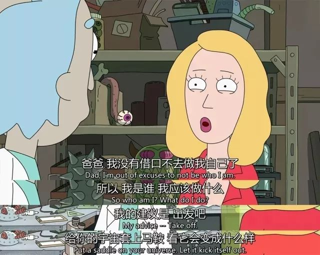
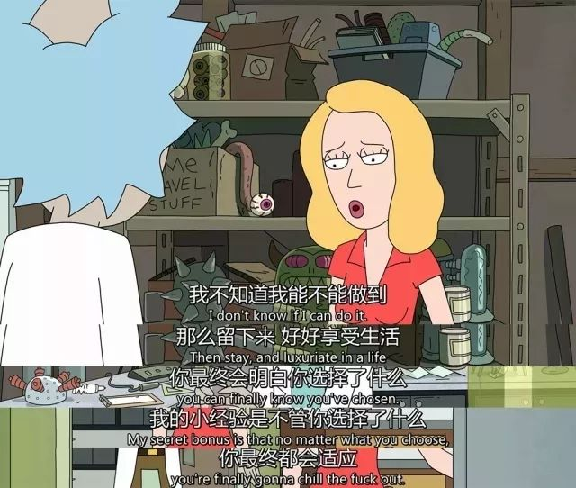
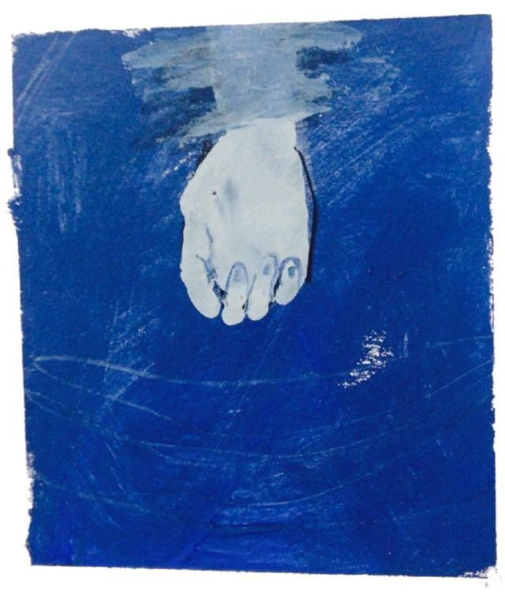

本文共计1898个字

少量英文串场

有时候恋人之间会保持一种默契 有些部分不去触碰  比如all feel crazy || 要开始吵架或者冷战的时候 拿出一个什么 或者说出一句什么  这时候双方都会像突然被点到了一样 冷静而知趣地看看自己 然后做成年人的事情

当我在自己写着日记和随笔 月常mess around在一些乱七八糟的想法中的时候 像上面所说的急救青囊 便是如下的这两张图

说实话rick & morty 这个剧里面的人物 画得是真的丑 讲多丑也算不上 但至少整个风格很黑暗是坐实了  rick 95%的时间都dedicate to lab或者不务正业 但也有那么5%的时间会说出一些令人下巴都要砸烂的话 而且这5%的话还都是那种很带科研风的赤裸truth

准备TOEFL 在找课题做实验 在努力跟上平常的学习 在锻炼身体搭配膳食 尽量合理安排时间 不当肝道夫 但我可以隐隐约约地感觉到 自己赖以驱动的一些 似乎有点能看到要用尽的一天了

如果说大家现在拼的是什么  无外乎在 身体 智商 天分 态度 说智商想来是不用担心 能够考虑这些问题 能够熟稔现在身边的一切本身就是自我智商的体现  当一些选入机制已经分流了太多derivation在智商和态度上的人  而当进入学院 尤其进入到了专业的核心时 当年的赌注就开始和人的机体冲撞  现在学习 学习规律包括考试什么的 怎么学怎么学得好考得好 这么多年了怎么做心里早就有了一套能自我矫偏的方法在

但是 很明显地 为了做完事情 不得不拿到 肝帝 的称号 不得不冥思苦想 不得不舍弃一些社交哪怕是再亲密的朋友和再喜欢的人  智商和身体 配上对这个life的良好态度 我也还能在之中占据还算不错的一席之地 但我是谁 我该往哪儿去

现在还能继续下去 partly也还可以自信在本科阶段不会迫在眉睫地遇到智商捉襟见肘的情况 也就是简单地不会挂科 成绩保持在良好 身体也还能抗背的情况  但以后呢 在国内抑或国外 在研究所或者在高校 读研究生甚至转博了之后呢  我还能不能只是靠着智商身体和积极的态度 还是一定要靠着天分和人一决高下

社会的竞争是不会变的  我在找我自己的兴趣和天分 我是谁 我做什么能做好 我曾经对很多感到兴趣  小学对数学几何 初二开始对物理光学 高中对语文训诂 大学先后对分析化学和高分子化学 这些学科 每一个都是正当可知 而且有足够迷人的地方耐人寻味和探索

可human-beings  whether gifted or not 能不能做好  空拿着自己的智商、身体和对事对人的良好态度 甚至不敢说我对哪一个方向特别有冲破所有的劲头 我不愿意将命运交付虚无缥缈的天分上争分夺秒  谁不想要一个真正有梦要追的地方  谁还不是想把自己的生活打点得好一点呢

随手摘的涂尔干《自杀论》的一些说法

声明！！！我就拿着看看 不要风声鹤唳草木皆兵  知不知道氰化钾有剧毒 知不知道怎么制备氰化钠 要不要用氰化钠 用不用氰化钠 怎么用氰化钠  这是六个完全不在一个维度的事情

利己型自杀

迪尔凯姆从宗教教派的自杀率差异入手，对天主教和新教的教会群体进行了比较，提出群体整合与利己型自杀率呈反向相关这一假设。家庭生活领域和政治生活领域的材料支持着这一假设。 整合性强的群体对个人起到支持性作用，是遏制其成员自杀倾向的重要社会因素 ，相反，涣散的群体使成员受挫折时得不到支持，容易实现自杀倾向。由于个人主义和利己心态对群体整合起到削弱的作用，这类自杀被称为利己型自杀。

家庭生活领域和政治生活领域的实证材料也支持上述假设。整合性强的社会群体通过共同的规范和强有力的权威控制着成员的思想行为， 使成员完全归属于群体 。在个人遇到挫折时，可以得到群体的保护和支持。因此群体的整合是遏制成员自杀倾向的社会因素。相反，个人主义的兴起增强了个人的独立性，削弱了群体对个人的约束和控制，降低了成员对群体的归属感，松弛了成员之间的相互联系。在这种情况下，那些遭遇不幸的人很容易陷入沮丧、绝望而难以自拔，进而采取自杀以求解脱。

PS:

这个世界虽然不完美，但我们仍然可以疗愈自己。

武汉24小时免费心理危机咨询热线：

027-85844666

日常交际的张衔瑜最善在各种关系之间游走 从上述自杀论的角度来看 构不成条件2333

其实很多时候我所能想的 还是受到了很多限制 不管是周遭环境的限制还是自我认知的限制 consequence看出来的还是childish能管到的范围

所谓功利的选择 其实会在长远上毁去掌控和眺望未来的能力

就是在一个开放的时代 路不止一条

这个是碎碎念的小鬼选的 我觉得很对hhh

如果类比一下的话 不少中庸或者佛系之后的事情 于人更像是 相敬如宾的伴侣关系 既不是轰轰烈烈的海誓山盟也不是完全基于利益考虑的联姻关系  二者成分都有 可既说不清哪者占了多少 也说不清总量有多少  所以我说只说佛系和中庸像相敬如宾的伴侣 还算融洽  所以这就是 平平的吧  然后once遇到了一些干预闯入 双方再重新对视blah  如此尔尔

小马过河的时候大概只有真正经历过了 走完了这段时间才会知道which is which, what is what

过去的日子过去 未来的日子接踵而至  时间公平在每一个转瞬即逝的second

公平地在每一个维度中 如是才可以名状 你来或不来 见或不见 做或不做  which is which, what is what

可爱情不是什么堡垒喏

爱是一只自由的小鸟呀

生活也该是如此

you deserve it

-END-

[-清醒与清醒的泥沼-](http://mp.weixin.qq.com/s?__biz=MzUzNjE3NzA3Mg==&mid=2247484385&idx=1&sn=2072f11aadffe2300dabbf1f0864d6ea&chksm=fafb733ecd8cfa2899854574432110441a276a61d7fd04292da3b5b52d1c80a7d1a809287410&scene=21#wechat_redirect)

[-几个最近的小波动 -](http://mp.weixin.qq.com/s?__biz=MzUzNjE3NzA3Mg==&mid=2247484374&idx=1&sn=861d887d15b031d61cb9db1dcfa26fb7&chksm=fafb7309cd8cfa1f19c76aebaf5a7579bc9957b69c04237029001f3a5fafc742ee0c58793a64&scene=21#wechat_redirect)

[-如果你愿意一层一层地剥开这层茧-](http://mp.weixin.qq.com/s?__biz=MzUzNjE3NzA3Mg==&mid=2247484321&idx=1&sn=f20b311192930c2c2520d166fd130767&chksm=fafb737ecd8cfa6846619c0b13a64db47b53ff07656f70d27fe33e24e7d927fd718c8f3f454f&scene=21#wechat_redirect)

[-科研二三事-](http://mp.weixin.qq.com/s?__biz=MzUzNjE3NzA3Mg==&mid=2247484290&idx=1&sn=198347db11a3a0879553b589d69c0e6e&chksm=fafb735dcd8cfa4bd55ef8feefa4bc7bd68e615db3f97c5dddcc545ffa9319e0baf0247436d9&scene=21#wechat_redirect)

[-只是尽可能的简单 却不再简化-](http://mp.weixin.qq.com/s?__biz=MzUzNjE3NzA3Mg==&mid=2247484253&idx=1&sn=a34e4728c9028d275ccdfc86208e3bf7&chksm=fafb7382cd8cfa940ddc1bb01aaab61f4850a966731eaa212817705c440b80a8d6fe2d43086b&scene=21#wechat_redirect)

文不加点的张衔瑜

懒得打标点的张衔瑜在日常尬文 2333333
