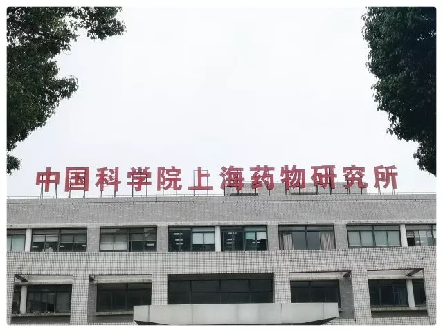

本文共计2035个字

少量魔都测评

2018.05.25

D3096

武汉—上海虹桥

周五下午到上海虹桥 行李不放地径直去了中科院上海药物所  药物所的老师接待了我们几个后 便开始就所里的人才队伍和主要成果进行介绍  第二天在上海有机所 也是听报告进实验室  其实比较官方的东西 大家都能查得到  导儿说这次又是我来写通讯 所以搬个电脑做到旁边写写记记

每一次提到所里人才队伍时 都不免讲起自己这有多少多少的院士 多少多少的杰青 青千  各种科技奖的获得者 发了多少的论文 占比多少  我蛮惊讶于做报告的研究员们的一点是 他们所有人都可以从最大化的角度解读本研究室的论文产量 无论把自己科室放到大所里同比全国 还是在小方向里把自己的发展路线和态势找出来 总能找到最自己欣赏自己的那一点

事实上 这些放到像我这样的参观学生看来 对于其中端倪和具体操作难度 只是出于平平的水平  现在自己手上一篇sci也没有出去过 充其量就是 比那些看懵懵懂懂热闹的外行人 多看过几次热闹罢了 并没有多少切身的感受

盐酸安妥沙星 是上海药物所研制出来的一种临床上主要适用于敏感细菌所引起的轻度和中度感染  说它有多大多大的意义 其实于个人而言 都是很抽象的  报告老师介绍说 有一天 研发盐酸安妥沙星的研究员 因为自己体内有炎症而到药店去买药  ta一开始说了一种药的名字 导购医生听闻后随即告诉ta 现在有一个叫盐酸安妥沙星片的药新近上市了 对你这个症状特别好 研究员听了之后 在药店里感动得眼泪都要落下来了  这就很有很强的代入感嘛  一个药物研发科学家 在药店里买到自己研制出的药 医好了自己  能这样应用到实际的 大家用得起的药  谁说这不是一种人生成功呢

甚而有说  外省的一个中学 在上世纪九十年代的时候 因为食堂操作不当 导致全校近千人出现了不同程度的铅中毒  联系全国制药企业时 上海有机所的新药研究室研究员和药企总工程师 紧急带着药物乘专机驰援当地中学 现场监测能为师生排忧解难的新药疗效  危机过去后 全校师生振作过来 夹道欢迎研究员和工程师到校内作客  谁说这不是一种荣誉 一种真正用自己的所学所知 因急救而通过病人实现的自我完成呢

真正在中科院里  有些这次我亲眼见到了的科学研究员 是真的眼神中 带有光芒的吧 对自己所学的知识 对自己所做出的东西有自信 对国家乃至世界未来因科技而变化的希冀 都承载在了这样的目光 以及致报告的时候不由自主地声调中像带着一首歌的那种感觉

后来已毕业的校友/院友 在所里做硕博的那些 也来同我们说着自己的现状  以前听说的是 进中科院的所里 虽然一些补贴什么的会要比在国内高校里做硕博的时候补贴要多一些 但貌似都是在 拼着老肝在像要不脱一两层皮不罢休地去做科研 我于是实在地问他们 是不是在所里的研究压力很大 对曰 海星  peer pressure 老板的push even force 倒没有一个特别说的标准要多少影响因子的文章多少篇 但大家都还在努力地做着  节假这些的基本和国家安排同步 平常的作息也还比较健康  当时我听到这些问题的答案时  我是有点点动摇之前对中科院各大研究所的刻板印象的

出于在中文/新闻方向培养起了一些自己对事观察时候的敏感 我感觉事情里是有些不对劲的  这个不对劲 主要是在所里的运动设施  我是个排球爱好者 但我在所里看到唯一的一个篮球运动场地时 我能很自然地感觉得到 这个场地上 没有多少人在这打过球  球场上 因为 用得多的磨化破损 和用得少的风蚀日刻 其效果是不一样的 所里显然是后者

我问学长学姐们 你们一般怎么运动啊 学长说 楼下有一个羽毛球室 所外也好像有一两个健身房 听说所里当天去打也没关系  我明明白白地见着羽毛球室里只有一个羽毛球场 一个所里的研究员和研究员带的学生也将近千人  说还占用率那么低 我是有些疑惑的

学长又说 从这里骑自行车到外滩 也不会超过二十分钟 也有一部分人是在那里夜跑  但凡自己做过运动的都知道 如果不是特别的私教或者一个小组织在催着 在时间被安排得明明白白的时候 是很难坚持下去的 更别提还要花一些气力起到外滩再跑步再骑回来  我问师兄师姐的运动频率 基本上 就是没有  这样一来 平常的工作课业压力有多少 也可以从一个小的角度窥探出来了

白天的科研找寻 并不会限制晚上出发感受魔都其城的步伐  两天分别和现在的同学还有高中的老朋友一起出去 上次来魔都的就心水的蟹黄面 这次出发前说一定要找到  走下楼梯 穿过街道 翻过小巷 阿鑫面馆 网评说这家的蟹黄面很贵 很贵 贵到168一碗

但是 蟹黄面 一碗里面是真的有六只香蟹的蟹黄 被切开后放在香油锅里秘法炮制后 浇在上海当地的轻碱小面上

夹起面里码着的蟹黄 在唇齿间感受细碎的蟹黄小籽摩挲而过  从口腔轻轻吸入一口上海新雨后的湿热空气 闭上嘴 从空气经口腔由鼻腔而出 闻到内外 满是香蟹蟹黄蒸炒熟透后 好像自己在咸咸的大海里徜徉 味蕾欢腾起来的喧闹

面条滑过碗底里蟹黄蒸炒出的清油 偷偷在消化道的粘膜表面飞驰 人类的口腹 怎么能不臣服在这样的食物面前

早上原定八点钟在中科院集合进行参观 为了赶到时间 于是我六点多起床 六点半出宾馆搭滴滴去同样在本帮风评中独占鳌头的春园点心店吃早餐

说到的这道是 荠菜鲈鱼 剔骨后的鲈鱼和早上新采摘的荠菜炖出清新心脾的清香 裹在从滚烫的锅中捞出的面条上 我拎起醋壶把香醋点入

整碗下来就像是在张爱玲笔下的白公馆隔壁 斜一条椅子坐在小洋房里 听着老上海人的吴侬软语油长酱短

拾起承着荠菜鲈鱼汤汁的宽底勺 我不知道这一勺里 是不是就是黄埔江涌的春秋

一座城和一座城的书店 我想魔都的最后 也和苏州武汉大连一样 适宜用猫的天空之城来做下小结

（其实就是写饿了你可别说了吧）

2018.05.27

G676

上海虹桥—武汉

（啊忘了喜茶-玉露皇后）

-END-

[-留下尬走的足迹||上海-](http://mp.weixin.qq.com/s?__biz=MzUzNjE3NzA3Mg==&mid=2247483809&idx=1&sn=74225fdbbdf6b66b605c282ea31038f7&chksm=fafb717ecd8cf8685b6a3e2a792253fa9c0ee22fa4f054eab8f38daf2cb220122741dfb506fa&scene=21#wechat_redirect)

[-留下尬走的足迹||香港-](http://mp.weixin.qq.com/s?__biz=MzUzNjE3NzA3Mg==&mid=2247483911&idx=1&sn=d03f50934536437929624ba6a7720095&chksm=fafb72d8cd8cfbce8f0ab19ffc52e5af4d9615ee616a247245c72c783d82c48142e2d74257dc&scene=21#wechat_redirect)

[-留下尬走的足迹||苏州-](http://mp.weixin.qq.com/s?__biz=MzUzNjE3NzA3Mg==&mid=2247483790&idx=1&sn=bab161c9ec342966da763c03c95d8f53&chksm=fafb7151cd8cf8476e48f3cb754c6aa22ef3a0520fca256988e2e461ef108d502422829da9f2&scene=21#wechat_redirect)

[-留下尬走的足迹||杭州-](http://mp.weixin.qq.com/s?__biz=MzUzNjE3NzA3Mg==&mid=2247483765&idx=1&sn=d4a84f483424470357f69e566f2ef118&chksm=fafb71aacd8cf8bc54453a58adec40a9a7ae6d6c4489c8fe0dfb0ecfd08b28a7ea1f15e45fdb&scene=21#wechat_redirect)

[-留下尬走的足迹||大连-](http://mp.weixin.qq.com/s?__biz=MzUzNjE3NzA3Mg==&mid=2247483833&idx=1&sn=962495d09a27d3d3a8993524d4134ce4&chksm=fafb7166cd8cf8708def007b372b850e9a4a856d6264c3525b6c01cb618edd29994651fd6fd1&scene=21#wechat_redirect)

文不加点的张衔瑜

懒得打标点的张衔瑜在日常尬文 2333333
