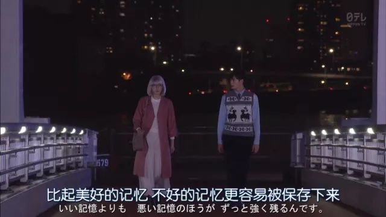

本文共计2009个字

他人写的文串场

辽阔的波罗的海懒洋洋地舔着沙滩，直到夹在白色灯塔和有航标的防浪堤之间的入港航道为止，一路上不见人影。

昨天下的一场雨，在沙土上留下了规则的印痕； 踩掉他们，换上自己的脚印，真是件开心事。 妈妈和我都脱掉了鞋袜在沙上走着。马策拉特拣起银币大小的转头碎片，轻轻撇出去，让它贴着绿色睡眠接二连三地跳跃，想逞一逞能。扬·布朗斯基手法不灵巧，在扔砖头片的间歇中，寻找琥珀，而且也真的找到了一些小碎片，其中一块，有樱桃核那样大小，便拿来送给了我妈妈。

这时，妈妈正同我一样，光着脚在奔跑，她时不时回头看看，像是爱上了自己的脚印。太阳谨小慎微地照射着。阴凉，无风，清爽；遥望无边，可见一条灰带，那是赫拉半岛。还有两三道逐渐消失的黑烟以及时而跃出地平线的一艘商船的上层建筑。

初次看到这一段 会有什么样的感觉呢  崖石 从一堆蓬蓬的乱草之间跳到另一块崖石上 背包里背着个大家伙儿 没走几步路 背上总要感觉感觉被硌着的意味

本来心情很不好 写下这个题目找到这一段的时候 是想拎个教人很不舒服的杠精来小小地解构一下杠精那些让人火大的言辞 不过打完这一段 心情也变得舒缓了起来

中午在实验室趴着睡觉醒来 说实话我有些不记得我在休息室吃完午餐后 是怎么走出去扔的厨余垃圾  只是记得鼻子有些不舒服 然后用了几张纸 接着趴在桌上 左手换右手 便睡着了去

看了一篇讲国人缺乏常识的文章 有些医学上 明明确确定义为过敏性的事情 却被认为是矫情和娇气 最难受的大概是生在北方却对面粉过敏的同学 从小因为多面食菜系而被强扭着吃面食 但是自身的的确确对面粉有过敏 于是不断地过敏 脱敏 过敏 脱敏  而但凡有一点点反应 一点点的异常症状 便会被给予以矫情娇气的定性

不是只有对青霉素 锈蚀金属 这些看上去像是经过了一些没有相关知识的人难以理解中间过程最后得到的产品过敏了 才叫做是过敏  花粉 家养宠物身上的东西 这些都是过敏 个人的体质和意念没有什么必然联系 正如需要用自残和自刎来证明的事情 人们会来怎么认识呢

只有发生了才知道要去防范 其实是一种畸形的侥幸心理在作祟 只有醉汉把整家商铺都打砸抢烧了 才允许有警方去强制控制  只有吃东西吃到真的吐出来了 才认识到真的不适合吃这样东西  只有抑郁症患者真的开始用恶狠狠地眼神盯得人不寒而栗了 才想到为什么不早去防治  只有真的侵害发生到不可挽回的地步了 禽兽才会或者说有更多的机会伏法

上面说的这四个是根据真实事件提炼的 第一个是最近的重判大连袭警  第二个是一个朋友头一次去未婚妻的家里 对凤头过敏但未来的岳丈夹来了一个刚刚煲出来的 最后很是狼狈  最后一个是说中山大学社人院以及再往前北大等几个地方发生的侵害  扁鹊家三个医生 从医未病 到医小病 以及医重病  但凡有一线生机 拖延症患者就会把幻想放到最后一刻

常识 是在最后这个侵害的事件曝光的时候 教人去勇敢的使用道义和法律赋予自己的权利去合理合法地捍卫自己 而不是学着些饶舌长舌的地痞 为人不仁 视礼不礼

所以我不能吃莴笋叶 是吃了真实地想吐  至于皮蛋葱蒜和甲鱼 如果看到我在吃这些 那一定是遭遇了不能自己主宰自己的事情吧

前天看到了药学朋友的一篇文章 讲到在 我不是药神 这部电影中 反映到制药人眼中有了哪些不一样的地方  具体的细节还请移步这一篇 [苏格兰的黑山羊](https://mp.weixin.qq.com/s?__biz=MzU1MzUwMTEwNQ==&mid=2247484129&idx=1&sn=1271e7f4762b7201fdf1fd62133c0889&scene=21#wechat_redirect) 下一个链接在文末传送门  全文都很棒 highly recommand

文中还有一个我觉得我也有点点被带了节奏的  记得说崔永元和范冰冰引爆微博的同时 院士大会在北京召开  两件事情在一起 又引得一些人 说这个时代不该向流量致敬 而应该向这些基石致敬 这句话本身没有错 但就像 我们的最终目标是实现共产主义 但目前还在为全面建成小康社会而奋斗 一样 有些人口口声声在什么时候就该做什么事 现在却完全忘了

科学和科普 一直或者说很长时间都只会是属于非大众的范畴 被很小的一部分人完完全全地视作自己的一切  而对于大众来说 端起碗吃肉 放下筷子“哔---” 是沉浸在已经过去了很久很久了的事或者说误解当中

最简单的 去年还在一些小聚会上听到有人生导师在听说别人家小孩铅超标了 于是疯狂说小孩子肯定是把铅笔放进嘴里吃多了 或者附近哪里又有个什么厂子有了新东西 所以铅超标  这和以貌取人没有差别 铅笔不含铅 铅笔里面脱落的那一块块 都是石墨 石墨是碳 咬铅笔最怕的危害是铅笔外表的那些有颜色的涂料 至于铅超标 检验饮用水或者控制爆米花的摄入量才比较像找到了稍微合理一点的方向  至于我联想到了多年以前日本福岛核电站爆炸了之后国人不顾实际海陆风向地疯抢生活必需品 和那个时代选择留站工作的日本科学家

如果所有人都开始像基石致敬 不再大众化 其实和现在的breast entertainment所起到的作用一样  矫枉过正  学了思修马原毛概这些课 除了拿到学分之外 最大的好处就是可以在无病呻吟的时候 比较正常地来看待一些事情 多样化和分工 以及行业内的自己吃行业内的“哔——” 是在当前社会和历史阶段的时候 能够被理解的存在

存在即合理 这个合理是现象出现的时候 其出现的过程是可以被理解的 这个发生是合理的 但并不是说这件事就合理 这件事就多么有意义

看到最上面那段话的无病呻吟就这么多  隔岸观火 作壁上观

希望身陷某一行业或者是在了哪一个特殊时期的时候 还能够像现在这样好好地看待周遭  而不是人云亦云 或者无端地去对他人在特定情境下的举止指指点点  更加不要生气 不要生气 生气是给魔鬼留余地

文章最早的那一段话出自 铁皮鼓 定居西柏林的德国作家君特·格拉斯 用黑色幽默展现了德国黑暗历史 算作流浪汉文学 被文学评论者认为是世界反法西斯文学经典 多辛辣讽刺  1999年格拉斯被授予诺贝尔文学奖  我也还没有太看明白这本书 书评且往后慢慢放一放

-END-

[-苏格兰的黑山羊-](https://mp.weixin.qq.com/s?__biz=MzU1MzUwMTEwNQ==&mid=2247484129&idx=1&sn=1271e7f4762b7201fdf1fd62133c0889&scene=21#wechat_redirect)

[-科研二三事-](http://mp.weixin.qq.com/s?__biz=MzUzNjE3NzA3Mg==&mid=2247484290&idx=1&sn=198347db11a3a0879553b589d69c0e6e&chksm=fafb735dcd8cfa4bd55ef8feefa4bc7bd68e615db3f97c5dddcc545ffa9319e0baf0247436d9&scene=21#wechat_redirect)

[-只是尽可能的简单 却不再简化-](http://mp.weixin.qq.com/s?__biz=MzUzNjE3NzA3Mg==&mid=2247484253&idx=1&sn=a34e4728c9028d275ccdfc86208e3bf7&chksm=fafb7382cd8cfa940ddc1bb01aaab61f4850a966731eaa212817705c440b80a8d6fe2d43086b&scene=21#wechat_redirect)

文不加点的张衔瑜

懒得打标点的张衔瑜在日常尬文 2333333
