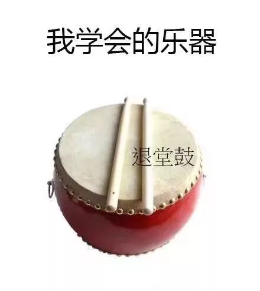
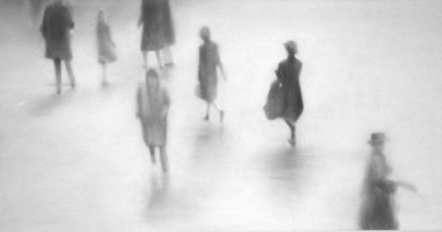
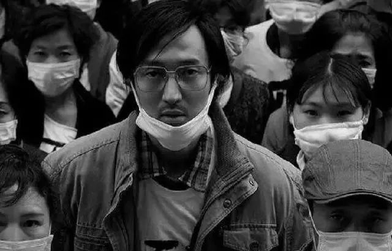

本文共计3167个字

少量文也加点

影片的内容我就不加赘述了  是部很好的片子 人物刻画没有槽点 大家都在自己的角色上发展得有血有肉 整幕看起来是 有逻辑地 在人物环境情节相碰撞  主题相关的是医药问题 言国人治不起病时的自救 和在此时一位代购人的内心

我上周四到的帝都 电影该是在上周一二的时候去的  看电影之前很久 我早早地确定了要 去到天朝最好的科研院所实习 这个最好就不用加之一了  有师兄先我一步到了那儿 但由于集群 虽说是对方帮我们解决了住宿问题 但其实有着很多的限制和不适应 师兄发我了照片 教我先行给我个准备 说是没有空调 洗漱间在寝室外边而同层楼既住着男生又住着女生

本人 张衔瑜 中央音乐学院打击乐系首席退堂鼓教授 国家一级退堂鼓表演演员 看药神之前我们三个在武汉科研的小伙伴一起去吃饭 当时我就和他们说我已经不知道该如何是好了  进 可能在那边诸多不适应  退 是对选派我过去的很多力量的不尊重  内心已经生无可恋 去自然是会要定位自己的学习 但很明显报不了太多希望 委屈巴巴

到了帝都之后 看到真实的情况 着实更令我吃惊  不光是环境 还有我自己生理上对此的反应  上次遇到这样的情况 是去的大连 也是天朝最好的科研机构的分院  具体可以移步 [留下尬走的足迹||大连](http://mp.weixin.qq.com/s?__biz=MzUzNjE3NzA3Mg==&mid=2247483833&idx=1&sn=962495d09a27d3d3a8993524d4134ce4&chksm=fafb7166cd8cf8708def007b372b850e9a4a856d6264c3525b6c01cb618edd29994651fd6fd1&scene=21#wechat_redirect) 那么到底是什么样子呢  由于保密事项 这边拍照都是受到了限制 但是写一写该是问题不大  以下是我对原校提交的笔记原文摘取

只有一条进出通道，是楼墙外边的铁质楼梯。

初到的时候寝室里 气味很重，闻得出来是新装的柜子/地板 （隔壁的说地板是为了盖住一些不好的东西），然后没有空调和洗衣机（公用的也没有）。另外这一层楼男生和女生都有，寝室里边是没有洗漱间的。卫生间和浴室分开了。寝室两张上下床，现在就我和另一位师兄睡了两张下床。过会儿还会再来人。只有一个床垫，我的空调被和床单都还没有到，当天也挺晚的了，就拿着裤子包着一本书当枕头睡在床垫上。 第二天早上出门洗漱的时候，顶着一头乱乱的头发出去看到一个女生过来，可能大家都有点尴尬吧。

催过了相关老师之后，昨天下午五点多有几个师傅拿了一台古旧的空调来装。我七点多从Tsinghua回来的时候， 床垫上有几个脚印， 大概是师傅留下的。打开空调想作为排气的换气扇一样，开着纱窗地排一下寝室里的气味，不一会儿寝室就 停电了 。打电话找物业过来，说是没有电费了，物业会到了下周去充好电费再过来。于是我洗过澡之后，昨晚就睡在了lab。

因为查过了five道口附近的住宿，大概是 评价一般、还漫天要价 。即便我是生长在长沙、在武汉读书，都是中部地区的省会城市，也觉得这附近的房价高的离谱。汉庭这些标注经济型的酒店，也达到400+/day。在各种我平常出游的点评网站和软件上的评分和晒图也大多不佳。好比吃惯了三块钱大饼的人，就算手上有钱，但是要自己掏300去吃一顿也会觉得忸怩不安。家里看我来北京，也准备了比平常多的生活费给我，可平常已经形成了节俭的习惯，更别提在这边还要住上不长不短的些时间了。

写到的倒是这样  真实的是我 但凡在那里边睡觉 就必定会从噩梦中惊醒 已经多少次了  在lab里倒是 匐在桌子上 压迫强直脊柱 撑不下去了的时候 方才回去躺一会儿  但只要一回去 也许是闻着新装的味道 便也就开始噩梦频传  partly比没有休息的时候还要累 只是因为实在是要躺一会儿 才如是做了  大概也是因此 食欲下降 到我写的时候 最近五天也就吃了五餐 甚至没有怎么想出去玩或者找同学这样  既没有时间也没有力气

放到之前 早就是很闹心的了  放在现在 也是一样的闹心  我现在留在这里 和当时看电影前后的反复相同  恰是在看药神之前的忸怩 使我在一边看的时候就一边在心里边默念 I am a scientist. 我是一名科学家。 当然只是YY 一个本科生怎么就自诩科学家 可默念的时候 是发现到了不能对自己就这样

有的影片之所以迷人 在于片中实现了对人物性格或者思想的可理解转变  我很心水的一部电影 是《辛德勒的名单》 到帝都的当天 下高铁时便一直在听

不光是配乐经典 而还有人物在变化  辛德勒本是纳粹党人 纯属出于利益地想办个工厂发点战争财 就连加入纳粹党也是为了这个原因  但是 是在多次看到了纳粹党人如何在对待这些犹太人 自己的秘书？管家？经理？会计？在想方设法为犹太人求得一分生存的时候 内心有些东西被唤醒了 辛德勒由是列出了长长的名单 向管辖军官赎买犹太人以作为自己所谓“工厂”的工人 而事实上 是为这些人提供的避难所

至于辛德勒是如何从富态便便 到后来悔恨自己为什么还有车为什么还有这些衣服而自己如果少挥霍一点是不是就可以再救下一个  由是引出那句希伯来文 凡救一命，即救全世界

药神中也是这样  油腻的男主从一个卖印度神油保健品的 到因为实在没钱供养上一辈同时和妻子决裂 只得走上跨国贩药的路子 他是个救世主吗 不 他一开始只是想赚钱 阴差阳错地 自己贩药终究逃不过本土贩药势力的打压 出于怕被监管的  所以男主拿着钱金盆洗手 干起了别的

可当曾经的合伙人 因这个药对症的慢粒白血病而上吊自杀来减轻家里的负担 一直到看到其他即将因为要生存要活着而走投无路的病人 于是出于对人的不安 宁可自己亏钱也要把药送到病人手上 被捕后 囚车一路 皆是送行人 慢粒白血病人须得尽量不暴露在有菌环境当中 而在场的所有人 都摘下了口罩

我知道新药开发要走多么远的路 也知道在之中有多少艰难险阻 全合成的路上 两年时间做出一条完整的路线都是既要人勤奋又要天眷顾的了 前仆后继的科研工作者日夜不停 就为了能做出一点他们自己能认可的真正行之有效的化合物

这些药物前期既是最聪明的大脑们在滴着心血浇灌出来 再得经过一系列严格严苛的临床药检才能到病人那里 科研人该得为此买单吗 不 科研人根本没工夫在意自己要不要买单 买也好不买也罢 自己已经走到下一个前沿去了 到底后来怎么样 该怎么调控价格回馈或者对哪个地方封锁 科研工作者考虑不了也考虑不好 as a scientist 使命就是不断地前进 不断地开拓 才能提供更大的回旋弹性给下游

我看药神并不觉得他们真的有多少做错了 这大概是生产力限域了的时间段上 合理 也就是可以被理解的情况  那么 落到我自己 我怎么办呢  便是我那句默念的话 I am a scientist. 我是一名科学家。 我要做的 虽然不一定是全合成有机物和制药工程  但是 科学 尤其是基础科学 自是从最根本上解决所有社会问题的办法  想通了这个 再知道自己要做的事情是什么 前文提到的许多在这边的不适应和难受 也就因为另一项事业而要退让

我还是和之前一样  对生活质量的要求很高 想要有干净整洁的环境 睡觉的时候周围不能有异味 不能有强光照射 不能有人总在吵吵嚷嚷  想要能及时洗漱 衣裤这些也要尽量保持整洁不能给人以不愉悦的体验  想要把生活整理得当 吃一点物美价廉而又有时候稍稍奖励一下自己

我依旧没有什么太高的追求或者不切实际的虚无斗志 只是知道自己在做的事情很有用 或者终有一天会有用 是提升了我自己或者怎么的 能够通过我或者我做的事来给这项属于小部分但是落到所有人的事业添砖加瓦  有了这些也就够了 这些事情必然是值得的

我慢慢地理解了那些上世纪报告文学中 提到的科学前辈们为什么能在那么艰苦的环境下继续科研  他们见到的荣华富贵很少吗 他们想获得荣华富贵还不简单吗 那为什么不牺牲哪怕一点点时间去很轻易地就换取一些取之即来的幸福呢 大概是因为有其他更重要的事情在催促着自己 根本腾不开手分不了心也不想去做别的 而应该继续自己走下去 可惜的是久而久之自己也就习惯了这副模样 别人也以为科研工作者就该是这副模样 反而把这当成了常态并且大肆宣扬  同时 科研工作者也并不腾出时间分出手 来打碎这些走偏的方向 如是循环

热闹 最后是大家的  自己 有多少算多少 仁心妙手普终身 徒留人间万古名 这是影片中 人们送给“救治”了白血病病患的主角 一面写着结局的锦旗

影片结束时或会有人怀念他 但接男主出狱的 只有和他相爱相杀的警察小舅子一个人  我不想去分析如果有曾经被他“救治”过的病人或者病人家属如果经常来探监的话是不是能够知道他什么时候出狱并来接一接他  终了不是谁所能掌控的 甚至过程中都不能  inner peace 算是唯独仅有的部分 是自己能拿到的

好一似食尽鸟投林 落了片白茫茫大地真干净  期年以后 是缘是情是童真 还是意外  不知道 也不必太在意  还是把精力集中好 在保护好自己的前提下尽可能地多做一些有意义的事情吧

顺便提一下前天获批了一个国内自主研发的抗艾滋新药 实现了我国抗艾药物的零突破  外壳写着 注射用艾博卫泰

-END-

[-无病呻吟-](http://mp.weixin.qq.com/s?__biz=MzUzNjE3NzA3Mg==&mid=2247484450&idx=1&sn=271530acd949e61598f16b8c004b17b7&chksm=fafb74fdcd8cfdeb6a5491f015ec97f8dde97f2a4f8edea37858d38e3c5cfef7af09ba6e3754&scene=21#wechat_redirect)

[-留下尬走的足迹||大连-](http://mp.weixin.qq.com/s?__biz=MzUzNjE3NzA3Mg==&mid=2247483833&idx=1&sn=962495d09a27d3d3a8993524d4134ce4&chksm=fafb7166cd8cf8708def007b372b850e9a4a856d6264c3525b6c01cb618edd29994651fd6fd1&scene=21#wechat_redirect)

[-如果你愿意一层一层地剥开这层茧-](http://mp.weixin.qq.com/s?__biz=MzUzNjE3NzA3Mg==&mid=2247484321&idx=1&sn=f20b311192930c2c2520d166fd130767&chksm=fafb737ecd8cfa6846619c0b13a64db47b53ff07656f70d27fe33e24e7d927fd718c8f3f454f&scene=21#wechat_redirect)

[-科研二三事-](http://mp.weixin.qq.com/s?__biz=MzUzNjE3NzA3Mg==&mid=2247484290&idx=1&sn=198347db11a3a0879553b589d69c0e6e&chksm=fafb735dcd8cfa4bd55ef8feefa4bc7bd68e615db3f97c5dddcc545ffa9319e0baf0247436d9&scene=21#wechat_redirect)

[-只是尽可能的简单 却不再简化-](http://mp.weixin.qq.com/s?__biz=MzUzNjE3NzA3Mg==&mid=2247484253&idx=1&sn=a34e4728c9028d275ccdfc86208e3bf7&chksm=fafb7382cd8cfa940ddc1bb01aaab61f4850a966731eaa212817705c440b80a8d6fe2d43086b&scene=21#wechat_redirect)

文不加点的张衔瑜

懒得打标点的张衔瑜在日常尬文 2333333
