本文共计3784个字

拖稿就是我

天子皇城 龙袖骄民

也许是以前看过的影视作品和文学作品如是对帝都予以描述 是故在提起这座城市的时候我首先想到了的是这两个词语  好在实地重又去到了北京 虽然并不全然以尬走旅游为目的 但也多少体味了在之中的城市氛围

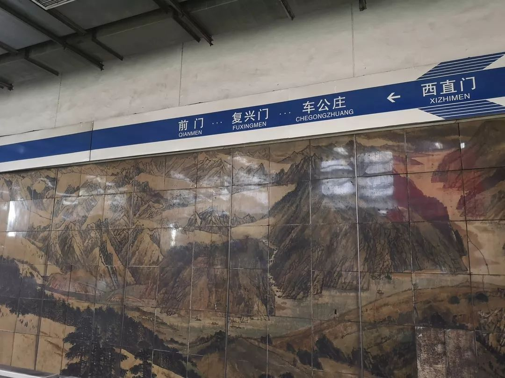

正如我之前一篇糅杂一部半电影影评 [-我在北京 因为药神多走了两步-](http://mp.weixin.qq.com/s?__biz=MzUzNjE3NzA3Mg==&mid=2247484463&idx=1&sn=26f02e578de44fd5803481060792fb22&chksm=fafb74f0cd8cfde6d340e13e53082d0877decd84d2213d2a6e5cd4b2b9394788a91d3fb70106&scene=21#wechat_redirect) 中所写道的那样  这次去北京是去实习的 actually 重心也就不主要在寻吃找玩上边  除却一次去南锣鼓巷 其余时间都在宇宙中心五道口 北四环的宝福寺附近

实习挺不错的 昨晚自己打腹稿订近期计划之后 重又进入了科研的状态

纯白色外景的小楼 我从其中外延出的门筒拾级而上  电梯里的有高强度照明 我到了三楼 左转 走过一排落到膝盖那么高玻璃窗的房间 继而走到走廊尽头右数的第二间 目力所及有流水纹实木质金丝楠木纹理

推门进入 两三个人高的花梨木书架落在大曲率圆弧形走廊上  取书的梯子耷拉在书架旁 约莫是时常有人来取用的才是  这架子层高不小 自然地 也是为了外硬壳装帧内精装详校的书能稳稳妥妥地放好  我随意抽下一本去 the essence of impressionism 秋香 从内容到质感  自抽下书的间隙朝外望 果然可以看到弧线对角过去的另一个拐抹

没有想到的是我现在所踏踩着的三楼地板 只是这之中的一个隔断  真正的书架从一楼开始向上生长 只不知道真正的高度几何 又是什么样的人以何种方式缔造的这般可以生长的树屋书店

不好意思 自己某一天做的梦 乱入了一下

实习的几天 大多在实验室周边  在实习生而言多少有些相悖的是  如果将这看作为一个合同契约关系 实习生对单位所起到的作用可以说是微乎其微 从能力到资历 都很难为单位作出实质性贡献  譬如我在科研单位 我能为实验室检索文献 还是能为实验室去扫核磁  我能为实验室去调整后勤之类的外部关系 还是能在实验室小组内部活跃气氛  大多数时候不能说无能为力 而是能实实在在做的事情实在是太少

不做事情是不可能的 这关系到自己和自己所代表的原单位的行事风格  等到快差不多知道怎么做了的时候 已经是将要离开的人了  再者 实验室负担一个实习生 担心安全问题 也担心在这边接受的教育和考验之类的在其原单位又是否受用 这关系到实习单位在原单位的风评  能负担的 都是真爱了吧

就这样 我依旧睡在实验室里  每天晚上 在最后一个人离开实验室之后 稍许工作便铺开瑜伽垫睡下  从椅背上取下唯一带的一件长袖卫衣盖在身上  只是翻不得身 以及 也不能把手放的太远  因为手肘会落到地上 有点点凉  就这么自己想想小事 睡不着了就起来接着工作或者写写日记 问人聊聊天尔后接着睡下  早晨不到五点天就亮了 老师是来得最早的 有两次都是不到七点就坐在了办公室里  我须得赶在来得最早的师兄/师姐到来之前收好瑜伽垫 打开窗户和门透过气 尔后重新关好门窗开空调 get to work

这个有点叫人揪心 所以没有图

多一点的时候就和师兄插科打诨 商量着点哪家的外卖 哪里的送餐员比较无聊  一个人食吉野家my little airport 去汉堡王但是只吃新注册会员的免费大薯 到对门小广场吃不好吃的红烧肉 以及早上在小巷子里买喝起来有一股铁锈味的豆浆 并没有多少要去吃的想法 只待在实验室 想尽可能多做一点事

真的是很有魔力的地方  我原以为那种自己家砸锅卖铁也要反过来补贴国家进行科学研究建设 这样的事情只有在上世纪的报告文学中才会存在 克己奉公 这样的精神竟也感觉到了 而且不止在一个人身上  我没有说他们一定已经这么做了 毕竟现在单位的资金多寡与个人的资金盈亏实在是不成比例 但我很明显地感觉到了这些人能扑倒科研当中的精神  也许这算是一种 难以向外人言明的纯粹直觉 或者是同类者的相互发现

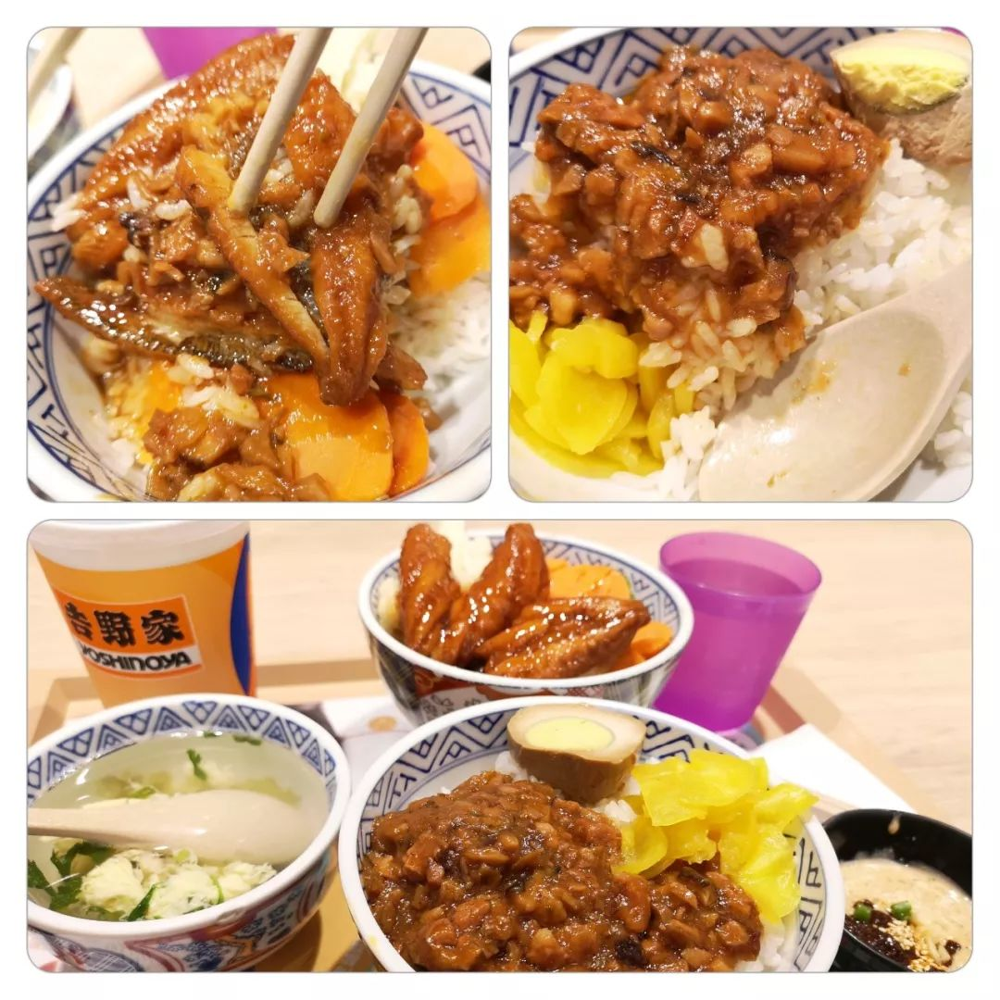

去了一次清华

原校的学长带着我从南门进去  在清芬园简餐后 一路到了学长的寝室和紫荆  走过明斋blah几个社科院还有化学馆的时候 蓦地想起自己高一过后的暑假在清华园 也是从这条路进来的

跟着学长去了李文正图书馆 如果要学习 在这样的地方 很自然的有对知识的憧憬和渴求 厚重的桌椅 说是清华毕业生们捐赠母校的  我走到老馆 悄无声息的楼道里但并不显得空洞  暗色的内景中 一排排的迎春花藤蔓从廊芜上倾泻下来  遮蔽在绿色掩映后的棕黄色方桌不受外界的扰拂

约莫两个人高的书架 却还只到这层楼层高一半不到的地方  我不大知道怎样描述那样的窗户 下边是长方形的窗框 齐中的恰好到书架顶部  上边是半圆形窗棂 直径约合长方形的宽  素白色窗帘在侧 和古朴色的厚重书本搭衬  我于是问学长“ 这个馆里的老书可以外借吗？ ”  学长给了我一个肯定的答复 这里约莫是实实在在有这么多的藏书量 所以不必和基科那样老书和外文书都藏的严严实实的 外借还要走很多程序 麻烦的很

荷塘里正是花骨朵含苞的时候 想想读朱自清的文章是从《匆匆》开始的 我不知道他们给了我多少日子，但我的手确乎是渐渐空虚了。在默默里算着，八千多日子已经从我手中溜去，像针尖上一滴水滴在大海里，我的日子滴在时间的流里，没有声音，也没有影子。 就突然笑了出来 从上面所说的缘由到笑了 中间跳跃了几次  想法总是千奇百怪的 有时候吓到自己也很正常

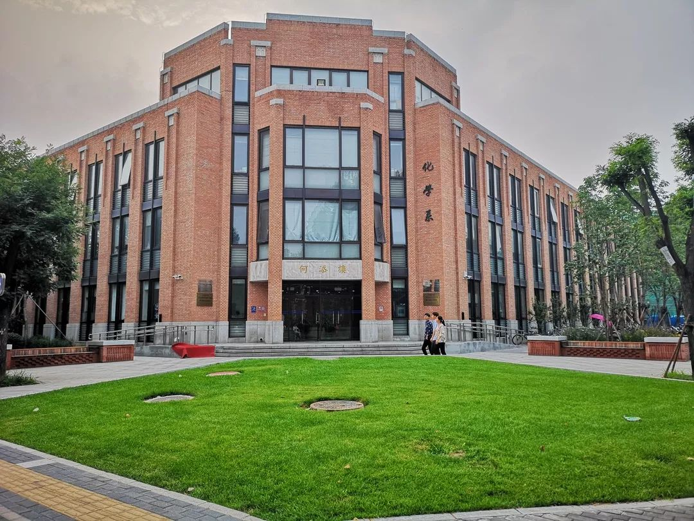

过会儿和一个毕业多年的北航学长在老校区闲逛

一栋主楼携四个副楼 很明显的苏式建筑风格 包括了墙上的雕饰纹样和风雨桥的设计  也许年岁与日驰去的一些传统想法还存在于我的观念中 靠年功的增长仍然是不可或缺的财富  简单来说 就是一个大学的文化 或者往大了说的关怀 还有很多在大学楼房墙壁上的爬山虎里边

叶圣陶描写说

它们一顺儿朝下，均匀地铺在墙上，没有重叠，也不留一点儿空隙。一阵风拂过，一墙的叶子就漾起波纹，好看得很。

算是真的很棒的体验了

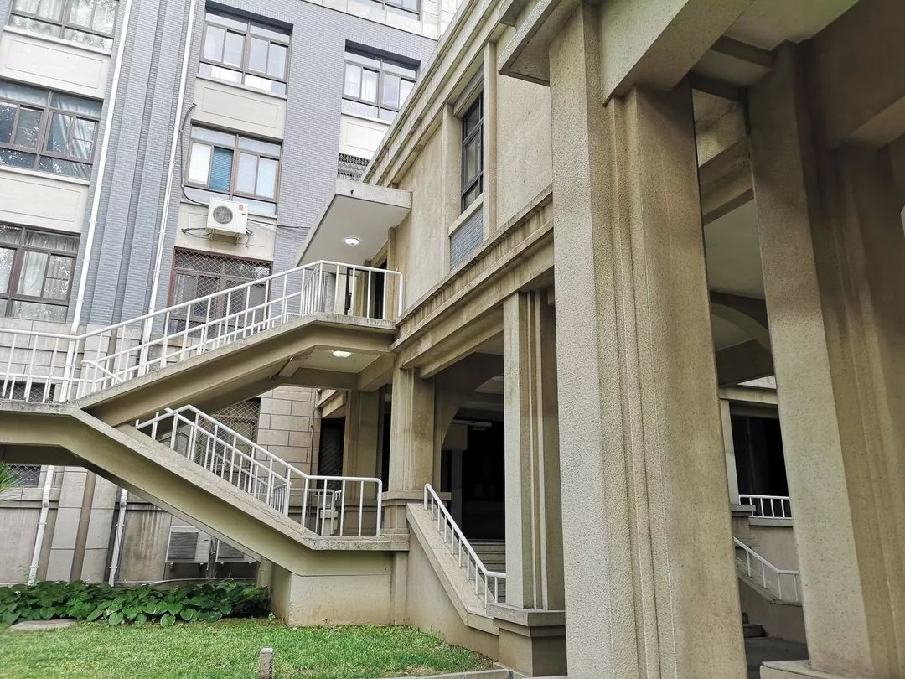

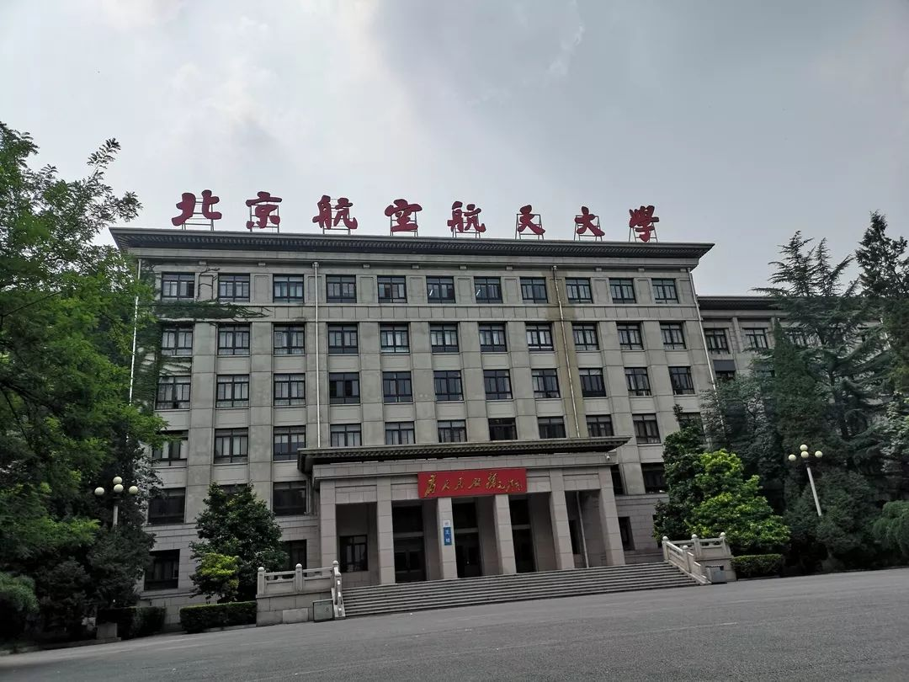

唯一一次从五道口出去 是with硬核朝阳boy去南锣鼓巷游走  正街上和我在国内走过的许些古街or仿古街并无大异

我知道这样的主街早就沦陷成了各大商牌斗法的地方 远不是我想走过的老街  走过中央戏剧学院后 旋即拐进了胡同里

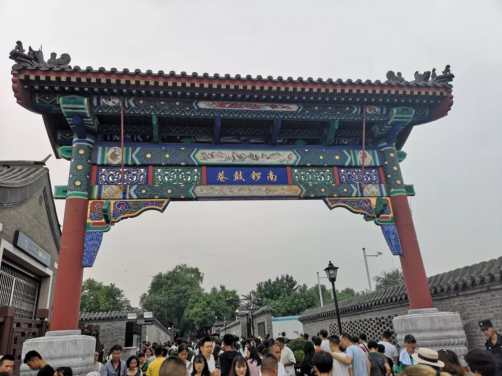

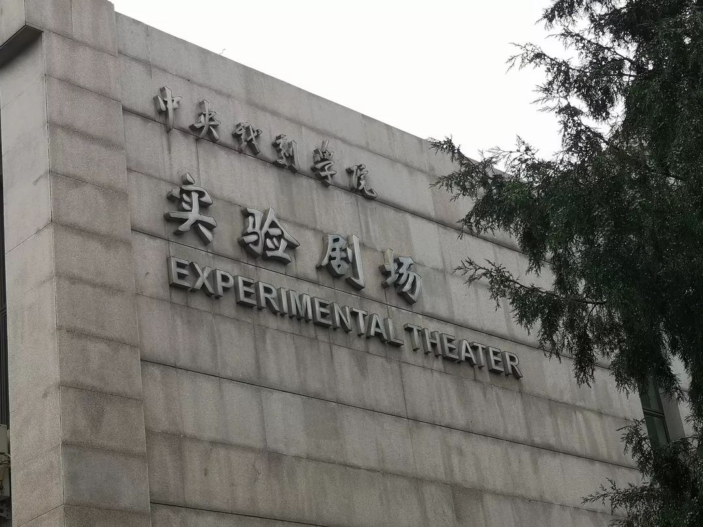

对胡同的印象 不过是中学闲暇的时候读过 林海音的《城南旧事》 新帘子胡同 往来的骆驼队 甚至是那一首骊歌  拐进帽儿胡同 世界顿时从南锣鼓巷的繁芜喧闹变得寂静下来 背后响起一阵自行车车铃声 骑着二八单车的男子从我和朋友旁边过去  如若不是周遭的车辆还新 我会以为进个胡同的功夫时光倒流五十年

在这边总能触发一些好久没有想起来过的古文概念 什么是坊 为什么要叫闾 查了查资料 发现这里也是清朝末代皇帝溥仪之皇后婉容的原居地 清朝时属内城镶黄旗居住地  闾阎扑地 钟鸣鼎食之家 还有很早的那个发闾左谪戍渔阳  虽然我知道地点都不在这 前一个是王勃在江西滕王阁 后一个是司马迁写的陈涉 陈涉者 阳城人也  中二的时候看些热血沸腾的小说 没有什么志向也可以出门大喊一声燕雀安知鸿鹄之志哉 23333是故没事尬笑

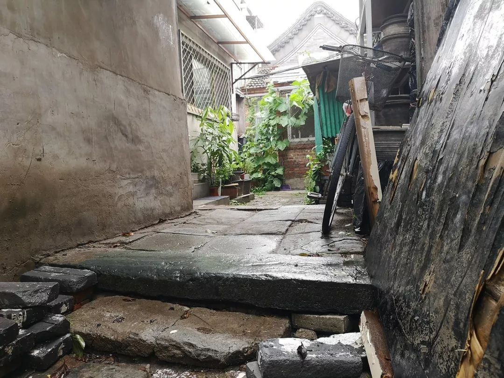

我在一个门口问一个提着菜往里走的老人 这里边是什么地方呢 他一口京片子地朝我笑了声 内有啥？还不就大杂院儿呗。 然后自兀自地往里走 我也跟了进去  我以为的四合院都和平常在古装剧里看到的 随处拐进去也都是那般进落有致 但大杂院却不  同学说这可能是解放之后 或者wg的时候 看到原住因为各种各样的原因离开了之后 民众于是欢天喜地地进去 就此住下

走不得几步 便又清晰可辨是另一户人家 脚底下的路 忽而是青石板 忽而是玫红色的瓷砖  该是这个地方易主多次 又分了很多次 虽然同样没有来过 但硬核就是硬核 同学指着一面印顶墙面告诉我说 这里以前一定住着个身份很显赫的人  像这样一面顶 虽然说不上具体算在那个属种里边 但稍稍过细一看果真有些区别  而连墙筑起的 则是材质都差了许多的颓圮泥墙 和周遭搭起的线路走梁相映衬  同学用手比划了一下 你看 这个就应该是当时府上的墙根  这里边的人家很可能一个大杂院的共享一个盥洗室 因为以前这里边是一整户人家 自然也就只在一处当兵  想起进大杂院门口贴的重点防火单位label 该是不假

进过几个大杂院之后 我们从前鼓楼苑胡同回往主街走 声音又渐渐变得闹腾起来  我记得我问过一个问题 如果这样的大杂院里 以前寄信 或者说现在寄快递的话该写到哪里比较好呢 同学想了想 说应该是寄到大杂院的门口吧  然后一个院子里的知道要到了 又是everyone knows everyone的地方 吆喝一声

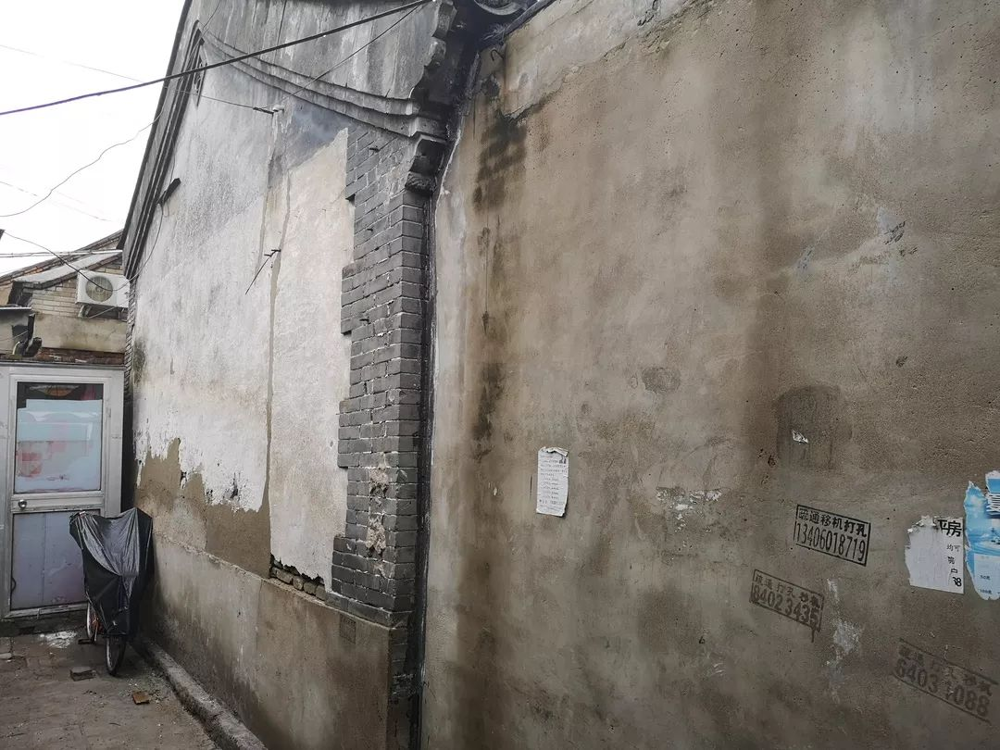

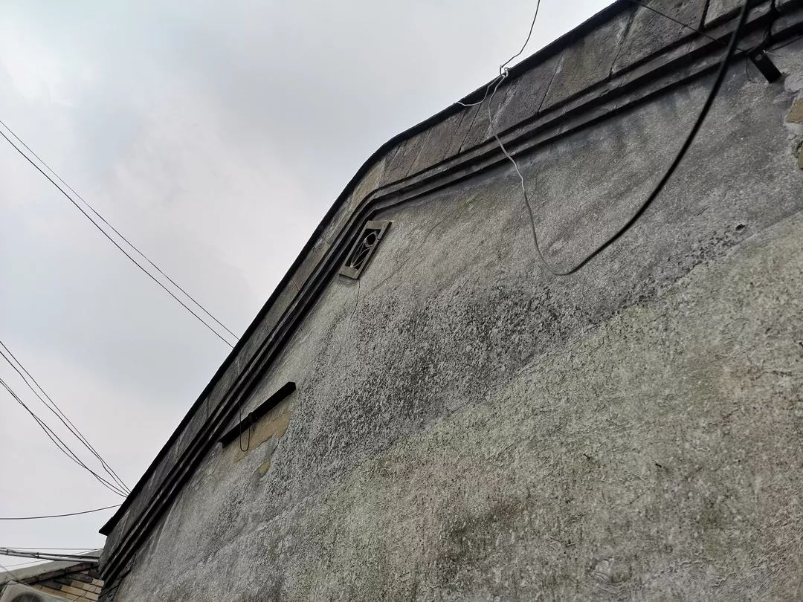

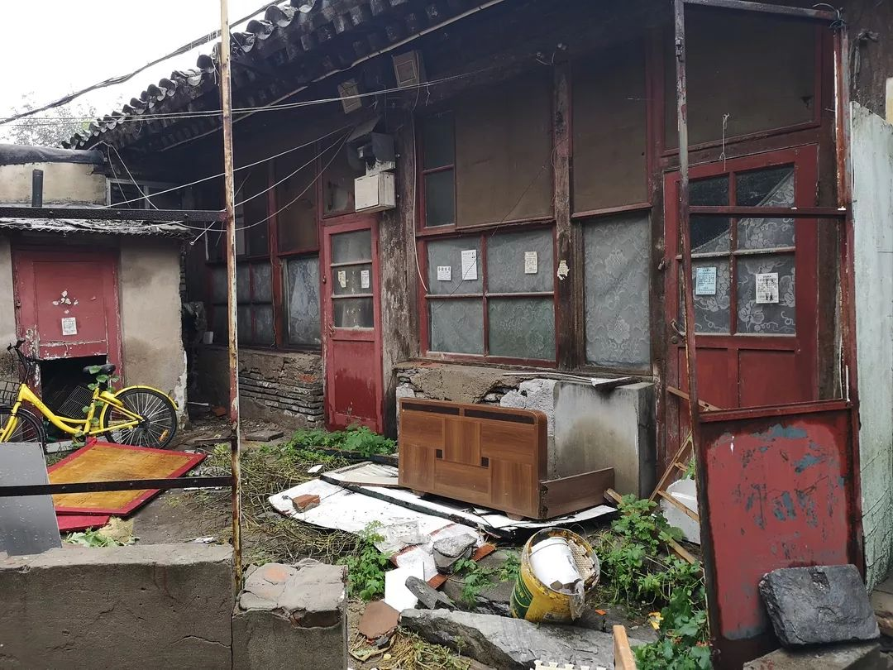

到钟鼓楼附近 姚记炒肝店 听说是帝都老炮儿会很喜欢的  很少吃内脏的我 也尝试开始吃起这些勾芡的食物

按说是有回民聚居地的 类似望京那般  霍达的一本书 《穆斯林的葬礼》——当然这本书我觉得是被过誉了 ——也讲到了一些回民的生活方式  似乎内脏之类的东西在他们的文化当中并不被接受 于是在老北京的调制之后兴起了这种食物

湘菜的一个叫新化三合汤的 多用山胡椒油 也喜欢用这些食材  我偶尔是作为感受文化地在吃这些

总而言之还是北冰洋好喝hhh

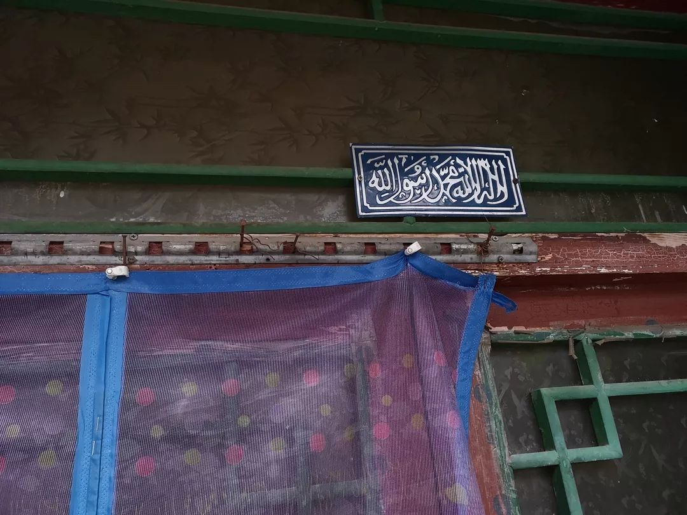

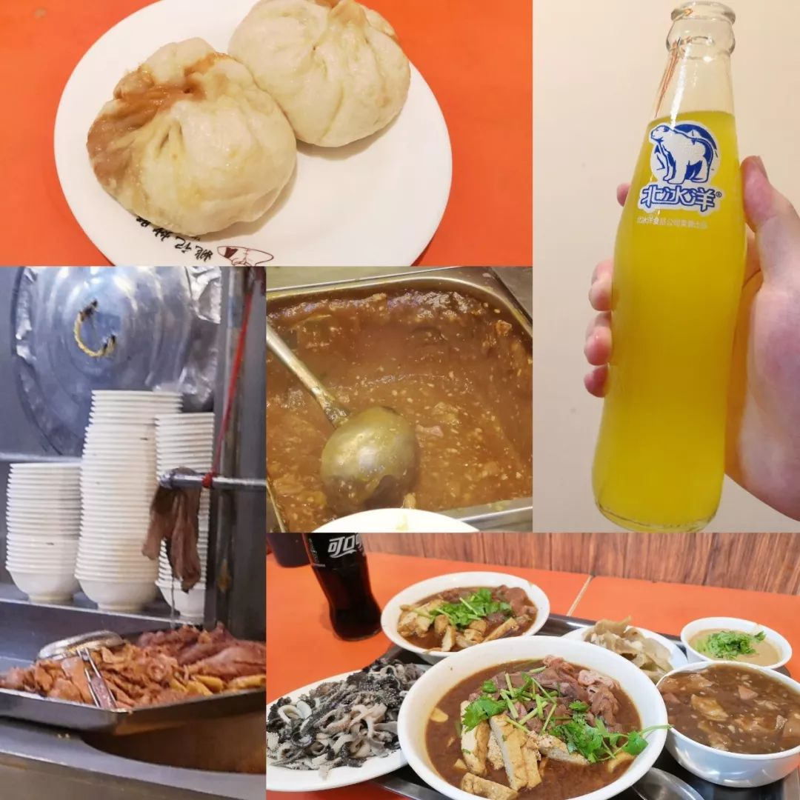

北京总是能查到各种各样的传说 也确实留下了很多悬而未决的所在  早年改编的京城81号是一处 北京地铁没有三号线则又是一处

我这次拍的地铁站内照片除了西直门换乘站这一个之外 便是东四十条幽灵换乘站的图  传说这条线是在57年的时候由苏联专家划定的 但后来因为年代上一些众所周知的原因 同时其他线路的建设也都紧锣密鼓地开展了起来 使得三号线踢来踢去 最后只剩下东四十条这一个地方是仅存的实际工程上的三号线换乘站

我从二号线换过来的地方拍下去 底下的标语都还完整地保留着上世纪七十年代的装潢画风  白色纸张黑色边框内黑色的字 请勿往道床里乱扔垃圾烟头纸屑 看着空空如也还没有铺轨道的空缺地 奇怪的是没有阴风也没有臭味  底下甚至还有一张中学用的课桌和一把椅子 也不知是哪个工作人员放下去的

笑着和同学说没办法我们只能在上边围着护栏拍一拍  有点点想假装掉个什么东西下去 比如在护栏旁边喝水 然后水杯掉下去了 要去捡 然后在下去的时候顺便多拍几张照片  想了想水杯掉下去早砸坏了 又放弃了这个念头

刚刚查了下最新消息似乎三号线又提上日程了 那我也得赶在通车之前发出来这篇文章才是呀

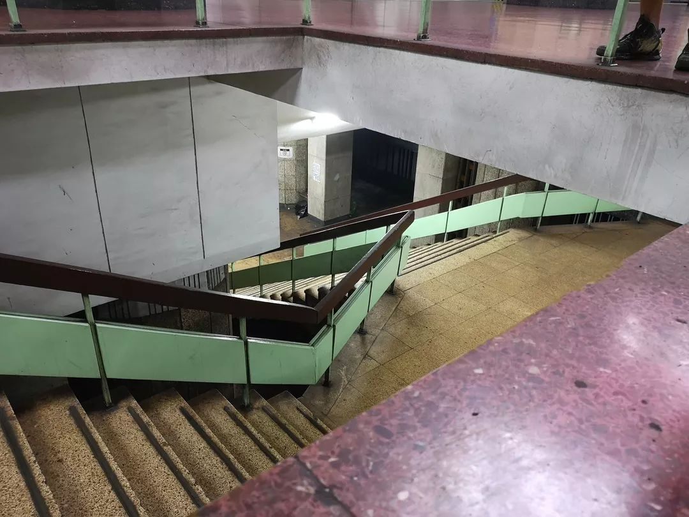

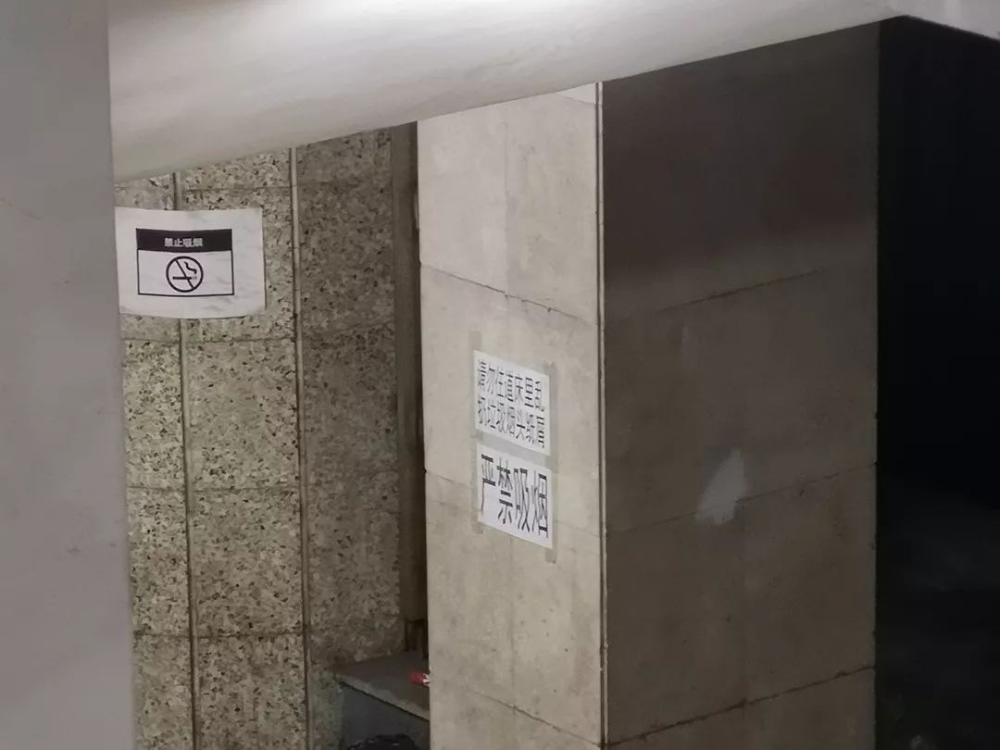

最后是出到库布里克书店的几张随手照  安静 氛围  每在一个城市都想要在书店里逗留 不管是猫空还是钟书阁这样的地方  长沙止间我应该也很久没有去过了 下次去八一桥或者一中的时候一定要记得这件事了

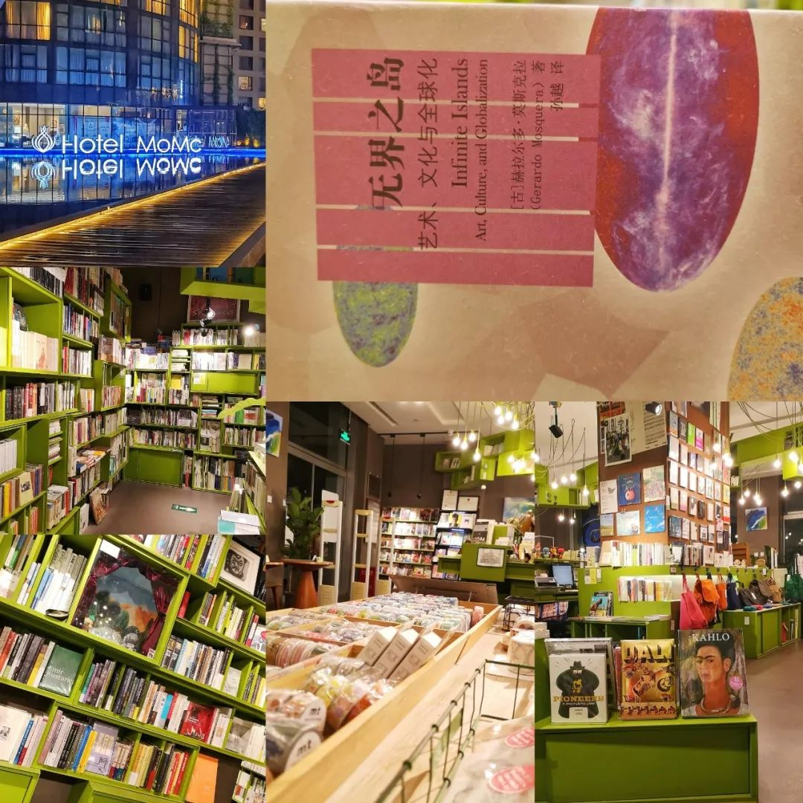

-END-

-留下尬走的足迹-

- [大连](http://mp.weixin.qq.com/s?__biz=MzUzNjE3NzA3Mg==&mid=2247483833&idx=1&sn=962495d09a27d3d3a8993524d4134ce4&chksm=fafb7166cd8cf8708def007b372b850e9a4a856d6264c3525b6c01cb618edd29994651fd6fd1&scene=21#wechat_redirect) - [香港](http://mp.weixin.qq.com/s?__biz=MzUzNjE3NzA3Mg==&mid=2247483911&idx=1&sn=d03f50934536437929624ba6a7720095&chksm=fafb72d8cd8cfbce8f0ab19ffc52e5af4d9615ee616a247245c72c783d82c48142e2d74257dc&scene=21#wechat_redirect) - [苏州](http://mp.weixin.qq.com/s?__biz=MzUzNjE3NzA3Mg==&mid=2247483790&idx=1&sn=bab161c9ec342966da763c03c95d8f53&chksm=fafb7151cd8cf8476e48f3cb754c6aa22ef3a0520fca256988e2e461ef108d502422829da9f2&scene=21#wechat_redirect) - [杭州](http://mp.weixin.qq.com/s?__biz=MzUzNjE3NzA3Mg==&mid=2247483765&idx=1&sn=d4a84f483424470357f69e566f2ef118&chksm=fafb71aacd8cf8bc54453a58adec40a9a7ae6d6c4489c8fe0dfb0ecfd08b28a7ea1f15e45fdb&scene=21#wechat_redirect) - [上海](http://mp.weixin.qq.com/s?__biz=MzUzNjE3NzA3Mg==&mid=2247483809&idx=1&sn=74225fdbbdf6b66b605c282ea31038f7&chksm=fafb717ecd8cf8685b6a3e2a792253fa9c0ee22fa4f054eab8f38daf2cb220122741dfb506fa&scene=21#wechat_redirect) - [再到上海](http://mp.weixin.qq.com/s?__biz=MzUzNjE3NzA3Mg==&mid=2247484421&idx=1&sn=fb650c977a7a366534415a20195d0cf5&chksm=fafb74dacd8cfdccc27df74c87eac7822646405762a36e1d80fc293543dfe32a71a248c6733d&scene=21#wechat_redirect) -

文不加点的张衔瑜

懒得打标点的张衔瑜在日常尬文 2333333
