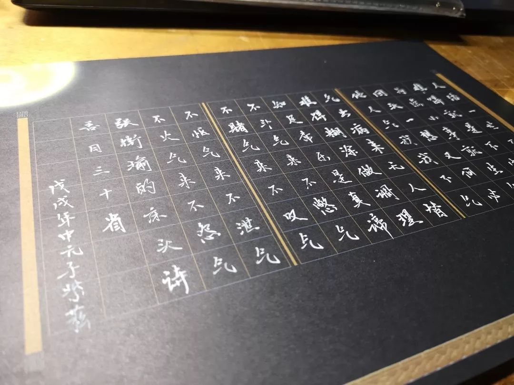

本文共计5052个字

是思想实验 所以我不配图了

题目是一句不好笑的俏皮话  语出程序员关于正则表达式（一个编程手段）的一个梗 意思是 当我遇到这个问题的时候 如果我想到用这种解决手段来解决 那么原来的问题也解决不了 如何运用这一手段又成为了一个新的问题来更加困扰你  这样就有了两个问题

对于张衔瑜的思想实验也是这样

我首先假定一下收听张衔瑜的都知道最近发生了些什么事 知道怎么保护自己的身份证 知道华北地区的菜价要涨了 知道自己如同韭菜一般 知道新华社的点名 也知道整改之后的APP又出了问题  如果以上的这些都知道 那么我先把这些归为一组观察 一组问题  接下来就可以分析问题了 之后 进行最不负责任的思想实验了

实验事件并不特指 仅限张衔瑜思想实验内部实现  请勿模仿

要分析现行的这一组实验 可以首先回顾一下 ATM机抢劫事件 此前有很多报告过ATM抢劫事件 作案人往往选择在 深夜 在 监控或有死角 的地方或 破坏了监控 的地方 对 独自 前往ATM机存取款的人进行控制 进而抢夺财物  简单粗暴的过程 符合有犯罪意图的人的基本认定

在多次媒体曝出有类似ATM机前侵害事件发生了之后 慢慢地也就有了解决方案  最近去ATM机前操作的时候 柜机旁边都多了一组按钮  快速报警和通话 想来应该就是保护存取款人的  也有一些地方 设置了存取款单间 也就是每个在ATM机前操作的人都有个能占一个半人的小空间 自己进去之后就上了锁 同样配备着报警装置  记得我一次在操作的时候 ATM机恰好在食堂旁有人经过的地方 ATM机立刻有语音提示 “注意，有人尾随” 虽然有些草木皆兵 但防患于未然总是好的

之后还有人提出 银行卡定义另一套密码 比如反向输入密码之类的  设置开通了这样的密码后 会有一个安全账户  客户输入这个密码就会自动报警 并且账号内只象征性地转入少量金额  对一般只是的谋财的劫匪 让出一点点空间尔后最大化保证自己的生命和财产安全  这个好像还没有实现 或者实现了但我还不知道

回到今天打车APP发生的事件来想一下经过 报警人和报警人的好朋友无疑做到了之为正常人最合理的反应 被害人发现情况不对 马上呼救朋友 尽量不和有作案意图的人起正面冲突  当然 她的朋友也第一时间报警 并且联系APP平台 已经算反应非常及时也合适的朋友了

按照现在能看到的报道 APP客服的态度是可以被理解的  还原到事件发生的最开始来看 假定协助报警人是用的手机电话或者一个账户什么的来反馈客服的话 客服是有理由进行拖延的

----思想实验-----

如果一个人寻仇 寻仇某个司机 想通过提供的其他信息来获得司机的车牌号和司机的手机号 由此来不断打击和骚扰他

这个好像不大会成立 因为我想不到提供什么其他信息可以让客服定位到这个司机  如果有的话也不需要一个雇佣方的客服再来提供什么 案例失败

----思想实验-----

如果一个人寻仇 寻仇某个乘客 假定我大概知道这个乘客的将要在某一时刻出行 比如从家里去单位 或者从单位回家  这时候如果向APP客服提供了路线起止点和乘客手机就能获取乘客出行轨迹的话  就可以借助APP平台来实时对侵害对象以跟踪

在这个故事中APP只是一个媒介 APP的司机只是一个躺枪的  接下来会发生什么 是和这个通过APP掌握了信息的寻仇人有关的  实验成立

当然不仅仅是寻仇 有的可能就只是在窥探别人的隐私 或者是商业机密刺探  但这些同时属于APP乘客和APP司机的出行隐私  在突然到了APP客服那里 自然地就会被拖延或者屏蔽过滤掉

这一部分完成 我们返回事件当中来看

插一句 公众看到的是警方对这一次特定事件的处理手段和方式 看不到的是每天会要接到多少的假报警和骚扰电话 那么如果以后有人类似地找我求助 则应该要想到三点 一者要证明自己受到了委托要全权代理报警事宜 二者要证明被代理人也就是被害人确实陷入了危险境地 三者要将情况完整地予以反馈 这三者缺一不可

被害人用微信委托朋友报警 也许是源自于不敢正面和有犯罪意图的人起冲突的恐惧心理 可以理解  既然微信聊天记录可以截图作为证据 那么同理就应当反馈给警方和APP客服 这在我看来已经可以满足了上述的前两条  目前看到的报道里只有客服反馈的截图 没有完整的报警记录 是自己说到的警方因为没有车牌号而不能受理

我于是就此专门和执业警察求证过 这样的失联请求委托是可以受理的

如果再侵害发生之前 被害人预感到了将有不测 委托朋友报警 朋友报警了并立案开始侦查 并反馈给了客服由公权机构进行车牌和行驶轨迹等隐私信息查询 接下来由经过专门训练的警察进行调查 而不是需要报警人也就是被委托的代理人掌握这些信息 想来会是对有犯罪意图的人的最完整最合理也是最有效的打击  讲道理现在出警后接警的速度是很快的 城市内就近到达现场的不会要等一刻钟以上  这是专业的训练素养 无脑人士请自行退散

好的那么这次回击的链条断在哪里呢  我以为是在 被害人的朋友到报警 的这边 思想分析在这个事件中 到这里也就差不多了  因为现在掌握的信息 我既不知道被害人的朋友是怎么报的警 也不知道接警人是不是真的因为车牌号没有而回应无法办理  好了开始假设 如果报警人说到的失联和要查车辆轨迹 这个诉求没有完整的被接警人理解 如果是接警人因为接到了太多的骚扰电话而有疲惫或者渎职的可能  如果规章流程上让接警人没有处理的办法  这就要自设条件去思想实验了  现在的分析只能到这里断裂了 这一断裂使被害人想要防止侵害变为不可能 也令后来的全警种出动变得耗费警力也劳民伤财  当然从通报来看 抓捕还是很得力的 这是履职和专业素质的配合 值得敬佩  至于是怎么反应过来的 新闻里仍旧只说报案 没有细节  那么还是说大家做得很好了 问题？摊手

楚人一炬 可怜焦土 前人不暇自哀而后人哀之 后人哀之而不鉴之 亦使后人而复哀后人也 不管在此之前还是在之后 太多这样的事情 弄得人心惶惶  我另一点想说的是 在一些文章的最后 写到的是一些防身的技巧blah  其中最让女权者感到权利被侵害的 自然是穿长裤出门和素颜出门 引得一片骂声 不止对女性 男性亦然 随便思想实验一下街上一个身强体壮的男性殴打一个体弱瘦小的女性 和一个身强体壮的女性殴打一个体弱瘦小的男性 脑内一下就知道世界对性别一直就不友好 不论男女 插一句我身边就有很多认识的耿直的男生连在食堂有女生在人多的时候坐到桌子对面吃饭都会紧张 更别提什么撩拨weixie了

能理解这样的骂声 因为这本来是基本权利 我们的文化中注意的是结果 而并不在意动机 所以到了现在侵害发生 一堆人在被害人的身上做文章 却没见到什么从源头上防止侵害 讲如何将侵害的念头扼杀在脑海中的措施  天下熙熙皆为利来 天下攘攘皆为利往  追名逐利本身不是一件坏事 君子爱财有些人就可以取之有道 却并不会因为冲动而去选择不合法的带侵害性的方式

开源节流 是说在资金紧缩的时候 既要加大流入也要减少流出  那么在防止侵害的时候 既要让人有自我防卫的能力 也要让侵害之心受到谴责和惩罚 回到文章开头的例子里边 因为在ATM机前发生了太多的恶意侵害而让人有了可乘之机 这是最坏的结果在最强力地倒逼银行机构采取安全措施  打车的APP也应该这样 侵害不止发生在乘客身上 夜间跑单的的士司机 那些为了家庭生计而在路上奔波来去的 人家也是合理合法地在赚取辛苦钱 也是守法的公民享受法律保护  只是最近很少听说有夜间的士司机受到侵害 但并不是说他们的安全状态就很乐观

点读机 那里不会点哪里  舆论的调调也是这样 哪里喊痛就只往哪里看 然后莫名其妙地都只看痛的那个地方 忘记了给那一块都做个检查  问题 不一定在问题里

记得我读小学的时候 长沙南郊公园发生一起性质恶劣的枪杀事件 罪犯周克华的通缉令和悬赏令贴满了长沙的大街小巷

当时有声音是说 如果我在餐厅吃饭 周克华突然过来坐在我对面吃饭 那我绝对不敢大张旗鼓地直接拨打110报警 有想过为什么不能实行网上报警 于是我刚刚去搜了一下一些地方公安局的门户网站 我现在没有在最醒目的地方看到一键报警的链接 那么在紧急情况下 如果我要先点开百度搜索公安的网站 打开之后再找很久报警通道 恐怕很是麻烦  并且不光是报警 里边还有一系列的警情描述和报警人身份信息确认

我想说的是现代人有的已经有在其他软件比如支付宝或者微信上已经经历过了身份信息确认 那么是不是可以直接在支付宝里设置链接进行报警  况且大部分的还开启了位置信息 这样如果发生了侵害 是不是可以更迅速地定位到报警人 调用预先设定好了的警情模块 并且防止因为警惕性电话报警而刺激侵害人带来更严重的损伤  并且这些软件都是人们日常用惯了的 避免了还要再上网站去费力地寻找门户网址并再次身份验证  应该是个很不错的想法 而且也很有意义

那么 我开一个新问题 为什么 解决不下去呢

冰点周刊刊发过一篇文章 名为《体制内的年轻人》

5年前，小魏和小邹一样参加了那场竞争激烈的考试。那时，他已经在市属事业单位里工作了一段时间。一天早上走进办公室，他突然意识到，30年后的自己，还是每天来到这个办公室，就像那些老同事一样，坐在自己的座位上直到退休，“那种感觉太恐怖了！”

小魏想换一种生活方式，他报考了中央机关的职位，走进了部委大院。现在，他不仅知道自己30年后的样子，连“50年后什么样子都知道了”。

后来他才得知，自己是去顶替机关里刚退休的一位老同志。

“在坐的都是平民子弟，这是国家给的机会”

不管命题人怎样描述，在外人眼中，机关里的小邹已经过上了“很顺”的生活。他吃着“皇粮”，拥有不错的社会地位。就算有烦恼，那也是“幸福的烦恼”，一个想要进入机关大院的考生这么说。

按照一位领导的说法，令人羡慕的稳定和地位，都是“国家给的”。研究生毕业的小李接受入职培训时听到过这句话：“你们在坐的都是平民子弟，通过选拔进来，这是国家给的机会。”

很多有热血但是技术还不成熟的年轻人进入到了体制内 接受老一辈的教导 磨炼“静”字功夫  技术上去 热血下来 自己也成了老一辈  像华北菜价上涨的事情里 如果不仅仅是天灾 那也许就是年轻的只是看到了问题吵嚷着要解决但不知道怎么下手 年长的睁一只眼闭一只眼知道下手了会是个怎么样的情况 所以有识之士提出了要不忘初心 是要一批人在练好了技术和性子之后 不要忘了为什么而出发

地震十周年之后 我们再次防震的能力有没有提高 不知道  诸多善款何去何从 能看到的把体制搞活的 是香港部分援助四川所做的建设  当时文章里描述说其他地方都早早地完成了 但很多只是外面庙门装修得漂亮 进去一看什么也没有  香港是真的要做些事情 然后每一笔钱都要反馈回去 给纳税者交差  文章里说这样反而倒逼了刺激了国内体制活力 工程确实耗时良久 也可以见到地扎实有效

我觉得 包括看最近的新闻 知道改变不了世界 那也就只能 好好地找到或完整或深刻的角度来看待整一个/一组事件 哪怕只是思想实验

一个微信名叫裁缝的同学在朋友圈说 为什么有人特别喜欢指责别人“带节奏”呢？一个可能是，他们发现自己的想法确实很容易被别人左右，对于外界的声音无力辨别。因此他们对一切有主张、有意见的想法保持无差别的警惕，拒不接受，仿佛这样就可以保持“中立、客观”，实则既不能辨别别人的想法、也不能树立自己的认识。 我觉得是对于目前肤浅者很好的概述了

一些人明明什么也不知道 也不说明自己就是在假设  只是把自己的情绪发泄过了 屎盆子往别人身上扣 无所不用其极  只要到了最后 自己的身上可以擦得干干净净就好  回头来反而再度嘲笑 hey 你看你身上都是些什么东西噢

摘自鲁迅《论睁了眼看》

中国的文人，对于人生，——至少是对于社会现象，向来就多没有正视的勇气。我们的圣贤，本来早已教人“非礼勿视”的了；而这“礼”又非常之严，不但“正视”，连“平视”“斜视”也不许。现在青年的精神未可知，在体质，却大半还是弯腰曲背，低眉顺眼，表示着老牌的老成的子弟，驯良的百姓，——至于说对外却有大力量，乃是近一月来的新说，还不知道究竟是如何。

再回到“正视”问题去：先既不敢，后便不能，再后，就自然不视，不见了。一辆汽车坏了，停在马路上，一群人围着呆看，所得的结果是一团乌油油的东西。然而由本身的矛盾或社会的缺陷所生的苦痛，虽不正视，却要身受的。文人究竟是敏感人物，从他们的作品上看来，有些人确也早已感到不满，可是一到快要显露缺陷的危机一发之际，他们总即刻连说“并无其事”，同时便闭上了眼睛。这闭着的眼睛便看见一切圆满，当前的苦痛不过是“天之将降大任于是人也，必先苦其心志，劳其筋骨，饿其体肤，空乏其身，行拂乱其为。”于是无问题，无缺陷，无不平，也就无解决，无改革，无反抗。因为凡事总要“团圆”，正无须我们焦躁；放心喝茶，睡觉大吉。再说费话，就有“不合时宜”之咎，免不了要受大学教授的纠正了。呸！

……

中国人的不敢正视各方面，用瞒和骗，造出奇妙的逃路来，而自以为正路。在这路上，就证明著国民性的怯弱，懒惰，而又巧滑。一天一天的满足着，即一天一天的堕落着，但却又觉得日见其光荣。在事实上，亡国一次，即添加几个殉难的忠臣，后来每不想光复旧物，而只去赞美那几个忠臣；遭劫一次，即造成一群不辱的烈女，事过之后，也每每不思惩凶，自卫，却只顾歌咏那一群烈女。彷佛亡国遭劫的事，反而给中国人发挥“两间正气”的机会，增高价值，即在此一举，应该一任其至，不足忧悲似的。自然，此上也无可为，因为我们已经借死人获得最上的光荣了。沪汉烈士的追悼会中，活的人们在一块很可景仰的高大的木主下互相打骂，也就是和我们的先辈走着同一的路。

凡越来越魔幻的 自然更需要辨识来去

灵台无计逃神矢，风雨如磐暗故园。

寄意寒星荃不察，我以我血荐轩辕。

虽然不是什么正经社论 但还是想抄诗

-END-

[-想讨论点关于教育的事-](http://mp.weixin.qq.com/s?__biz=MzUzNjE3NzA3Mg==&mid=2247484024&idx=1&sn=b3196a122c69edcb4d9601409c9a02a9&chksm=fafb72a7cd8cfbb1d384e0ee81449edd14ee2098751cbaa3090ca8d74691cf16eb2ec7965416&scene=21#wechat_redirect)

[-朴素思路的若干重载-](http://mp.weixin.qq.com/s?__biz=MzUzNjE3NzA3Mg==&mid=2247484485&idx=1&sn=640ea8fcc50daf44fef4e77c93c2a2d4&chksm=fafb749acd8cfd8cc5ad1ad46e665066989661614cf5d7a84eb465dc04e1cfe9f206a4384cb6&scene=21#wechat_redirect)

[-有道理&&没有价值-](http://mp.weixin.qq.com/s?__biz=MzUzNjE3NzA3Mg==&mid=2247484395&idx=1&sn=3df5bd2daeebbb58b75c1d1dcba0ad91&chksm=fafb7334cd8cfa22d95bd8c64c64dad3e4b42447c69bd19ac4598003325322336907766dab02&scene=21#wechat_redirect)

[-只是尽可能的简单 却不再简化-](http://mp.weixin.qq.com/s?__biz=MzUzNjE3NzA3Mg==&mid=2247484253&idx=1&sn=a34e4728c9028d275ccdfc86208e3bf7&chksm=fafb7382cd8cfa940ddc1bb01aaab61f4850a966731eaa212817705c440b80a8d6fe2d43086b&scene=21#wechat_redirect)

文不加点的张衔瑜

懒得打标点的张衔瑜在日常尬文 2333333
