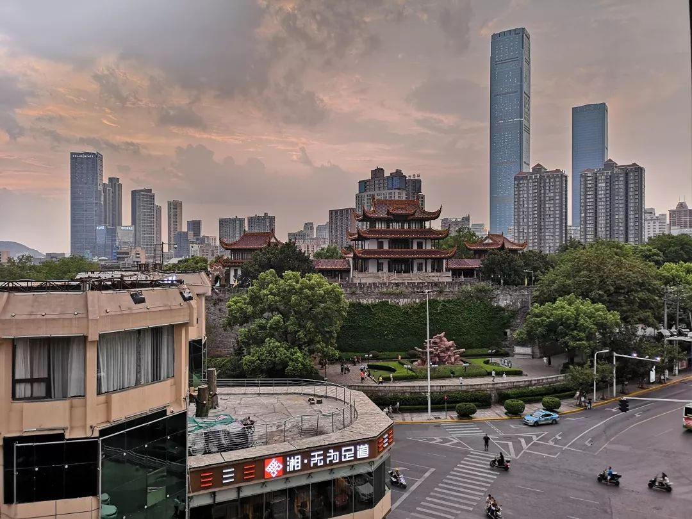
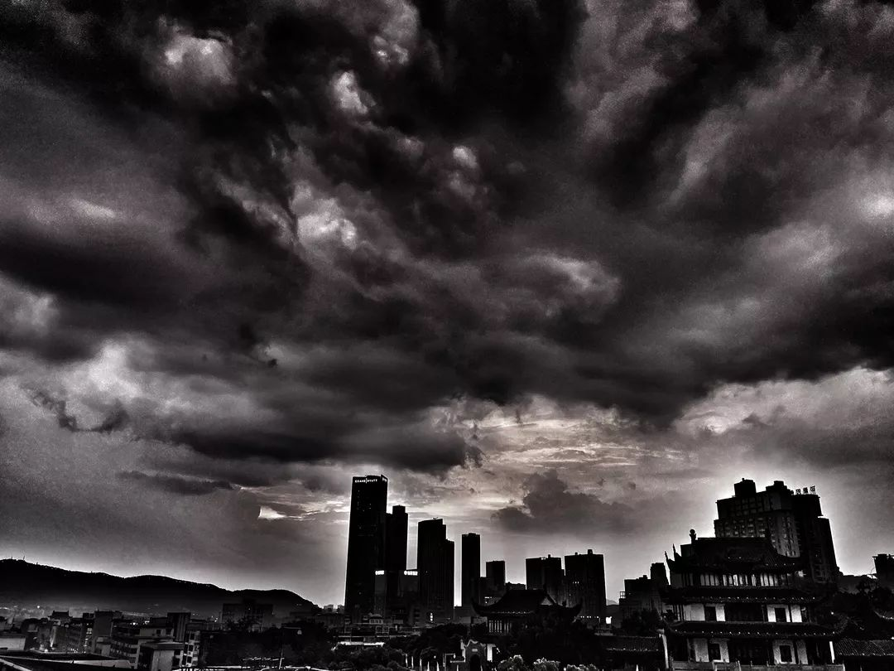
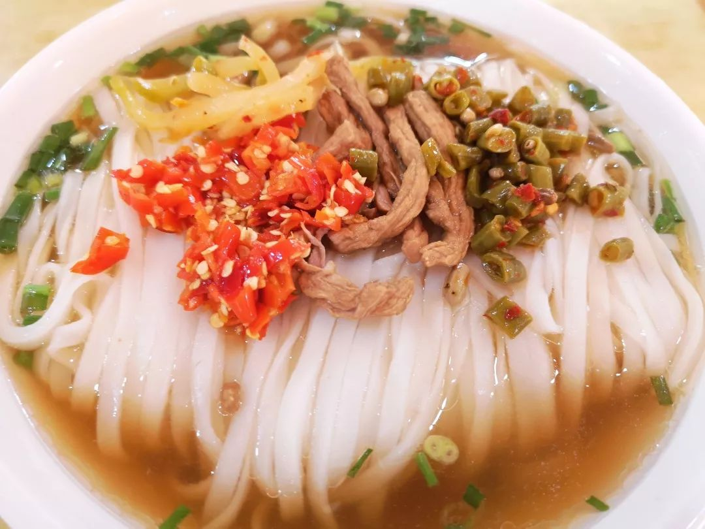
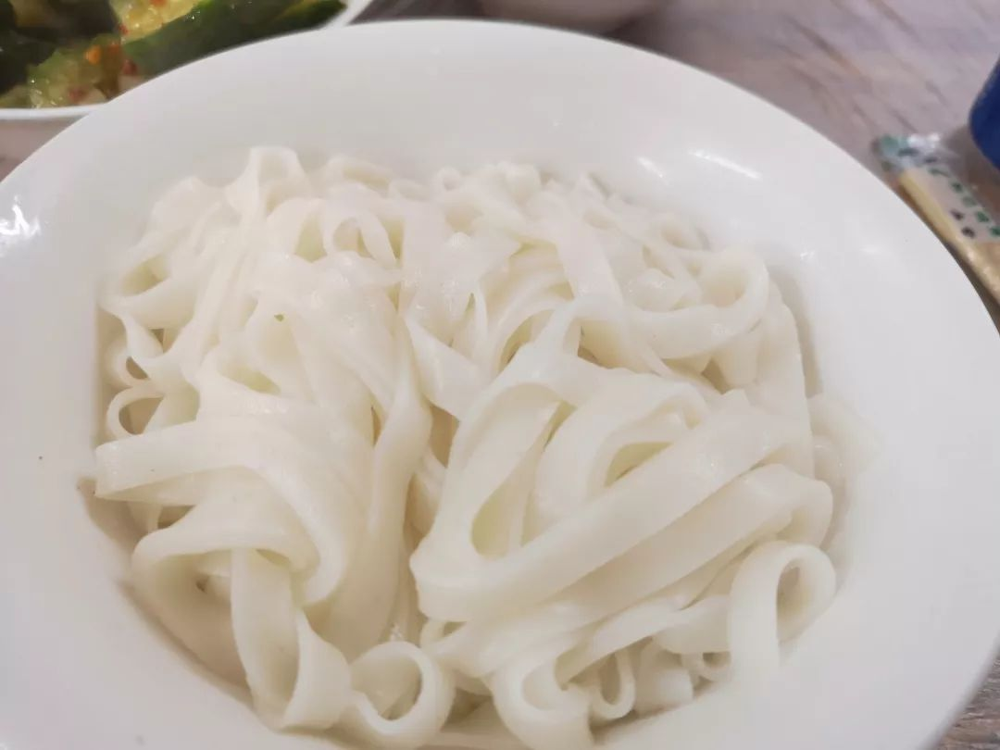
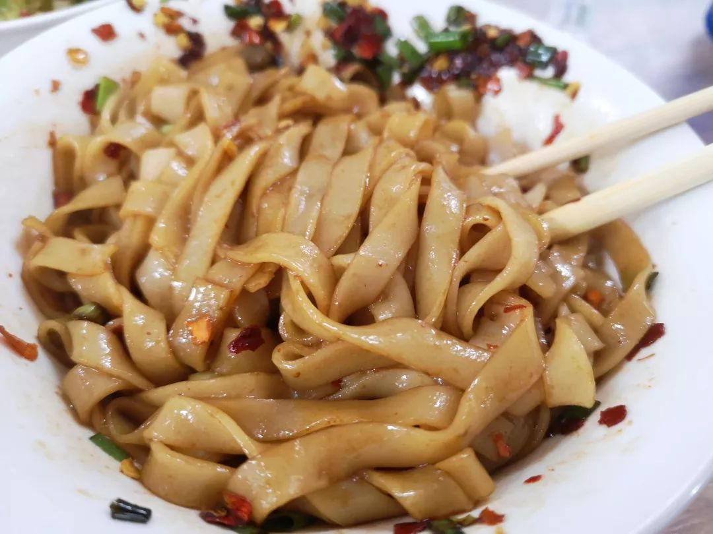
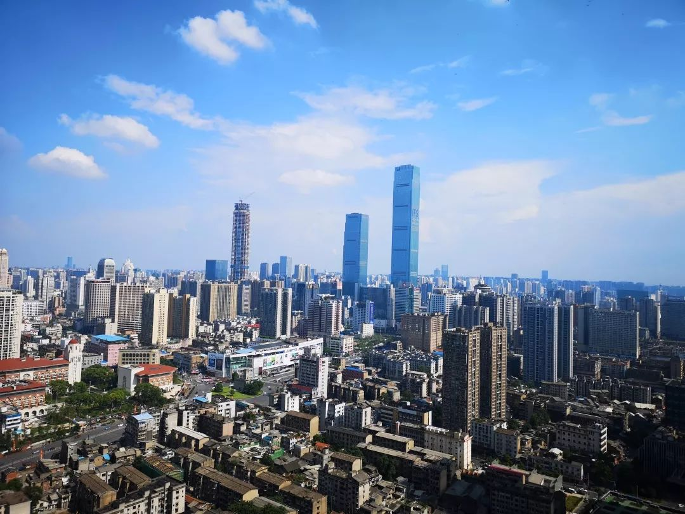
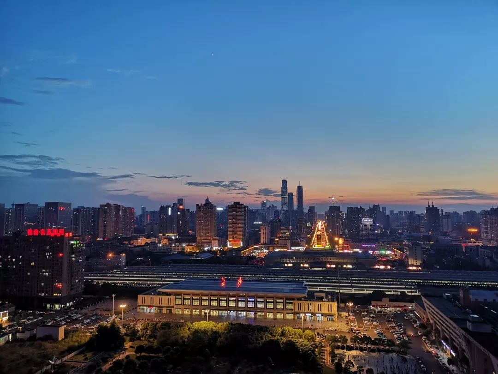

进入三伏之后，每天一阵的大雨教长沙人都有了随身带伞的习惯。说不上这雨什么时候来，也说不上在湘江以西抑或浏阳河以东，知道的不过是在那段日子里，澄澈的蓝天在长沙城里定居了下来，漫步而不离去。水陆洲城映着一抹抹晚霞，每一张对焦天空照片都如同湘菜里的辣椒一般惹怜可爱。对喜欢从高高的楼顶俯拍城市建筑的摄影爱好者而言，这是一年中最好的时候。

“水陆洲，洲系舟，舟动洲不动；天心阁，阁栖鸽，鸽飞阁不飞。” 地势最高的龙伏山巅，是古长沙城的制高点。建阁一，应星宿分野中的“长沙星”而得名“天星阁”，后更名“天心阁”，为观星祭祀场所，也是现行长沙行政区划中“天心区”名称的由来。我选择 天心阁 作为这次出门采风的第一点，一者是古阁自身与文脉所系，另外则是阁楼下有长沙仅存的一段古城墙，是为复原古长沙外景的最佳构图要素。 我很想看看这些旧式的传统潭州和长沙中心城区的新兴高楼在同一个镜框里，会擦出怎样的火花来。

城南路口 东南角的居民楼上，我在顶层拍下这张照片。画面右下角的城南路口，得名自长沙城南书院所迁的地址。而城南书院，则是南宋大儒朱熹和张栻论道之处。近代，城南书院改制为湖南师范馆，她更为人所知的名字是湖南第一师范，也就是培养了毛泽东、蔡和森、黄兴等风云人物的著名学校，电视剧《恰同学少年》的选景点。

从那个年代的风云际会，到现今望向天心阁，显而易见的是建筑外观上就能找到的设计理念之别。右侧直指天际线的长沙国金中心，塔楼高452米，是长沙现在最高的楼。九龙仓商业与资本的力量，在洗练而犀利的商业外墙设计中展现得一览无余。稍稍抬高了镜头，增加了暗部亮度以弥补手机拍摄带来的不足后，我在后期将画面处理成黑白的样子。北拱联南屏，天心阁与天际流云走到了一起。左侧视线消失点附近的是岳麓山绵延的峰峦，流云一拂，长沙城泼成了一幅洇墨山水画。 诗云：“四面云山皆入眼，万家灯火总关心。” 来得旷远，来得深邃。

果真是暴雨。路灯亮，路人匆匆忙忙跑到酒店的廊檐下躲雨，城南路的车流也渐缓渐塞。雨把地面冲刷一新，也洗出了一片刺目的车灯殷红，上楼顶拍照的我也不得不撤进楼梯间，并且将楼道窗户关上。我知道，这样的雨不会太久，而只要雨一过，我便可以沿路步行去到长沙最正宗的小吃集中地—— 南门口 ，寻些个好吃的大快朵颐一番。

粉躺在碗里的那几条线，是长沙人的生命线。 长沙米粉的外观不同于外地所指的河粉或是米线，显得细长而扁。传统地来说，这片土地上的粉在方言中又被称作“扁粉”。粉的吃法有很多种，时下选出的照片中一碗是来自天下第一光头粉的猪油拌粉，另一张则是杨裕兴的汤粉，“的”字之前是老字号的店名、之后是粉名。其中，汤粉是在宽好排骨汤汤底后，烫过粉在碗里，盖上各式各样的盖码，然后任食客加入剁椒、豆角、酸菜、榨菜、酱油、醋、香菜、蒜泥之类的拌料。猪油拌粉则不一样，只不过垫一层鲜猪油主调和的酱料在碗底下，再烫过粉覆在上边。长沙本地的达人们常常在湘方言中被称作 “老口子” ，如若教是他们遇上了这样一碗粉，只消筷子在碗中稍加翻动，那么登时口水就会“一洒就出来了”。

长沙人在方言设计中，给粉搭配的动词是 “嗦” 。我一直觉得这个字很是拟声，像是吃粉时的“簌簌”声或说成是“哧溜”声。真正把这项技能运用得纯熟的人，会要这样地走完一整个流程：他们首先按照一定顺序拌匀称粉，一筷子下去夹起最有眼缘的那个部分，带离碗面稍许，并不似普通人一般直接送入口中，而是头微微左偏，从侧方向吹冷些新烫的扁粉，稍稍顿一下端详一番，留给粉以准备的时间，之后嘴拉长成椭圆形直到两颊凹陷下去，一口“嗦”起筷子上夹到的全部的粉。末了，喝点点入味了粉的润滑、酱的调和、盖码的鲜美和自选了拌料的汤底， 长沙人这时候是可以就着嗦粉和人谈精致美学的 （谈完了再嗦一碗）。

1938年11月13日凌晨，国民政府决定实行“焦土抗战”政策，计划纵火焚毁长沙城以不给日军留物资，其中放火总信号设在制高点天心阁上。不巧的是，城内联动的布置多有疏忽，意外骤起，长沙城遂遭劫文夕大火，致使三万余人葬身火海，全城房屋及其他地面文物毁坏殆尽、片瓦无存。三日后，蒋介石抵达长沙，在天心阁青筋暴起，枪决主事三人、革职省主席、通缉逃逸主管。每每想到经两千年城址不变地传承潇湘文化，又有曾国藩、左宗棠、黄兴、蔡锷等清朝和民国时期带领湘军闯荡后回来建设得好好的湖南省会长沙，经此一火之后连给人们留下可瞻仰的痕迹都没有多少，就觉得反思事故原因和为今后排险警报提供血的教训特别重要。 前人不暇自哀而后人哀之，后人哀之而不鉴之，亦使后人而复哀后人也。

所以这一次外采拍摄，不管手机在楼顶的暴晒下有可能造成怎样的损伤，我都特地去找到了一个能拍 中山亭 的地方——“一火四战”后留存下的只有了它和国货陈列馆。国货陈列馆经整修后面目全非，于是我有意在“万街潮宗”—— 潮宗街 这个长沙古城最北的地方，将中山路和黄兴路交汇处的中山亭，这座曾经的长沙城市使用公共标准时钟作为警钟置于画面左方位上权比最重的地方。作为加入组织时的文字记者，刚刚有点喜欢上摄影的我还不能很好地指明构图几个点位的专属的名称，我只能凭我对图中要素的理解，照顾到基本的审美倾向后架构全图。

转过身去，是 橘子洲洲尾 。橘子洲头留有名作《沁园春·长沙》，矗立青年毛泽东雕像一座。湘江大桥的这边，则是按期开办橘洲音乐节、草莓音乐节等歌舞会的沙湾公园。从影视行业突起的电视湘军，给人们展现了一种能力，即这座受过创伤也有很多红色印记的城市，能恰到好处地把历史文化和娱乐开怀融合起来而不过于突兀或偏好。想到这里就很容易背起屈子的辞，《九歌·湘夫人》：帝子降兮北渚，目眇眇兮愁予。袅袅兮秋风，洞庭波兮木叶下。沅有芷兮澧有兰，思公子兮未敢言。荒忽兮远望，观流水兮潺湲。传承至今的许多年间， 长沙城的梦想，融化在了诗文里，长沙城的理想，熔铸到了政治里。 霸蛮是一个奇怪的词语，兼有霸道蛮横不讲理和执着坚定不放弃的两个意项，而 长沙其城与其人则是兼得霸蛮与闲散，教人捉摸不透。

摄影构图，和文字对场景进行表现记述一样地，我是藉此在选择时下场景的表现手法。最后一个爬楼登高点，我来到的是我自己长大的地方—— 长沙马王堆 ，我在这里度过了童年，对这里的人、这里的建筑、这里的生活方式再熟悉不过。当火烧云和长沙戏谑，极目西行，岳麓幕遮、灯火湘水。长沙市老火车站、长株潭城际铁路站、长沙东西向主干道五一大道和绕城二环线，堵得很好看的车流、消失在视线尽头的湘江一桥、被天际残云遮蔽的岳麓山轮廓。这是自己生长在的地方呀。

张栻有诗：湘江岁晚水清浅，橘州霜后犹青葱。归舟着沙未渠进，且看渔火听疎钟。旧式绿皮火车徐徐进站，金星也悄然出现在画幕的左上方，亦即地理上的西南方。像小孩子吃甜豆，一不小心红黄色的圆粒撒的到处都是，我站在高楼上看纠缠不清的周一晚高峰，也是这样觉得。 念兹在兹，释兹在兹，我以为是走出一座城又回到一座城后，最令人安心的事情了。长沙每个时刻都令人有过去、现在与未来的交错感。 我在长沙待了这么久，也还不敢说完全了解了长沙。

长沙的文化和建筑，并不是由哪一个人在哪一天之内肇基并铸就的。自然地，我自己才疏学浅，更没有办法以一人之力在一篇文之内穷尽所有，也只是节选了部分走到的和拍到的写到的。贾谊、爱晚亭、湘菜、芒果台、茶颜悦色、雅礼中学，陆游诗云：“挥毫当得江山助，不到潇湘岂有诗？”林林总总，长沙市井，方方面面，我只是作为长沙人，在做文字记者到感兴趣摄影这一兼修转型的路上，这次回到了长沙，正好遇到了好天气，边拍图边写，于是有此篇图文域见。

图文 | 张衔瑜

排版 | jqy

责编 | zy

一起尬走的|紧栖冉
