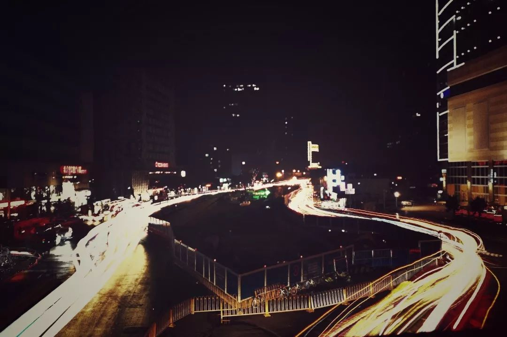
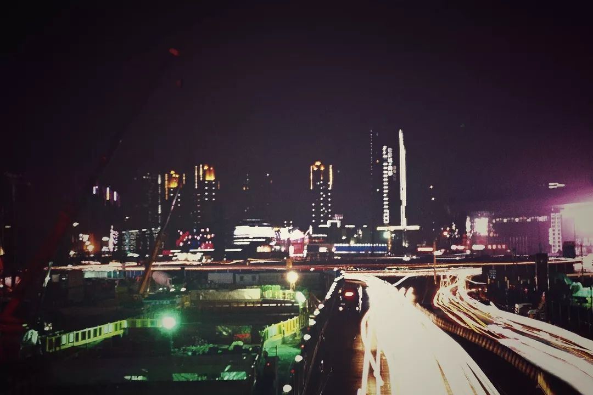
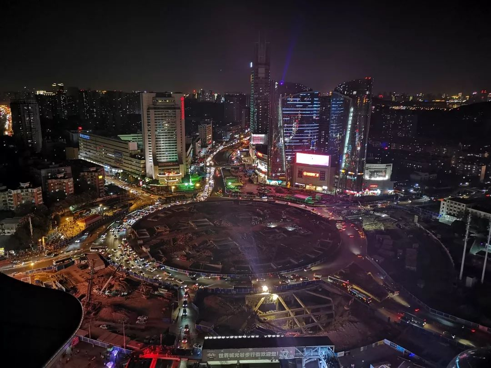
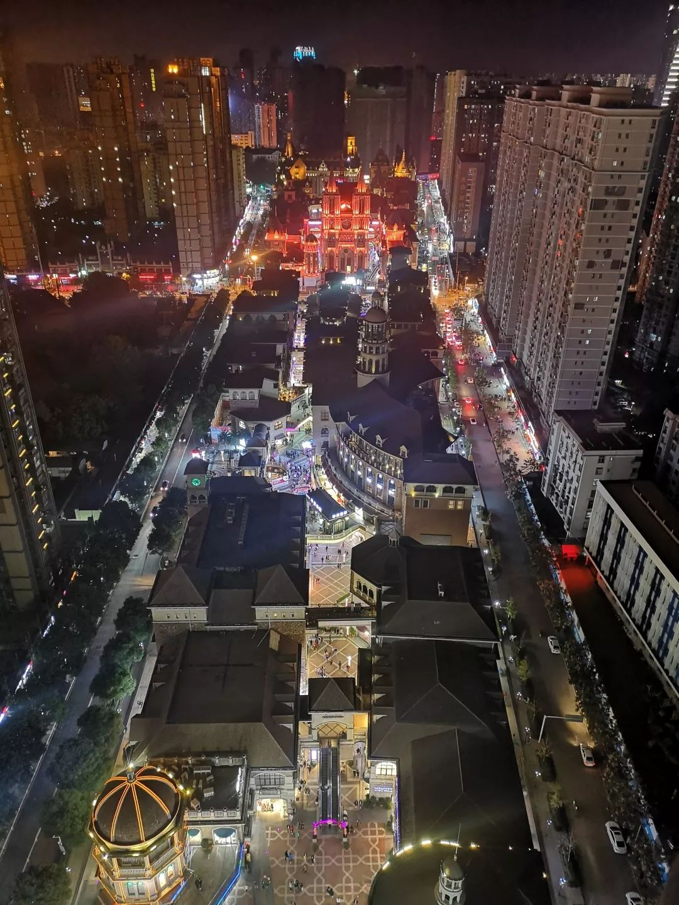

本文共计991个字

需要找一点感觉来回味一下才好

很多次我在武汉的路上走着 都能捕捉到很多有生活气息的瞬间  奶奶拿着波板糖 逗着怀里的小孩边走变笑  车站的情侣在寒风中紧紧地攥着口袋里对方的手 然后一起发抖 以及坐在地铁站墙边 一节竹木挑着蛇皮袋行李的深绿色薄衣男子 耷拉着眼神数大理石墙面上的黑点  诸如此类 不胜枚举

只是 武汉的市政建设像野蛮生长的猴面包树顶端 写着写着文章然后随缘宕开一笔  这样的笔画大抵是太多了一些 像以前医院里医生的天书病方  每次走武汉的路 就和尝试读懂这样的病方难度系数相当

这两段移动延时摄影是我已经silent play好了的 不用担心点开之后会有声音突然吓死人（PS：我不喜欢别人给我发视频很大的原因也在于BGM沙雕）

视频拍摄地点在光谷西边的人行天桥上 工具是手机+稳定器+三脚架  怎么说呢 当堵车的时候 拍出来的视频和拉出来的车轨 从镜头里看到的真的很不错  小学作文也都这么写 车水马龙 川流不息 灯的海洋 光的世界 事实上 一年以前 人们可以从地下通道去到这条路的另一边 或者从地上的人行横道去到这条路的另一边  现在 人们需要走上临时建起的天桥去另一边

视频里其实就可以看出来 我已经用到了稳定器+三脚架 那么所有的抖动就都来自于桥体的抖动  桥体的抖动 最主要的 也无非来自于重型施工设备和公交车

地面 想要过珞喻路 要么再往西走一公里过另一个非临时的天桥 要么违反交规徒步进转盘 要么就绕一大圈几公里去对面 要么就走这个临时天桥

我偶尔就会在想 如果是一个腿脚不便的人  老人或者残障人士  typically在这个坡度下 既走不了wheelchairs也走不了盲人

如果给心情做 100 分满分的话 很多次我出门决定要去玩的时候可以打 100分再附加20分 因为真的很开心  出门后 到了鲁磨路上 傍着新拆掉的施工牌走一段用不超过膝盖高度的护栏隔开的不规则人行道 大概就已经降到 80 左右  再往前走过一截施工的路面 堆着从以前的正常路面上撤下来的石墩 和下雨鞋子走过去仿佛插秧上来的阶梯  心情大概就已经 不及格 了  再通过天桥 雨天和很多把撑在不同高度的伞摩擦 堵着所有路过的人在施工围栏旁边 with想想如果是自己以后腿脚不便或者感官不便的时候 大概心情就只有 20？30？ 分了  进鲁巷广场 绕道商场里可能并不会开的便门 沾一身所谓美食广场的腥辣气味  心情 如果这时候地铁人很多还要挤的话（in most time） 基本上在地铁上就宛如行尸走肉一般死气沉沉了 -∞

再放张在同一个机位的延时摄影traffic lights  兴许不生活在光谷的看客们又会有不一样的感觉罢

另加一个在光谷广场东边分别向东向和西向的两张  延时摄影的牌车轨的话直接就是封面了  没有什么开始 那也就这么结尾吧

今天或许？出去玩？

-END-

-留下尬走的足迹-

- [大连](http://mp.weixin.qq.com/s?__biz=MzUzNjE3NzA3Mg==&mid=2247483833&idx=1&sn=962495d09a27d3d3a8993524d4134ce4&chksm=fafb7166cd8cf8708def007b372b850e9a4a856d6264c3525b6c01cb618edd29994651fd6fd1&scene=21#wechat_redirect) - [香港](http://mp.weixin.qq.com/s?__biz=MzUzNjE3NzA3Mg==&mid=2247483911&idx=1&sn=d03f50934536437929624ba6a7720095&chksm=fafb72d8cd8cfbce8f0ab19ffc52e5af4d9615ee616a247245c72c783d82c48142e2d74257dc&scene=21#wechat_redirect) - [苏州](http://mp.weixin.qq.com/s?__biz=MzUzNjE3NzA3Mg==&mid=2247483790&idx=1&sn=bab161c9ec342966da763c03c95d8f53&chksm=fafb7151cd8cf8476e48f3cb754c6aa22ef3a0520fca256988e2e461ef108d502422829da9f2&scene=21#wechat_redirect) - [杭州](http://mp.weixin.qq.com/s?__biz=MzUzNjE3NzA3Mg==&mid=2247483765&idx=1&sn=d4a84f483424470357f69e566f2ef118&chksm=fafb71aacd8cf8bc54453a58adec40a9a7ae6d6c4489c8fe0dfb0ecfd08b28a7ea1f15e45fdb&scene=21#wechat_redirect)  -

- [上海](http://mp.weixin.qq.com/s?__biz=MzUzNjE3NzA3Mg==&mid=2247483809&idx=1&sn=74225fdbbdf6b66b605c282ea31038f7&chksm=fafb717ecd8cf8685b6a3e2a792253fa9c0ee22fa4f054eab8f38daf2cb220122741dfb506fa&scene=21#wechat_redirect) - [再到上海](http://mp.weixin.qq.com/s?__biz=MzUzNjE3NzA3Mg==&mid=2247484421&idx=1&sn=fb650c977a7a366534415a20195d0cf5&chksm=fafb74dacd8cfdccc27df74c87eac7822646405762a36e1d80fc293543dfe32a71a248c6733d&scene=21#wechat_redirect) - [北京](http://mp.weixin.qq.com/s?__biz=MzUzNjE3NzA3Mg==&mid=2247484509&idx=1&sn=8636d9c5e3faa952e64923f8e75c1c40&chksm=fafb7482cd8cfd94e4fb1eb8fc1b66a4c82c6768ada2110e800808eabc7a505e7a54a1c3b9bf&scene=21#wechat_redirect) - [新加坡](http://mp.weixin.qq.com/s?__biz=MzUzNjE3NzA3Mg==&mid=2247484561&idx=1&sn=38abfcb9f79650f4eb255a1324251bea&chksm=fafb744ecd8cfd58e26edcd4ad384a5a2d7292f27ad2c8a0b6cecb81bcb19703a487f36235ff&scene=21#wechat_redirect) -

文不加点的张衔瑜

懒得打标点的张衔瑜在日常尬文 2333333
