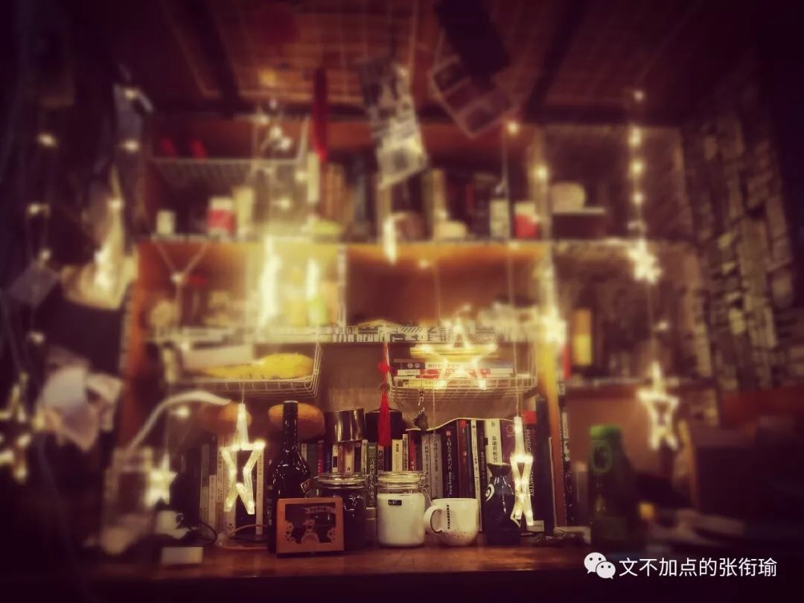
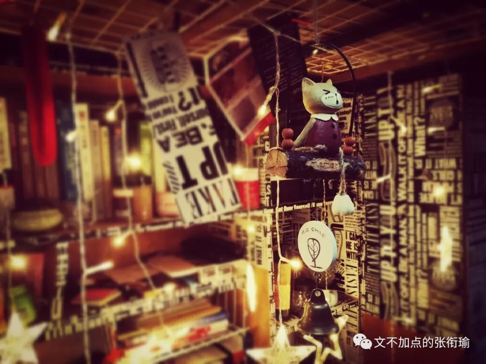
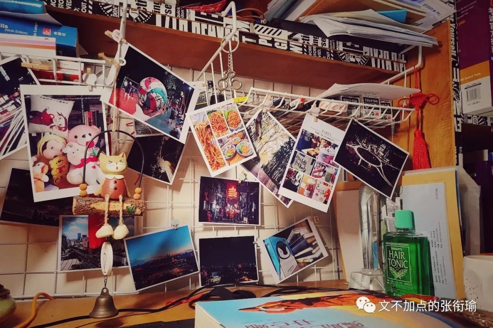

本文共计 1485 个字

一点点尬说罢辽

郁结不同于抑郁 扁鹊家里三个 上医带给人的是一种健康积极的生活方式
治未病于未然 倘若都一定要等到最后了去 这不是我们的生活方式

人人都不想吃苦

却自讨苦吃

人人都向往幸福快乐

但与自我为敌

破坏自己的幸福和快乐

——寂天《入菩萨行论》

今天武汉下起了小雨 但我本来早上是想起来把椅套枕套床单被套都洗了 然后出去走一走 走到下午四点多再回来收了好睡得更舒服

这些小事情 本没有太多的意义

洗晒做一点个人的卫生

或者把寝室里挂上星星灯

又或地铁四十分钟走去黎黄陂路在街角写日记 画一些简笔而抽象的小学生画作

这些本身都没有太多的意义 可生活就是这么组成的

郁结不同于抑郁 扁鹊家里三个 上医带给人的是一种健康积极的生活方式
治未病于未然 倘若都一定要等到最后了去 这不是我们的生活方式

昨天和同学说今天的打算的时候 是想着早上稍微早一点起来 然后洗晒了各种 就出门去 毕竟中午也许没地方睡觉 也许做一点要在外边游荡来去的事情比较好 拍拍图？ Umm 就很不错 也还说想去拔草好久要去的 k11 物外书店看会儿书 带一本高分子做在那样的环境中 鲜萃一杯热拿铁就可以在那边坐很久很久 到了差不多四点多钟 就回来收了晒上去的 然后晚上 也许看会儿书 或者看一部下了在电脑里躺尸了两个多月也没有看过的剧或者电影
或者有人要来找我一起 debug 或者催得紧了不得不去改科研里的事

意义 或者也可以讲得出来 但不是我想说的那一种

和生活死磕 大概 也就是这些事情

中午我梦到去找人帮我一个忙 工地？的人告诉我 我要找的那个人在最顶上 我看了看旁边的脚手架 想着我可能要爬脚手架上去 脚手架分两个长段 中间有一些空余 用幕罩着 爬上去了之后 在中间那一段忽而又觉得不太对劲 拿出手机来发现没有信号没有网络 于是坐下来开始休息

又或者在很累的时候梦到有人跟我将数学结构在算法原理中的应用 想当年程咬金也就是有人在梦中给 ta 教了几路板斧
但是我什么也不记得 只感觉跟我将算法的那个人长得好像齐白石 然后给了我一本叫做 全反关系的调整作用 反正也查不到这本书 就当是大脑随机数表在我的词库里随机生成的几个词拼到一起的一本书好了

经不起推敲的生活是了

前几天有和人在讨论为什么这里那里会有 push 的问题 一方面是大概 push 的动作发出者可能没有好多事情去做 另外大概就是动作的接受者可能需要一点这样的动力 小马过河的前面 假设给现在的人是一条沟 有人在后面推一把 也许久过去了 没有人推 可能自己鼓起勇气就还要很久很久

也许这就是他们做教育的人想的吧 however, I ain’t them

昨天去吃火锅同学问我的生活是有多苦 吃一次火锅也可以人间值得好多次 硬是要说起来 好像也没有怎么样 在做的事情仍然是可以给自己也可以给他人创造价值的 在推动科技从而推动着发展 自己从中受益的则不仅是一些成果 还有过程中的更多

可是可以 但是 没有必要

好像一个人 戴着报纸叠成的帽子 正琢磨着怎么给自己的手表拧上发条 城里的人 都用城中心广场上的钟表作为自己校准时间的模子 而那钟楼里的钟表工 每天都勤勤恳恳地 路过城外那家相传是方圆几百里内最古旧的一家钟表店 先校准自己的手表
再校准时间 一天 钟表店老板又见到钟表工路过 打招呼的时候一不小心说漏了嘴 你们那个钟楼的音乐可真好听
我每天听着你们的钟声校准我店里的表 都觉得心情格外地好

一张巨大的网 将丝线伸进生活的每一个角落 蜘蛛停在网络的最中央
像一只巨大的爬虫 用触肢感受着每一个部分的翕张振动 可 不过如此

落下的阴影和攀爬的光

我说我要找郁结好好谈一次 不是一定要跑出去玩 或者感受些什么拍下些什么 好多多的云 有道是如果要祭水的话
自己拿个脸盆接一盆水也可以在家里完成所有的心路历程 何牢叫着麝香？（如果我没记错的话 非跑那么远的距离去哭金钏

生活像是一帧一帧 一段一段的白噪音

城市在慢慢生长

一段一段的水色天穹中

武汉的天气

把所有鼻子的泪点都调低了

