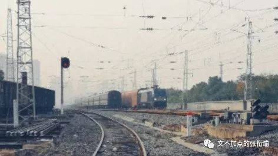
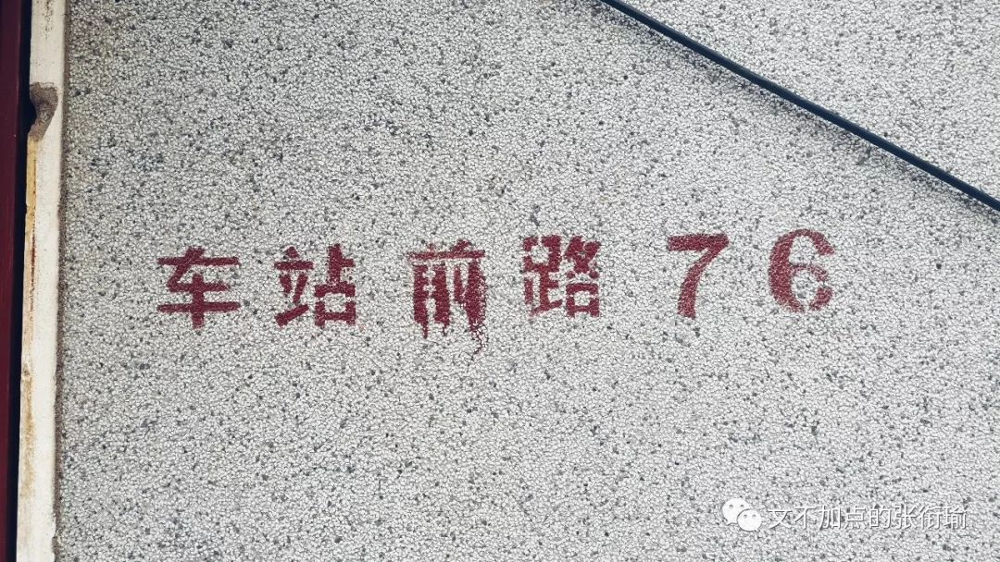
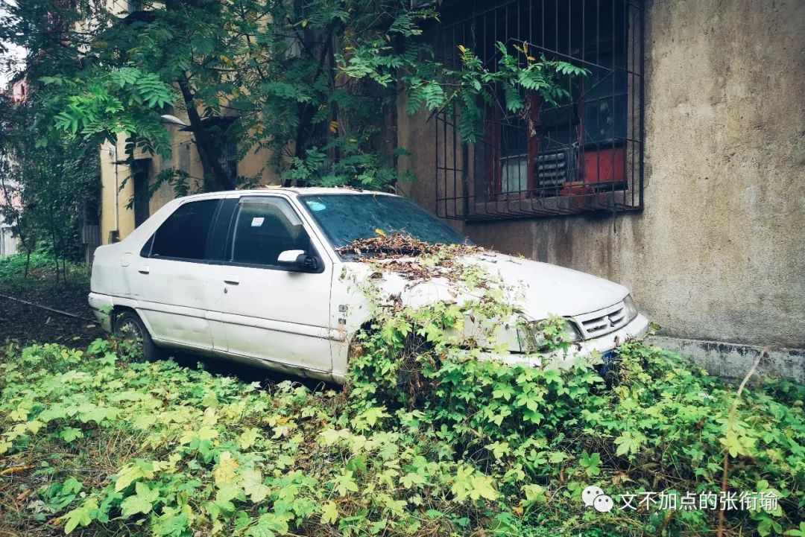
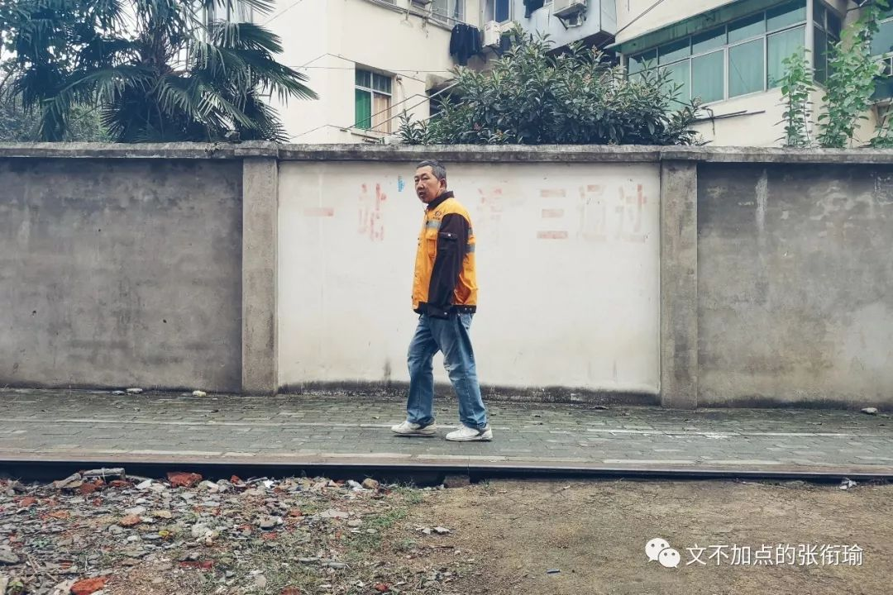
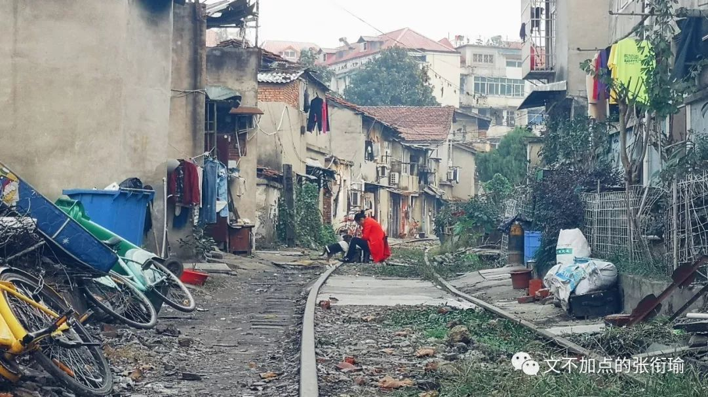
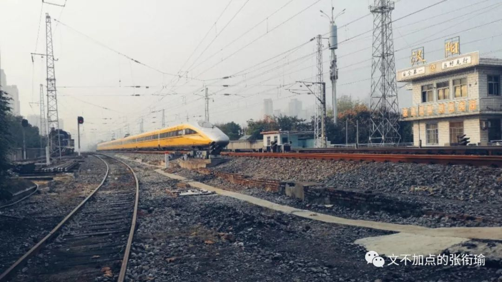
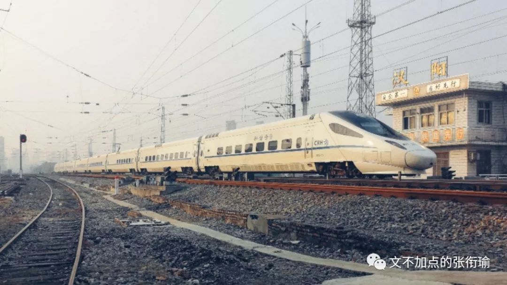
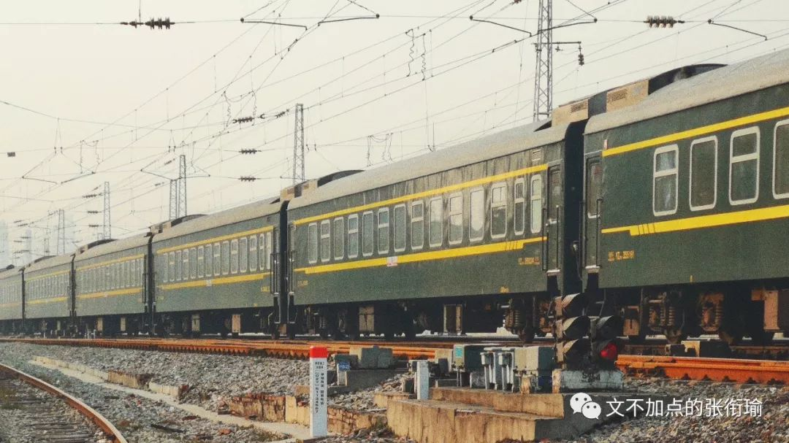
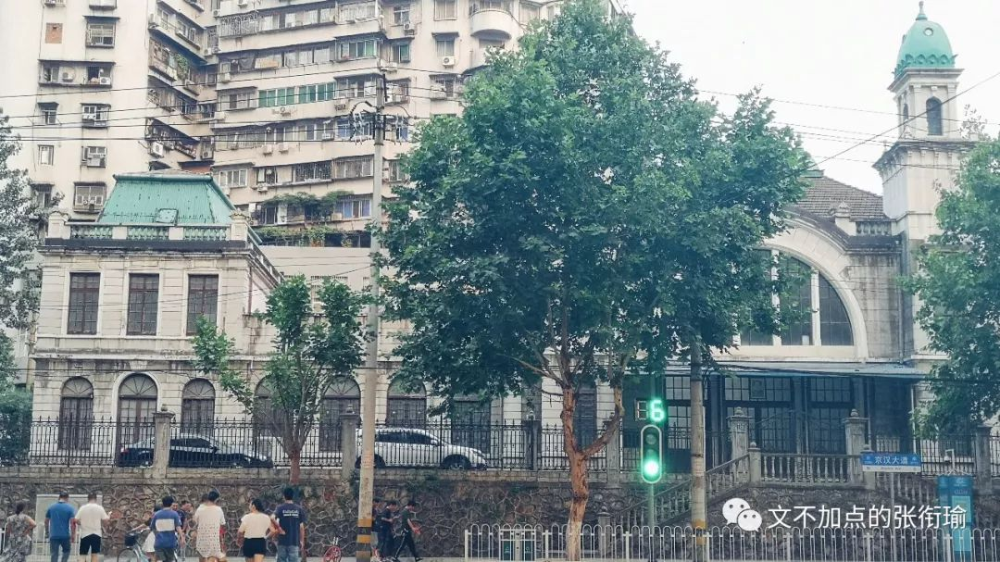
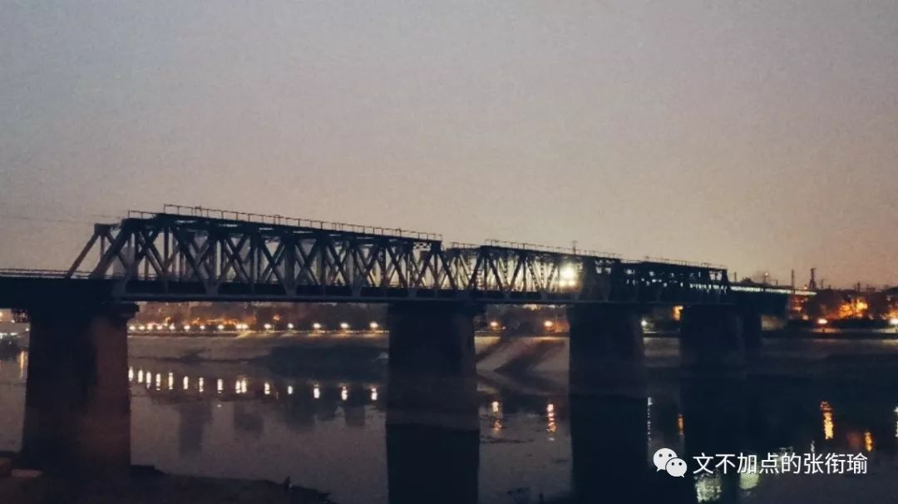

本文共计 1859 个字

出没了 13 张尬拍的图片

在武汉街上闹腾的男男女女
偷走了我的时间

但汉阳火车站不 这是一座时间的印章

在长沙待得最久 也还是常常写 其他去过的小地方 一周之内的 也都会如数一个个写下来  倒是武汉 待得不短 感触不少 成文的 却并是最少  想捉起刀来削去赘余的生活木料 然后塑造出一个sophisticated雕工作品
却一直疏于笔耕

久而久之 这些木材一半埋在我的日记本里 一半在我的朋友圈空间ins汤之类的地方从流飘荡  正反馈调节中 娱乐至死是一种
我关于武汉的这些原木纯浆又是一种  最后终于触到阈值了 膜上的ATP也要开始工作了

时间由远及近 太像是史家笔法 但正着走太多了 辰南知道怎么反转心法 我也想试试倒着走路 看看会不会好一点

这学期每周固定地要出去一次 说出这句话的时候是很羞耻的 因为这几周并没有出去 所以说这句话并不成立  anyway 再往前走 便是上^(n)周  那周周一 和一位有趣的同学去到了 汉阳火车站 现在在我记忆里大概是这个样子虚焦 （ 其实是看都看不清的一张列车交错2333（误

武汉现在有武汉站走高铁 武昌站和汉阳站既有高铁又有普通列车
庙街和光谷火车站只存在于地图上  倒是汉阳火车站真真切切地在地铁上有一站可看到 但据传是一直进行货物运输
所以很少向非铁路人员开放 我自然不会墨守成规

去到的地方叫 车站前路 脚底下便是铁轨 同学说在以前 这一块儿是真的会有火车过去的  以前小学课本上写 植物种子在发芽之后往往会体现出常人无法想象的生命意志 很形象地说 是滚滚的春雷过去了
小草把压在身上的砖石掀了个跟头  枕木依旧驻留在车站前路的路基上 就连铁轨也没有多少变化 停在上边的 僵尸车 与砖石建筑上的 爬山虎

突然笑了是因为 细细的读的话
一旁低矮的建筑上写着 一站二看三通过 一位中年男子走过 打量着我们显然是对我手中的稳定器看着在琢磨 不管是于新闻行业人员的提防也好还是对云台的若干好奇 我倒是很迅速地蹲了下来 调整角度后将走过的人和背后的字眼一齐抓到了镜头里  夸我小能手吧 不要吝啬赞美 溢美之辞？Umm well也不是不可以

更往前走 回身望去 坐在草木铁轨中央的女子
正做着手里的活计  小狗徘徊了几次 后腿支起来想和人玩耍

Train
whistles in a distance.

Train
brakes squeal and screech.

Stationmaster’s
whistle blows.

Like
church bells ring and horse whinnies.

Indistinct
chatter. Door slams.

这些都是 纯英文字幕电影中
一般setting在比较早年代的时候 会有的一些串场字幕  我们在路的尽头架上三脚架 稳定器和拍摄用的手机

等火车来 就像是在湖边钓鱼

鱼什么时候上钩呢？  我其实一直不理解垂钓的乐趣究竟在哪里 小时候去 连在鱼塘旁边跑来跑去都会被说要我 小声一点 不要给鱼知道了有人在岸上 看那些钓鱼的人 就拿根鱼竿在那 也不怎么动 只是同旁边人小声交谈着  小时候觉得这些人可无聊了 那到底鱼会什么时候上钩呢？ 他们也不知道 不知道答案的事 实在是神秘而无聊
产生着大人们总喜欢卖关子的不好的印象

等火车的时候 看着好像是拿着稳定器一直站在这
什么也没动  眼睛虽然看着前面 但有点类似于电脑 只保留了最小的空间给盯着前方有没有火车出现的眼睛
和警觉后方有没有火车过来的听鸣笛声的耳朵  留了这两个唤醒程序后 其他的部分就 任由各种各样的心思脑内到各个地方去

去的当天 天色不是太好  有的是轻微的雾霭 却恰好将视线最远处的城市天际线 隐得有些模糊  下午的太阳照在 鎏金 的汉阳站哨岗上 惹得我看到的世界变得有如辉耀般明亮  我的用词中 出现当时身后的那般十八世纪油画似的乡村风景 是少见但总还有的  但出现如身前铁轨上这般交错了不确定的神秘而明明白白的流光辉耀 却是真的少见

车上的人 是谁呢

这列车 是从什么地方开来的呢

在规划中 来到汉阳的车大多是货运用车 客运的停靠都会到武汉站汉口站和武昌站  那 这些车上 装了些什么呢  是煤铁矿石 还是来往信件  是粮油米面 还是衣装染料 衔瑜什么也不知道 但也正是多了太多想象的空间

一位胡子拉碴的列车长 提着一瓶上次去山西的时候沽的汾酒
慢悠悠地绕车一周 爬上列车  列车长对着镜子 正了正帽子 随口问了下副手 “小伙，我们现在在哪呢？” 副手把放大镜放下来 压着桌上的中国地图说 “回师傅，我们现在在江苏徐州，得开往湖南怀化去。” 旋即瞥见了列车长偷偷放在驾驶位置上的汾酒 提醒到 “师傅，这酒怕是，不方便吧” 列车长稍微迟滞了一下 撇了撇嘴 又看了看驾驶室两旁的窗户 探出头说了声 “升弓，分相准备！” 然后给副手赔笑 “小场面，不要慌，我只是闻闻，不会喝的。” 接着 咕噜咕噜 就是一大口地喝下

快天黑了的时候 我们转 去了罗七路
找汉水铁路桥 这是一座 比那座任命了武汉市长为江大桥通知的桥 还要早三年的一座铁路桥 更早以前 便就要上溯到张之洞时期建的大智门火车站即老汉口站了

一直觉得铁路是很有 年代感 的象征 同学说其实绿皮火车的价格 一直都没怎么上涨  现在从长沙到广州去 也只要不到一百块钱  但拍铁路到底是极好极好的 和在公路上拍城市风光的traffic
light和一些人们来来去去的匆忙时分 都是极好的

听说新的汉阳火车站要在19年开工了 而百度百科中原定18年底建成的光谷站 到底是一点声音也没有  倒是校门口的地铁站快好了 也因此又封了路
