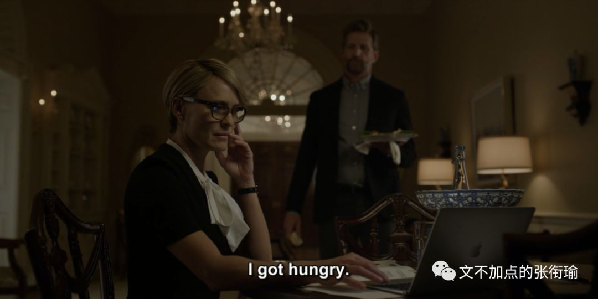
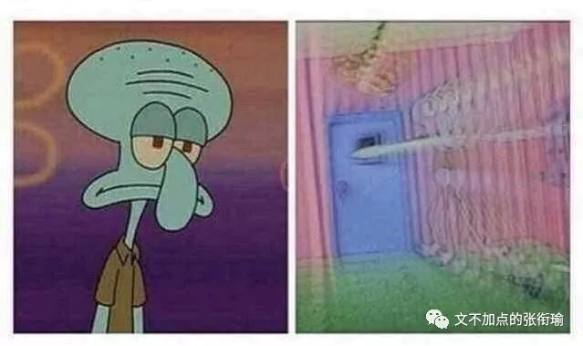
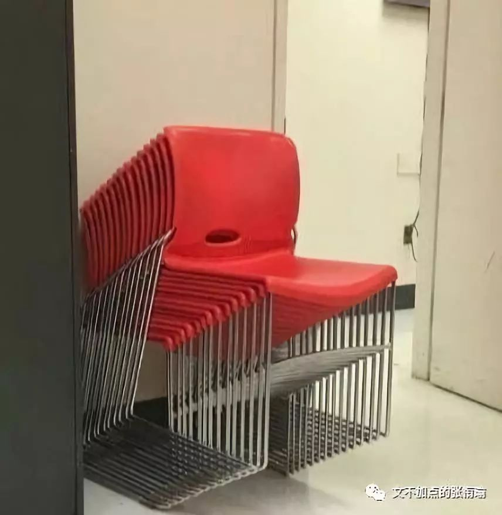

本文共计 778 字

一下就读完了

特地去找了一下纸牌屋里的这一段对话 当 Claire 问 Tomas 晚上做什么去了的时候

Tomas: I got hungry.

Claire: if there is anything you need, it
can be brought up.

Tomas: I did not know what I needed until I
was eating it.

很喜欢这一段 虽然并没有任何一个句子集锦 blah 提到这个部分

最近又习惯性地 skip meals ，吃饭真的是一件很艰难的事。

在复习的时候
要从座位上起身，搭好衣服，检查有没有带饭卡。然后下楼 刷卡 出门，一想到还要和食堂打饭的人说我要吃什么，还要端盘子找座位，咀嚼 下咽 拿纸擦嘴。很累。

当然还有计划表里，元旦附近多出来的几天。一想到突然多了几天，就没有动力做现在手上的事。结果是每天的复习任务， 每天都没有完成 既不知道要拖到哪天去 也懒得就现在的新时间安排再拟个表出来。

蹭了一下桌上的草稿纸 写满公式和算式的白纸一下弯曲了

没有笔套的铅笔 也就没有阻拦地 轱辘了几圈 掉到地上 浸到地上的雨水 是从放在屋里的伞尖上扩成的一小滩

是刚刚醒来 眼睛干涩 有很多话但是说不出来 吱呀了一阵挣扎着起身 拨拉过小阳台上拦在眼前垂着水的裤脚 赶开从没取下洗过的纱窗 弄了弄想来已经糟得寥落无几的头发
手上方才掉落着几根 吹落了去

天空 显得有几分澄澈

今天竟然是个 晴天

人 确实很多 但鸦雀无声 人们都在说话 但没有听到任何声音 窸窣的嗡嗡声慢慢响起 小小的声音一点点地突然变大 像一条 指数函数 开始的时候明明看着只有微不足道毫不起眼的一滴滴
人们都在关注其他函数的时候 猝不及防地 开始爆炸 声音太大了 能不能关小一点 不管怎么吼叫 怎么对着打对着吵对着举起四十米大砍刀 都于事无补 make no sense

我行我素地愈发大声

一阵子之后 不知道消了什么事情 突然之间陡转而下 如果这是什么的话 会以为是突然 转置 了方向 到底怎么回事呢 只不过是纳闷 并不知道为什么 不知道为什么来 不知道为什么去 就好像薛定谔出现的事情 只出现在一刻 控制不了也拿捏不准

一来一回的烛光中 一些人在执拗地争执

是铆还是卯
是柱还是炷

摇摇若醉 中心如醉

不过如果是这样的话

幸好是和所有人没有什么区别的才对吧

当然今天 还有很多天 还是有加油  也不光只是有加油 （没有特种兵 还有在寝室坐了一天 饿了就求舍友投喂 或者一次外卖点几餐的量 然后趁着冬天 小鸟胃？ 点就下次有东西了这样子

开心快乐每一天

