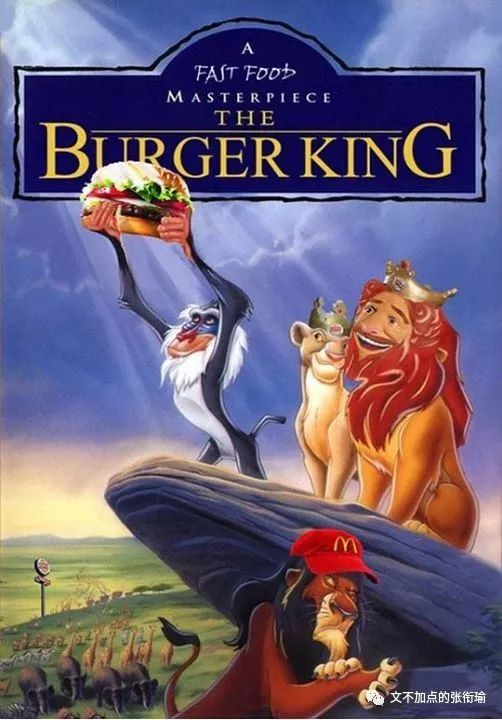
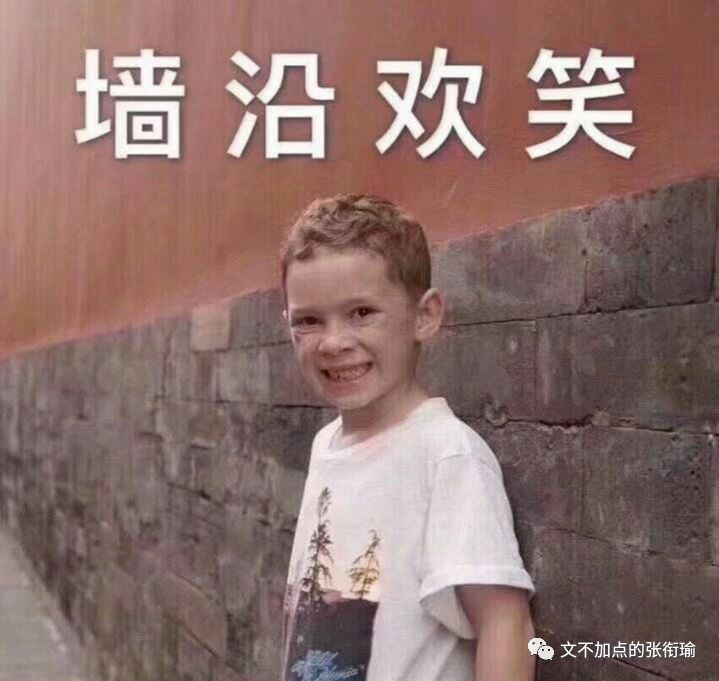
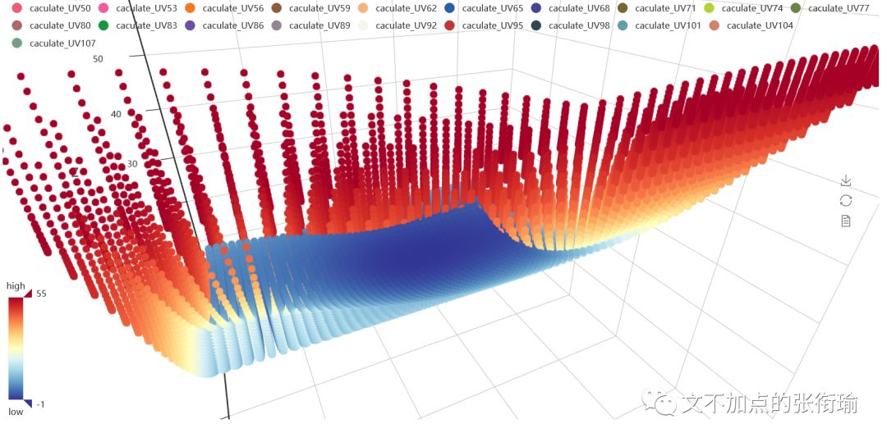
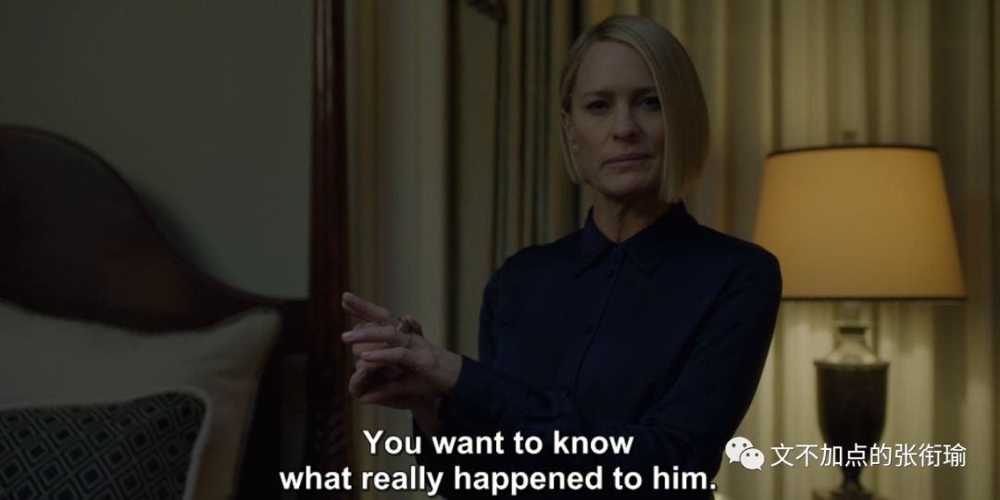
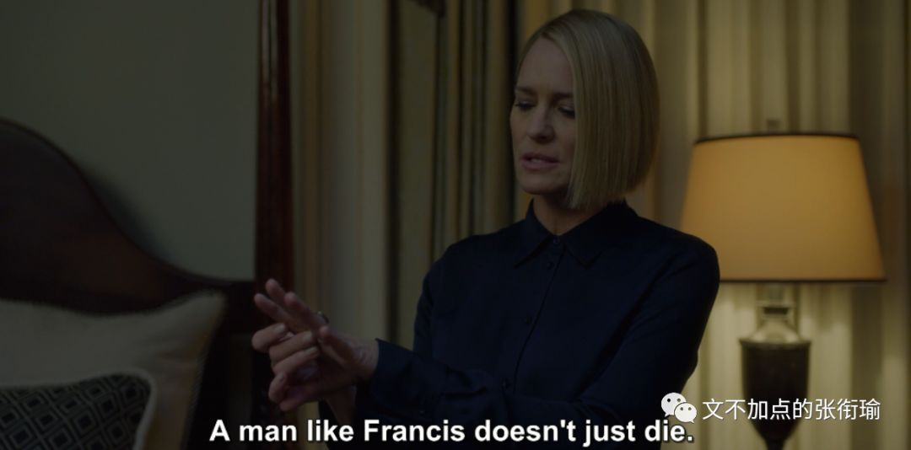
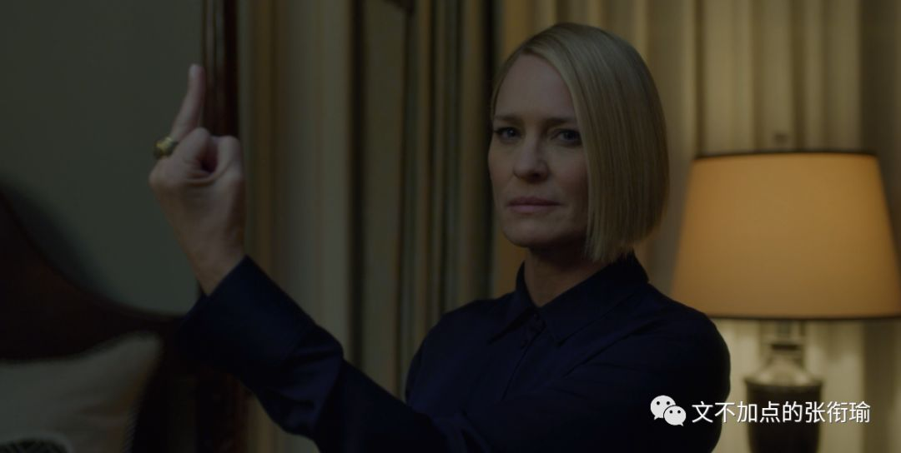

> 本文共计没有几个字

本文共计没有几个字

> 一半在桌上躺尸 一半摘了眼镜戴上耳机

一半在桌上躺尸 一半摘了眼镜戴上耳机

复习周的事 谁说得清呢

也没有说在哪里玩或者怎么的
甚至昨天说起纸牌屋发现第六季出了 去看一下发现演了前五季的 男主不见了 大概是因为丑闻什么的被开除出了剧组
然后引进了几个新角色

不过我也没有怎么看下去

一天基本上就是 后台跑着程序 时不时去收一下 看看自己设置的输出控制 有没有报错什么的 除了沙雕图之外的消遣 就只有看看英语的生肉剧 比如提到的 纸牌屋 以及美版的 成龙历险记 没有字幕组也是很难受

于是开始重新看一看 GRE 的阅读 还想起很久没打字了 所以趁着练打字的功夫就把两篇打了放上来 都是 单选 看我公号的应该也都看得懂 idk 答案和中文翻译在后边 都只有一道题 不如随便写一写

> Even after numerous products made with
artificial sweeteners became available, sugar consumption per capita continued
to rise. Now manufactures are introducing fat-free version of various foods
that they claim have taste and texture of the traditional high-fat versions.
Even if the manufactures’ claim is true, given that the availability of these
fat-free foods will reduce fat consumptions.

Even after numerous products made with
artificial sweeteners became available, sugar consumption per capita continued
to rise. Now manufactures are introducing fat-free version of various foods
that they claim have taste and texture of the traditional high-fat versions.
Even if the manufactures’ claim is true, given that the availability of these
fat-free foods will reduce fat consumptions.

Which of the following, if true, most
seriously undermines the argument?

A. Several kinds of fat
substitutes are available to manufactures, each of which gives a noticeably
different taste and texture to products that contain it.

B. The products made with
artificial sweeteners did not taste like products made with sugar.

C. The foods brought out in
sugar-free versions did not generally have reduced levels of fat, but of the
fat-free versions about to be introduced are low in sugar.

D. People who regularly consume
products containing artificial sweeteners are more likely than others to
consume fat-free foods.

E. Not all foods containing fat can
be produced in fat-free versions.

> Because of strong overall stylistic
similarities, prehistoric cave painting in El Castillo, Spain and other in
Altamira, Spain, were thought to data from the same period. Recent pigment
analyses, however, established the Altamira paintings as by far the older and
as about the same age as a third group of paintings done in a different overall
style. Nevertheless, this case does not prove that stylistic similarities cannot
be a reliable indicator of closeness in age, since__.

Because of strong overall stylistic
similarities, prehistoric cave painting in El Castillo, Spain and other in
Altamira, Spain, were thought to data from the same period. Recent pigment
analyses, however, established the Altamira paintings as by far the older and
as about the same age as a third group of paintings done in a different overall
style. Nevertheless, this case does not prove that stylistic similarities cannot
be a reliable indicator of closeness in age, since__.

Which of the following most logically
completes the passage?

A. Experts who knew the results of
the pigment analyses reexamined these paintings and found no previously
unnoticed stylistic similarities between the Altamira paintings and the
paintings in the third group.

B. There certain stylistic
features that the Altamira paintings share with all known paintings of their
period and do not share with the El Castillo paintings.

C. Before dating by pigment
analysis was widely practiced, stylistic similarities were the only means of
deterring whether two prehistoric cave paintings dated from the same period.

D. Deterring the age of a prehistoric
cave painting simply by reference to the age of the pigments used in that
painting substitutes technology for artistic judgment.

E. There are experts who maintain
that the results of the recent pigment analyses leave the striking stylistic
similarities between the El Castillo paintings and the Altamira paintings
unexplained.

中文翻译是谷歌翻译直接翻的 我比较懒就没有去改 正好 给跳过了英文直接看中文翻译的朋友制造一点困难

> 即使在使用人造甜味剂制成的众多产品之后，人均食糖消费量仍在继续增加。现在，制造商正在推出各种食品的无脂肪版本，他们声称这些食品具有传统高脂肪版本的味道和质地。即使制造商声称是真的，因为这些无脂肪食品的供应将减少脂肪消耗。

即使在使用人造甜味剂制成的众多产品之后，人均食糖消费量仍在继续增加。现在，制造商正在推出各种食品的无脂肪版本，他们声称这些食品具有传统高脂肪版本的味道和质地。即使制造商声称是真的，因为这些无脂肪食品的供应将减少脂肪消耗。

以下哪一项，如果是真的，最严重地 破坏 了这一论点？

A. 制造商可以使用几种脂肪替代品，每种脂肪替代品都含有明显不同的味道和质地。

B. 用人造甜味剂制成的产品味道不像用糖制成的产品。

C. 无糖版本的食物通常没有降低脂肪含量，但即将推出的无脂肪版本含糖量低。

D. 经常食用含有人造甜味剂的产品的人比其他人更有可能食用无脂肪的食物。

E. 并非所有含脂肪的食物都可以以无脂肪的形式生产。

> 由于强烈的整体风格相似性，西班牙埃尔卡斯蒂略和西班牙阿尔塔米拉的其他史前洞穴绘画被认为是同一时期的数据。然而，最近的色素分析确定了阿尔塔米拉的绘画作为迄今为止的老一点的那位，和与第三组绘画大致相同的年龄，以不同的整体风格完成。尽管如此，这个案例并不能证明风格相似性不能成为年龄接近的可靠指标，因为 ___ 。

由于强烈的整体风格相似性，西班牙埃尔卡斯蒂略和西班牙阿尔塔米拉的其他史前洞穴绘画被认为是同一时期的数据。然而，最近的色素分析确定了阿尔塔米拉的绘画作为迄今为止的老一点的那位，和与第三组绘画大致相同的年龄，以不同的整体风格完成。尽管如此，这个案例并不能证明风格相似性不能成为年龄接近的可靠指标，因为 ___ 。

以下哪一个最 合乎逻辑地完成 了这段经文？

A. 知道色素分析结果的专家重新审视了这些绘画，发现阿尔塔米拉绘画与第三组绘画之间没有任何未被注意的风格相似性。

B. 阿尔塔米拉的绘画与他们所有时代的所有已知画作共享某些风格特征，并不与 El Castillo 画作分享。

C. 在通过色素分析进行约会之前，广泛实行，风格相似性是阻止两个史前洞穴壁画是否同一时期的唯一手段。

D. 仅仅通过参考该绘画中使用的颜料的年龄来确定史前洞穴绘画的年代，取代技术判断的技术。

E. 有专家认为，最近的色素分析结果使得 El
Castillo 绘画和 Altamira 绘画之间的风格相似，无法解释。

> 答案： B; B

答案： B; B

我就知道很多人觉得看了英文之后觉得还好 但是看了中文之后反而蒙了 或者是看了中文觉得不对又去回看英文 然后发现更加晕了 抑或是无从下手 直接跳到了这两段部分看到这里来了 直接叉掉了对话框的一部分 就不管了

抛开 GRE 的魅力不谈 这其实是 个人生活方式的一些剪影 即便这只是一个随缘更文的公众号和沙雕后台

我 无意于 去 谈论这两道题的答案到底合不合理 或者说 应该怎么做出来这两道题 我最近做的题看的书想的事都已经够多的了 知道这些 是讨论或者想不出来什么真实结果的

万青在歌词里写到 如此生活三十年 直到大厦崩塌 随随便便 我就已经把好久好久以后的事情现在全都在脑内剧场中上演完毕了

前一段时间 姬哲湍的小伙伴们去专访了 王尧 专访稿的里有王尧说道的这样的词句

> 所有的学术研究、读书不是为了扼杀人的生命力，而是为了解放人的生命力，是让人活得更有意义，更有价值。在自己力所能及的范围内要买些好衣服，要去逛街，吃点好东西，我们的所有教育不是让人变得无味，而是让人变得有趣。

所有的学术研究、读书不是为了扼杀人的生命力，而是为了解放人的生命力，是让人活得更有意义，更有价值。在自己力所能及的范围内要买些好衣服，要去逛街，吃点好东西，我们的所有教育不是让人变得无味，而是让人变得有趣。

我不敢说现在的教育是不是这个样子 不仅仅有体制的引导
有一线教师的传授 也有每一个学生个体作为对自己负责的主体在这之中做到了什么的样子 中文说这三点的时候 有很多的 侧重 分别 我的本意自然也不是三驾马车 硬性平均 或者怎么 加权

用本行业的术语来说 这三者之间应该是要 相互耦合

套话说起来叫 有机结合 都是随便 乱说 的

一旦复杂一点的结合都叫有机结合 好的蔬菜是有机蔬菜 牛奶是也是有机奶 不知道有的哪门子机

到了复习周往后 或者说 一直以来 我的沙雕朋友们当中 就很多的 杨超越 头像 不过也很正常 和老一辈里面 没必要谁看不起谁 一切历史都是当代史 以前的人们和现在的 心理结构 有相似的地方

比如说锦鲤这个东西 和之前所谓的求福十法 或者各种各样的寄托仪式 都是差不多的 再说得明白一点 关云长 就是以前的杨超越

关公也什么都管 各行各业都奉他做祖师爷 卖绿豆的 打铁磨刀的 剃头的 还有奉做财神爷的 我知道各行各业这个表述不怎么准确 但为了配合上一代的语言习惯还是这么说好了 再看看杨超越 或者信小呆之类的其他的锦鲤 也就是同样的心理结构了

只是生活已经这样地苦 人艰不拆 说不定就是人家的稻草
和沙雕图 & 更文减压一样 达到的效果或者原本希冀的目的是一样的

我之所以配图这些的 最近又只能全部都是一些表情包这样子 是因为就真的没有出门 出门了的图 都是一些在外边拍的 视频或者图片 好看的或者丑陋 但在寝室就不一样了 在寝室就基本上只有学习 物质生活的直径就是床板到寝室门口那个外卖员会到的地方 精神生活的直径就从量子开始一直跨到了不知道在哪里的形而上部分

> 佛不遗忘众生的疾苦 时时刻刻点击众生 救应众生

佛不遗忘众生的疾苦 时时刻刻点击众生 救应众生

冬天的雨 在窗外嘶吼 徘徊

就把它想象成一只流浪的杜宾狗

在寻找入睡的地方

我只是听听它的咆哮和不安

想象它的喉咙里 在鲠住时戳破

