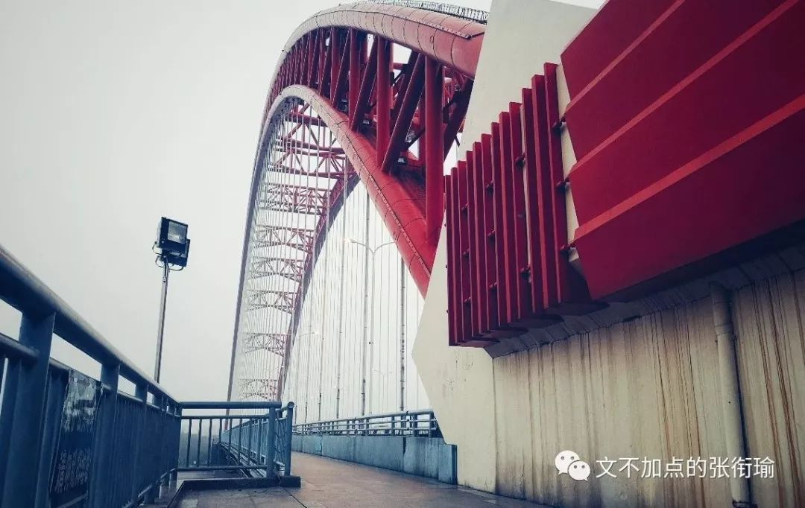

> 本文共计3056个字 是寄送的一篇咆哮推送

本文共计3056个字

是寄送的一篇咆哮推送

前天的日记节选：

让步的感觉还是用英文说比较好 Though i do not wanna say it
in that way, 但我似乎对被人鸽这种事情格外敏感 也可能生活本没有太多事情 于是一点点小事也有可能突然想很久

冬至 听起来也还不错 但在我一个长沙人看来 到武汉读大学以前 我从来没有听说过冬至也算个节 甚至还要吃饺子或者喝羊肉汤之类的其他习俗 有四拨人约我出去吃饺子 几个人 或者只有一个人

I am busy doing nothing. 句子的用法深得我心 四天了 我在寝室待了四天 每天就是学习 睡觉 吃饭靠舍友投喂 或者走出一天中最远的距离去到楼下拿外卖
就像之前的推文里说的那样

我自己都感觉自己刻意地无趣 虽然本身也 很无趣 想逃离寝室 教学楼 学校 至少不要再总是待在寝室楼里不出去 但是一想到没办法生活所迫要带着书走 武汉的图书馆书店什么的 在脑子里一家一家想完 想完所有去的路上要发生的事 在看书的时候要看的内容和看完之后回来的事 就 一点动力也没有 仿佛已经过完了这一切

我之所以很感冒万青的那一句 如此生活三十年 直到大厦崩塌 是因为我也脑内完了所有的事 说了所有的谎 我没有什么事情是情愿的或者实在情非得已的 没有用

我怕我明天一早醒来 又是一个晴天 而我也 又还是在寝室 看书 写字 敲代码走走停停 逛逛沙雕图 life just turn Starbucks into Sucks 真实灵魂实验

昨天确实出门了 在路上走走停停 开 gofun 这种共享汽车出去的最大的问题 是在于 找不到停车位 几次之后我大概有经验了一般都停在了那些公用的停车场里 露天 可能在哪个酒店门口或者临时开辟了停出来的地方去

计划到 南岸嘴 去浪 停车到 汉口 然后步行过 晴川桥 在 孙中山像 附近绕了太久太久 汉口老城区最老的那一部分 现在继 汉正街 后也是各大布艺商贩的集中地 定位一上了车之后就会不准 单行线过了停车点之后 绕绕一大圈 开进了一家菜市场然后菜场的人说前面走不通得倒出去 真实考验我微操的 车技 绕着绕着脚都踩累了要疲劳驾驶了

下车之后我说我一定要拍几张照片 是开始在转的时候看得很市井的几个地方 我的字典里 说 市井 倒并不是指的小市民 是那种带着 烟火 气息 是因为有人在这边生活 有家长里短的一些碎碎细细的事情

倾倒的树干在临街的店铺上野蛮地生长 店里的师傅还在和面 到处都是提着袋子拖着小车子来菜场采购的人 小小的店铺开个张 也要摆上几盘花篮 挂一点氢气球 用高音喇叭开始音乐配上中气十足的女声来宣告自家的产品如何如何

伙计熬过一碗羔汤（我没有打错字 走到街边泄水的地方直接倒了进去 也许是怕店里的管道堵住吗 团团的热气上升 散发着令人有两三分食欲但甚而至于更多的还带一点作呕感觉的部分

有人专门把市井说成是吵闹下贱不安和唐突的聚集地 我只觉得是生活

低矮的板车 现在大概是可以电动了 空空如也的板车在四处游荡不知道是不是像摩的师傅一样跑一些拖货运货的生意 交警协管在路口尽力地维护附近的秩序 对着货物堆了四层的板车师傅 姑且让我这么称呼他们 说着 快走快走 指了指信号灯

> 临街门面的油布篷子里兜着深深的一窝水。这老街，即老者。老者沉静寡言，只用满脸的皱纹告知你他的丝丝白发中凝结了多少世事沧桑人情练达。老街亦然。不信，且看脚底正摩挲的那方麻石。正坐在石墩上休憩遐想着，一位衣着单薄的男人慵懒地推着板车而来。车轮狠狠地碾过，麻石伸了个懒腰，发出浑浊的清痰声。浑黄的水花乱溅，好一个文庙坪世俗的点睛之笔。

临街门面的油布篷子里兜着深深的一窝水。这老街，即老者。老者沉静寡言，只用满脸的皱纹告知你他的丝丝白发中凝结了多少世事沧桑人情练达。老街亦然。不信，且看脚底正摩挲的那方麻石。正坐在石墩上休憩遐想着，一位衣着单薄的男人慵懒地推着板车而来。车轮狠狠地碾过，麻石伸了个懒腰，发出浑浊的清痰声。浑黄的水花乱溅，好一个文庙坪世俗的点睛之笔。

这是我高二的时候 也是一个元旦附近的时候 骑车去长沙 文庙坪 写的一篇叫 《偶然间遇到童话》 中的一段 世俗 市井 就算以后世殊时异 有人的地方 就会有生活 而生活是不会变的 权力意志也好到了生存意志的部分 生活还是这个样子 像天桥下打麻将的大爷们 只是这样

走上晴川桥

拍一拍桥上的照片

也许朋友用单反来拍我在用手机拍桥灯

走到南岸嘴看到滩涂上的插花

对岸和汉江上驶向对岸武昌的接驳渡船

找地方吃点什么 看到菊乃井 下次再去

我昨晚后来去看的话剧 里边有一段台词 我在看之前很久就知道了

> 黄昏是我一天中视力最差的时候。一眼望去满街都是美女，高楼和街道也变换了通常的形状，像在电影里。你就站在楼梯的拐角，带着某种清香的味道，有点湿乎乎的，奇怪的气息。擦身而过的时候，才知道你在哭。事情，就在那时候发生了。

黄昏是我一天中视力最差的时候。一眼望去满街都是美女，高楼和街道也变换了通常的形状，像在电影里。你就站在楼梯的拐角，带着某种清香的味道，有点湿乎乎的，奇怪的气息。擦身而过的时候，才知道你在哭。事情，就在那时候发生了。

我每次看话剧 皇莎的 [李尔王](http://mp.weixin.qq.com/s?__biz=MzUzNjE3NzA3Mg==&mid=2247483993&idx=1&sn=49a1bd1d4280592805196111f35ee123&chksm=fafb7286cd8cfb90f5d279bd6f203e84b8a8d450cac6981bdb983bdefee578f2bd44126556ad&scene=21#wechat_redirect) 林兆华的 [等待戈多 || 三姐妹](http://mp.weixin.qq.com/s?__biz=MzUzNjE3NzA3Mg==&mid=2247484243&idx=1&sn=e5262d8bf6c3b014bd66d79e1b4b4230&chksm=fafb738ccd8cfa9aa26e3fbd0ff8bc24febd5aeefc8eacdcaa3a5b6ac7aa38b53505486f8578&scene=21#wechat_redirect) 呼吸 以及这一次恋爱的犀牛 于我而言 倒不会去扣哪一块台词 哪一戳布景或者甚至于哪一个串场以及哪一个人和我一起去或者根本没有人一起我只是自己去看 于我而言 empathy with the
same feeling weights the most 太难过了就像说自己的那样心 里憋着一壶的都是叫喊 但没有说出来什么

> 也有很多次我想要放弃了，但是它在我身体的某个地方留下了疼痛的感觉，一想到它会永远在那儿隐隐作痛，一想到以后我看待一切的目光都会因为那一点疼痛而变得暗淡了，我就怕了。爱她，是我做过的最好的事。

也有很多次我想要放弃了，但是它在我身体的某个地方留下了疼痛的感觉，一想到它会永远在那儿隐隐作痛，一想到以后我看待一切的目光都会因为那一点疼痛而变得暗淡了，我就怕了。爱她，是我做过的最好的事。

其实我 最近 总是很后悔 总是很自责 我又好多事要自责的啊 即便大家都觉得我是一个做人做得很成功的很受人欢迎的人 但就像张枣在镜中里所说的 只要想起一生中后悔的事 梅花便落满了南山 我太想哭 太想哭了 我是个什么人 谈恋爱不会伤心吗 说感情不会头脑空白吗 和朋友因为要去赶剧场 所以随便吃了些 有生的感觉没熟的 所以回来又喝了点酒

我真情实感对我自己感到绝望
对现在的所有事觉得无趣 这是抑郁吗
不 我觉得倒是对自己的自责和讨厌 我太不喜欢我自己了
虽然这是一个很复杂的情感对与我而言 我可以同时间多线程想好多好多事

所以大家都觉得我很厉害可以同时处理那么多关系 在学业上觉得我的安排和调度是中肯而没有什么缺漏的 但至于感情 我终究只是在苟延残喘不要最后的尊严 也许连这样 也没有真正谁和谁在怎么样的过程当中事件当中谁看不起谁
谁看不过谁 谁没有谁和谁的绝望以及共情

撕下人皮面具 谁不是个空白呢 伪装可笑 生命可笑 这样一来不管是佛祖还是所谓的一些奋斗目标 这是我为什么日常觉得我所做的奋斗毫无意义 我真的只是因为无聊才费力不讨好地做着我现在做的这些 人的精神生活 精神体验可以很丰富 也不要和我讲什么 你还在想诗和远方而父母还在苟且 的鬼话 我不会 拿着刀来以死相逼说 如果不是考虑到父母我现在就会去死 这样 我所做过的努力和正在做的恐怕不是除了我自己以外的任何人所可以想象的 太过于暴躁的不是我 虽然我经常看很多无聊的但又被拍在了脸上的事情觉得要奋起爆刀 想想有还是算了不值得

他坐在桌子前 耷拉着头 从身后绕过来的大衣
原本是搭在椅背上的 身子往下溜 尔后翻下大衣的帽子罩住眼睛 裹了裹身上的小被子

浅浅地像在倾诉 没有任何攻击性地 如怨如慕 如泣如诉 像个吹洞箫的船客 “啊，我好难过啊” 手都不会抬起来一下 一会会之后可能就睡着了

旁边人走过来 也许出于好意 也许只是象征性的慰问一下 拍了拍肩 但他一下从椅子上弹坐起来 用仿佛要把肺都吼出来的声音咆哮 “ mmp 莫挨劳资”

从前没得选 现在只想做个好人 却还有人恋爱来了依旧渣到抠脚
如此而已 舔狗不得 house

> 你应该像其他的犀牛一样顺从你的命运，你就不会整天这么郁郁寡欢。顺从命运竟是这么难吗？我看大多数人自然而然也就这么做了，只要人家干什么，你也干什么就行了。也有很多次我想要放弃了，但是她在我身体的某个地方留下了疼痛的感觉。一想到它会永远在那儿隐隐作痛，一想到以后我看待一切的目光都会因为那一点疼痛而变得了无生气，我就怕了。爱她，是我做过的最好的事情。

你应该像其他的犀牛一样顺从你的命运，你就不会整天这么郁郁寡欢。顺从命运竟是这么难吗？我看大多数人自然而然也就这么做了，只要人家干什么，你也干什么就行了。也有很多次我想要放弃了，但是她在我身体的某个地方留下了疼痛的感觉。一想到它会永远在那儿隐隐作痛，一想到以后我看待一切的目光都会因为那一点疼痛而变得了无生气，我就怕了。爱她，是我做过的最好的事情。

19:36 开场的剧 21:42 结束

我在循礼门随手拉了两条流光 没有什么清奇的

只是回来路上多在光谷的一个路边摊旁边停留了一下 路上的小狗也看着摊位 眼巴巴的 我想我当时的表情也差不多吧 因为还有点点饿

我知道也可能没有人能帮到我 明天也不会对我更好一点 我知道要加油并且今天剩下的时候 明早醒来我也都会那么做 但还是难受说不出话

就算我还在喝着酒 转笔 甚至可以想想题 看看后台程序是不是还正常

hilarious and pathetic

> 一切白的东西和你相比都成了黑墨水而自惭形秽 一切无知的鸟兽因为不能说出你的名字而绝望万分 一切路口的警察亮起绿灯让你顺利通行 一切正常的指南针向我标示你存在的方位 你是不留痕迹的风 你是掠过我身体的风 你是不露行踪的风 你是无处不在的风

一切白的东西和你相比都成了黑墨水而自惭形秽

一切无知的鸟兽因为不能说出你的名字而绝望万分

一切路口的警察亮起绿灯让你顺利通行

一切正常的指南针向我标示你存在的方位

你是不留痕迹的风

你是掠过我身体的风

你是不露行踪的风

你是无处不在的风

风止于秋水 而我止于你

