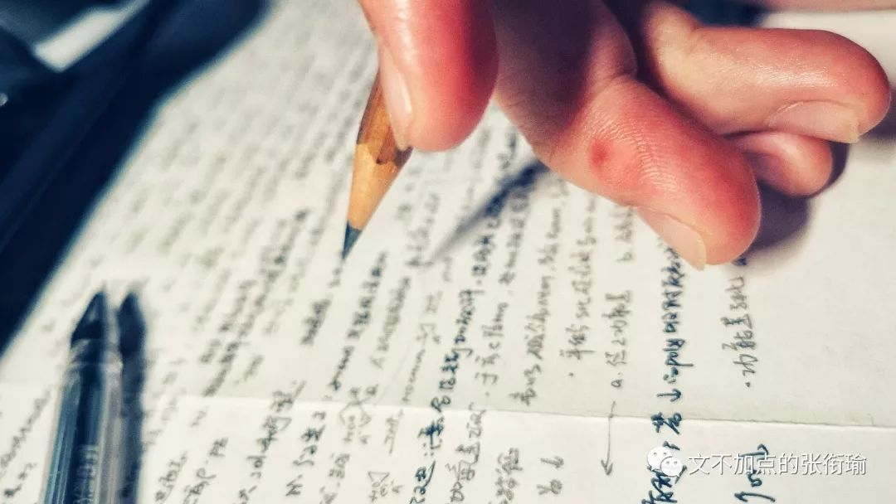
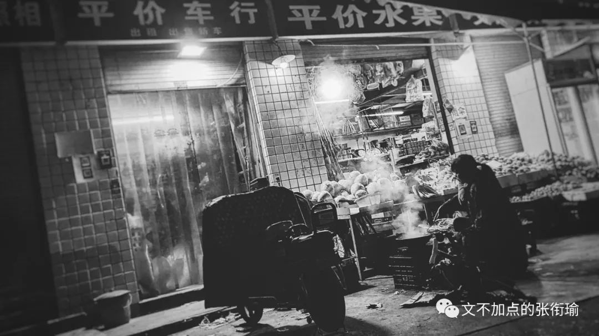
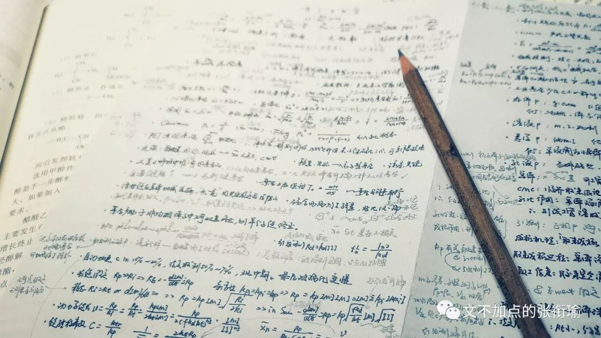

本文共计3763个字

由很多很多的小片段拼凑

相声《蛤蟆鼓》：

> 甲：你这么有学问，我请问你，蛤蟆那么点小，叫声为什么那么大 ? 乙：蛤蟆叫声大，是因为嘴大，脖子又憨。凡是嘴大脖子憨的叫声都大。 甲：我家的字纸篓也是嘴大脖子憨，怎么不响呢 ? 乙：那它是竹子编的，竹子编的它都不响。 甲：和尚吹的那个笙管也是竹子编的，它怎么就响呢 ? 乙：它虽然是竹子编的，但它上面有眼，所以就响。 甲：竹子编的，有眼，就响。那我家的筛子也是竹子编的，也有眼，它为什么不响 ? 乙：它是圆圆扁扁的，圆圆扁扁的它不响。 甲：那唱戏的打的那个锣，也是圆圆扁扁的，为什么又响呢 ? …… 甲：泡泡糖为什么响 ? 乙：那是有胶性的，才响。 甲：有胶性的，胶鞋底为什么不响呢 ? 乙：那它挨着地了，不响。 甲：挨着地的三轮车胎，放起炮来怎么又那么响 ? 乙：什么乱七八糟的 !……

甲：你这么有学问，我请问你，蛤蟆那么点小，叫声为什么那么大 ?

乙：蛤蟆叫声大，是因为嘴大，脖子又憨。凡是嘴大脖子憨的叫声都大。

甲：我家的字纸篓也是嘴大脖子憨，怎么不响呢 ?

乙：那它是竹子编的，竹子编的它都不响。

甲：和尚吹的那个笙管也是竹子编的，它怎么就响呢 ?

乙：它虽然是竹子编的，但它上面有眼，所以就响。

甲：竹子编的，有眼，就响。那我家的筛子也是竹子编的，也有眼，它为什么不响 ?

乙：它是圆圆扁扁的，圆圆扁扁的它不响。

甲：那唱戏的打的那个锣，也是圆圆扁扁的，为什么又响呢 ?

……

甲：泡泡糖为什么响 ?

乙：那是有胶性的，才响。

甲：有胶性的，胶鞋底为什么不响呢 ?

乙：那它挨着地了，不响。

甲：挨着地的三轮车胎，放起炮来怎么又那么响 ?

乙：什么乱七八糟的 !……

每当看到层出不穷的注意力失焦 我就想引用这一段相声来嘲讽骂人 国人那份失焦的注意力大抵如此 并进而演变成一种沾沾自喜和用言语的转场来虐待他人逻辑的变态快感 邓晓芒老师在 [康德哲学对中国启蒙的意义](https://mp.weixin.qq.com/s?__biz=MjM5Mzk5OTQ4MA==&mid=2247491653&idx=3&sn=0b7a0909613122b1d32710d2c90dd158&scene=21#wechat_redirect) 中如是说

> 其实，中国人的一般思维方式就是这种状况，碰到什么就想当然地是什么，明明错了也不知道反思。 这种思维方式为人们非理性的情感情绪留下了大量的空间，而将理性挤压成了类似于条件反射的碎片。 你不能说中国人不动脑筋，但中国人动脑子只动一下，然后就想到别的东西，通常都是情绪、体验这些不可言说的东西。这些东西未经认真思考，飘忽不定，渗透一切，它可以是大气磅礴，也可以是极精至微，它不需要用脑子，只需要用“心”。

其实，中国人的一般思维方式就是这种状况，碰到什么就想当然地是什么，明明错了也不知道反思。 这种思维方式为人们非理性的情感情绪留下了大量的空间，而将理性挤压成了类似于条件反射的碎片。 你不能说中国人不动脑筋，但中国人动脑子只动一下，然后就想到别的东西，通常都是情绪、体验这些不可言说的东西。这些东西未经认真思考，飘忽不定，渗透一切，它可以是大气磅礴，也可以是极精至微，它不需要用脑子，只需要用“心”。

失焦会带来很多很多的问题 最主要的是在面对事件的时候 不自觉地站在自己的高度上 以最大的力气来维护自己所在的山头领土主权完整 这一方法如果朝内 变成了最近被黑炸了的六小龄童在各个地方章口就莱 如果朝外 便成了奇怪的键盘侠 非要在强奸事件中问被害人是怎么穿着打扮的 在整形医院死了病人的时候说整形有什么好能不能不要再哈韩有点民族自信心行不
并且在研究生跳楼了之后疾呼“当代学生的心里抗压能力不行了，还是因为没受过饿没经历过冻”之类云云

“围捕”美猴王当中 文字我以为是很恰切地说到了 [六小龄童](https://mp.weixin.qq.com/s?__biz=MjM5NjQzMzcxNA==&mid=2651977773&idx=1&sn=ae81a881daef45843ffbff2a2a6a8196&scene=21#wechat_redirect) 之所以会到现在的模样 给出的解释大致如此

> 信念坚定，但逻辑薄弱， 这是他自己未能解决的困惑，也是他不断重复但始终激情四溢的根本原因。“忠实原著”，只是他能找到的最称手的武器。 事实上他什么也没有看破。 弘扬“西游文化”，是他言行之中的一个逻辑出发点，但从来没有人定义过这个概念，这是一个不着边际、模糊依稀的存在。 “理论只要说服人，就能掌握群众；而理论只要彻底，就能说服人。”六小龄童搜罗了很多现象，但从来没有掌握理论，当然更没有掌握彻底的理论。所以在短兵相接的时候，他就缺乏一块坚强的盾牌。

信念坚定，但逻辑薄弱， 这是他自己未能解决的困惑，也是他不断重复但始终激情四溢的根本原因。“忠实原著”，只是他能找到的最称手的武器。

事实上他什么也没有看破。

弘扬“西游文化”，是他言行之中的一个逻辑出发点，但从来没有人定义过这个概念，这是一个不着边际、模糊依稀的存在。

“理论只要说服人，就能掌握群众；而理论只要彻底，就能说服人。”六小龄童搜罗了很多现象，但从来没有掌握理论，当然更没有掌握彻底的理论。所以在短兵相接的时候，他就缺乏一块坚强的盾牌。

朝内如此 朝外亦然

在强奸案捅出来了之后 第一时间去看是不是有受害人当时或者事前的照片从而自兀自地评头论足
焦点本应该在对加害者的声讨却成了对被害人的二次伤害

研究生跳楼亦然 不光是 [同济大学医学院](https://mp.weixin.qq.com/s?__biz=MjM5MDAyMzQyMQ==&mid=2650611087&idx=1&sn=0a305c7008c0410ddbc34683d0d86fe7&scene=21#wechat_redirect) 还有西安交大和武汉理工等等更多的地方 日常无聊地把事情归结到学生整体的抗压能力下降和心理素质不加 进而对于电子竞技或者更喜欢称呼的网络游戏带来以 预设前提的判定 这和在学生圈当中一些学校的学生看不起另一些学校 一本的看不起二本的 做文化的看不起做艺术的都差不多

> 噢你是艺术生啊，编导什么的应该很容易就可以买进个还不错的学校吧。 噢，你是体育生啊。（转身）肯定是没什么脑子读书才进体校。

噢你是艺术生啊，编导什么的应该很容易就可以买进个还不错的学校吧。

噢，你是体育生啊。（转身）肯定是没什么脑子读书才进体校。

按理说不管哪一类型的学生 只要是还在奋斗的 就不会有轻松 安逸闲适的人在哪里都安逸闲适 想奋斗的人无论在哪个领域都会想要做出一番成绩 并不以时间地点而又太大的转移（前提是也还在自己所中意的方向里）

可是也并不会管 只图自己的一时口嗨就可以 正如所有人都 心心念念地想让自己的孩子有更好的受教育环境
却对教育的目的一无所知 同时也不承认教育的成果 这就很像那些让自己小孩尽可能多读书多报班的奇怪家长
却普遍看不起大学生 认为持有文凭的人都不过是混出来的 拒绝前沿研究当中做出的成果
拒绝新兴的便捷工作方法和工作习惯 却一个劲地鼓捣自己的孩子去学 我能想到的只有行为的悖论和厚黑学的过程
其他的并不知道也懒得和人争  或可移步我写的另一篇 [关于教育的事](http://mp.weixin.qq.com/s?__biz=MzUzNjE3NzA3Mg==&mid=2247484024&idx=1&sn=b3196a122c69edcb4d9601409c9a02a9&chksm=fafb72a7cd8cfbb1d384e0ee81449edd14ee2098751cbaa3090ca8d74691cf16eb2ec7965416&scene=21#wechat_redirect)

于是这一批 有文凭但是没有文化 的人将这一畸形的现象继续传递下去 继续制造和影响着有文凭没有文化的人 就和现在随意用论文充数但实质推进也好理论突破也好不一样的思维模式也好全然没有
但依旧在主要位置上掌握着话语同质

其实我也算是非理性叙述占了太多的人 不然不会从研究生跳楼当中大家的关注点错误延伸下去这么远 主要是生气 如果拿棋类作比的话
完整的理论论述在专业棋手那里可能可以算到七八步 我也只是拿着自己大概四五步的水平在看着身边一两步的人着急

说到底他们还是站在自己的高度上去评议他人的苦痛 本质是不会共情换位和思维角度单一的问题

像这样的自杀 弱势方提起诉讼 诚然是有限的空间内有着无限的能量膨胀 但谁考虑过决定者违背自身routine做出决定前的挣扎呢？难道生来就是要这样死去的吗？

可谁又回去重走一下这位研究生 或者之前的那些轻生者 他们究竟经历了怎样的心路历程才至于到了这步田地呢？

> 中国古代做学问其实是很强调背诵的，这叫 “ 童子功 ”; 但这种背诵只是一种外在的记忆，即从小在脑子里刻下刻痕，到老不忘。这不用动脑子，和动物记得它的主人的声音气味没有什么不同。直到今天我们的学校教育还是在花大力气训练这种记忆，在这方面中国人举世无双。这就压抑了人的内在记忆。 你要确立一个事物发出声音的原理，就必须在各种场合下记得这个原理，如果场合一变就可以随意改变甚至忘记了先前的原理，那就不是真正的原理，而只是想当然的意见。

中国古代做学问其实是很强调背诵的，这叫 “ 童子功 ”; 但这种背诵只是一种外在的记忆，即从小在脑子里刻下刻痕，到老不忘。这不用动脑子，和动物记得它的主人的声音气味没有什么不同。直到今天我们的学校教育还是在花大力气训练这种记忆，在这方面中国人举世无双。这就压抑了人的内在记忆。

你要确立一个事物发出声音的原理，就必须在各种场合下记得这个原理，如果场合一变就可以随意改变甚至忘记了先前的原理，那就不是真正的原理，而只是想当然的意见。

整形医院死了病人也是 把多年的忿恨撒在对韩流的崇拜上 衍生出一套就是因为韩综所以大家才去整容才出了这么多问题 甚至还有玛利亚在说 如果一个人连真的你都不喜欢，更不会喜欢假的你

如果再回看一下这篇推送开头的那个相声 就会发现所谓的非理性情绪 碰到什么就想当然是什么
可以说存在在了太多太多的地方 回到问题上 谁有想过要不要去探讨一下医疗救治的过程以及医院的资质呢 我其实在这里也可以带一笔关于最近 [头孢皮试](https://mp.weixin.qq.com/s?__biz=Njk5MTE1&mid=2652398160&idx=1&sn=eff13baca3c8b212dae3bd8e162558ad&scene=21#wechat_redirect) 的事情 不过还是请自便吧

错了就错了 并不可怕

怕的就是错了还自我感觉良好

自以为对

> 今天，和谐、维稳的世风让这个社会人人明哲保身。社会没有担当，学校不敢涉险，这种环境下成长的孩子能成为怀有中国梦的青年？！春天不许远游，夏天不许涉水，秋天不许野营，冬天不许赏雪。从六岁到十八岁，除了校园就是家园。我不知道他们在成年后回忆青春花季回忆什么？难道只有网络游戏？？

今天，和谐、维稳的世风让这个社会人人明哲保身。社会没有担当，学校不敢涉险，这种环境下成长的孩子能成为怀有中国梦的青年？！春天不许远游，夏天不许涉水，秋天不许野营，冬天不许赏雪。从六岁到十八岁，除了校园就是家园。我不知道他们在成年后回忆青春花季回忆什么？难道只有网络游戏？？

以上是一段来自霍邱一中校长的一段随笔 大抵是从学校因冰冻放假 而写的一篇随感 行文和我这样的公号软文差不多随意 除了没有像我这样把参考文章的链接安在文内 也都加上了标点

狼人杀里面有一个板子叫做 验一砸一 类似地 也出现地不少 记得在进大学不久之后的那个秋天 正好是高中的校庆 长沙的几所高中大抵都在一起 出门之后互通互通有无 在校庆那天也就既有我们自己的人在嗨也有其他学校的朋友在一起开心 当时有一个我校的同学在得意忘形了之后 就开始在空间自嗨 内容大概就以下几个意思

> 我太喜欢我们学校了。 我们到了高三都还有体育课。 据说，隔壁那个学校没有。 他们差多了。 我们学校太好了。

我太喜欢我们学校了。

我们到了高三都还有体育课。

据说，隔壁那个学校没有。

他们差多了。

我们学校太好了。

我看到之后都为学校里出了个这样的人感到羞耻 更别在一些无脑跟转之后 别的学校的学生把这些截图下来作为证据 然后开始恶心 我也觉得恶心 可这又怎么样呢
日光底下并无新事发生

> 黄：你说，你故意伤人已经好几次了，我千方百计跟律政司说你心理有问题，要你去看心理医生，可你还到处打人？ 你是不是真的心理变态啊？你忘了自已是好人还是坏人啦？ 梁：明明说好是三年，可三年之后又三年，三年之后又三年，就快十年了老大！ 黄：你对我态度好点行不行？现在全香港只有我一人人知道人的身份，我回去把你的资料删除掉，你一辈子做古惑仔我也不用烦了。 梁：你想我怎么样？天天提醒自已是警察，连做梦的时候都说‘放下枪，我是警察！’这样啊？！

黄：你说，你故意伤人已经好几次了，我千方百计跟律政司说你心理有问题，要你去看心理医生，可你还到处打人？ 你是不是真的心理变态啊？你忘了自已是好人还是坏人啦？

梁：明明说好是三年，可三年之后又三年，三年之后又三年，就快十年了老大！

黄：你对我态度好点行不行？现在全香港只有我一人人知道人的身份，我回去把你的资料删除掉，你一辈子做古惑仔我也不用烦了。

梁：你想我怎么样？天天提醒自已是警察，连做梦的时候都说‘放下枪，我是警察！’这样啊？！

以往看别人写的杂文 总觉得是在犀利的时候才能把最要害的痛处点出来 尔后一些 吃别人排泄物的 教辅书就会出来说这篇文章的中心思想是什么中心论点是什么 知道这些 固然很重要 虽然会损失一部分细节上的精巧 但最重要的是 在知道了这些 甚至自己也可以开始操刀了之后 却没有人来教授如何在知道了这些之后和生活和解的办法

知道了又怎么样呢 晨间剧主角就会说 当然是在看清生活的本质之后继续热爱生活啦 可这并不可能 人并非生而知之者 晨间剧主角毕竟没有学过马哲 不知道事物前进的进程中前途是光明的但道路是曲折而充满斗争的 我看到不少言辞都在和人说应该要怎么样 比如全心全意为人民服务 却在定义人民的时候偏差 说我们要减少负面影响不传播负能量 却既不知道自己在做什么 也不知道侠客岛（笑

我只能讲说 看到别人有在这么做 我知道原因在哪里 是怎样的出发点然后经历过怎样的流程 但把我自己放到事件的中心去 我并不会这么去做 即使有些时候效果不一定会更好而由此落下一些沙雕话柄给人抓着 于是 杠精的本质就是：在和人辩论中，拼命反驳人家没有说过的意思，拼命捍卫人家没有攻击的观点。

> 我们中国人历来认为，中国文化的道德水平举世无匹。然而，儒家道德基本上是一种前启蒙的道德，它不知自由意志为何物，而是诉之于天经地义的天理天道。它也讲意志的选择，但前提是选择的标准已经预定了，这标准强加于每个人，就看你接受不接受。接受了你就是君子，不接受就定为小人。

我们中国人历来认为，中国文化的道德水平举世无匹。然而，儒家道德基本上是一种前启蒙的道德，它不知自由意志为何物，而是诉之于天经地义的天理天道。它也讲意志的选择，但前提是选择的标准已经预定了，这标准强加于每个人，就看你接受不接受。接受了你就是君子，不接受就定为小人。

曾经很久以前我也看一些佶屈聱牙的著作 大部分的我已经忘了 也许有的已经成为了我的一部分思维方式 也许有的就是真的忘了 但有一段的大意我还记得很清楚 即便细节地方和原本的译作有所差异

美德是什么？我们嘲笑它。美德不就是一种虚妄嘛。我们敞开心扉，坐在这里，做着属于我们自己的真正有意义的事。至于美德，它想什么时候来就什么时候来，想什么时候走就什么时候走吧 ~

学业繁忙 告辞

