这是衔瑜的第 72 篇推送

> 本文共计2465个字 还有一部分截图没算进来

本文共计2465个字

还有一部分截图没算进来

明明自己饿得要死 好不容易鼓足勇气出门 下楼一趟 仿佛去到南极 哼哧哼哧拿上来外卖 好端端地摆在自己的眼前 任凭这时候自己已经把外卖的包装拆开 披萨的热气抟扶摇羊角上升
但就 因为自己眼前想看的成龙历险记还没有在 B 站加载完全 所以不能开始吃饭

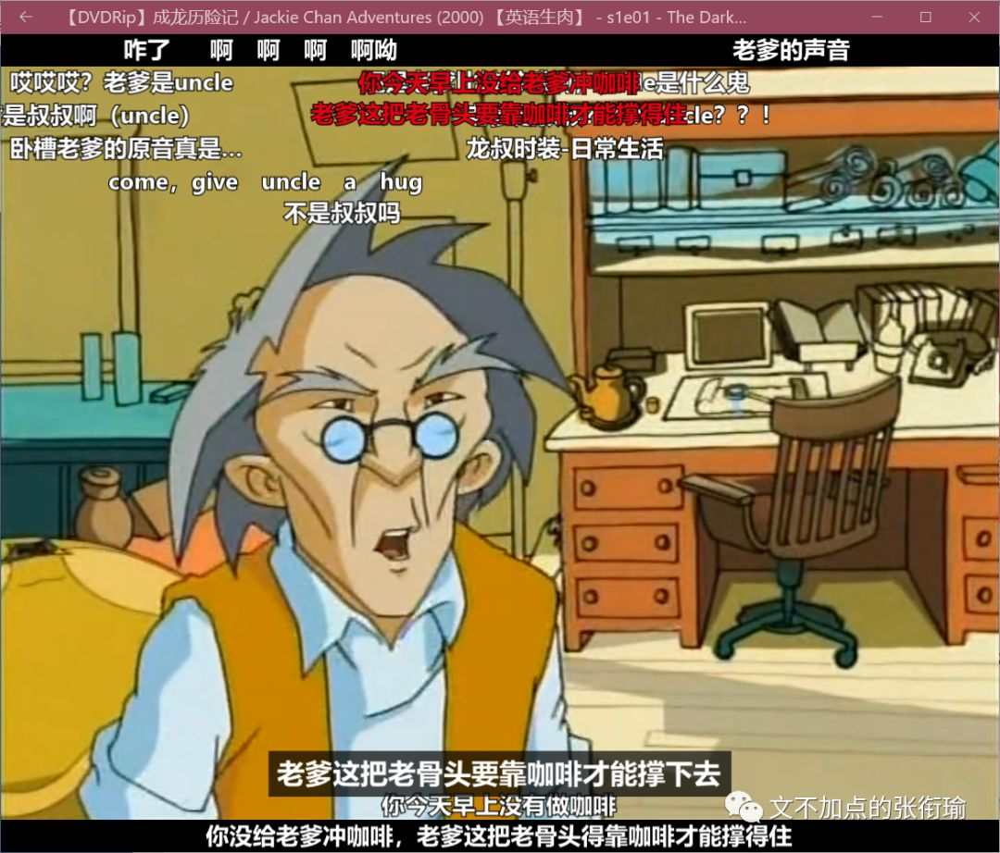

在寝室吃外卖的话

一定要和看 成龙历险记 关联在一起吗

如果真的有人问我这个问题 我一定会像在汉街的喜茶店 辛辛苦苦在寒风中排队了两个小时 但排到自己的时候 突然发现自己还没有排练好要跟服务生对话的剧本 …… orz  anyway 请一定注意不要问我这个问题 蜈蚣在别人问它出门的时候先迈哪只脚
想来也很难回答的吧

鸡汤沙雕文里面多的是一些看起来很有用 但实际上什么用也没有的文字 给人的感觉就是 谁能想到一个刚刚经历过考试周每天暴饮暴食过劳肥了二十斤的人 在考试周以前竟然比现在受二十斤 不过有些话 过滤一下还是可以听的 比如 人和人的沟通里 百分之三十是在 沟通信息 百分之七十在 沟通情绪 天知道这个沙雕比例是谁算出来的 但沟通情绪比沟通信息要重要 却是再实在不过了的

毕竟 不是所有人都适合思考

最近想多看看这个剧 孤独的美食家 就是五郎到各个地方去吃东西 配音就是自己在那边脑内的各种剧场

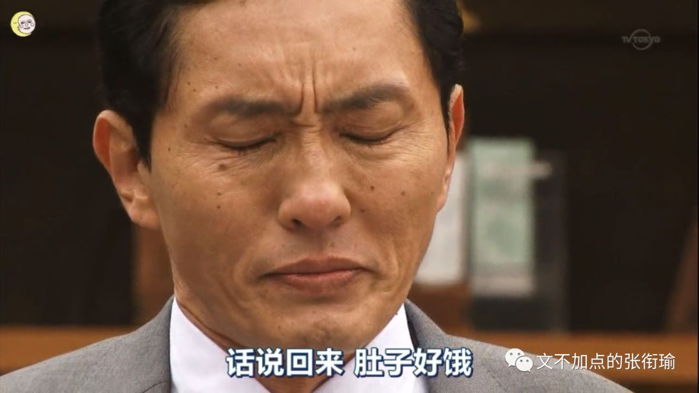

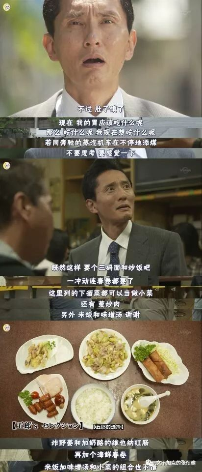

实在是很棒的沟通感觉

但如果是 四重奏 可能事情就会变得稍稍有点不一样 截图来自第一集 四个人刚刚遇到 开始晚餐之前的一段对话

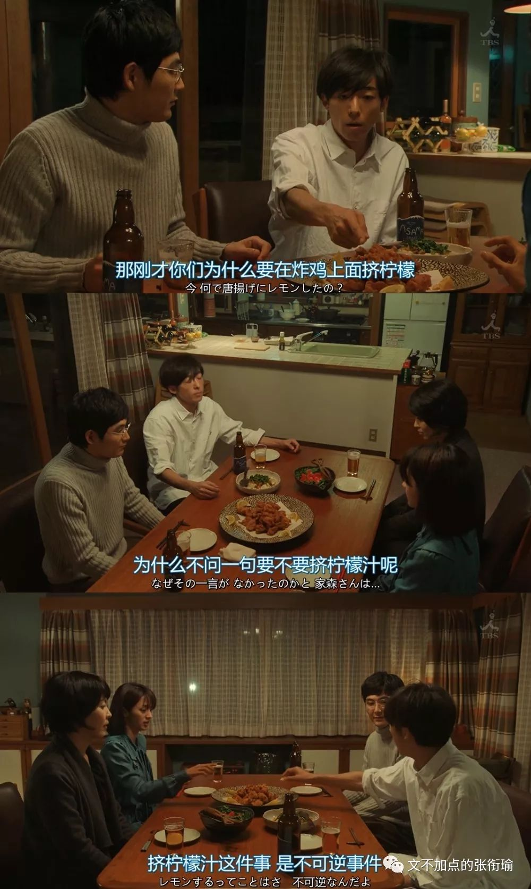

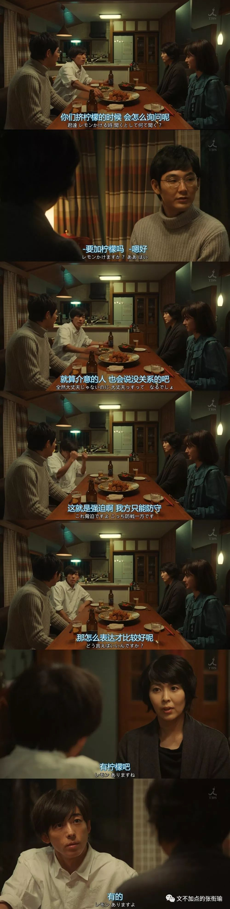

全剧都很精彩 所有人都在单向恋爱 所有人都在心照不宣地说谎

沙雕日剧很棒的一点在于 形而上一点的话有人称之为阴翳之美 但也像是可以拿出来说一说的了 刻意一点的话 是一种 有些近乎于夸张地 带形式感仪式感 的出落

我想讨论的 关于 沟通情绪和沟通信息 的事情 可以拿日剧台词来做很恰切的例子

考试周和复习周往往是当代学生狗德行的集中表达时刻 以下是在考试周的时候 我不经意间 自己或者别人或者剧里边讲出来的一些沙雕词句

> 可恶，复习到要吐了，可还是学不会呀 ·本来我是要劝您去休息的，可是您也不会听吧 ·如果是 ta 的话，可能我死算的这些都很简单呢 ·即使是课本，也有写得不详尽的地方诶 ·好厉害，和你聊聊天也能复习到很多 ·如果想放弃了，就请再坚持最后一会会好嘛 ·量子即正义，也只有这样才可以改变世界的吧 ·那么，我不会的这道题，就拜托你了 ·能在深夜看 PPT 的人，才是可以好好把生活过下去 ·一学习就想睡觉，这难道不是彻头彻尾的笨蛋吗 ·复习啊，只要按照自己的就走向前走就可以了 ·人，要饱尝被生活痛打过的苦涩，才会温柔呢

可恶，复习到要吐了，可还是学不会呀

·本来我是要劝您去休息的，可是您也不会听吧

·如果是 ta 的话，可能我死算的这些都很简单呢

·即使是课本，也有写得不详尽的地方诶

·好厉害，和你聊聊天也能复习到很多

·如果想放弃了，就请再坚持最后一会会好嘛

·量子即正义，也只有这样才可以改变世界的吧

·那么，我不会的这道题，就拜托你了

·能在深夜看 PPT 的人，才是可以好好把生活过下去

·一学习就想睡觉，这难道不是彻头彻尾的笨蛋吗

·复习啊，只要按照自己的就走向前走就可以了

·人，要饱尝被生活痛打过的苦涩，才会温柔呢

表面上看起来 其实是很深重甚至后边想起来过分了之后就显得很 low 的日剧翻译腔 不要把日剧台词拿来过日子 实在是很实诚的罢 但如果注意一下表达的话就会发现 这只是把我们日常用语或者说书面用语当中的一些语言格式 用实在的日剧腔写了出来 情绪上有出现变化吗

衔瑜是走交叉学科的 虽然不一定说在哪一块有特别的过人之处 但至少知道在遇到问题的时候不能只依赖 Baidu 和 Google 知网很低级但好在中文期刊多 鲁迅文学作品中的日语式表达解析 现代汉语的“日化”现象研究 分别取自期刊和一篇博士论文 以下为部分截图

> 

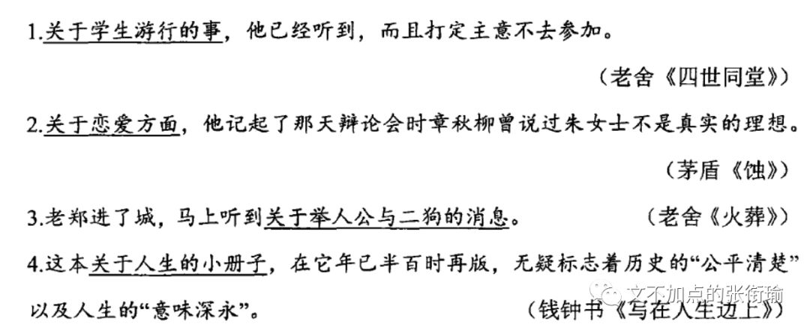

> 

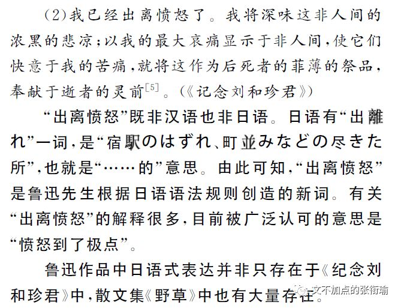

> 

我想指出来的是 沟通情绪 在我们现在的表达当中 需要沟通的情绪 在现在的心境当中 表达出来 在有其他语言形式介入的时候 我们更显而易见地发现在这之中的问题 （很绕对吧 但 计算机语言 当中就可以用括号把我想要的括在一起
我也很难过

所以 我们为什么要沟通情绪 并且要用一定的表达方式呢

是因为 一些信息不能被正常的情境完整地表达

我昨晚的一条朋友圈是

> 一张图 说着是随手记录生活 然而在后期的时候调上三十几笔 看来看去都还是觉得不够 自己审稿觉得哪里都是问题 复习也是这样

一张图 说着是随手记录生活

然而在后期的时候调上三十几笔

看来看去都还是觉得不够

自己审稿觉得哪里都是问题

复习也是这样

（↓这是配图

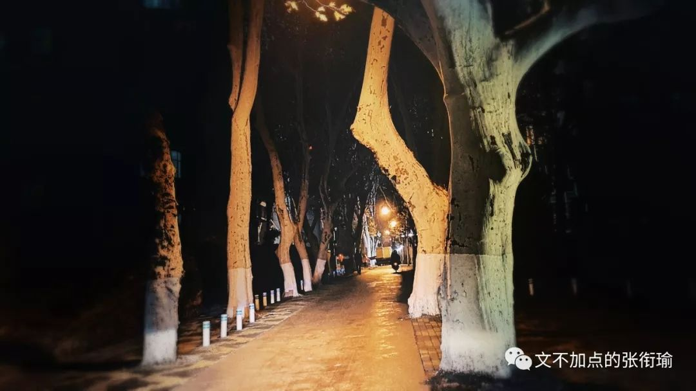

其实也没有很多想表达的 但如果 把最后一句换成 爱情也是这样 那么气氛就会变得有些不一样了

人类的古怪举动里 多的是无法沟通的 就像在信息储备上的不对等
我如果跳出我现在看的 《计算机辅助调香：研究与应用》 和我在高二的时候为了给学校哲学社 （那时候还是爱智慧的那个意思） 讲课的时候读的 歌德 荷尔德林 尼采 海德格尔 我自己相比自身也很难对话下去 但如果 退而求其次 想办法沟通两个时间上的情绪 那也就可以解释为什么有人会在半夜想到以前做过的一些事情而睡不着 只要想起一生中后悔的事 梅花便落满了南山

为什么在之前 孤独的美食家和四重奏里边 前者显然沟通得更为到位 是因为 剧作恰恰 选择了进食作为沟通的载体 而这一载体却是最易于接受的 相比起来 后者关于为什么晚餐不要不经过询问就把柠檬汁挤到炸鸡上 就显得更难于接受

人类 是三维空间中的生物 这也就决定了人类在处理二维图像信息的时候显得尤为出色 这也就是为什么 机器学习模拟人类行为的时候 就是要想办法 mimic 人类处理图像信息的过程 而我们 最易于接受的视听 饮食男女 也就成为了最能打开话题 而又人人都可以说上两句的 今天我吃的西一也可以说 昨天 ta 在路上看到了一个极好看的小鸽鸽也可以说 这是为什么 处理简单信息更容易给人以成就感 为什么从别踩白块到跳一跳到我不指名道姓的短视频平台可以兴起的认知原因

所以鸭 当想要好好说话的时候 就显得尤为难过 把公式变形成科研用语 去 GitHub 上读别人写的代码
到把一些政治口号具象化 如果还有什么更教人难过的
大概就是想不逃避事情真相地说一些话 语出 李狗嗨 胜者即正义

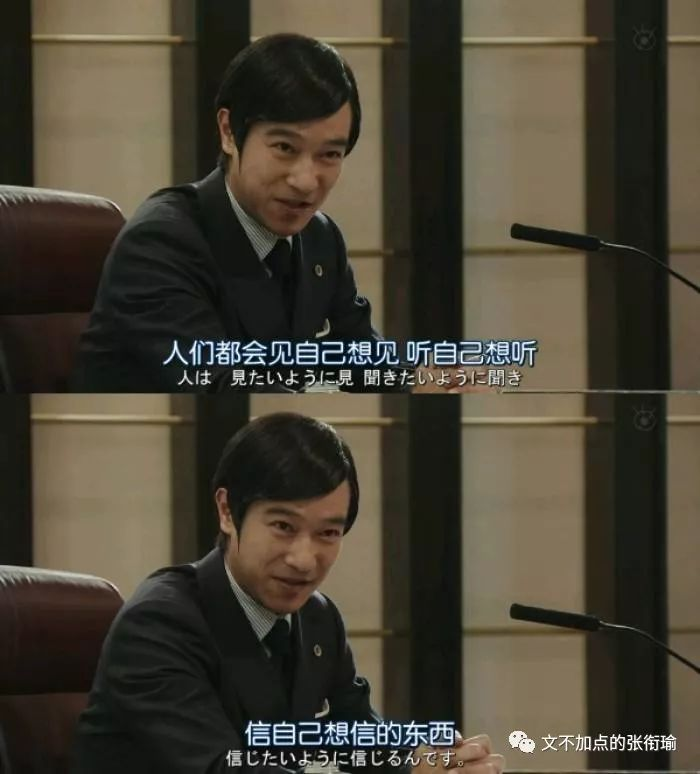

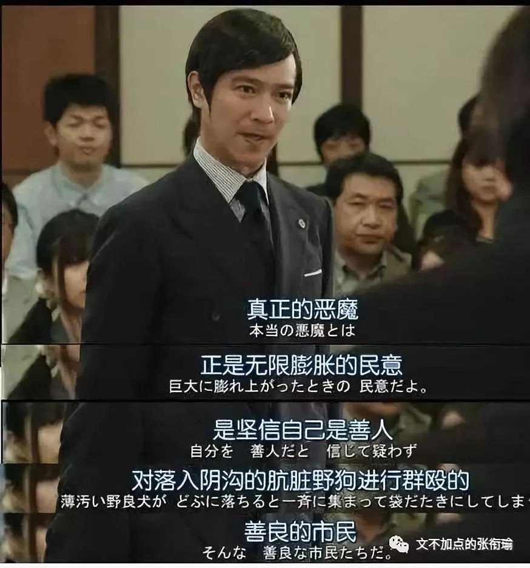

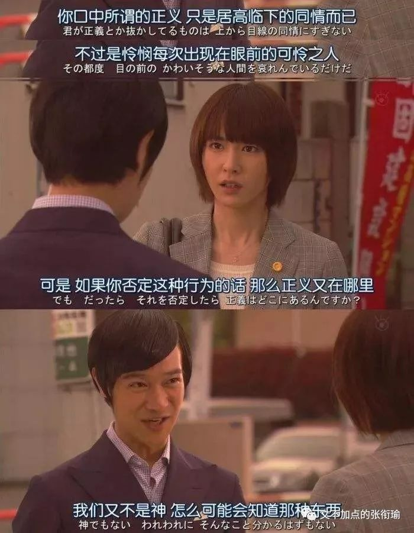

最后 仿写练习

> 可恶，还是没有办法好好说话呀。 生活是一艘蟹农的舴艋舟，而我是个净打捞些蚌壳上来的笨蛋。即使是努力了很久，也还是没有办法拜托一直强加给自己的羁绊吧。因为在我的生活里，日剧可能是为数不多的生命之光了。当恋爱已经全然自由，说爱就爱说散就散，不用维系关系的感觉实在是太棒了。 需要解气的人，演出时很用力气的情深深雨蒙蒙也没有办法让我开心一点呢。想和人说话但又不想再把我许多年的人生复述一遍。乏善可陈，是我用过最好的词，故事也恰恰在这时候脱口而出。 果然还是一个彻头彻尾的笨蛋呢，需要别人来帮忙自己的时候，也会强忍着说不好意思这一点小事也来麻烦您。心里始终膈应的一块，无论在隔壁的小老弟来敲门，抑或是导师来催我上工，都无时不刻不在提醒自己还要再努力再努力一些。 言语即是正义的时刻，也许我打下的两行字全部都是 " 哈 " ，但也许眼角的肌肉并不会因此而皱起来哪怕一点。不能总这么冷眼看穿呀！挣扎的时候，不知道想象的味噌汤和天妇罗可不可以让自己变得开心一点。

可恶，还是没有办法好好说话呀。

生活是一艘蟹农的舴艋舟，而我是个净打捞些蚌壳上来的笨蛋。即使是努力了很久，也还是没有办法拜托一直强加给自己的羁绊吧。因为在我的生活里，日剧可能是为数不多的生命之光了。当恋爱已经全然自由，说爱就爱说散就散，不用维系关系的感觉实在是太棒了。

需要解气的人，演出时很用力气的情深深雨蒙蒙也没有办法让我开心一点呢。想和人说话但又不想再把我许多年的人生复述一遍。乏善可陈，是我用过最好的词，故事也恰恰在这时候脱口而出。

果然还是一个彻头彻尾的笨蛋呢，需要别人来帮忙自己的时候，也会强忍着说不好意思这一点小事也来麻烦您。心里始终膈应的一块，无论在隔壁的小老弟来敲门，抑或是导师来催我上工，都无时不刻不在提醒自己还要再努力再努力一些。

言语即是正义的时刻，也许我打下的两行字全部都是 " 哈 " ，但也许眼角的肌肉并不会因此而皱起来哪怕一点。不能总这么冷眼看穿呀！挣扎的时候，不知道想象的味噌汤和天妇罗可不可以让自己变得开心一点。

沙雕图警告warning

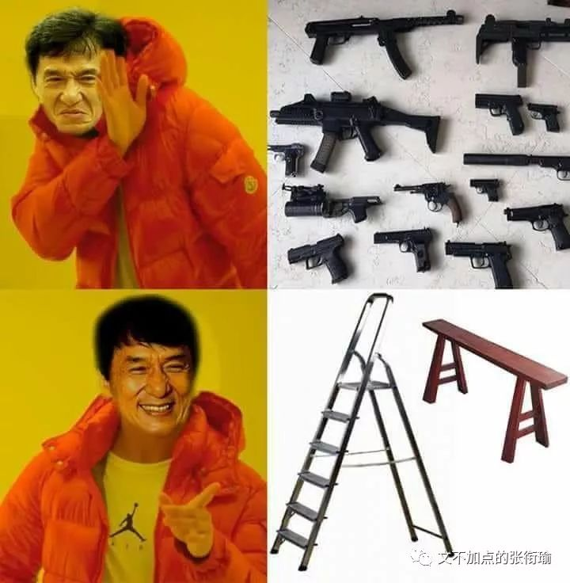

那么 如果情绪到位了的话

接下来我去看成龙历险记的时候

好看和打赏什么的

就拜托了
