> 本文共计 4962 个字 赶在山海关以北发了出来 张衔瑜的第 74 篇图文

本文共计 4962 个字

赶在山海关以北发了出来

张衔瑜的第 74 篇图文

> 我是雨和雪的老熟人了，我有九十岁了，雨雪看老了我，我也把它们给看老了，如今夏季的雨越来越稀疏，冬季的雪也逐年稀薄了。它们就像我身下的已被磨得脱了毛的狍皮褥子，那些浓密的绒毛都随风而逝了，留下的是岁月的累累瘢痕。坐在这样的褥子上，我就像守着一片碱厂的猎手，可是我等来的不是那些竖着美丽犄角的鹿，而是裹挟着沙尘的狂风。

我是雨和雪的老熟人了，我有九十岁了，雨雪看老了我，我也把它们给看老了，如今夏季的雨越来越稀疏，冬季的雪也逐年稀薄了。它们就像我身下的已被磨得脱了毛的狍皮褥子，那些浓密的绒毛都随风而逝了，留下的是岁月的累累瘢痕。坐在这样的褥子上，我就像守着一片碱厂的猎手，可是我等来的不是那些竖着美丽犄角的鹿，而是裹挟着沙尘的狂风。

其实这一块说到东北也不太适合 毕竟我只是到了长春 关于东北的若干思考 提出得也不是很明确 从高铁上走出的时候看 从山海关继续向东北 地形也逐渐变得有了东北的特色 到这边的时候 时间已经是晚上了

我一直以来对于东北的印象 是迟子建的一本 《额尔古纳河右岸》 以及一位之前很要好朋友的描述当中

> “清晨的露珠湿眼睛 正午的阳光晒脊梁 黄昏的鹿铃最清凉 夜晚的小鸟要归林 ” 的时候，他拍了拍我的脊梁。只这一拍，却使我的眼睛湿了。

“清晨的露珠湿眼睛 正午的阳光晒脊梁 黄昏的鹿铃最清凉 夜晚的小鸟要归林 ” 的时候，他拍了拍我的脊梁。只这一拍，却使我的眼睛湿了。

多么有画面感的样子 这样的语句 给人的感觉是很不一样的 西藏给我的感觉就是仓央嘉措和大昭寺寺内的诵经佛号 新疆给我的感觉是昼夜温差超大时候吃到的葡萄 blah 瓜果 台湾的感觉则是几句软糯的湾湾腔 而东北的感觉 自然是这样的不一样

就像我也会很难描述到底什么是东北 我很难用一种很限定性的话语来说 噢，你看这样子的地方就是东北了 诶，这样的话就不是东北 我似乎很难找到这样倒过来去都很直接到的存在 我只敢说 东北在我的印象里 就是这个样子 而我这次到了东北 到了吉林长春 这一印象也始终是这般

长春也是一个很神奇的地方 从这次吃到的东西 和看到的地方可就可见一斑 我问打车的师傅 你们这最当地菜长春菜吉林菜东北菜的是什么 师傅回我说 （ 脑内东北口音） 那必须得是杀猪菜呀 大意应该是那家人家里杀猪 然后大家一起跑去
其乐融融的样子 杀猪的杀猪 择菜的炒菜的唱戏的扭在一起
硬是什么都不会做 生个火也成 就这样大家伙的坐到一起
吃点儿杀猪烩菜 和朋友唠唠嗑吹吹牛 就是这边的菜式

我也觉得是这样 除了食材本身 氛围是更重要的饮食 但还是问了问师傅这边最正宗的参观是哪家 他回答是大年初一和社会主义新农村 我扶额了一下 去到了这家 大年初一

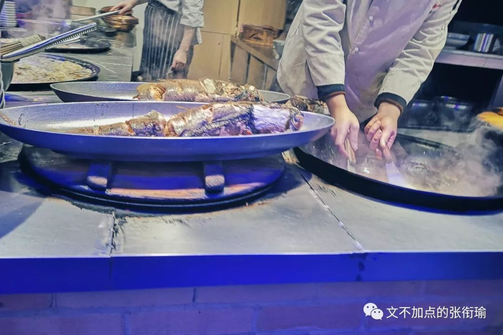

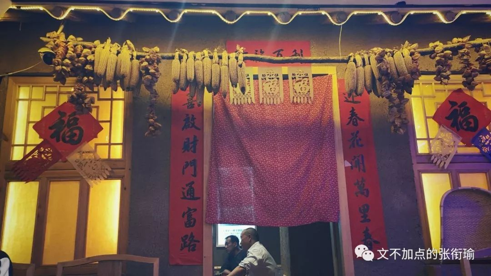

当真是很扎实的菜式 从底料到盛装食物的器皿 一样菜里的分量 抵得上我在两湖地区吃差不多两个菜的感觉 我问同样来自长沙但在这边生活了很长时间的人 是不是这边人吃东西时候就是真的分量比我们那边要大一些 回答是用力的点头

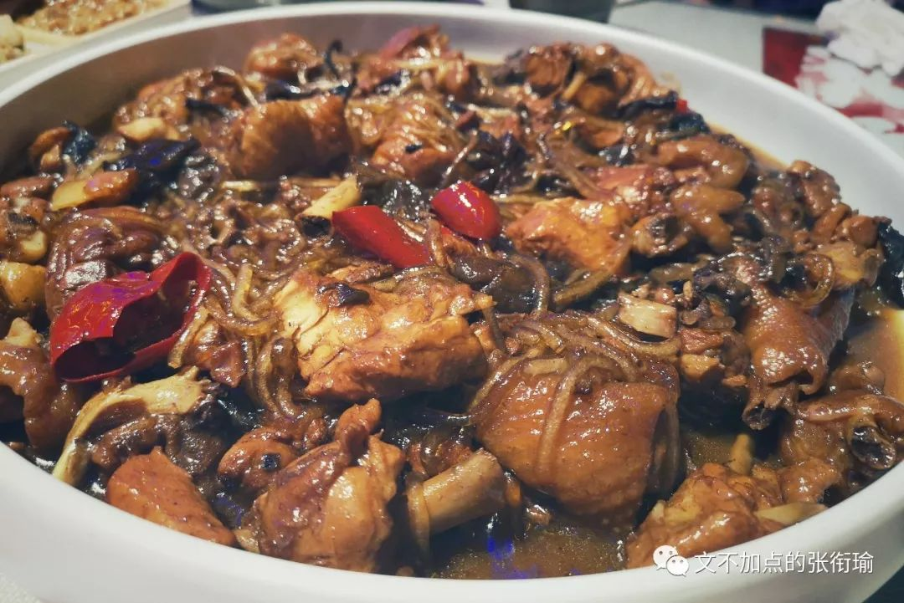

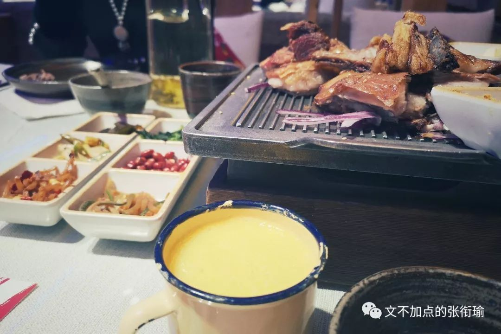

神奇的是这边烤肉的方式 我记得在久苑和金韩宫 自助吃起来的日韩烤肉都是从上边抽气 回民烧烤倒是别个烤好了给我们送进来 但在东北这边撸串的时候 却是拿着半熟的烤肉自己再进行一会会加工

抽气倒是神奇 都是在限定好了的每个桌子 从底下给把烧炭烧出来的气给抽走
都不带用铁丝网架放到上边的那种 辽宁的同学书在他们家那边还有夹了铁丝网但有专利往里通水
这样就不会粘在铁丝网上的有办法的烧烤店 吃货 get +1

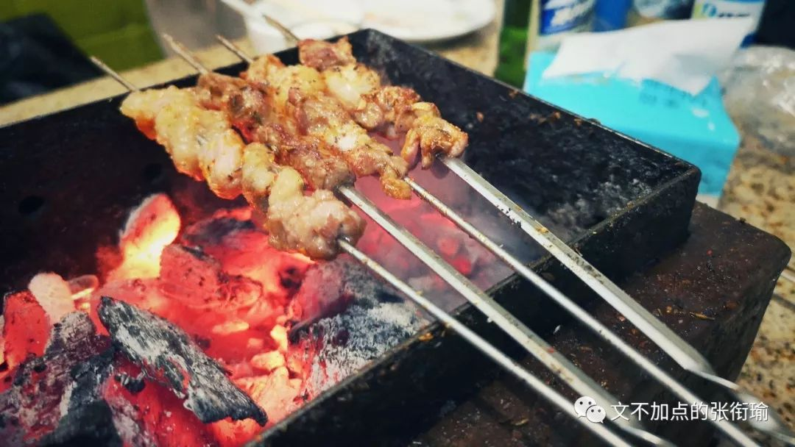

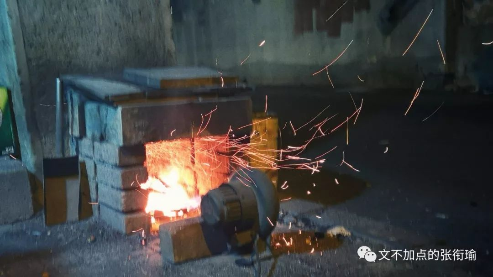

找时间去到了 伪满皇宫 末代皇帝 溥仪当时的行宫里 我一直有在犹豫是用 vintage 调色的样子来表达在旧式宫殿当中的场景 还是直接换成 noir 来直接进入黑白画映 从皇帝到公民 生活是这样欺骗吗

> 妃嫔媵嫱，王子皇孙，辞楼下殿，辇来于秦，朝歌夜弦，为秦宫人。

妃嫔媵嫱，王子皇孙，辞楼下殿，辇来于秦，朝歌夜弦，为秦宫人。

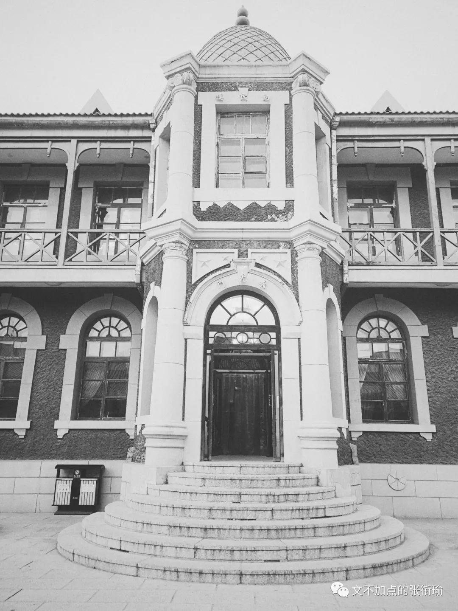

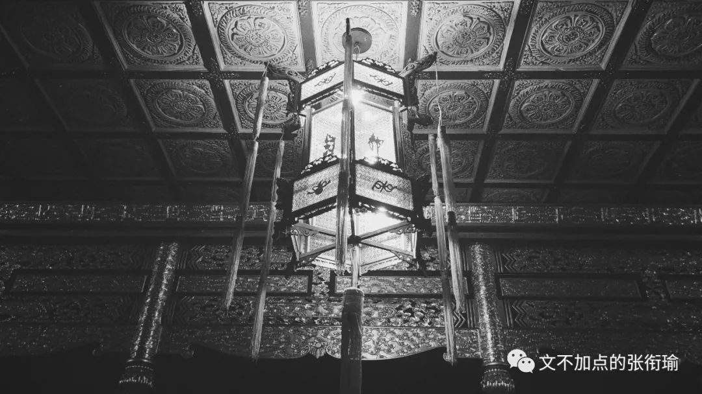

如果要讲生活迷幻的话 溥仪可能是一个非常神奇的存在 从大清的遗老遗少 到去了伪满洲国 成为战犯回来以及写作《我的前半生》 人们往往会把一个人放在宏大的历史里
在知道前因后果了之后来述评一个人物 但想想落到冲龄登基的宣统皇帝
可能被生活所奇怪的欺负 也应该会更加感受到 自己对自己命运全然无可把握 的感觉罢

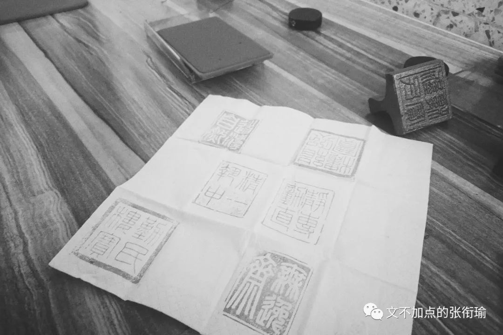

现在我们所看到的 无论是宫廷剧也好 还是文学意义上为人所熟知的红楼梦也好 落在封建帝制的身上 都也依旧会将溥仪和道光咸丰同治以及更往前的时候康雍乾嘉做对比 我们仿佛在梳理自己的历史架构与脉络时 自然而然地把宫廷剧和后来的民国和共和国年间的历史割开 诚然这和不同时代的艺术变现手法有别 但交杂在两个时代当中的人 又会怎么样呢 我有想到一句老话 一个人的命运啊 , 当然要靠自我奋斗。但也要考虑历史的进程。

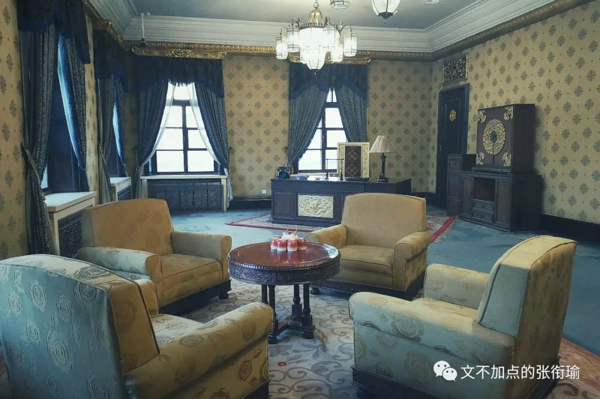

这次到长春 主要目的仍旧是到这边的研究所里走走停停 不管是最先给我们作报告的院士 还是之后在和我们大家交流的硕博研究生 应化所给人的感觉 就和我之前去到大连 上海
北京 都很相似的是两个共性特点 —— 极尽可能的朴实和拿到手软的荣誉

所谓极尽可能的朴实 是指的从上到下给人的感觉都是没有任何架子的 出自对科学的好奇与虔诚
而自然而然带有的朴实 朴实就像所里的院士伉俪
两位都是院士 每天都仍然可以手拉着手一起到办公室 然后工作学习 教书育人 科学研究 然后每天再手拉着手回去 即便是到了春节 有作为行政问候的拜年来到 也都不会请到自己家里 而是在办公室里
进行所有的往来处理 在这样的地方 薪尽火传 传承下的科研精神和探索理念 人家 offer 一些荣誉奖项 也就是理所应当的了

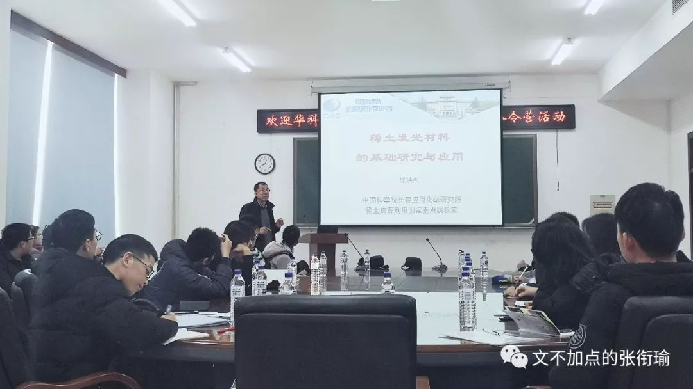

长春这边确实成果斐然 从当代化学国内发展的地位上来讲 怎么表扬都不过分 我在这边很多次听到的 共和国的长子 还有总设计师说的 中东有石油，中国有稀土 实在是太多了奖项 我到了这边的展示厅里之后 甚至都出现了审美疲劳 在普通一本高校可能都比较少看到的中科院科技进步奖之类的
这边看到的就真的是数不胜数

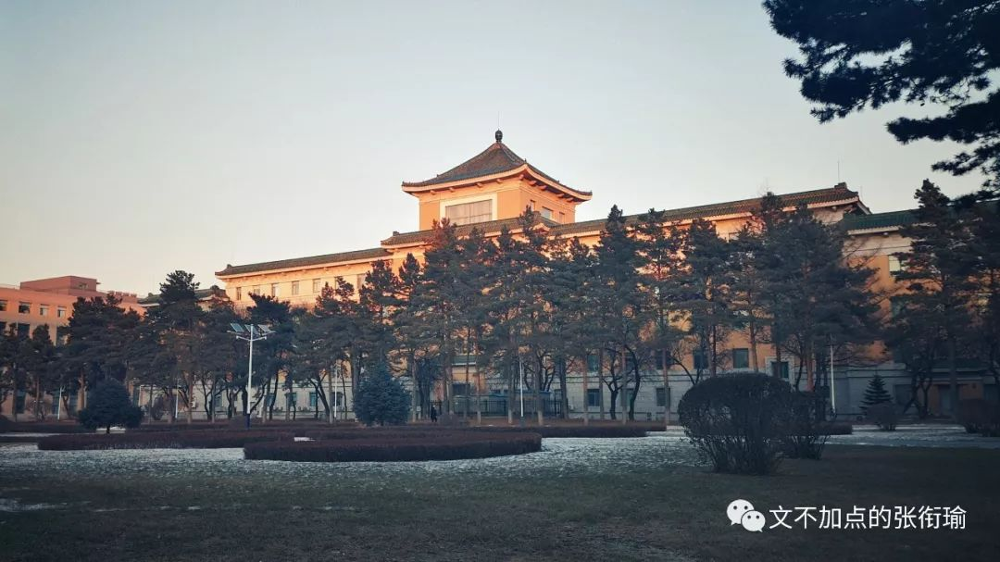

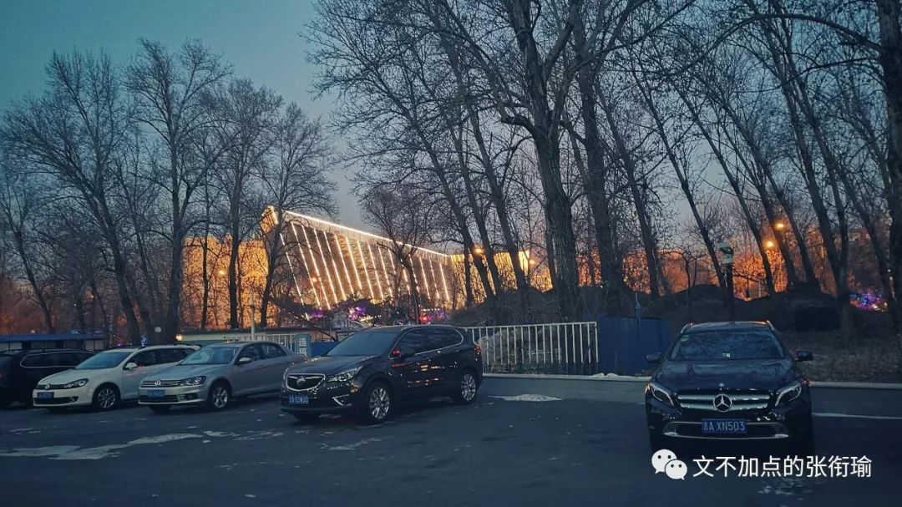

不过 （转折之后也不一定是重点） 长春的所里的确很棒 但并没有 就我个人而言 从整体方向上有吸引到我 给我的感觉是有真实地在做并且做到了很棒的应用
但我 没有感觉到给我有很有憧憬 很有冲劲 很有想象力让我感觉整个人仿佛看到了有 bling bling 发光在闪 这可能就是一种自己非常主观的过程 这也就是 qwq 和 QAQ 的区别 如果能在说到自己项目的时候浑身发抖 我以为 是一件太了不起的事情

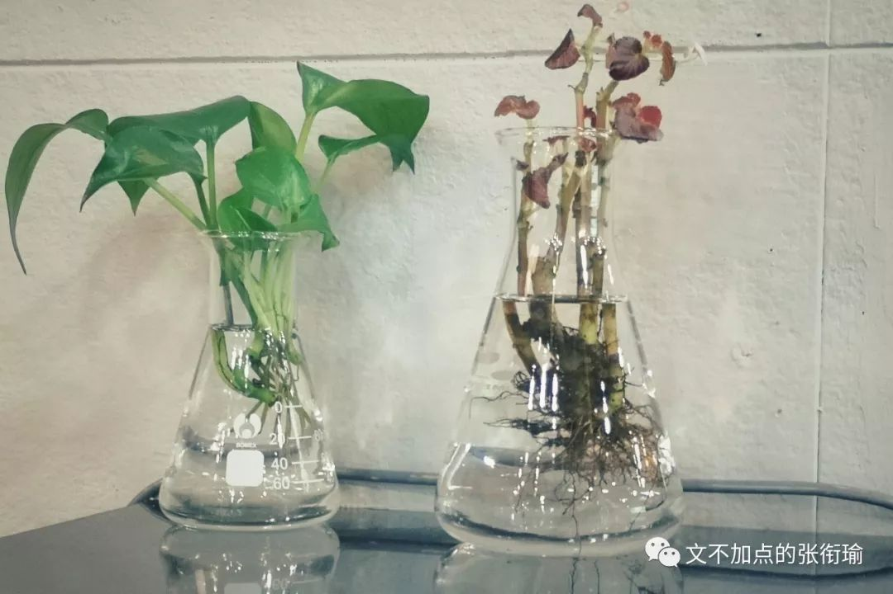

也许和我现在的自己的状态也有关 当人越来越会很少有强烈的悲伤情绪 也就很难有对于某一个事情特别开心的感触 不会哭的人 笑起来也会显得有些虚假的吧 我没有特意地去宣扬向死而生的人生观 太过于暴烈的情绪 不是张衔瑜 我也因此而在反思自己对于自己生活的判断过程
是不是有什么地方没有嵌套上 当我们的生活当中
从崇高的虚无当中解放出来 从底层的琐碎当中剥离开来 我们的生活还剩下了什么呢

当所有真正的哲学问题都归结到对死亡的思考时 如果看客也还不避讳死亡的话 我有一种说法 这一段如果看的话就一定要看完 我不希望在这个问题上被人有不必要的误解 纯粹从自私的角度来看 如果我明天就消失了 那么我觉得是 OK 的 因为我所有必须要做的事情
都已经做得差不多了 我没有对哪一样东西有特别的妄执

正如我没有特别强烈的愿望说要去求什么拿什么 尽管我在绝大多数的时候 做的事情比所谓计划性和执行力极强的人更多
单位时间的利用效率高到我自己都怕 可我更多的把这归为一种好玩一种表演
我只是演员之一 就因为是演员 所以没有对自己的剧本台本有太强烈的感受
但也因为是演员的专业有在 所以可以对自己的台本达到评价里也还不错的效果 我觉得我是没有太多偏颇的 现在对我而言除开剥夺我吃好吃的和睡在一个干净干燥有热水洗澡的类似基本生活需求之外
其他的可能都于我没有太过强烈的要我毁了台本重来的感觉

但事实上 如果我已经完全觉得生活百无聊赖 大可不必在深夜一边抹着生发液一遍熬夜肝程序 也更加不会把自己的生活整理成现在这样斗战胜佛的样子 这大概就是我对于生活的全部看法 我觉得我没有太多的非要实现不可或者极其暴躁的情绪在搅扰我
每每多过一天 就是又多多赚下了一天 日子可能忧郁也可能镇定
但我不会太因此而转移自己的注意力

主要是自己过得已经没了遗憾的情绪 是故每一个过走 也就都是开心

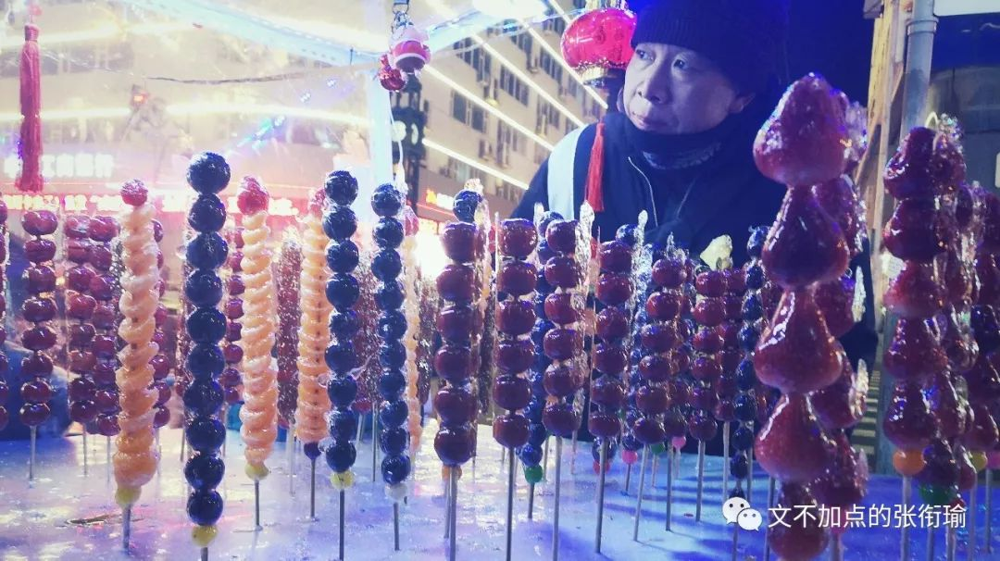

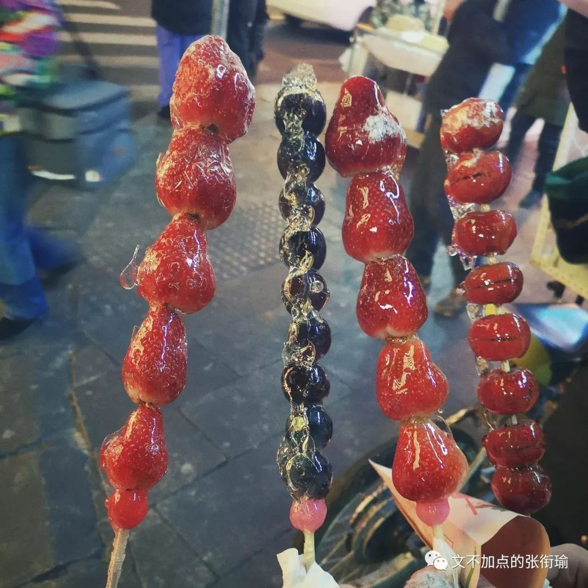

这样真的好吗 对于程序猿来说我以为是极好极好的 不管在什么时候都能包容代码的 bug 生活也是一样
也会在怼天怼地的同时尝试手里的办法去和生活和解 唯独不好的是 当对待生活的态度变成这样之后 也就同时不会有太大的悲痛和太大的开心 常人所开心的那种 开怀的 眼角挤出皱纹的 会厌软骨都骨折的大笑 可能也就离我远远地去了 我不知道是不是 我很少见到有哪位中年男人或者寺庙高僧开始嚎啕大哭 也许酩酊大醉的人有想往这个拯救自己情感的角度去努力
但也许被定义了种种失态之后 也会逐渐地忘记自己来时的路吧

在所里听报告的时候 有位研究员一上来就开始在 diss 中国的高等教育

读大学 在读什么 读研究生 在读什么 他给的答案我忘记了 总之不是很有启发的那种 但这个问题我记下了 我本来以为 我在毕业的时候可能会反思我这四年读了些什么东西出来 但事实上 我其实在大学生活的每一个时间点里其实都是有必要来想一想这件事的

沉舟侧畔千帆过 病树前头万木春 也许这就是待在某一个
既出不来成果 又感觉自己没有提升 还被人究极 diss 的课题里边

我所做的 从一开始来校的时候写了很多的评论稿和活动稿 到后来和同学一起出了一本杂志 之后写一点点调查和人物类的 做做学生工作 打打球 出去听几场音乐会 到实验室做一点科研实验 和同学聊一聊话剧 漫无边际地和不熟悉的小伙伴说一些有的没的
一直到现在编程尬照 出门刷街 都是在按照 自己喜欢什么 想做什么而走 虽然不一定是自己最天马行空幻想着要去做的 但都也还是当下最理想也有想去做的

我所幻想的不过是作为随意写文的人 每天拿着相机带着笔出门 在街上或者楼里转悠采风 看到所有人并不相通的生活方式 以及他们在生活中会否遇到些什么 也许是从市中心的高层直接坐电梯到最底下 开着滴滴出门和乘客尬聊一会儿之后
去夜宵摊点一碗辣椒炒肉双码带迅干听听旁边人说话猜猜他们有什么样的生活经历 累了就回去写写刚刚的遇到的这些人事 然后睡觉开心

无论是在新闻组织里报题 还是做着几个方向的科学研究 我的出发点和行为方式 想一想都是没有太多出入的 依旧斗战胜佛 依旧张衔瑜 依旧文不加点的

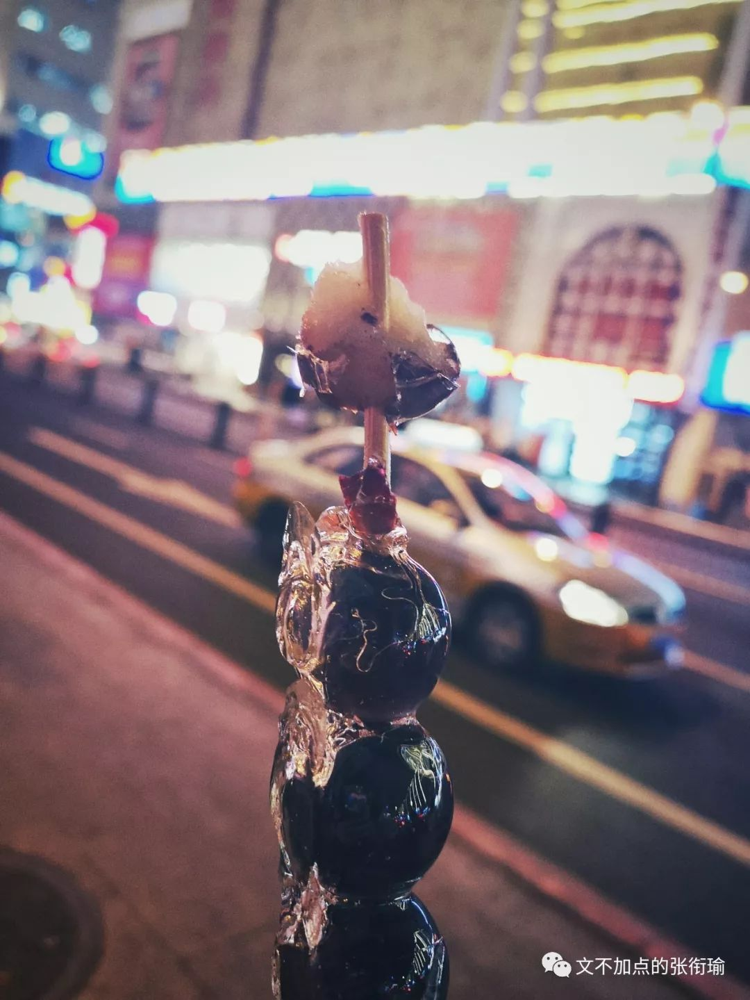

沙雕鸡汤文里说 人们只要稍微关注一下你 你便敞开心扉便掏心掏肺 你自己以为这是真诚 但实际上是孤独 这句话就是那种没有什么用前提也不给的正确废话 和 如果我在回头的时候看了你 60 秒的话，那么我的生命就减少了一分钟。 本质这种话都是我之前 diss 的那种 [注意力失焦](http://mp.weixin.qq.com/s?__biz=MzUzNjE3NzA3Mg==&mid=2247484806&idx=1&sn=68993c9803f22256843699150d782762&chksm=fafb7559cd8cfc4f29e79f132276042bca7eaaef15cc8283b70734aad9bc32105f195992d31c&scene=21#wechat_redirect) 不过落到科研生活当中来 其实是很真实地在描述当代科研人的现状 在学科门类愈发齐全 下划分类越来越细的时候 学习的本质就成了 to learn more and more about less and less 甚至 当你走到所在方向的前端了时候 四野无人都是正常的现象

这次来长春 是我找到的目前大陆高校和研究所当中
唯一一个和我的方向有重叠的组 师姐告诉我 我们这个方向发出去的文章 在大领域的交流期刊里 编辑们都很难给我们找到审稿人 上一篇文章我们投出去半年之后问一问别人审核到什么阶段了 回复是还没有圈定好送审的对象 这谁顶得住呢  形成了自己这一方向的话语体系 排异外边 谁能想通呢

所以 我遇到的不少搞科研的 久而久之养成了在自己的方向里 只要有愿意听的听众 就可以滔滔不绝讲上很久很久 讲上很久自然是对这一方向有极多的理解和建设性的想法
但旁人看来 不厚道地说可能和几十年未曾和人交流过的辟谷人士相当 外向型的极其健谈和内向型的不苟言笑 也就同时出现了在

以至于当我们 在现在的这个年纪去和领域内的专家学者交流的时候 但凡也还被认为可以聊得上来有这方面的专业知识 话题总会到一个问题 “ 你想不想来我这里读研 ” 或者 “ 你想来我课题组直博吗 ”

不可否认的是 确实很多当代的理工科学生确实就只把去和老师交流当成一种套磁
藉此想免去一些后期的测试而提前把关系打点在这里 但像我这样 有可能在网上看到沙雕图片就去私戳然后想着和人交朋友就真的只是认识个人的这样 并且以前长期从事学生工作和新闻采写就锻炼出来了无论在多尬的情况下都能和人把聊天继续愉快地进行下去
甚至也还在本专业的科研方向有一定的了解 这时候再被人以他们的思维模式来套取一个 本质只是喜欢观察和交流各式各样人 的张衔瑜看来
其实是 有一些不一样在的

为此 在我们系而言 现在学生里极其需要的是对行业有高度清晰的认知 又能够讲实话并且愿意讲实话的人 现在所接触到了的很多 不管是报告还是平常的课业 都不过是把他们的成功变成了自己贫乏生活里的盐 真正能冷静分析一下现状 有来有回 正反辩证而又清晰地站在高度看问题 可以投喂现在所有半梦半醒但又自救不了的嗷嗷待哺的那一批人 不过这也太难得 我现在还没有看到过罢了

我并不知道以后的路会往哪里走 正如我不确定自己会不会像现在这样继续自己的方向抑或和自己之前一样又转移自己的兴趣爱好到其他的地方 但我确切的明白 我会在每一个时间节点上找到这一块
当前状态与局部之下的最优解 以后无论在什么情况下看起来就算会后悔 也绝对不会怪罪当时自己的决定

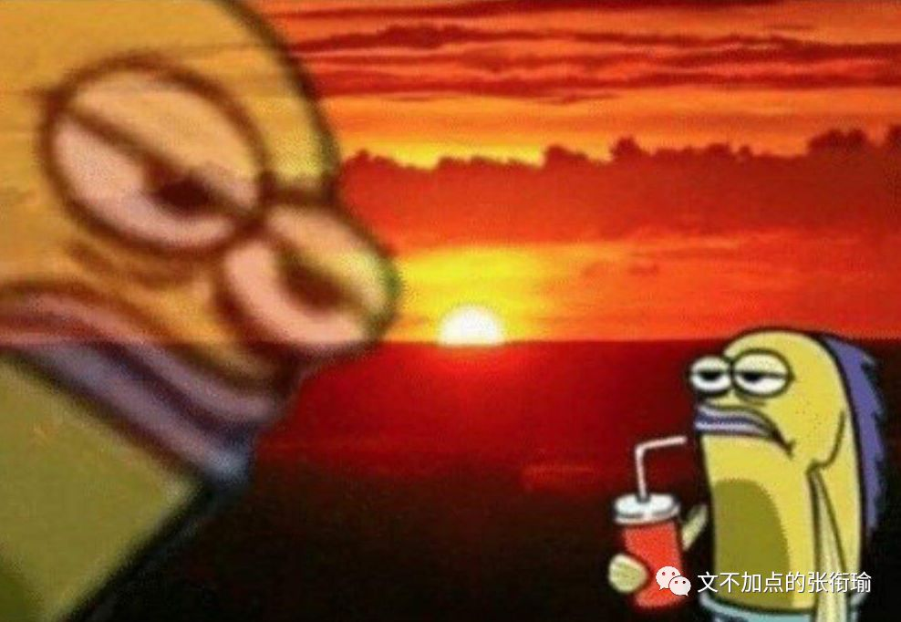

> 我不愿意睡在看不到星星的屋子里，我这辈子是伴着星星度过黑夜的。如果午夜梦醒时我望见的是漆黑的屋顶，我的眼睛会瞎的；我的驯鹿没有犯罪，我也不想看到它们蹲进“监狱”。听不到那流水一样的鹿铃声，我一定会耳聋的；我的腿脚习惯了坑坑洼洼的山路，如果让我每天走在城镇平坦的小路上，它们一定会疲软得再也负载不起我的身躯，使我成为一个瘫子；我一直呼吸着山野清新的空气，如果让我去闻布苏的汽车放出的那些“臭屁”，我一定就不会喘气了。 我的身体是神灵给予的。 我要在山里，把它还给神灵。 ——迟子建《额尔古纳河右岸》

我不愿意睡在看不到星星的屋子里，我这辈子是伴着星星度过黑夜的。如果午夜梦醒时我望见的是漆黑的屋顶，我的眼睛会瞎的；我的驯鹿没有犯罪，我也不想看到它们蹲进“监狱”。听不到那流水一样的鹿铃声，我一定会耳聋的；我的腿脚习惯了坑坑洼洼的山路，如果让我每天走在城镇平坦的小路上，它们一定会疲软得再也负载不起我的身躯，使我成为一个瘫子；我一直呼吸着山野清新的空气，如果让我去闻布苏的汽车放出的那些“臭屁”，我一定就不会喘气了。

我的身体是神灵给予的。

我要在山里，把它还给神灵。

——迟子建《额尔古纳河右岸》

-END-

-留下尬走的足迹-

- [大连](http://mp.weixin.qq.com/s?__biz=MzUzNjE3NzA3Mg==&mid=2247483833&idx=1&sn=962495d09a27d3d3a8993524d4134ce4&chksm=fafb7166cd8cf8708def007b372b850e9a4a856d6264c3525b6c01cb618edd29994651fd6fd1&scene=21#wechat_redirect) - [香港](http://mp.weixin.qq.com/s?__biz=MzUzNjE3NzA3Mg==&mid=2247483911&idx=1&sn=d03f50934536437929624ba6a7720095&chksm=fafb72d8cd8cfbce8f0ab19ffc52e5af4d9615ee616a247245c72c783d82c48142e2d74257dc&scene=21#wechat_redirect) - [苏州](http://mp.weixin.qq.com/s?__biz=MzUzNjE3NzA3Mg==&mid=2247483790&idx=1&sn=bab161c9ec342966da763c03c95d8f53&chksm=fafb7151cd8cf8476e48f3cb754c6aa22ef3a0520fca256988e2e461ef108d502422829da9f2&scene=21#wechat_redirect) - [杭州](http://mp.weixin.qq.com/s?__biz=MzUzNjE3NzA3Mg==&mid=2247483765&idx=1&sn=d4a84f483424470357f69e566f2ef118&chksm=fafb71aacd8cf8bc54453a58adec40a9a7ae6d6c4489c8fe0dfb0ecfd08b28a7ea1f15e45fdb&scene=21#wechat_redirect) -

- [上海](http://mp.weixin.qq.com/s?__biz=MzUzNjE3NzA3Mg==&mid=2247483809&idx=1&sn=74225fdbbdf6b66b605c282ea31038f7&chksm=fafb717ecd8cf8685b6a3e2a792253fa9c0ee22fa4f054eab8f38daf2cb220122741dfb506fa&scene=21#wechat_redirect) - [再到上海](http://mp.weixin.qq.com/s?__biz=MzUzNjE3NzA3Mg==&mid=2247484421&idx=1&sn=fb650c977a7a366534415a20195d0cf5&chksm=fafb74dacd8cfdccc27df74c87eac7822646405762a36e1d80fc293543dfe32a71a248c6733d&scene=21#wechat_redirect) - [北京](http://mp.weixin.qq.com/s?__biz=MzUzNjE3NzA3Mg==&mid=2247484509&idx=1&sn=8636d9c5e3faa952e64923f8e75c1c40&chksm=fafb7482cd8cfd94e4fb1eb8fc1b66a4c82c6768ada2110e800808eabc7a505e7a54a1c3b9bf&scene=21#wechat_redirect) - [新加坡](http://mp.weixin.qq.com/s?__biz=MzUzNjE3NzA3Mg==&mid=2247484561&idx=1&sn=38abfcb9f79650f4eb255a1324251bea&chksm=fafb744ecd8cfd58e26edcd4ad384a5a2d7292f27ad2c8a0b6cecb81bcb19703a487f36235ff&scene=21#wechat_redirect) -
