> 第 75 篇推送 共计 4555 个字

第 75 篇推送

共计 4555 个字

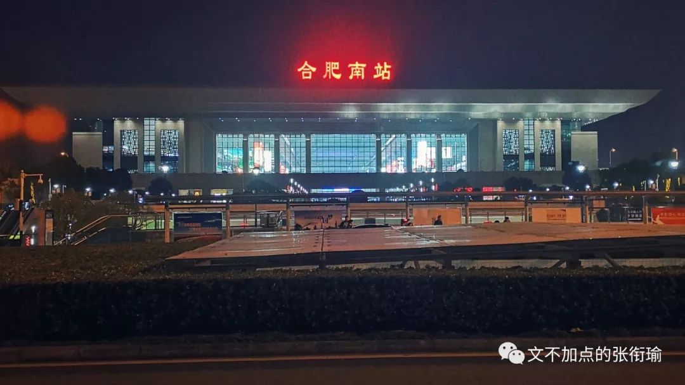

合肥是什么样的地方呢？

在最早的认知地图里
以为安徽是一个地方 合肥是和安徽平级的一个地方 后来即便看了一些地理 知识也仅限于知道合肥是安徽的省会
除此之外 知道得并不多

我也是来了合肥之后才知道 原来李鸿章的故居在合肥 想当年看唐浩明写的《曾国藩》 提到李鸿章所主持的一支军队 以及后来说李鸿展去日本签《马关条约》 说他是卖国贼到又反转洗地种种云云 那时候就觉得这个地方很有些透明

就连前几天我和同学一起从 [长春](http://mp.weixin.qq.com/s?__biz=MzUzNjE3NzA3Mg==&mid=2247484906&idx=1&sn=18caeb80b686315ad9b7eb5379013e6e&chksm=fafb7535cd8cfc2310bc2efd53e55c9fee406398f8ba990b173f1c933421b92fa0f6af890892&scene=21#wechat_redirect) 回来 我说我接下来就马不停蹄地要去合肥了 我随口问说合肥有什么玩的 小伙伴回了我一句 离苏州近啊 …… （如果一个城市的游玩景点是和另一个城市近 那等于还是没有发掘其原本的魅力对吧

当时就有在想 我也要想想办法把合肥玩起来才是呀

去年这个时候我也有打算到一趟安徽 不过是想看一些 徽派建筑 在长沙周边建设的社会主义新农村 讲道理是都还修整得挺好看的 但很多的 我看过去 我知道湘南很多的烽火墙 但又有另一种 平常很少见的风格 后来别人告诉我说 这种叫做徽派 一直觉得很神奇 所以去年打算说 去走一走徽派建筑的地方 包括还有黄山这些的

徽派建筑确实看起来就像一幅山水画 但严格地来说 却并不特定属于安徽 徽派建筑在绩溪 浙江金华 衢州一带也有出现 在此按下不表

总而言之在我到合肥之前 我仍旧按照自己之前的游玩方式写攻略 查路线看地点 本着要把合肥玩起来的感觉过来 和我出去旅行的基本风格 没有什么区别

事实上 我到了之后就发现 事情并不是我想象的那样

实际到合肥 我是去到这边的实验室里 叫见习实习访问交流之类的 whatever 要说我有没有到合肥呢 我确实是到了的 但如果要说我是到了合肥的吗 其实想一想也并没有到这里 讲道理 如果说到了哪一个地方 我指的到了是 走到一栋高楼上 向下眺望过去 弥望的是田田的叶子（误 向下望去是可以尽收眼底的建筑或者其他的风光 随即走下楼去 走到最地面上 走到别人家里去 走到别人家的锅里去 走到吃这些锅长大的人写的书里去
然后听这个地方的人尬聊浮沉沧海桑田

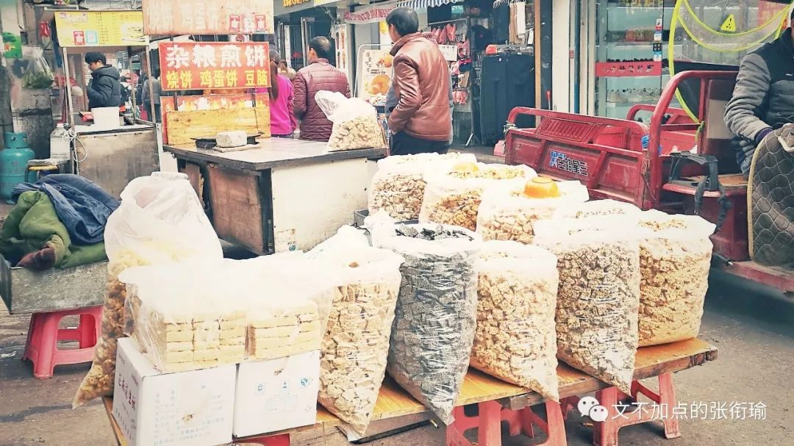

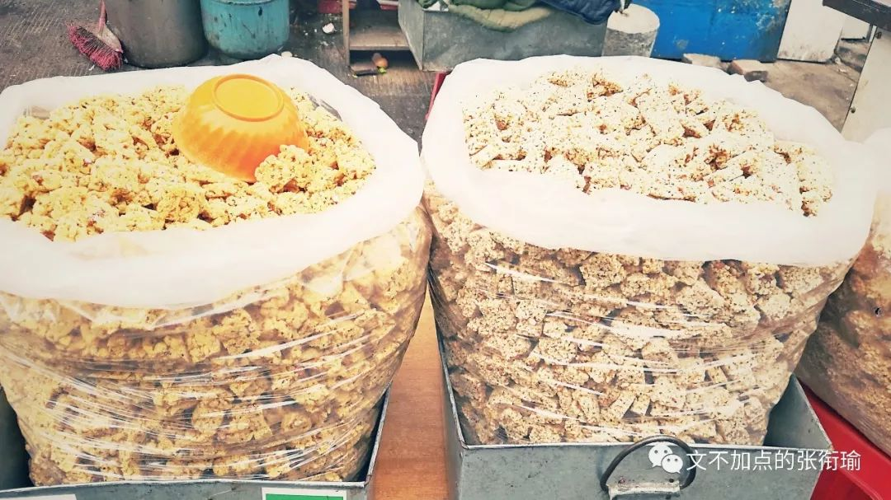

但我在合肥的游玩却没能成为这样子 却感觉到了这个城市该有的有样子 这是一件很神奇的事情

在合肥的几天里 如果说 按生存压力来说 和在 [北京](http://mp.weixin.qq.com/s?__biz=MzUzNjE3NzA3Mg==&mid=2247484509&idx=1&sn=8636d9c5e3faa952e64923f8e75c1c40&chksm=fafb7482cd8cfd94e4fb1eb8fc1b66a4c82c6768ada2110e800808eabc7a505e7a54a1c3b9bf&scene=21#wechat_redirect) 差不多 同样的是在到地方之前做了很多的攻略 想着要把一块地方玩起来 不过在帝都我原本想的是用一个月的时间 而在合肥已经定好了的是五天而已 一样的是 在几天 在北京走最远的范围不过中关村宝福寺几百米的范围内 在合肥也是 住的附近紧邻金寨路高架 应该说是南七里 也就几百米的生活半径 从住处到实验室

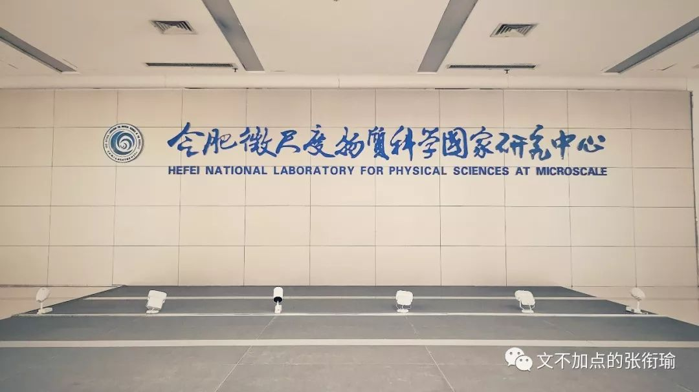

不知道从什么时候开始起 我看重一座城市的人文关怀 最主要的在看街道和交通的设计 所谓街道的设计也无非就那么几条 盲道 人行道 非机动车道 以及路上司机的表情之类的

第一次感受到城市设计对人的影响极大 是在从高三毕业时从重庆渝中区去到成都锦里 （并不知道在哪个区 2333 在重庆上上下下 平面定位是到了但高度可差上十几层楼
到成都后有些闹心的感觉就消失了 成都这时候的设计是亲和的 合肥也是这样 从盲道很少从中间断开 到不吵不闹的文明施工围挡 我和朋友说的时候朋友笑我是 [刚刚从武汉来](http://mp.weixin.qq.com/s?__biz=MzUzNjE3NzA3Mg==&mid=2247484576&idx=1&sn=6d574c01332526873d623b54b8e86347&chksm=fafb747fcd8cfd695a8b05885a3fba80454e5f3d5184b667b9df3a1dda7ca1dd13f209e06e62&scene=21#wechat_redirect) 的所以感受极深 也许 ta 说得没错 图是合肥金寨路高架底下 没有像其他城市一样做停车场或者小摊小贩集中地 修了 BRT 在中间 是可以上下公交车乘客的（我以为要上车之后再刷
失敬失敬

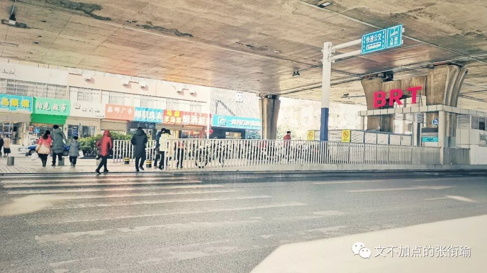

合肥给我的感觉是 乍一看不会像是一个省的省会城市 既不太市井烟火 又不会大工掘进

如果说把我们以往讲一座旅游省会城市的 必定是遍地地高调对外宣称自己有多么多的好吃的和多么多的游玩去处 合肥没有这样 合肥整体给人的感觉是 朴素 的 我所讲的这个朴素也可以说成素朴 不是相对于奢侈 而是相对于精致和高度 意为质朴 无文采 simple and unadorned 像哲学里定义朴素辩证法的那种 没有太过雕琢 也没有野蛮生长 不带地域偏正地看待 我所遇到的大部分安徽同学有类似的感觉 没有特别浮夸地向人展示自己到底水平有多高
都很和善地在对待生活中的事 很难想象我认识的安徽同学和人吵架时候的样子 似乎生来在这方水土里养就的性格并不是为了在自大和自卑中证明自己而需要走过的

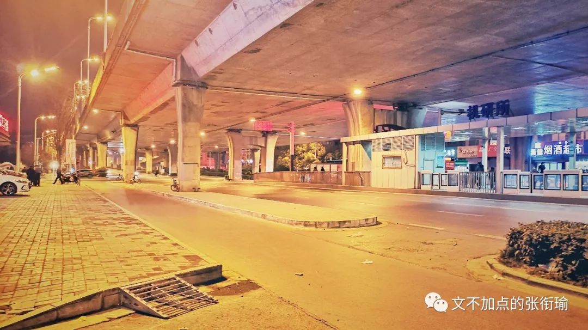

偶尔会有人自嘲说觉得中部城市里太没什么存在感 但我所看到的 这样的生活姿态 既不虚浮冒进也不固步自封
而是按照自己的生活节奏正常地向前 我以为如此的朴素状态 是很能做一点真正需要静下来才能做好的事情的

很难说我的这种感觉 到底是因为看到了什么或者知道了什么而突然有的 在合肥的生活状态是逐步形成的 逐步感觉到的 这并不暴躁 所以我后来想一想 我在来合肥以前做的要去哪个景点或者到某个地方一定要吃上什么 在感受到这个氛围后
觉得可以有 但是可以佛一点 不必为走而走 这可能是本次来合肥的最大收获

这么一想之后 在合肥经历的一些事情也就变得在更换角度之后可以理解了 比如合肥同学安利我一定要去吃的锅贴 肥叔锅贴 竟然只开早饭和晚饭 我中午十二点的样子在南七走来走去却没有找到孤独的美食家要进去的店 肥叔锅贴的工作人员和我说 现在都十二点一刻了怎么还会有？？？我们家锅贴十一点半就卖完了 我说 才十二点一刻怎么就没吃的了？？ ？
然后大眼瞪小眼 两脸茫然

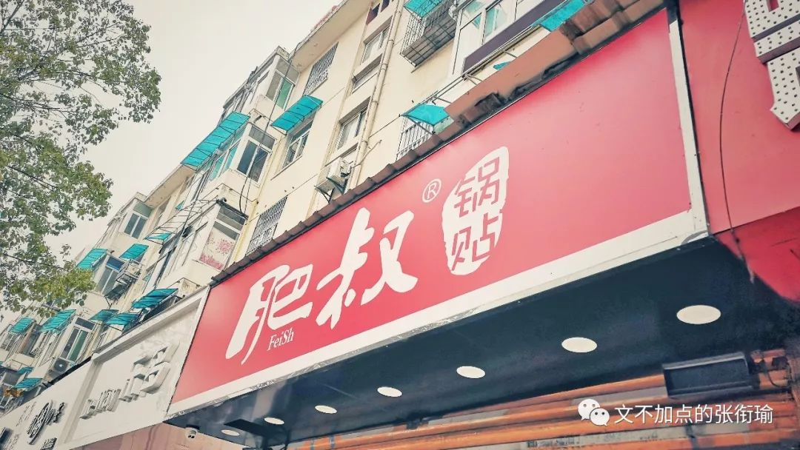

但最后下午我还是点了外卖 锅贴真的不是不是在武汉可以吃得到的 西一区风亭渡也不可以 西小门哈尔滨饺子馆说话自带东北味的大叔煎饺也不可以 锅贴软的一面和锅贴脆的一面恰好在一起 很难这是什么样神奇的操作 虽然是家网红店但讲道理并不夸张 一个锅贴也才五毛钱（讲道理真实经济实惠而且吃起来挺干净的是那么回事 一直对吃吃喝喝挑剔到打人的张衔瑜 吃了三十个之后这次也咬合肌酸胀惹

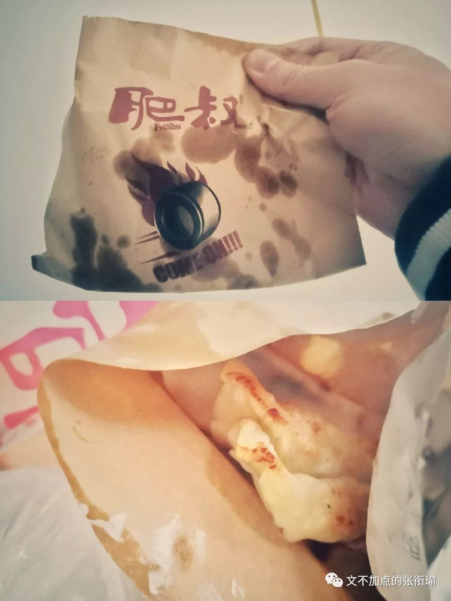

走心写文赞美 不走心的摄影 qwq

顺带提一下在合肥玩的话也不花什么钱 应该是我去到的诸多城市里玩起来最实在的了 詹记宫廷桃酥王 刚刚出锅的蜂蜜蛋糕 闻起来香香的 我想了想说给实验室的大家也带一点回去 然后买了 20 块钱的（我没有问单价 然后提起来就真的是一大袋子 …… 真的好大一袋子 我拿到的时候都惊了 跟了一队人在我身后排队也不好意思说少一点
就直接提着走了

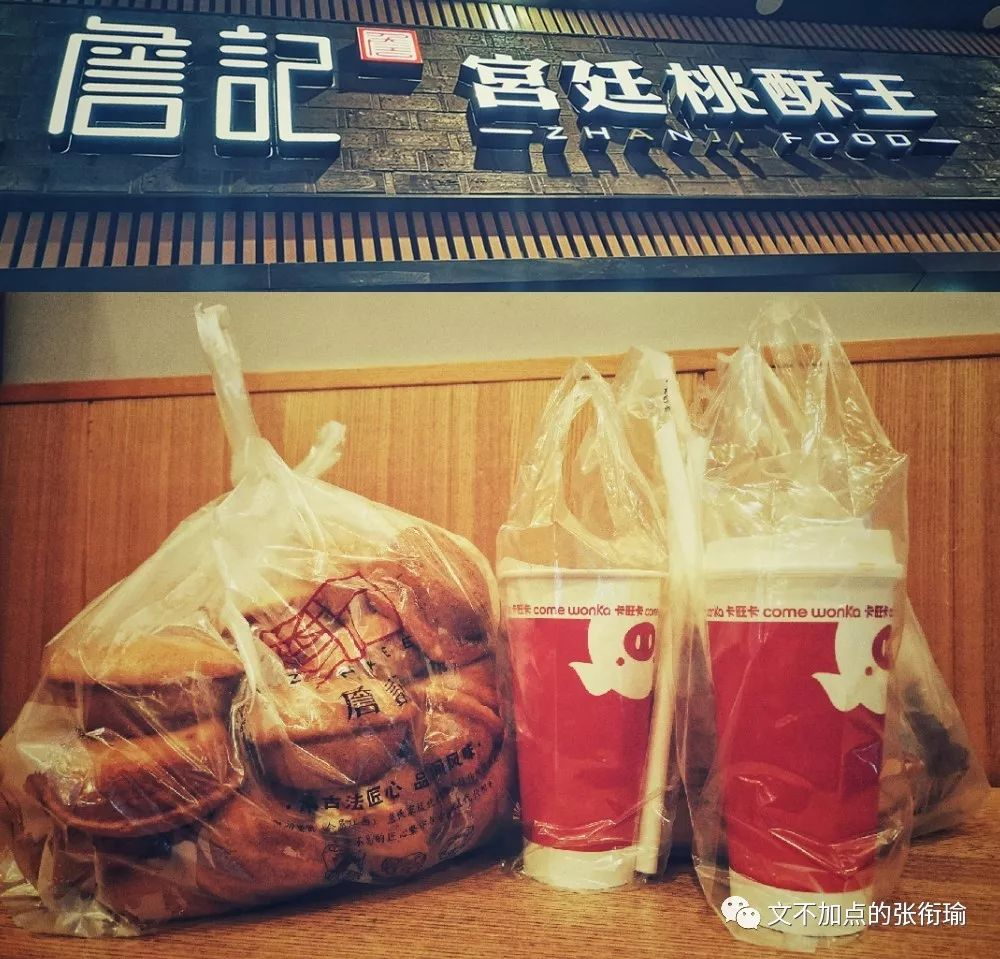

合肥没有很过分打造自己的另一个标志是 就连所谓的网红店也不太难伺候 仍旧说詹记 这家我在好多地方看都评分超高 但在店门口排队的话 是分了两队的 人们并不能很好地知道到底自己排在前面的是什么队 比如长沙茶颜有点单区和出杯区 但詹记是一部分专卖刚出锅的 蜂蜜蛋糕 另一部分就买一些泡芙啊千层酥之类的

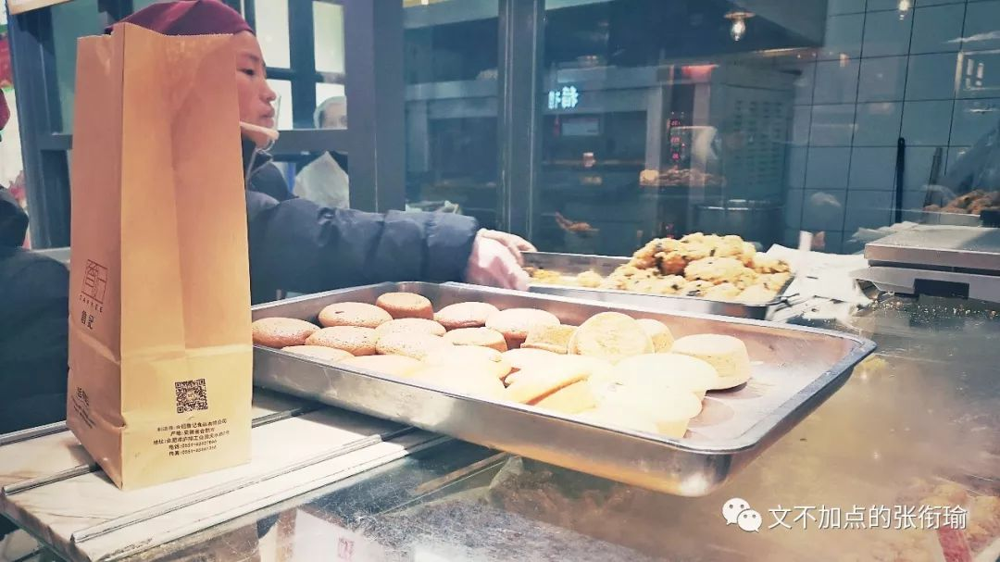

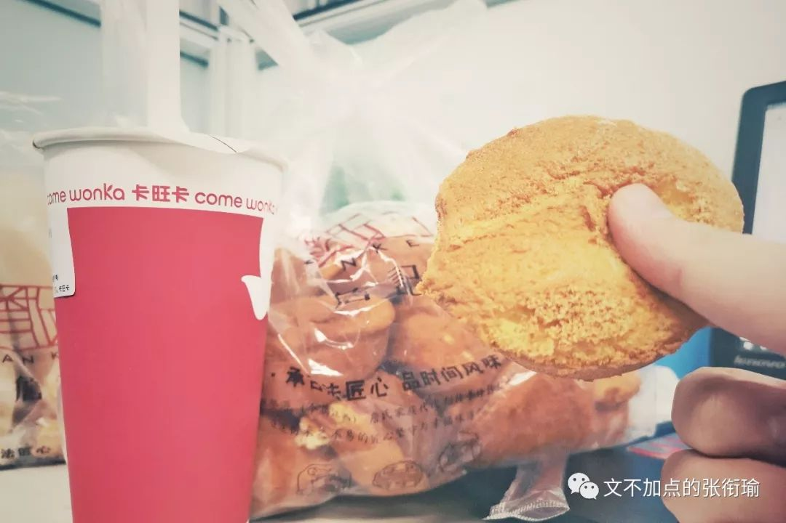

以及真的是没有吃完 实验室的朋友还有带我在合肥玩的朋友也给过了之后 自己也真的吃不完了这刚出锅的蛋糕  写了一张便条留给在宾馆打扫的人  像新世相、我要what you need这些号感觉偶尔会出一些讲 陌生人的善意 的  偶尔也可以做一下提供善意的人 不过怎么措辞我还是想了一下的  毕竟越是在从事体力劳动的人 越能够分辨他人的直观意图

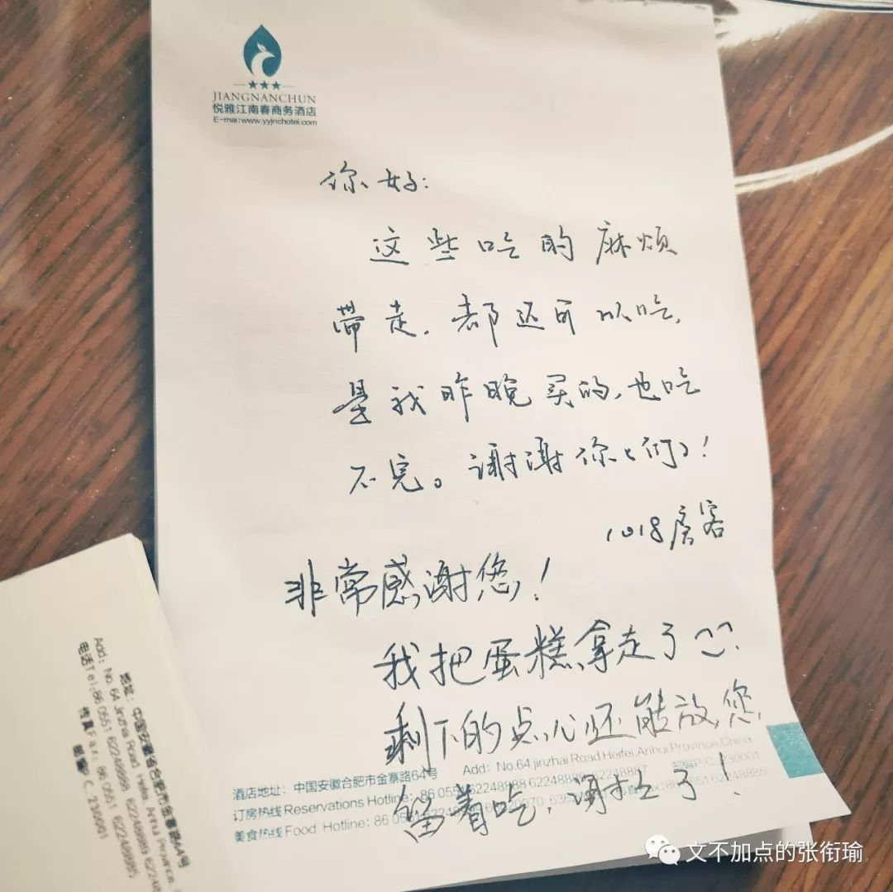

安徽人自己的茶 （广告语大概这么说的 叫 卡旺卡 不知道这是个什么名字可能像南蒙布朗 好吧专心一点说茶 在前奶茶博主张衔瑜的视角里 这家的奶茶 没有这家的气泡水好喝 （讲好的说奶茶呢？ 气泡水数 莫吉托 我指的没有很过分打造自己还在于 我无论喝茶颜 喜茶 一点点 益禾堂 coco sucks Costa 这些的之外 我都能很轻易地找到一个合适的拍照的角度然后修一张很好看的图出来

在我写 [茶颜](http://mp.weixin.qq.com/s?__biz=MzUzNjE3NzA3Mg==&mid=2247484279&idx=1&sn=10ee40acafb30309f43432ea34d3a5a2&chksm=fafb73a8cd8cfabe994ae62179c50a323152f7fad42350e089bfa4c5f44ed232228f415b2d16&scene=21#wechat_redirect) 的推送里 图里边多的是我的手握着杯子 然后拍出这一杯的特色 是奶盖就聚焦奶盖 是杯身就聚焦杯身 背景虚化为店内的环境或者店上的标识都 OK 然后光速拍完走人开始喝 但这次在卡旺卡 我在南七和乐城两家店都试了几个角度用心拍好图 但总也还是没有找到和修出合适的样子呢 如果是在设计的时候没有想到的话 那么就可能是要照顾类似需求的权重 在调整下被一点点减去了吧

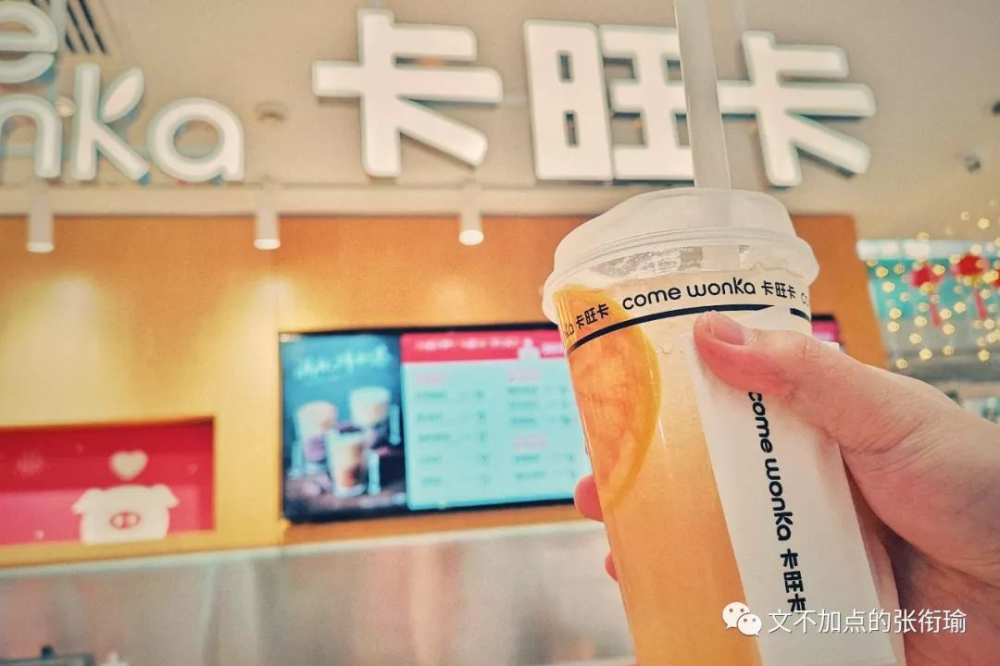

还有一个很神奇的操作在我去南七吃凉皮的时候 合肥话很难懂当然我也不知道到底说得是否正宗 知道的是我说打包带走的时候 店家拿了两个袋子和一个碗
然后在第一个袋子里装上米线和凉皮 再在另一个袋子里装上汤汁
放到碗里 再把碗放到我的袋子里 这个过程感觉说起来很玄幻 总之就是从外到内的话是 袋子 凉皮米线 碗 袋子 汤 我和在肥叔锅贴一样和店主两脸迷茫 我理解的带走是带走之后马上就吃
那你应该把什么都做好了凉皮也拌好了再给我对吧 店主听了之后说

> “你不是要带走吗？”

“你不是要带走吗？”

接着奇异地打量了我一下 然后解开袋子 拌好了面之后又放进了开始装汤的袋子里？？？
尔后再将袋子放进碗 碗又放进袋子 以至于最后我拿到的 从外到内是 袋子 碗 袋子 凉皮 看起来就是这个样子 讲道理这个操作是我没有懂的 也许当地都觉得 OK 或者周边人们的要求是这个样子的 idk

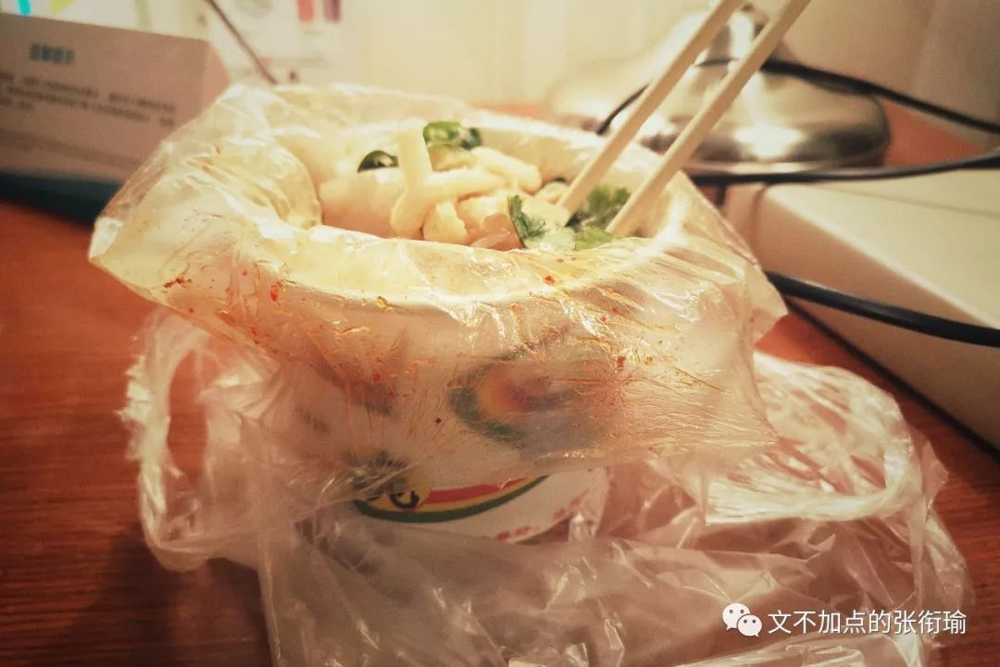

不过这些说起来 也是可以有好解释的 可以讲道理的内容 说得通的事项 但是武汉并不会这样 即便是在合肥 也依旧收到学校发来的停水通知（ like 上午九点说下午一点停水这种 每次学校都要说 “早完工，早送水” 就像自己从没做过这件事一样 理直气壮

事实上我 25 号说要 26 返校的时候
同学告诉我说寝室没有热水了 后勤之前发的文说是考虑大家的需求于是从 21 号停水改到了 28 号 谁知道呢 只觉得如果以后有人问起然后说我是在紫菘住着的话 我会感觉到羞耻的吧 到底是学校蠢还是我蠢呢 为什么要到这个地方 为什么也没有改变的办法 今天正好看到三联发的关于里皮的推文 里边有一段话送给做了很多好事但被后勤和市政全都败光了了学校和光谷

> 看着国足中后卫如出一辙的致命失误，球迷戏称这是 “复制粘贴” 一样的丢球。赛后，里皮也对此耿耿于怀，“ 谢谢我所有的球员付出了努力，他们牺牲了非常多，但是今天晚上我没有任何感谢的话要说。 他们在如此重要的比赛中，出现了如此多重复的失误。

看着国足中后卫如出一辙的致命失误，球迷戏称这是 “复制粘贴” 一样的丢球。赛后，里皮也对此耿耿于怀，“ 谢谢我所有的球员付出了努力，他们牺牲了非常多，但是今天晚上我没有任何感谢的话要说。 他们在如此重要的比赛中，出现了如此多重复的失误。

不可以写尬走游记的时候太暴躁 我觉得学院挺好但学校很沙雕也不可以 耗子给猫当伴娘了也不可以

虽然在合肥 对于城市建设与设计的时候让人很舒缓朴素 但本斗战圣佛在一段时间内还是很难回转惹 这边的确在前沿计算上 和我走过的中科院四大化学所有着不一样的地方 这次来合肥其实又印证了上次在说 [长春应化所](http://mp.weixin.qq.com/s?__biz=MzUzNjE3NzA3Mg==&mid=2247484906&idx=1&sn=18caeb80b686315ad9b7eb5379013e6e&chksm=fafb7535cd8cfc2310bc2efd53e55c9fee406398f8ba990b173f1c933421b92fa0f6af890892&scene=21#wechat_redirect) 里所提到的那样对于学科前沿与学科憧憬的考虑 这个也是我来合肥的主要使命或者说任务
但之前已经在公号推送里有说过 在此按下不表

留下尬走的足迹自然是要尬走的了 上周在长春
实在是冷也实在是没办法 别说去爬楼 就连出个门都要鼓起勇气好多次 出门穿衣服不赢
进门脱衣服不赢 上次返校之后马上就到了合肥 来合肥是 21 号 晚上九点的样子到的南七 师兄带我去到 庐州太太 说大概是平常聚餐很多的地方 菜式倒是 也许不是 刀板香 那么正宗的安徽菜菜馆 我问师兄的时候师兄点下去尽是带“湘味”字样的

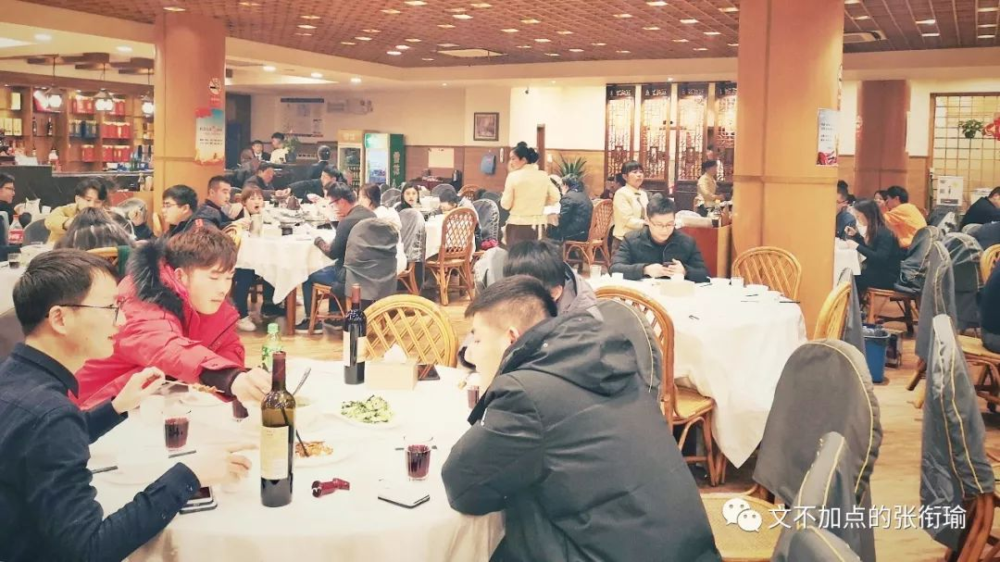

神奇的是我们到的时候就九点多了 然后慢慢的 人还是很多 I mean 这才周一啊晚上怎么这么多人来吃吃喝喝 庐州太太的地方其实不是很大 但人还是很多 周一的晚上来吃吃喝喝的 十点多我们走的时候还在进客而且人着实很多 问问师兄怎么会这个样子 师兄也表示很惊奇

真正爬楼只出去了一次 瞅着实验的间隙去的 看了时间是 17:37 日落 我五点的样子出门去找楼 想把 金寨路高架到一环上 的交通拍出来
流光 是我很喜欢的构架方式 但真实很难惹 …… 去了三个小区在科大东区的北边 没有一个小区是能够让我真正上到顶楼去的 总是在楼顶压了一张门 楼顶锁得死死地 qwq 而且从视线来讲 在临近路高的附近有不少的楼房 如果在自己视线前方的话拍流光的时候就想别人在跳彩带舞然后被不速之客用锋利的小刀割断了一样

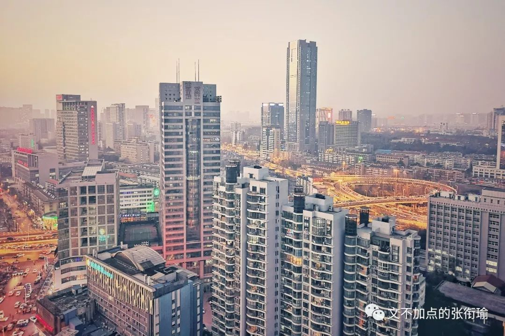

挑了挑角度

没有太多难过的

是这张向西拍出的近似日落

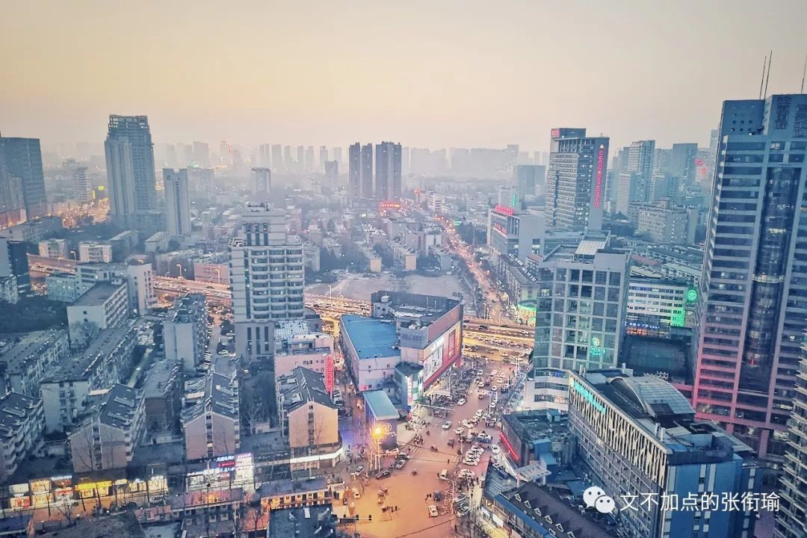

以及入夜以后权宜拍下的两张流光

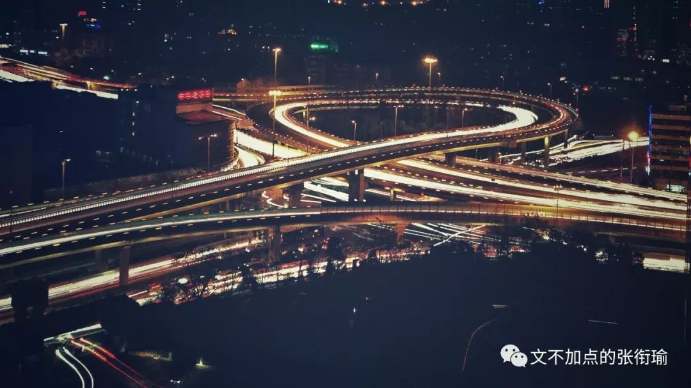

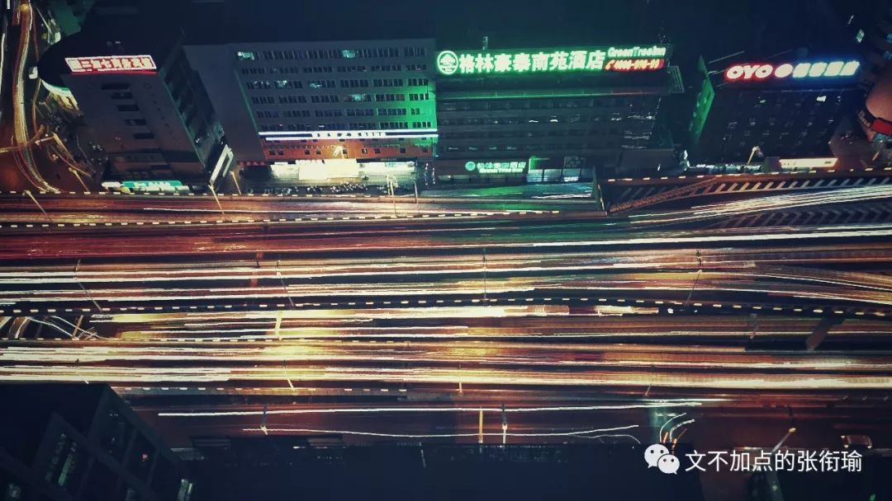

晚上修这张柔焦的时候

没有戴眼镜

当时愁死我了

不知道到底是自己看不清

还是就是柔焦的效果

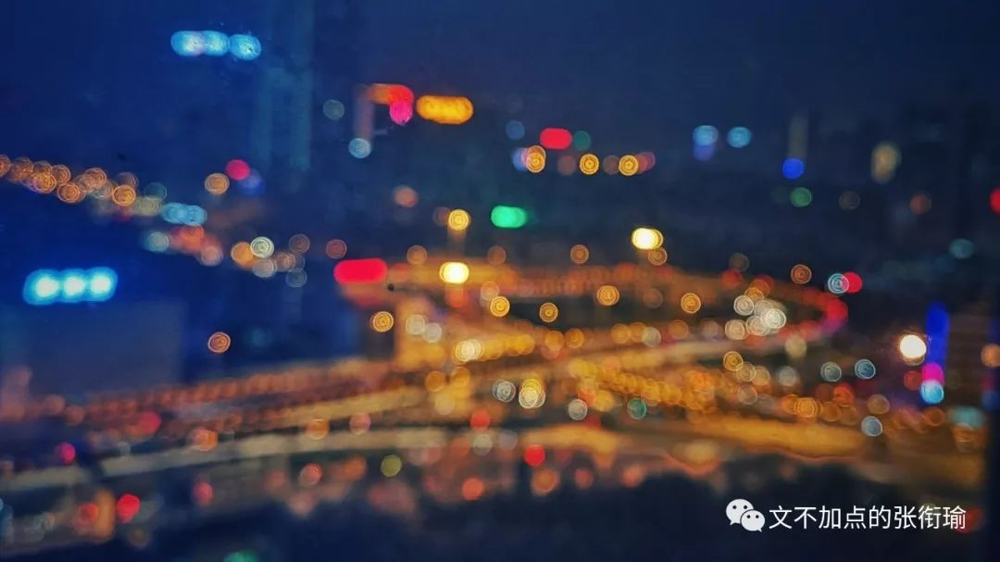

事实上 从 11 号我考完开始 我的考试周结束我的法定假期也就开始了 只是我觉得我还有很多要做的事 而这点时间正好可以做点什么 于是就有了 [和 Amber 的出拍](http://mp.weixin.qq.com/s?__biz=MzUzNjE3NzA3Mg==&mid=2247484879&idx=1&sn=08784a8876a520f43895a803e89169a5&chksm=fafb7510cd8cfc0682b031239e57331268bd044c39bbca9ce5bbb9c6bafb2e9a817101913cd9&scene=21#wechat_redirect) 在 [长春](http://mp.weixin.qq.com/s?__biz=MzUzNjE3NzA3Mg==&mid=2247484906&idx=1&sn=18caeb80b686315ad9b7eb5379013e6e&chksm=fafb7535cd8cfc2310bc2efd53e55c9fee406398f8ba990b173f1c933421b92fa0f6af890892&scene=21#wechat_redirect) 的尬走 以及这次到合肥的尬走

我在返校的动车上敲下这篇游记  毕竟春运 感受了一波 软卧代二等座 的操作  所谓软卧代二等座 实际上就是没人坐的软卧车厢 在乘客买的是二等票的时候让三个买二等座的人坐到同一节软卧车厢的一张铺上面去  据说是 春运 时候才有的操作 冷静冷静佛一点你已经很累了不要爆刀

返校之后 也还有一些事情要去做 回长沙以后 我的理想生活状态是 睡觉 睡觉整整十天 才能让我恢复过来 回复从复习周到考试周以及这一个学期的难过 我需要一段超长的休假

不过 虽然说这个学期 一直都觉得考试周是最轻松的日子因为所有事都可以推掉然后只用考试就可以了 但回去之后 想休息只怕也是很难的了吧 只要不在休息的时候也要被安排的明明白白 或者被认为说 “你这样就算休息了” 就好 需要一点真正的休假 尽管我知道这就是不可能的 但希望不是必须真实实现 切切，切切。

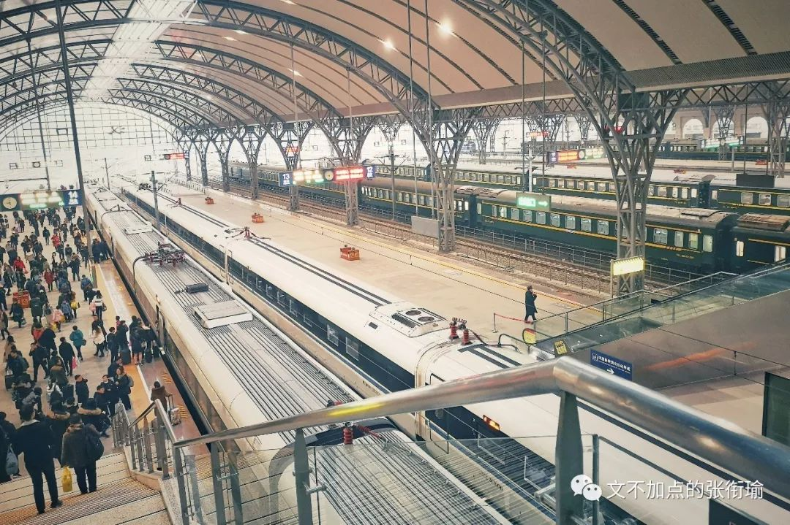

适合我的是这首歌

塞尔维亚的理发师——

快给大忙人让路

一并感谢

在合肥帮到我

和安利了好玩好吃去处的大噶

-END-

-留下尬走的足迹-

- [大连](http://mp.weixin.qq.com/s?__biz=MzUzNjE3NzA3Mg==&mid=2247483833&idx=1&sn=962495d09a27d3d3a8993524d4134ce4&chksm=fafb7166cd8cf8708def007b372b850e9a4a856d6264c3525b6c01cb618edd29994651fd6fd1&scene=21#wechat_redirect) - [香港](http://mp.weixin.qq.com/s?__biz=MzUzNjE3NzA3Mg==&mid=2247483911&idx=1&sn=d03f50934536437929624ba6a7720095&chksm=fafb72d8cd8cfbce8f0ab19ffc52e5af4d9615ee616a247245c72c783d82c48142e2d74257dc&scene=21#wechat_redirect) - [苏州](http://mp.weixin.qq.com/s?__biz=MzUzNjE3NzA3Mg==&mid=2247483790&idx=1&sn=bab161c9ec342966da763c03c95d8f53&chksm=fafb7151cd8cf8476e48f3cb754c6aa22ef3a0520fca256988e2e461ef108d502422829da9f2&scene=21#wechat_redirect) - [杭州](http://mp.weixin.qq.com/s?__biz=MzUzNjE3NzA3Mg==&mid=2247483765&idx=1&sn=d4a84f483424470357f69e566f2ef118&chksm=fafb71aacd8cf8bc54453a58adec40a9a7ae6d6c4489c8fe0dfb0ecfd08b28a7ea1f15e45fdb&scene=21#wechat_redirect) -

- [上海](http://mp.weixin.qq.com/s?__biz=MzUzNjE3NzA3Mg==&mid=2247483809&idx=1&sn=74225fdbbdf6b66b605c282ea31038f7&chksm=fafb717ecd8cf8685b6a3e2a792253fa9c0ee22fa4f054eab8f38daf2cb220122741dfb506fa&scene=21#wechat_redirect) - [再到上海](http://mp.weixin.qq.com/s?__biz=MzUzNjE3NzA3Mg==&mid=2247484421&idx=1&sn=fb650c977a7a366534415a20195d0cf5&chksm=fafb74dacd8cfdccc27df74c87eac7822646405762a36e1d80fc293543dfe32a71a248c6733d&scene=21#wechat_redirect) - [北京](http://mp.weixin.qq.com/s?__biz=MzUzNjE3NzA3Mg==&mid=2247484509&idx=1&sn=8636d9c5e3faa952e64923f8e75c1c40&chksm=fafb7482cd8cfd94e4fb1eb8fc1b66a4c82c6768ada2110e800808eabc7a505e7a54a1c3b9bf&scene=21#wechat_redirect) - [新加坡](http://mp.weixin.qq.com/s?__biz=MzUzNjE3NzA3Mg==&mid=2247484561&idx=1&sn=38abfcb9f79650f4eb255a1324251bea&chksm=fafb744ecd8cfd58e26edcd4ad384a5a2d7292f27ad2c8a0b6cecb81bcb19703a487f36235ff&scene=21#wechat_redirect) - [长春](http://mp.weixin.qq.com/s?__biz=MzUzNjE3NzA3Mg==&mid=2247484906&idx=1&sn=18caeb80b686315ad9b7eb5379013e6e&chksm=fafb7535cd8cfc2310bc2efd53e55c9fee406398f8ba990b173f1c933421b92fa0f6af890892&scene=21#wechat_redirect) -
